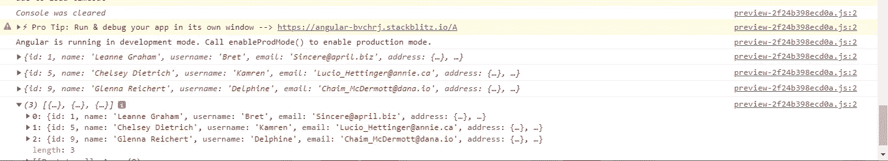

# Angular:如何使用 Concat RXJS 操作符同时获得所有内部可观察的结果

> 原文：<https://medium.com/geekculture/angular-how-could-you-use-concat-rxjs-operator-to-get-the-results-of-all-inner-observables-at-the-d96699bd995e?source=collection_archive---------1----------------------->

我在我的工作项目中有一个场景，我需要在 **concat 操作符**中同时得到所有内部观察的结果，类似于 **forkJoin** 操作符。

你可能想知道“同时”在这里是什么意思！为了理解这一点，让我们回顾一下 **concat** 操作符是如何工作的。

1.  订阅序列中的第一个可观测源
2.  当源可观察对象发出一个值时，将其传递给观察者
3.  一旦这个源观察完成，订阅序列中的下一个源观察
4.  只有在所有源观察完成后，才向观察者发送完成通知。
5.  如果任何一个源观察器抛出错误，就向观察器发送错误通知。
6.  如果一些输入流没有完成，concat 将永远不会完成。这也意味着一些流将永远不会被订阅。

这意味着 concat operator 将只在每个内部源可观测的结果完成时才将其发送给观察者。你永远也不会得到所有可观测结果的总和。假设所有源可观测量都成功完成，那么如果您同时需要所有可观测量的结果来做出决策会怎样呢？

**toArray** 操作员前来救援。

我使用了一个简单的应用程序来演示这一点。

**组件模板:**

在上面的模板中，我们已经订阅了 **user$** observable 来显示用户名列表。

可以忽略**error observable＄**observable，因为它与本故事无关。

**组件类别:**

在**ngOnInit**lifecycle 钩子中，我们从 **TestService** 中调用 **getUser()** ，传递不同的用户 id 作为参数来获取用户数据。

```
**//TestService
getUser(id:number) {**
return this.http
.get(`https://jsonplaceholder.typicode.com/users/${id}`)
.pipe(catchError((err) => throwError(err)));
}
```

当所有内部可观测量完成时，由 concat 操作符创建的源可观测量也将完成。只有当源可观测完成后， **toArray()操作符**才会将源可观测发出的所有值收集到一个数组中并发送给观测者。

```
pipe(
**tap((response) => {console.log(response);}),
toArray(),
tap((response) => {console.log(response);})**,
catchError((err) => {
this.error$.next(err);
return EMPTY;
})
);
```

在**第一个点击操作符**中，我们记录每个内部可观察对象发出的值。



在所有内部可观察对象完成之后，因此当源可观察对象完成时， **toArray()操作符**执行并将所有内部可观察对象发出的用户对象推入一个数组。该数组由**第二次点击操作员**记录。

正如您在上面的截图中看到的，用户对象的前 3 个日志来自第一个 tap 操作符。第二个 tap 操作符记录 3 个用户对象的数组。

这是我们最终用来在模板中显示用户名的数组。

您可以在下面找到完整的工作示例。

[](https://stackblitz.com/edit/angular-bvchrj?file=src/app/child-a/child-a.component.ts) [## 角形(叉形)堆叠

### 一个基于 rxjs，tslib，core-js，zone.js，@angular/core，@angular/forms，@angular/common 的 angular-cli 项目…

stackblitz.com](https://stackblitz.com/edit/angular-bvchrj?file=src/app/child-a/child-a.component.ts)