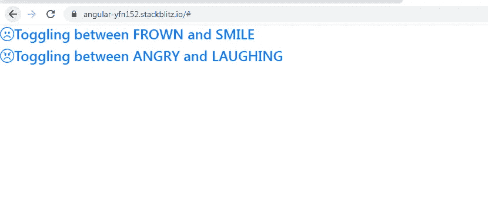
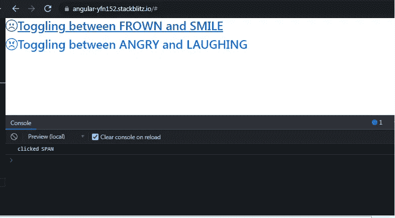
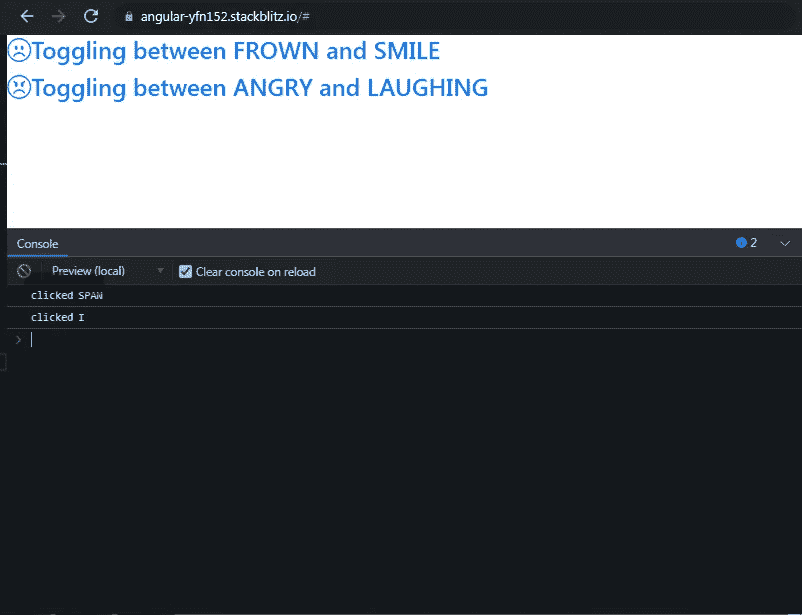
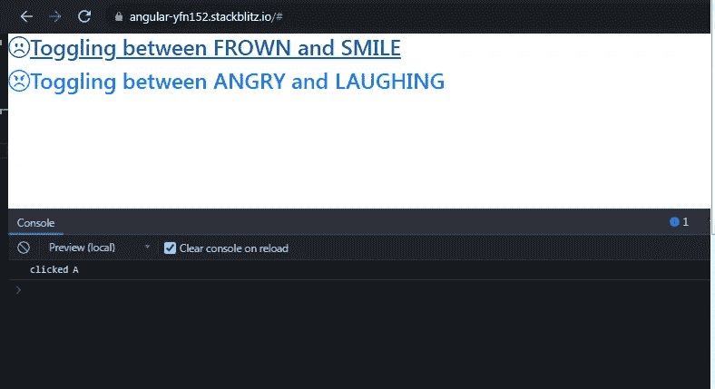
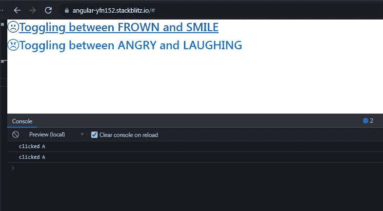

# Angular:我终于明白了何时以及如何使用事件的 currentTarget 属性

> 原文：<https://medium.com/geekculture/angular-how-i-finally-understood-when-and-how-to-use-currenttarget-property-of-events-9bd3725d691a?source=collection_archive---------10----------------------->

你有没有遇到过这样的场景，你不得不**操纵子元素** **的 CSS，而不管事件发生在哪里:在父元素上还是在子元素**上？

我想分享一下我是如何处理这个场景的，以及如何使用指令使解决方案可重用的。这个例子还帮助我理解了事件的**目标**和**当前目标**属性之间的区别。

这是我的**图标切换角度应用**的样子:



我们的目标很简单。

1.  “在皱眉和微笑之间切换”文本旁边的图标必须在皱眉和微笑表情图标之间切换，不管我是点击文本还是图标。
2.  “在生气和大笑之间切换”文本旁边的图标必须在生气和大笑表情图标之间切换，不管我是点击文本还是图标。

我的组件模板看起来像这样。该模板显示图标和文本，如上面的屏幕截图所示。我在这个例子中使用了引导图标。

请注意元素的结构。我们有一个父元素，它有两个子元素:*和标签。不管我是点击*标签还是标签，附加到*标签的引导图标类都会一直切换。我们将很快看到 **event.currentTarget** 如何在这个场景中帮助我们。***

使用选择器**切换**的**切换方向**已应用于父<标签。该指令将负责所有的切换图标逻辑。

你一定很奇怪上面的主旨没有逻辑:)逻辑相当直白简单。因此，在我们开始之前，有必要了解事件的**目标**和**当前目标**属性之间的不同。

因此，我们首先记录了 **event.target** 元素的**标记名**属性。当我第一次点击文本“**在皱眉和微笑之间切换**，正如你在下面看到的，它已经记录了“**点击跨度**”。



当我点击皱眉表情图标时，它已经记录了“**点击了我**”。



这种行为意味着 **event.target 引用了事件发生的元素。**您将观察到****文本在生气和大笑**之间切换的类似行为。**

**现在让我们修改下面的 **ToggleDirective** 来记录 **event.currentTarget** 元素的**标记名**属性。**

**当我第一次点击文本“**在皱眉和微笑之间切换**，正如你在下面看到的，它已经记录了“**点击了一个**”。**

****

**当我点击皱眉表情图标时，它也记录了“**点击了一个**”。**

****

**这种行为意味着 **event.currentTarget 引用的是事件处理程序附加到的元素，而不是事件发生的元素。****

**您将观察到****文本在生气和大笑**之间切换的类似行为。****

****为什么我们选择 **event.currentTarget** 作为切换图标的例子？因为我们并不关心用户点击了哪个子元素，即< i >或< span >标签。不管他点击哪里，我们都需要附加到< i >标签的引导图标类来切换。****

****将 **ToggleDirective** 应用于父< a >标签而不是子< i >标签是一个更好的选择。这是因为用户可以自由点击< span >标签文本或< i >标签图标来切换图标类别。****

****现在让我们来看看指令中使用的实际切换图标逻辑。****

```
**let iconElement = target.querySelector(‘.togglingIcon’);**
```

******目标**是父<元素>而**图标元素**是带有类 **togglingIcon** 的< i >标签。****

****我们创建了一个对象**图标**，有 4 个属性:**皱眉、微笑、生气和大笑**。每个属性的值又包含另外两个属性:**图标和对**。****

******属性图标**包含引导图标类名，而**属性对**包含字符串。如果你注意到这个字符串与**图标**对象中的另一个属性相同。****

****例如，**图标对象**的**皱眉属性**拥有**对属性**为**"微笑"**。原因是皱眉表情符号必须切换到微笑表情符号。在图标对象下我们还有一个**微笑属性**。****

```
**let **icons** = {
frown: { icon: 'bi-emoji-frown', pair: 'smile' },
smile: { icon: 'bi-emoji-smile', pair: 'frown' },
angry: { icon: 'bi-emoji-angry', pair: 'laughing' },
laughing: { icon: 'bi-emoji-laughing', pair: 'angry' },
}**
```

****如果需要添加更多图标或删除现有图标，则需要单独更新**图标对象**。****

****下面这段代码执行实际的切换动作。使用**渲染器 2** 来添加和移除类。****

```
**for (let x in icons) {
**if (iconElement.classList.contains(icons[x].icon)) {**
this.renderer.**addClass**(iconElement, icons[icons[x].pair].icon);
this.renderer.**removeClass**(iconElement, icons[x].icon);
break;
}
}**
```

****您可以在下面找到完整的工作示例:****

****[](https://stackblitz.com/edit/angular-yfn152?file=src/app/app.component.ts) [## 角形(叉形)堆叠

### 一个基于 rxjs，tslib，core-js，zone.js，@angular/core，@angular/forms，@angular/common 的 angular-cli 项目…

stackblitz.com](https://stackblitz.com/edit/angular-yfn152?file=src/app/app.component.ts)****