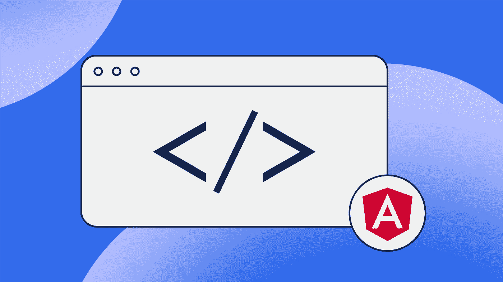

# 角度定位指南

> 原文：<https://medium.com/geekculture/angular-localization-guide-dcbbe4b150d7?source=collection_archive---------4----------------------->



当考虑角度定位时，最常见和开箱即用的解决方案是基于文件的方法，它将保存所有字符串。有一些库为你管理字符串:内置的 Angular i18n 模块 或库 [**ngx-translate**](http://www.ngx-translate.com/) 是最常用的。还有库 [**i18next**](https://www.i18next.com/) ，这是一个通用的本地化框架，既支持纯 JS，也支持框架驱动的应用。

**内置的 i18n 模块**是开始本地化 Angular 应用程序的最简单的方法，但是它也有一些缺点:首先，你不能动态地改变语言环境，但是你需要编译所有的语言并为它们生成应用程序，没有简单的方法来创建一个定制的翻译加载器。第二，只支持 XML 文件，例如，它比 JSON 文件维护起来更复杂。

第二个是 **ngx-translate** ，它是为了绕过这些限制而创建的。它工作得很好，很成熟，采用率很高，但尽管如此，内置模块正在快速发展，很快将支持这个伟大的第三方库提供的所有功能。它的主要缺点还是基于文件的方法。

最后一个， **i18next** 是一个成熟而强大的库，用于管理基于文件的翻译，它有很多特性，可能不会被用于本地化的内置 Angular 模块取代。它是不断维护的，但是它也有前面提到的所有解决方案的缺点:它是一种基于文件的方法，需要更多的努力来执行不同的任务，如分支、发布等。

在这篇文章中，我们将指导你如何使用不同的方法实现角度本地化和国际化，这不涉及管理文件。更具体地说，我们将关注一种叫做 [Transifex Native](https://www.transifex.com/native/) 的替代方法，你可以简单地在你的代码中使用它，而不需要你做额外的工作。所有可翻译的内容都由 Transifex Native 管理，所有翻译更新都是通过无线方式提供的，并具有您可以控制的额外缓存和分组功能。

# 装置

要开始使用 Transifex Native，您需要在代码中安装 Transifex Native JavaScript SDK 和额外的 Angular components 库。之后，您必须在 Transifex 应用程序中创建一个 Transifex 本地项目。Transifex 项目将提供将您的应用程序链接到内容交付系统(CDS)所需的凭证，该系统将为您的所有内容提供服务。

```
npm install @transifex/native @transifex/angular @transifex/cli --save
```

因为我们想在应用程序中使用 Transifex Native Angular SDK，所以我们需要一些额外的步骤来利用 SDK 在模板和代码中公开的所有元素。

# 声明 TXNativeModule

在我们的主应用程序模块中，我们需要添加本机模块，如下所示:

```
import { NgModule } from '@angular/core';
import { BrowserModule } from '@angular/platform-browser';
import { TxNativeModule } from '@transifex/angular';import { AppComponent } from './app.component';@NgModule({
  declarations: [
    AppComponent
  ],
  imports: [
    BrowserModule,
    TxNativeModule.forRoot(),
  ],
  providers: [],
  bootstrap: [AppComponent]
})
export class AppModule { }
```

这样，我们就可以在应用程序中使用 Transifex Native Angular SDK 提供的所有元素。

# 初始化单一翻译服务

在我们的入口组件中，我们需要注入 SDK 提供的翻译服务，并用 Transifex 项目生成的令牌初始化库。该服务是一个单例实例，可以在应用程序的任何部分使用，因为初始化是全局完成的。

```
import { Component } from '@angular/core';
import { TranslationService } from '@transifex/angular';@Component({
  selector: 'app-root',
  templateUrl: './app.component.html',
  styleUrls: ['./app.component.css']
})
export class AppComponent {
  constructor(private translationService: TranslationService) {
    translationService.init({
      token: '1/adfdaca976eb9b4d554d7******',
    });
  }
}
```

# 国际化进程

有了 SDK，您就可以开始在代码中使用提供的函数了。Native SDK 提供了不同的方法来标记本地化字符串:

*   模板中使用的 T 和 UT 组件
*   在变量声明中使用的测试装饰器
*   模板中使用的翻译管道

这是在模板上使用 Transifex Native 的一个示例:

```
<h2>{{ 'Hello world!' | translate }}</h2>
  <p>
    <UT
      str="To review the <b>terms of service</b> click here: <a href=\'terms\'>View terms</a>">
    </UT>
  </p>
  <br/>
  <p>
    <T
      str="Number of apples in the basket: {apples}"
      [vars]="{ apples: apples_number }">
    </T>
  </p>
```

正如你在上面的例子中看到的，我们使用了**翻译管道**和 **T/UT 组件**来标记你想要翻译的字符串，并传递属性，比如变量。其他可用的属性有密钥标识符、标签、字符限制、注释和上下文。这些属性将作为额外的上下文供本地化团队使用，以更好地完成他们的工作。

您还可以在字符串中使用 ICU 语法来定义复数字符串，如下例所示。

```
<UT
  str="Updated: {minutes, plural, =0 {just now} =1 {one minute ago} other
  {# minutes ago}}"
  [vars]="{ minutes: minutes }"
></UT>
```

如果您需要在组件代码中翻译一些变量，您可以这样做:

```
@Component({
  selector: 'app-root',
  templateUrl: './app.component.html',
  styleUrls: ['./app.component.css']
})
export class AppComponent {
  @T('Angular Transifex Native Demo')
  mainTitle!: string;
...
```

然后在组件的模板中使用变量，如下所示:

```
<span><UT str="{title} is running!" [vars]="{ title: mainTitle }"></UT></span>
```

使用上面共享的语法和 T 函数，您可以通过在所有现有代码文件中标记字符串来继续；不需要额外的文件。

# 使用翻译服务

[翻译服务](https://developers.transifex.com/docs/angular-sdk#translationservice-service)可以在你的代码内部，在组件或者库中使用。它是一个强大的单例实例，公开了可以帮助您处理特定流程的方法和可观察对象。使用该服务，您可以:

*   初始化实例
*   添加、删除或选择替代实例
*   设置并获取当前区域设置
*   翻译字符串
*   批量获取翻译以提高延迟加载和性能
*   检索可用的语言

您还可以订阅两个事件，以监控流量:

*   区域设置已更改
*   获取翻译

# 使用内置语言选择器

Angular SDK 提供了一个名为[语言选择器](https://developers.transifex.com/docs/angular-sdk#language-picker-component)的现成组件，以便轻松选择当前的语言环境。该组件公开一个事件来检测当前区域设置何时发生了更改。

```
<!-- Toolbar -->
<div class="toolbar" role="banner"> 
  <span class="welcome">{{ 'Welcome' | translate }}</span>
  <div class="spacer"></div>
  <tx-language-picker class="languagePicker"></tx-language-picker>
</div>
```

# 推送内容进行翻译

要推送内容进行翻译，您需要在系统上安装 [txjs-cli 工具](https://docs.transifex.com/javascript-sdk/uploading-source-content-to-transifex)。您还需要在 Transifex 项目中创建的令牌，以便能够向您的项目发送内容。使用 CLI 工具将扫描所选文件夹中的所有文件，并使用下面显示的命令将可翻译的内容推送到您的 Transifex 项目中。

```
$ npx txjs-cli push <SRC_FOLDER> --token=<PROJECT_TOKEN> --secret=<PROJECT_SECRET>
```

使用附加参数，您可以用自定义标签标记您推送的内容，或者确保您清理了任何未使用的内容。阅读我们的 [CLI 文档](https://docs.transifex.com/javascript-sdk/uploading-source-content-to-transifex)中的所有细节。

# 预览翻译

要在应用程序中预览翻译，只需使用语言选择器切换语言。Native SDK 的 Angular 组件包括一个语言选择器，它与本地服务绑定以请求翻译，但是您也可以构建自己的选择器。

当选择一种新语言时，Native SDK 将检查是否缓存了最新的翻译版本。如果没有，它们将被获取并在应用程序中可用。随着新的翻译被添加到 Transifex 项目中，它们在一个小时内就可以在应用程序中使用了。

如果您想在本地主机或实时环境中获得最新的翻译，可以在命令行界面中使用 invalidate 命令。

```
$ npx txjs-cli invalidate --token=<PROJECT_TOKEN> --secret=<PROJECT_SECRET>
```

# 在 Transifex 中处理翻译

进入 Transifex 接口，您从代码中推送的所有内容都被添加到您的 Transifex 原生项目的资源中。要访问您推送的短语，请访问编辑器。

在编辑器界面中，您将看到完整的短语列表和一组有助于内容本地化的工具。您和您的本地化团队可以通过添加新的翻译或改进现有的翻译来开始处理内容。只要保存了翻译，它就会自动在您的本地应用程序中可用。

使用 Transifex Native，您还可以修复错别字或改进原文的文案。点击[编辑源字符串](https://docs.transifex.com/projects/edit-source-strings)选项，改进您的内容。与翻译类似，所有编辑都可以在您的本机应用程序中使用。

**我什么时候能在应用程序中看到更新的内容？**

Transifex 本地翻译由一个名为 [Transifex CDS](https://docs.transifex.com/transifex-native-sdk-overview/hosting-translations) 的安全 CDN 服务器提供，每小时更新一次。Native CDS 是一个开源服务器，您可以将其安装在自己的基础设施中，以获得额外的修改和安全性。

# 进一步优化您的工作流程

Transifex Native 非常灵活，可以通过开放的架构和工具集支持更复杂的工作流。

# 使用分支

如果处理多个分支，可以通过直接向 CLI 命令添加标记来标记推送到本机的字符串。这样，您可以在 Transifex 中对本地化工作进行优先级排序，因为您的本地化团队可以在编辑器中通过标签进行过滤。要使用标签推送，请使用下面显示的命令。

```
txjs-cli push <SRC_FOLDER> --token=<PROJECT_TOKEN> --secret=<PROJECT_SECRET> --append-tags=<YOUR_TAG>
```

# 使用字符串键，增加可重用性

如果您想改进开发团队的工作流程，优化本地化团队需要翻译的内容数量，请为字符串使用关键字。

要使用键，您需要在本机函数中添加一个额外的属性，将字符串标记为可翻译的。键是唯一的标识符，可以在代码的其他区域重用。具有相同键的多个字符串在 Transifex 中作为单个字符串被推送。因此，本地化团队只需要添加一个翻译。

要使用 key 属性，只需在 T 组件中传递 _key 参数:

```
<Text><T _str="Hello world" _key=”welcome.string” /></Text>
```

# 内容拆分

要在特定页面上提供较小的翻译块，您可以使用内容拆分功能。如果你的应用程序有很多内容，但并不需要在每个屏幕上显示，那么把你的内容分成小块是非常有用的。例如，当访问者在您的应用程序设置页面上时，没有理由通过无线方式获取您的帮助中心内容。

内容分割基于标签，因此您可以设置新标签或使用任何现有的标签来分割您的内容。

要使用内容拆分，请在 tx.init 函数中设置适当的标记:

```
tx.init({
  token: 'project_token',
  filterTags: 'homepage',
});You can combine content splitting with your branching tags, so you can test or debug localization in your localhost or staging environments:tx.init({
  token: 'project_token',
  filterTags: 'new-login-page-branch',
});
```

阅读关于[内容分割](https://docs.transifex.com/javascript-sdk/content-splitting)的文档以获得完整概述。

# 延迟加载翻译

结合内容分割，出于性能原因，您可以在需要时批量加载翻译。

您可以在组件首次呈现时获取特定的翻译，例如:

```
constructor(private translationService: TranslationService) { } async ngOnInit(): void {
    await this.translationService.fetchTranslations('menu');
  }
```

或者在模板的一部分中，以便获取一组用特定标签组合标记的翻译，例如:

```
<p class="small-text" [txLoadTranslations]="'menu'">
    <a href="#/home">
      <UT str="home" key="text.home" inline=true></UT>
    </a>
    &nbsp;
    <a href="#/terms">
      <UT str="terms of service" key="text.terms_of_service_1" inline=true></UT>
    </a>
    &nbsp;
    <a href="#/privacy">
      <UT str="privacy policy" key="text.privacy_policy_1" inline=true></UT>
    </a>
    <a class="align-right" href="#/login">
      <UT str="logout" key="text.logout" inline=true></UT>
    </a>
  </p>
```

# 自动化应用程序发布

当您的特性或分支准备好进行部署时，您也可以使用 Native 对您的内容进行一些整理。因为内容总是被添加到您的 Transifex 本地资源中，所以当您在您的分支上进行测试时，您可能会得到许多字符串工件。

推送时，您可以使用 purge 属性清除本机 CLI 工具中的所有错误内容:

```
$ txjs-cli push <SRC_FOLDER> --token=<PROJECT_TOKEN> --secret=<PROJECT_SECRET> --purge
```

Purge 将解析在<src_folder>中找到的所有代码文件，仅保留在这些文件中检测到的短语，删除代码文件中未检测到的任何短语。</src_folder>

通过在您的部署流程中包含清除选项，您可以对自动导航进行管理。

# 为更好的翻译添加更多上下文

您在 Transifex 中工作的本地化团队将需要您所推广的每个短语的更多上下文。通过使用测试函数的附加属性，可以直接从角度分量提供上下文:

*   **上下文**，提供关于短语的更多细节
*   **评论**，在这里你可以分享关于短语的说明
*   **字符限制**，分享关于翻译长度的具体要求
*   **标签**，用于更好的字符串分组。

这种情况的一个例子如下:

```
<Text><T _str="Hello world" _context=”login screen, welcome screen” _comments=”String displayed as header and is followed by explanation paragraph” _charlimit=”30” /></Text>
```

您附加到每个短语的所有附加信息都可以在编辑器的[上下文选项卡](https://docs.transifex.com/translation/tools-in-the-editor#section-details-&-context-for-translators)中找到。

# 使用 Transifex Native 进行角度定位的 3 个原因

现在你知道如何安装 Transifex Native 了，但是你知道“为什么”吗？以下是您应该在堆栈上安装 Native 的 3 个原因:

*   **减少开发人员的工作量:** Native 通过将本地化作为代码的一部分，最大限度地减少了开发人员对本地化过程的参与。
*   **没有更多的文件:**老式的本地化方法很大一部分是将文件从 TMS 来回传输到您的平台。这么简单的任务肯定可以自动化，对吗？这是 Transifex Native 的一大特色。
*   **专注于本地化:**忘记必须实现应用程序的翻译更新。Native 将本地化与开发分开，以便翻译人员可以专注于翻译，工程师可以专注于编程。

# 包扎

有几个库可以处理角度应用程序的角度本地化和国际化。他们中的大多数使用基于文件的方法来处理每个地区的翻译。 **Transifex Native** 提供了一种基于新方法的解决方案，即“空中传送”,它有很多好处，并且有不同的工具和 SDK 来帮助迁移到这种新方法。很容易尝试和比较传统技术，并决定哪种更适合您的工作流程。

**延伸阅读:**

*   [我们如何在两周内迁移到 transi fex Native](https://www.transifex.com/blog/2021/how-we-migrated-to-tx-native-in-2-weeks/)
*   [Transifex Native:应用程序本地化的现代方法](https://www.transifex.com/blog/2021/transifex-native-modern-approach-application-localization/)

本帖原载[本页面](https://www.transifex.com/blog/2022/angular-localization-getting-started-with-transifex-native/)。