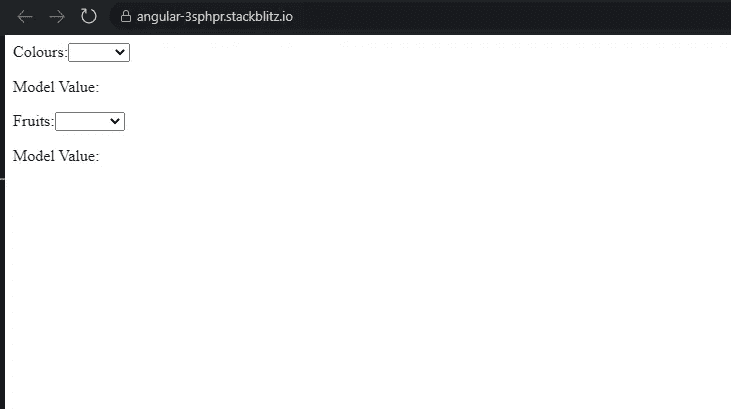
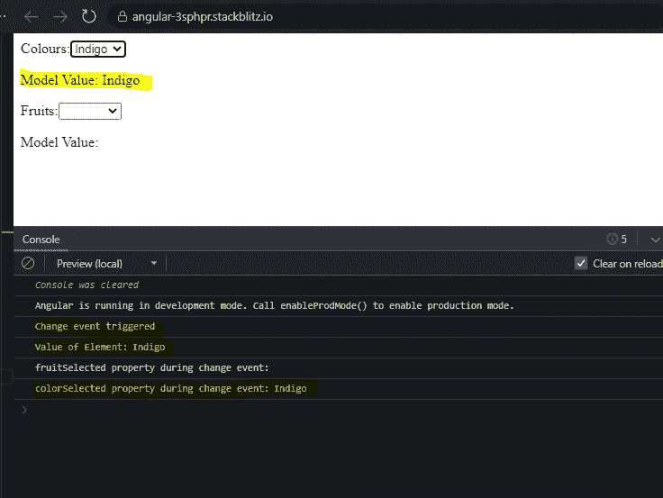
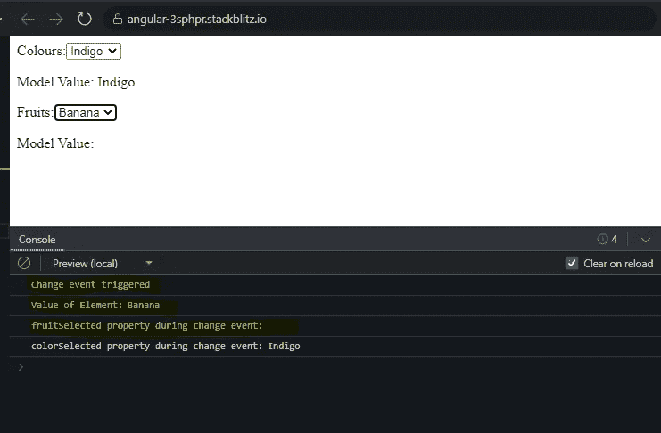
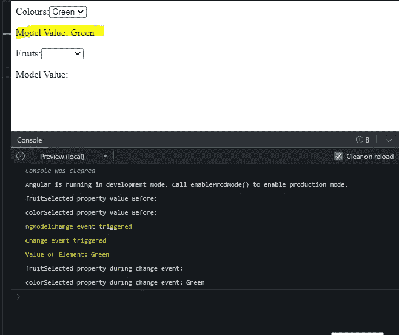
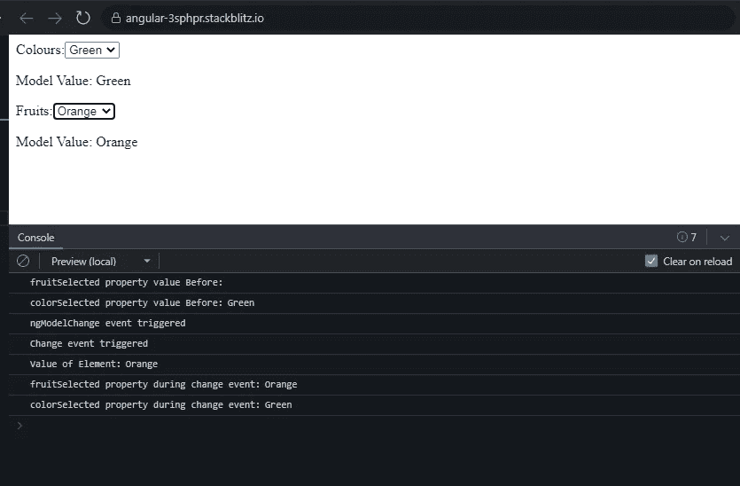

# Angular:使得有条件地将多个属性绑定到 ngModel 成为可能

> 原文：<https://medium.com/geekculture/angular-making-conditionally-binding-multiple-properties-to-the-ngmodel-possible-27b6e00dba32?source=collection_archive---------6----------------------->

当您想要重用一个 html 元素时，您是否遇到过这种情况，您觉得这个元素重复了多次，但是要绑定到该元素的 **ngModel** 的**属性**在不同的地方是不同的？

我试图用**三元运算符**来解决这个问题，但结果出乎意料。

让我用这个简单的例子向您展示问题和解决方案。

假设你有一个水果和颜色的列表显示在一个下拉列表中。

```
colors = [‘Violet’, ‘Indigo’, ‘Blue’, ‘Green’];
fruits = [‘Apple’, ‘Mango’, ‘Orange’, ‘Banana’];
```

您分别使用 2 个属性/模型**水果选择**和**颜色选择**来跟踪选择的水果和颜色。

```
fruitSelected: string = ‘’;
colorSelected: string = ‘’;
```

在模板中，为了在两个场景中重用下拉菜单，您已经将<select>添加到一个引用下拉菜单的 < ng 模板> 中。</select>

```
<ng-template #dropdown let-list="list" let-type="type">

<label>{{ type === 'fruit' ? 'Fruits' : 'Colours' }}:</label>

<select
    [(ngModel)]="type === 'fruit' ? fruitSelected : colorSelected"
    (change)="change($event)"
  >
    <option value=""></option>
    <option *ngFor="let item of list" [value]="item">{{ item }}</option>
  </select>

  <p>Model Value: {{ type === 'fruit' ? fruitSelected : colorSelected }}</p>

</ng-template>
```

**水果**和**颜色**数组属性将被传递给变量**列表**。

变量**类型**将包含一个字符串**“水果”或【颜色】**来标识下拉菜单是显示**水果**还是**颜色**。

请注意，在变量类型包含“水果”的情况下，属性 **fruitSelected** 已被赋值给[(ngModel)]。Else 属性 **colorSelected** 被赋值给[(ngModel)]。

我们还向<select>元素添加了一个变更事件。事件处理程序 change()将记录</select>元素值的变化。

```
 change(evt) {
    console.log('Change event triggered');
    console.log('Value of Element:', evt.target.value);

    console.log('fruitSelected property during change event:', this.fruitSelected);
    console.log('colorSelected property during change event:', this.colorSelected);

  }
```

我们还打印属性 **fruitSelected** 或 **colorSelected 的值的任何变化。**

最后，我们使用 **ngTemplateOutlet** 和**ngTemplateOutletContext**来显示颜色和水果的列表。

```
<ng-container [ngTemplateOutlet]=”dropdown” 
[ngTemplateOutletContext]=”{ list: colors,type: ‘color’}”></ng-container>

<ng-container [ngTemplateOutlet]=”dropdown” [ngTemplateOutletContext]=”{
list: fruits,type: ‘fruit’}”></ng-container>
```

最初，应用程序如下所示，因为属性 **fruitSelected** 和 **colorSelected** 都被初始化为空字符串。



现在，让我把颜色改成“靛蓝”。属性 **colorSelected** 已从空字符串更新为“Indigo”。

您还可以在控制台中看到， **change 事件已经触发了**，并且< select >元素的值以及属性 **colorSelected** 的更新值已经被记录。



清空控制台。现在让我们把水果换成“香蕉”。

属性 **fruitSelected** 在模板和控制台中都没有更新。它仍然是一个空字符串。但是请注意，**变化事件**已经触发，并且“香蕉”已经被记录为控制台中<选择>元素的**值。**



我们由此推断出什么？<选择>标签的**值已更改为“Banana ”,但此更改尚未在**结果选择**属性中更新，即模型尚未更新。**

这意味着使用三元运算符方法时，**双向数据绑定不能像预期的那样工作。**

我们如何让这个工作？

我将如下所示更新<select>元素。</select>

```
<select
[ngModel]=”type === ‘fruit’ ? fruitSelected : colorSelected”
(ngModelChange)=”updateModel($event, type)”
(change)=”change($event)”
>
```

**[(ngModel)]** 已更改为**【ng model】**，即**简单属性绑定。**

**(ngModelChange)** 事件已添加到<选择>元素中。

事件处理程序 **updateModel()** 将属性 **fruitSelected** 和 **colorSelected** 的值更新为< select >元素的**值。 **updateHandler()** 将< select >元素的值和类型变量作为参数。**

```
updateModel(value, type) {
   console.log('fruitSelected property value Before:', this.fruitSelected);
   console.log('colorSelected property value Before:', this.colorSelected);
   console.log('ngModelChange event triggered');
   type === 'fruit' ? this.fruitSelected = value:this.colorSelected = value;
  }
```

在我们继续之前，我们需要了解 **(ngModelChange)** 和 **(change)** 事件之间的区别。

1.  每次<select>元素值改变时，触发(ngModelChange)事件。 在 ngModel 即 fruitSelected 或 colorSelected 绑定的属性的值发生变化之前触发。在这个阶段，您可以对模型的值进行更改。</select>
2.  仅当 **<选择>元素模糊**且绑定到 ngModel 的属性的**值(即**结果选择**或**颜色选择**发生变化)后，才会触发(change)事件。在这个阶段，您可以使用模型的更新值来执行一些操作。**

让我们现在重试我们的实验。

1.  将颜色的值更改为“绿色”。型号**颜色选择**已更新为“绿色”。



我们从控制台做出以下推论。

在(ngModelChange)事件处理程序 **updateModel()** 中，模型 **fruitSelected** 和 **colorSelected** 的初始值是一个**空字符串，即它们没有更新。**这些模型的值被**手动更新为方法内< select >元素的值。**

在 **(change)** 事件处理程序 **change()** 内部，模型的值已经有了它们的更新值。

2.清空控制台。将水果的值改为“橙色”。您可以观察到模板和控制台中的模型 **fruitSelected** 已经更新为“橙色”。



当 **(ngModelChange)** 事件处理程序 **updateModel()** 被触发时，可以看到 **fruitSelected** 的值仍然是一个空字符串。之后，它以同样的方法更新为<选择>元素的值，即“橙色”。

所以现在您可以轻松地将多个属性有条件地绑定到 **ngModel** 上。

您可以查看下面的完整工作示例。

[](https://stackblitz.com/edit/angular-3sphpr?file=src/app/app.component.html) [## 角形(叉形)堆叠

### 一个基于 rxjs，tslib，core-js，zone.js，@angular/core，@angular/forms，@angular/common 的 angular-cli 项目…

stackblitz.com](https://stackblitz.com/edit/angular-3sphpr?file=src/app/app.component.html)