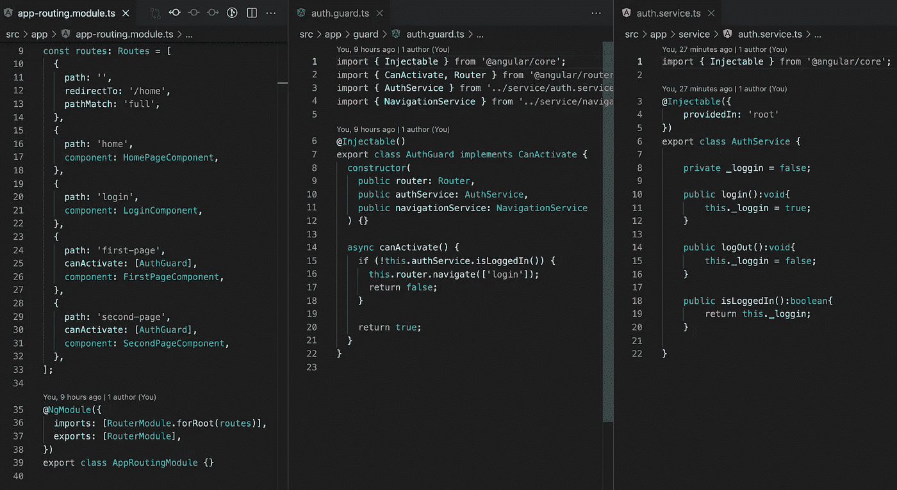
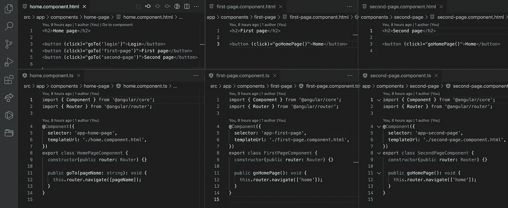
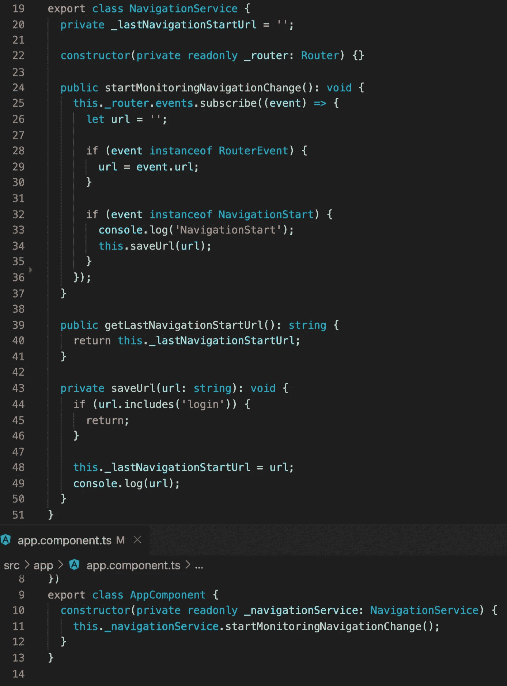
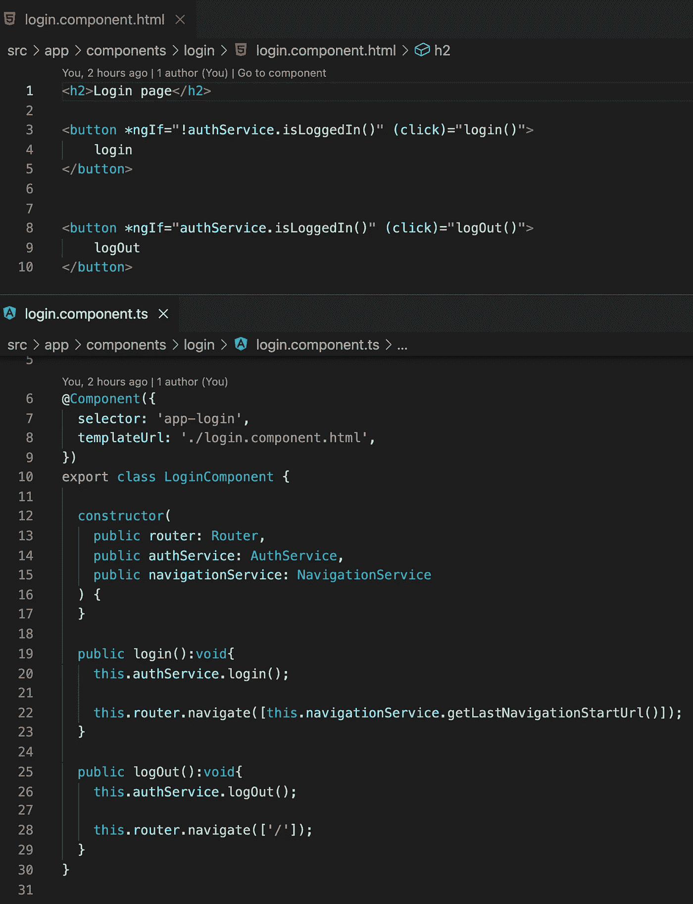

# 角导航事件给出更好的 UX

> 原文：<https://medium.com/geekculture/angular-navigation-events-give-a-better-ux-bc6e7af4bf59?source=collection_archive---------4----------------------->

想象你正在读一篇文章。本文包含一个链接。你点击这个链接，但不是先看到资源，你需要登录。此后，您将重定向到一个主页。你期待一个不同的行为。现在你需要转到文章，再次点击链接。这是一个非常糟糕的用户体验。

我们如何改变这种行为？嗯，我们需要监控应用程序中的用户活动。登录后，我们可以在登录页面之前获取 URL，并将其重定向到该页面，而不是将用户重定向到主页。比起第一个，我更喜欢这个行为。

现在是实现这一战略的时候了。我们需要做四页纸。其中两个由授权警卫保护。对于登录页面，我们创建了一个简单的授权服务。

我们的网页非常简约。

我们的登录页面在登录前需要知道网址。让我们创建一个导航服务并存储导航 URL。我们可以通过使用 RouterEvent 来监视用户活动。Angular 提供了 9 个路由事件:GuardsCheckEnd、GuardsCheckStart、NavigationCancel、NavigationEnd、NavigationError、NavigationStart、ResolveEnd、ResolveStart、RoutesRecognized。我们将使用 NavigationStart 事件。

如你所见，我们进行了订阅。每当用户转到下一页时，NavigationStart 事件会通知我们。我们不需要保存“登录”URL。在 app 组件中，我们开始监控用户导航活动。

最后一步是制作登录页面。成功登录后，我们使用 NavigationService 将用户重定向到他的初始 URL。

现在，当我们转到“首页”时，首先我们将转到“登录”页面，然后我们将被重定向到“首页”。同样的行为也适用于“第二页”。

如果你需要仔细看看这个项目[，这里是链接](https://github.com/8Tesla8/navigation-events)。

*原载于 2021 年 12 月 12 日*[*【http://tomorrowmeannever.wordpress.com】*](https://tomorrowmeannever.wordpress.com/2021/12/12/angular-navigation-events-give-a-better-ux/)*。*