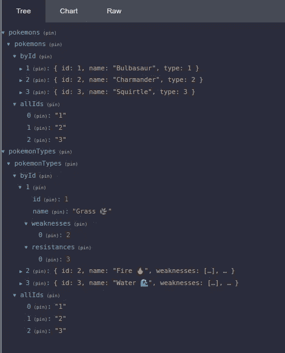
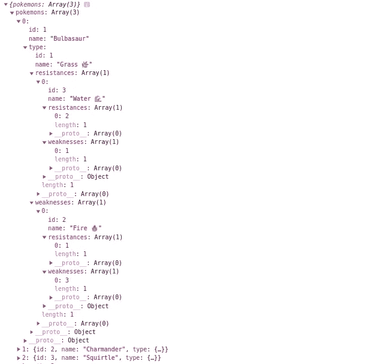

# Angular + NGXS + Normalizer:通过标准化实现更好的数据管理

> 原文：<https://medium.com/geekculture/angular-ngxs-normalizr-better-data-management-with-normalization-b0d656a3db94?source=collection_archive---------0----------------------->

## 在本帖中，我们将探索使用数据规范化管理 ngxs 商店的更好方法。

# 什么是数据规范化？

数据规范化只不过是用“范式”对数据建模。但是，这不是真的，是吗？

当我们在状态管理模式中讨论数据规范化时，我们主要讨论四个要点:

*   每个实体都由一个“表”来表示。
*   每个表中的每一项都按其 id 进行索引，就像在地图中一样。
*   对实体内部其他实体的任何引用都是通过被引用者的 id(外键，如果我们用 SQL 术语来说的话)来完成的。
*   还为每个实体存储了一个 id 数组来表示顺序，并帮助我们进行反规范化过程，这将在后面讨论。

您可以将数据规范化视为数据通常在关系数据库中的存储方式。你不会将一个 SQL 实体存储在另一个实体中，而是创建一个指向被引用实体的指针，不是吗？

让我们来看两组不同的数据，一组是标准化的，另一组不是。

Version bump

你可以在这里看到一个结构的例子，你在 API 的响应上已经见过很多次了。

每一个神奇宝贝都包含了嵌套的同类信息，每一类都包含了更多的代表它们弱点和抗性的嵌套类型。这是同样的数据，现在标准化了:

好的，希望你能看到我们已经取得的几个胜利。但是…

# 为什么我们需要规范化我们的数据？

这些是主要的优势，而且它们确实非常重要，足以让我们花时间来做这件事——不是微不足道的——过程:

*   **数据不重复:**你有没有看到上例中每个神奇宝贝类型在数据不归一化的情况下定义了多少次？当试图保持数据的更新和一致性时，数据的表里不一会带来一系列问题。还有，内存降低！
*   **无需计算成本即可访问数据:**在这个例子中，我们没有那么多嵌套层次，但是想象一个真实的数据集。如果我们想更新一个 n 层嵌套的项目，我们必须通过遍历所有层来找到每个层上的元素的索引；抛开访问数据时产生的混乱代码不谈。
*   **商店树中只有一小部分在发生变化时得到更新:**这也很重要，因为您可能有相当多的组件在监听树中的变化。如果更新嵌套在另一个对象上的对象，将通知整个父对象的侦听器。如果数据存储是规范化的，就不会发生这种情况。

# 我应该如何在我的 NGXS 商店上这样做？

当我第一次面对深度嵌套状态的问题，并试图通过规范化我的数据来解决它时，我找到了关于如何用 React Redux 和 NgRx 来做这件事的文章。但是因为我喜欢 NGXS 的简单性，所以我想继续使用它。所以这是我关于如何做的建议。

我们将利用一个众所周知的健壮的库，名为 [normalizr](https://github.com/paularmstrong/normalizr) ，它将基本上对我们的数据进行规格化和反规格化。

## 第一步:创建保存规范化数据的状态

在我的方法中，每个实体由不同的国家持有。当然，这也适用于单个更大的状态，但是为了没有单个巨大的文件(据我所知，因为 ngxs 不允许我们在不同的文件中实现动作监听器)，我宁愿将它们分开。

首先，要使用 normalizr，我们应该为 Pokemon 和 PokemonType 实体创建模式，告诉它如何规范化和反规范化我们的数据(如果您不知道如何使用 normalizr，请转到 GitHub 的文档部分):

如您所见，我们在这里定义了 normalizr 模式和一些接口，使状态代码更加类型友好。

现在，两种状态都以前面几节中解释的方式保存数据:

这里没什么特别的。在 NGXS 上声明状态的通常方式，但是状态模型是一个准备好的对象，用于保存由 id 和所有 id 的数组索引的规范化实体。

## 第二步:规范化来自外部来源的数据

让我们假设一个组件分派一个 PokemonsState 将处理的动作，它将使用注入状态的服务从 API 中检索数据。即将到来的数据不会被规范化，我们希望在存储之前对其进行转换。此外，规范化数据部分存储在 PokemonsState(神奇宝贝实体)上，部分存储在 PokemonTypeState(神奇宝贝类型实体)上。

为了实现这一点，将从 de API 检索数据的动作处理程序将首先规范化数据，然后分派两种状态都将处理的动作(某种广播)。让我们看看它的实际效果。

让我们首先关注口袋妖怪州，因为它是做得最多的州。

第一个动作处理器叫做 *getPokemons* ，负责从 de API 获取非标准化数据。然后它将调用 *normalizePokemons()* 传递检索到的 Pokémons 数组，这个将利用 normalizr 来获取规范化的实体。最后，它将调度广播动作 *GetPokemonsSuccess* 。

getpokemonsuccess 处理程序将把存储在状态中的实体与新的实体合并。

现在，让我们来看看口袋妖怪的状态:

这看起来很眼熟。它基本上和口袋妖怪状态做同样的事情。

这里是 redux devtools 上的规范化状态的结果，正如你所看到的，我们已经实现了一个规范化的数据集！

Redux dev tools with our data normalized! Yay! 🎉

## 最后一步:将我们的数据反规范化，以便在组件上使用它

好的，标准化数据非常适合存储它和对它进行修改(不在本文的范围内，但是您可能会看到操作处理程序修改“嵌套”数据是多么容易)。

但是，我们正在开发一个 Angular 应用程序，所有这一切的最终参与者是组件，相信我，在组件中处理规范化的数据集并不真正友好。我们想反规格化它！

谁将负责这件事？选择器。

我将在这里展示一个选择器的例子，它将选择所有的神奇宝贝。当然，它将包括类型信息。

为了保持整洁，我们将利用 NGXS 拥有的[选择器组合](https://www.ngxs.io/concepts/select#joining-selectors)特性。

首先，我们在 PokemonTypeState 上有一个选择器，它将给出一组“原始的”规范化数据。

那很容易。

现在，我们将该选择器与将在组件上选择的真实选择器连接起来。

这就是反规范化“魔法”发生的地方。但也没那么花哨吧？我们从两种状态中获取实体(如预期的那样，为了反规格化我们需要它们), normalizr 库给了我们原始对象……或者没有？

这是这段代码的结果。

Infinite circular dependency! 😨

如你所见，normalizr 不像我们预期的那样处理循环依赖，我们将达到内存极限。我们必须手动停止循环。

我们通过稍微修改我们的模式来做到这一点:

有了这个，*弱点*和*抗性*里面的类型就不会再有其他类型了，所以 normalizr 不会去规格化它们。让我们看看结果:

That’s better 😌

好吧，我们可以这样做！嗯，我们的“内部”类型仍然有一个弱点和抗性数组，但是在它们内部，我们只能找到 id，所以递归展开被停止。

你将得到这些组件的数据，你可以随意使用。

就这些，我希望你喜欢这篇文章，并请在评论区留下任何建议！

和你说话！

页（page 的缩写）d:你可以在这里找到源代码的最终版本。

更多相关文章:

*   [https://redux . js . org/recipes/structuring-reducers/normalizing-state-shape](https://redux.js.org/recipes/structuring-reducers/normalizing-state-shape)
*   [https://medium . com/angular-in-depth/the-benefits-of-application-state-normalization-in-angular-f 93392 ca 9 f 4](/angular-in-depth/the-benefits-of-application-state-normalization-in-angular-f93392ca9f44)4