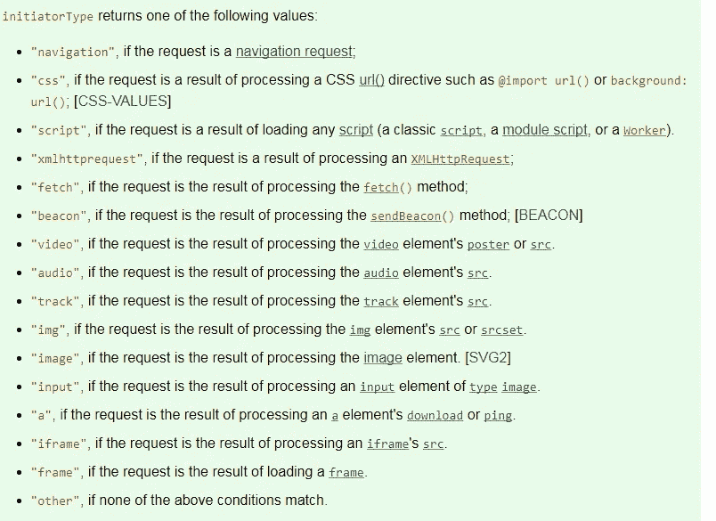
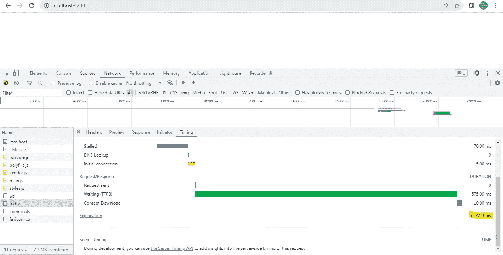
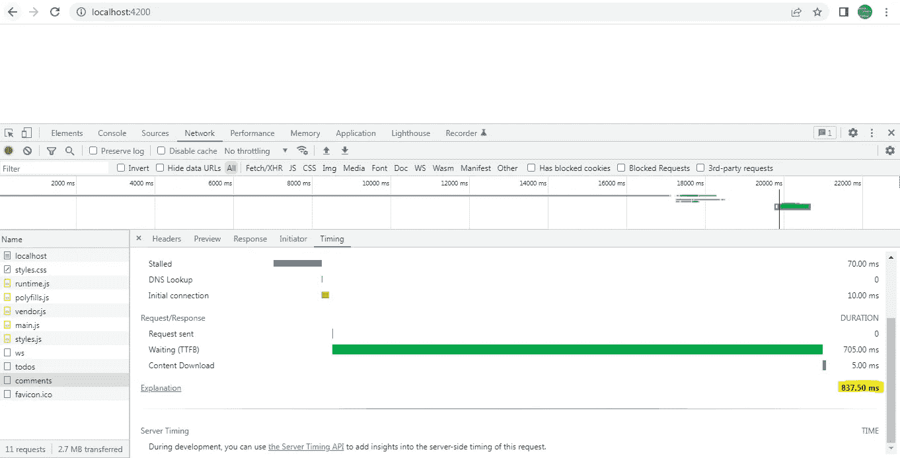
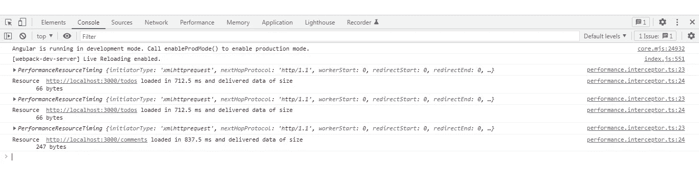
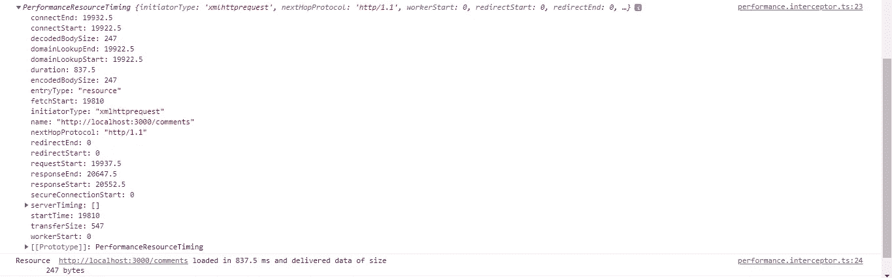

# Angular，Node:使用资源计时 API 获取 API 计时信息

> 原文：<https://medium.com/geekculture/angular-node-using-resource-timing-api-to-get-api-timing-information-f460898f31d9?source=collection_archive---------5----------------------->

在为我的工作项目编码的过程中，我遇到了这个非常有趣的**资源计时 API** ，它是通过 **window.performance** 属性公开的。

用 MDN 文档的话说，资源计时 API 提供了一种方法来检索和分析关于应用程序的*资源*的加载的详细网络计时数据。

这里的应用程序资源可以是以下任意一种:`[XMLHttpRequest](https://xhr.spec.whatwg.org/#xmlhttprequest)`对象[ [XHR](https://www.w3.org/TR/resource-timing-2/#bib-xhr) ]，链接类型为`[stylesheet](https://html.spec.whatwg.org/multipage/links.html#link-type-stylesheet)`的 HTML 元素如`[iframe](https://html.spec.whatwg.org/multipage/iframe-embed-object.html#the-iframe-element)`、`[img](https://html.spec.whatwg.org/multipage/embedded-content.html#the-img-element)`、`[script](https://html.spec.whatwg.org/multipage/scripting.html#script)`、`[object](https://html.spec.whatwg.org/multipage/iframe-embed-object.html#the-object-element)`、`[embed](https://html.spec.whatwg.org/multipage/iframe-embed-object.html#the-embed-element)`和`[link](https://html.spec.whatwg.org/multipage/semantics.html#the-link-element)`，SVG 元素如 [svg](https://www.w3.org/TR/SVG11/struct.html#SVGElement) 和`[EventSource](https://html.spec.whatwg.org/multipage/server-sent-events.html#eventsource)`。

结果与 Chrome 的开发者工具提供的计时信息非常接近或几乎相同。

为了测试这一点，我创建了一个简单的 Angular 项目，它对一个节点服务器进行两次 API 调用 **/comments 和/todos** ，以获取注释和 todos 数据。

为了捕获 API 调用的性能，我创建了一个拦截器来完成这项工作。

一旦服务器发回响应，我们就调用 **rxjs tap()中的 **analysePerformance()** 。**

```
analyzePerformance() { let resourceList = **window.performance.getEntriesByType(‘resource’);**let filteredResourceList = **resourceList.filter( (resource:any) =>{ 
return resource[‘initiatorType’].includes(‘xmlhttprequest’) } );** filteredResourceList.forEach((entry:any)=>{ 
console.log(entry); 
console.log( **`Resource ${entry.name} loaded in ${entry.duration} ms and delivered data of size ${entry[“decodedBodySize”]} bytes`** ); }) 
}
```

windows . performance . getentriesbytype(**resource**’)将返回给定类型“resource”的 **PerformanceEntry** 对象列表。

该列表是具有不同 **initiatorType** 属性的对象的数组。 **initiatorType** 属性让我们了解对象包含的资源类型。下面是属性可以包含的值列表。



在本例中，当我们查看 2 个 GET Http 请求的计时信息时，我们对类型为 **xmlhttprequest 的 resources/PerformanceEntry 对象更感兴趣。**

```
let filteredResourceList = **resourceList.filter( (resource:any) =>{ 
return resource[‘initiatorType’].includes(‘xmlhttprequest’) } );**
```

因此，正如您在上面看到的，我们只为 xmlhttprequest 对象过滤 PerformanceEntry 列表。

```
filteredResourceList.forEach((entry:any)=>{ 
console.log(entry); 
console.log( **`Resource ${entry.name} loaded in ${entry.duration} ms and delivered data of size ${entry[“decodedBodySize”]} bytes`** );})
```

最后，我们遍历所需的列表，记录整个 PerformanceEntry 对象和一个字符串，该字符串包含资源名称、资源返回的数据大小以及资源完成其操作所用的时间，即 API 调用完成所用的时间。

在跨源资源共享(CORS)请求的情况下，PerformanceEntry 对象中的许多计时属性值返回为零。为了避免这种情况，提供资源的服务器必须发送带有一个值的`[**Timing-Allow-Origin**](https://developer.mozilla.org/en-US/docs/Web/HTTP/Headers/Timing-Allow-Origin)` HTTP 响应头，该值指定允许获取受限时间戳值的一个或多个源。

下面是用于检索注释和待办事项数据的 Nodejs Express 路由器。请观察两个路由器文件中返回的响应头。

```
res.setHeader(‘**Timing-Allow-Origin**’,cors.whiteListedOrigins);
```

我们已经用从 **cors.js** 文件中导出的 **whiteListedOrigins** 属性的值设置了 **Timing-Allow-Origin** 头。

**cors.js** 文件如下所示。**whiteliedorigins**是一个数组，包含连接到节点服务器的白名单源列表。这意味着只有这些源可以连接到节点服务器以访问其资源，包括受限的定时信息。

cors 白名单中的所有源不必都能访问受限定时属性。但是在这个例子中，我们这样做是为了简单。

最后，让我们看看 Chrome 开发者工具，将计时结果与资源计时 API 进行比较。

在 Chrome 开发者工具中， **/todos API** 用了 **712.50 ms** 完成，**/评论 API** 用了 **837.50 ms** 完成。



todos API



comments API

现在让我们在控制台中检查资源计时 API 结果。



如你所见，我们得到了两个 API 完全相同的结果。下面是 PerformanceEntry 对象的截图。如果没有设置 **Timing-Allow-Origin** 响应头，该对象中的许多属性将会取值为 0。最终结果将是您将无法获得正确的时间信息。

