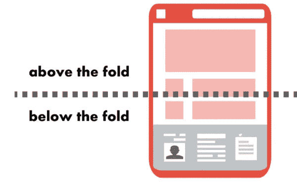
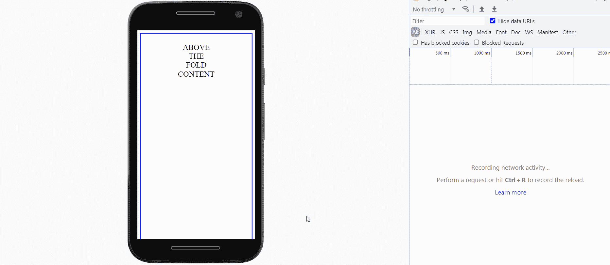

# 角度优化:加载折叠下方的内容

> 原文：<https://medium.com/geekculture/angular-optimisation-load-content-below-the-fold-8ef87559c867?source=collection_archive---------8----------------------->

在页面滚动上加载组件



为了减少页面的加载时间，一个好的规则是只加载折叠线以上的内容，只有当用户滚动页面时才加载折叠线以下的内容。

为此，我们将侦听“窗口”上的“滚动”事件，并在页面上标记一个元素，一旦该元素可见，将触发“到达位置”事件。注意,“滚动”事件将在角度之外**被监听，以避免大量和不必要的变化检测周期。
此时，我们可以加载更多的内容，比如在“ng-dynamic-component”库和服务的帮助下加载一个模块的组件。**

让我们创建一个名为“tagReached”的指令

```
**tagReached.directive.ts**import {
    AfterViewInit,
    ContentChild,
    Directive,
    ElementRef,
    EventEmitter,
    NgZone,
    OnDestroy,
    OnInit,
    Output
} from '[@angular/core](http://twitter.com/angular/core)';
import {Subscription} from 'rxjs';
import {debounceTime} from 'rxjs/operators';import {CommonService} from '../common.service';[@Directive](http://twitter.com/Directive)({
    selector: '[tagReached]'
})
export class TagReachedDirective implements OnInit, AfterViewInit, OnDestroy {
$windowSize: Subscription;
documentHeight;
breakpointOffsetTop;
_scrollEventBind;
 reachedEmitted = false;[@ContentChild](http://twitter.com/ContentChild)('breakpointTag', { static: false, read: ElementRef }) breakpointTag: ElementRef;
[@Output](http://twitter.com/Output)() reached: EventEmitter<boolean> = new EventEmitter<boolean>();constructor(private ngZone: NgZone, private commonService: CommonService) { }ngOnInit() {
        **// Run only in client side**
        if (!this.commonService.isBrowser())
            return;
        this._scrollEventBind = this.handler.bind(this);
        this.commonService.addListenerToWindowScroll(this._scrollEventBind);
    }ngAfterViewInit() {
        // Run only in client side
        if (!this.commonService.isBrowser())
            return; **// Delay the init function to avoid the access to DOM for perform better first load**
        if ('requestIdleCallback' in window) {
            // [@ts](http://twitter.com/ts)-ignore
            window.requestIdleCallback(() => this._init());
        } else
        // For Internet Explorer
            this._init();// Recalculate if browser window changes the dimensions
        this.$windowSize = this.commonService.$windowSize.pipe(debounceTime(50)).subscribe(() => {
            this.initOffsets();
        });
    }_init() {
  this.initOffsets(); if (this.checkBreakpoint(window.scrollY)) {
        this.reachedEmitted = true;
        this.reached.next(true);
      }
  }initOffsets() {
  this.documentHeight = this.commonService.getHeight(); if (this.breakpointTag) {
      this.breakpointOffsetTop =        this.findPos(this.breakpointTag.nativeElement)[1];
     }
 }handler (event) {
  const scrollY = event.currentTarget.pageYOffset; if (!this.reachedEmitted) { // Tag reached!
     if (this.checkBreakpoint(scrollY)) {
         this.reachedEmitted = true;**// Necessary due scroll event is captured outside angular change detection**
         this.ngZone.run(() => {
              this.reached.next(true);
            });
         }
        }
    }checkBreakpoint(scrollTop) {
        return scrollTop > this.breakpointOffsetTop - this.documentHeight;
    }findPos(obj) {
        let curleft = 0;
        let curtop = 0;
        if (obj.offsetParent) {
            do {
                curleft += obj.offsetLeft;
                curtop += obj.offsetTop;
            } while (obj = obj.offsetParent);
        }
        return [curleft, curtop];
    }ngOnDestroy() {
 if (!this.commonService.isBrowser())
            return;this.commonService.removeListenerToWindowScroll(this._scrollEventBind);
 this.$windowSize.unsubscribe();
 }
}
```

让我们创建一个公共服务，您可以在其中管理滚动事件的添加/删除以及浏览器窗口的当前大小

```
**common.service.ts**import {Injectable, Inject, PLATFORM_ID, NgZone} from '[@angular/core](http://twitter.com/angular/core)';
import {isPlatformBrowser} from '[@angular/common](http://twitter.com/angular/common)';
import {Subject} from 'rxjs';[@Injectable](http://twitter.com/Injectable)()
export class CommonService {
  private currentWidth = 0;
  private currentHeight = 0;private isBrowserPlatform: boolean;public $windowSize = new Subject<Object>();passiveSupported = false;
passiveSupportedTested = false;
private eventOptions: boolean | {capture?: boolean, passive?: boolean};scrollCallbacks = []; // Holds all window scroll callbacks for disable they when neededconstructor([@Inject](http://twitter.com/Inject)(PLATFORM_ID) platformId: Object, private ngZone: NgZone) {
    this.isBrowserPlatform = isPlatformBrowser(platformId);
  }isBrowser(): boolean {
    return this.isBrowserPlatform;
  }getWidth() {
    return this.currentWidth;
  }getHeight() {
    return this.currentHeight;
  }setDeviceDimensions(width, height) {
    this.currentWidth = width;
    this.currentHeight = height;
  }addListenerToWindowScroll(callback) {
    if (!this.isBrowser())
      return;
    if (!this.passiveSupportedTested) {
      this.passiveSupportedTested = true; try {
        window.addEventListener('test', null,
          Object.defineProperty({}, 'passive',
            {
              get: function () {
                this.passiveSupported = true;
              }
            })); } catch (err) {}
    }
    if (this.passiveSupported) {
      this.eventOptions = {
        capture: true,
        passive: true
      };
    } else {
      this.eventOptions = true;
    }**// Necessary for avoid a change detection on each scroll event**
    this.ngZone.runOutsideAngular(() => {
      this.scrollCallbacks.push(callback);
      window.addEventListener('scroll', callback, <any>this.eventOptions);
    });
  }removeListenerToWindowScroll(handler) {
    for (let i = 0; i < this.scrollCallbacks.length; i++)
      if (handler === this.scrollCallbacks[i]) {
        this.scrollCallbacks.splice(i, 1);
        break;
      }
    window.removeEventListener('scroll', handler, <any>this.eventOptions);
  }
}
```

让我们创建一个加载模块组件的服务

```
**loadLazyModule.service.ts**import {Compiler, Injectable, NgModuleFactory} from "[@angular/core](http://twitter.com/angular/core)";[@Injectable](http://twitter.com/Injectable)({providedIn: 'root'})
export class LoadLazyModuleService {
    myModuleComponents;constructor(private compiler: Compiler) {
    }load() {
        return Promise.all([import('./my.module')])
            .then(m => m[0].MyModule)
            .then((modalModule) => {
                this.myModuleComponents = modalModule.components;
                if (modalModule instanceof NgModuleFactory) {
                    return modalModule;
                } else {
                    return this.compiler.compileModuleAsync(modalModule);
                }
            })
            .then(factory => {
                return {components: this.myModuleComponents};
            });
    }
}
```

让我们创建一个模块，它包含一个我们想要在页面上显示的组件

```
**my.module.ts**import {NgModule} from "[@angular/core](http://twitter.com/angular/core)";
import {LazyComponent} from "./lazy.component";[@NgModule](http://twitter.com/NgModule)({
    declarations: [LazyComponent]
})
export class MyModule {
    static components = {lazyComponent: LazyComponent};
}
```

让我们创建懒惰组件

```
**lazy.component.ts**import {Component} from "[@angular/core](http://twitter.com/angular/core)";[@Component](http://twitter.com/Component)({
    selector: 'app-lazy',
    template: `<div style="color: red">LAZY COMPONENT</div>`
})export class LazyComponent {}
```

在页面上使用指令

```
**app.component.html**<div tagReached (reached)="belowTagReached($event)">
    <div style="height: 800px; text-align: center; border: 3px solid blue;">
        <br>
        ABOVE
        <br>
        THE
        <br>
        FOLD
        <br>
        CONTENT
    </div><div **#breakpointTag**>
        <div style="text-align: center; border: 3px solid yellow;">
            BELOW
            <br>
            THE
            <br>
            FOLD
            <br>
            CONTENT
            <br>
            **<ng-template [ngComponentOutlet]="lazyComponent"></ng-template>**
        </div>
    </div>
</div>
```

我们在组件中捕获事件，并为浏览器大小更改事件添加一个侦听器

```
**app.component.ts**import {Component, HostListener, NgZone, OnDestroy, Type} from '[@angular/core](http://twitter.com/angular/core)';import {CommonService} from '../common.service';
import {LoadLazyModuleService} from "./loadLazyModule.service";
import {LazyComponent} from "./lazy.component";[@Component](http://twitter.com/Component)({
  selector: 'app-root',
  templateUrl: './app.component.html',
  styleUrls: ['./app.component.scss']
})
export class AppComponent implements OnDestroy {// Window resize listener
  [@HostListener](http://twitter.com/HostListener)('window:resize', ['$event'])
  onResize(event) {
    const widthChanged = this.commonService.getWidth() !== event.target.innerWidth;
    const heightChanged = this.commonService.getHeight() !== event.target.innerHeight;this.commonService.setDeviceDimensions(event.target.innerWidth, event.target.innerHeight);
    this.commonService.$windowSize.next({width: event.target.innerWidth, height: event.target.innerHeight,
      widthChanged, heightChanged});
  }lazyContent = false;
lazyComponent: Type<LazyComponent>;
destroyed = false;constructor(private commonService: CommonService,
              private ngZone: NgZone, private loadLazyModule: LoadLazyModuleService) {// Set the first window size
    if (commonService.isBrowser()) {
      this.commonService.setDeviceDimensions(window.innerWidth, window.innerHeight);
      this.commonService.$windowSize.next({width: window.innerWidth, height: window.innerHeight});
    } else
      // Force to be a smartphone (Moto G4) when SSR
      this.commonService.setDeviceDimensions(360, 640);
  }**belowTagReached**(event) {
    if (event && !this.lazyContent) {
      this.ngZone.run(() => {
        console.log('reached');
        this.lazyContent = true;
        this.loadLazyModule.load().then((module) => {
          if (!this.destroyed)
            this.lazyComponent = module.components.lazyComponent;
        });
     });
    }
  }ngOnDestroy(): void {
    this.destroyed = true;
  }
}
```



Lazy component loaded when “below the fold” was reached

这种技术对于获取各种基准的分数也非常有用，比如 Lighthouse 和其他，因此可以提高 SEO 排名。