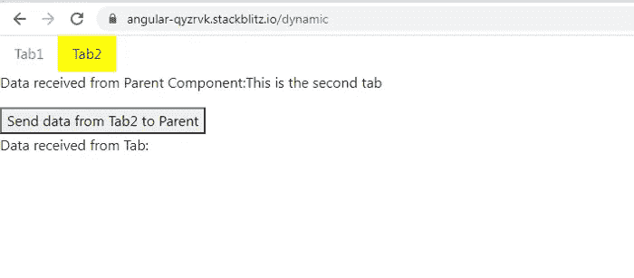
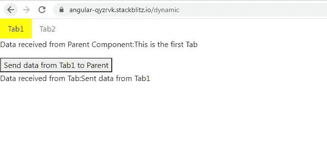

# Angular:将数据传入和传出使用 ngComponentOutlet 创建的动态组件

> 原文：<https://medium.com/geekculture/angular-passing-data-in-and-out-of-dynamic-components-created-using-ngcomponentoutlet-cb677f018735?source=collection_archive---------3----------------------->

我已经写了一个故事，探讨了如何将数据传入和传出使用 ComponentFactoryResolver 创建的动态组件。以下是链接:

[](https://ramya-bala221190.medium.com/angular-passing-data-into-and-out-of-dynamic-components-created-using-componentfactoryresolver-64c5d08c61e8) [## Angular:将数据传入和传出使用 ComponentFactoryResolver 创建的动态组件

### 我探讨了两种创建动态组件的方法:ComponentFactoryResolver 和 ngComponentOutlet，以及如何…

ramya-bala221190.medium.com](https://ramya-bala221190.medium.com/angular-passing-data-into-and-out-of-dynamic-components-created-using-componentfactoryresolver-64c5d08c61e8) 

这个故事提供了通过 ngComponentOutlet 实现的相同示例。

我们首先创建两个选项卡，它们实际上是两个组件: **Tab1Component 和 Tab2Component** 动态加载到父组件 **TabContainerComponent** 中

**TabContainerComponent 模板:**

```
<ul class=”nav”>
<li ***ngFor=”let x of tabs;let ind=index”** class=”nav-item”>
<a **[ngClass]="x.isActive ? 'activeTab' : ''"** class=”nav-link” (click)=”**ldTab(x.component, x.data,ind)”**>{{x.tab}}</a>
</li>
</ul><ng-container **[ngComponentOutlet]="activeComponent"[ngComponentOutletInjector]="myInjector"**
></ng-container><p>Data received from Tab Component: **{{ receivedData }}**</p>
```


Tab1 is active in TabsContainerComponent



Tab2 is active in TabsContainerComponent

我们正在迭代一个变量 **tabs，**，它是一个包含每个选项卡的数据、组件细节和活动状态的 2 个对象的数组。

点击一个特定的选项卡，我们调用一个方法 **ldTab()** ，传递组件名、选项卡数据和选项卡索引作为参数。

<ng-container>已经接受了 2 个属性:**ngcomponentfoutlet**和**ngComponentOutletInjector**。</ng-container>

**activeComponent** 变量包含需要动态创建的组件名称。此变量作为值传递给 ngComponentOutlet 属性。

**myInjector** 是一个定制的注入器，用于向动态组件传递数据。此注入器作为值传递给 ngComponentOutletInjector 属性。

我们将很快看到如何创建注入器，将它传递给这个属性，以及它如何将数据传递给动态组件。

```
**export const token = new InjectionToken<string>(‘’);**@Component({
selector: ‘app-tabs-container’,
templateUrl: ‘./tabs-container.component.html’,
styleUrls: [‘./tabs-container.component.css’],
})export class **TabsContainerComponent** implements OnInit {
constructor(**private serv: DynamicService, private injector: Injector**) {}public **tabs**: any = [{
tab: ‘Tab1’,
component: **Tab1Component**,
data: ‘This is the first Tab’,
isActive:true
},
{
tab: ‘Tab2’,
component: **Tab2Component**,
data: ‘This is the second tab’,
isActive:false
},
];public **activeComponent**: any;
public **activeComponentData**: string = ‘’;
public **receivedData**: string;
public **myInjector**: Injector;**ngOnInit() {**
this.serv.getObservable().subscribe((data) => {
this.receivedData = data;
});this.ldTab(this.tabs[0].component, this.tabs[0].data,0);
}**setActiveTab(tabInd: number) {**
this.tabs.forEach((tab, tabIndex) => {
tab.isActive = tabIndex === tabInd;
});
}**ldTab(tabComponent: any, tabData: string,tabIndex:number) {** setTimeout(() => {this.**setActiveTab(tabIndex)**;
this.receivedData = ‘’;
this.activeComponent = tabComponent;
this.activeComponentData = tabData;
**this.createInjector();**}, 0);
}**createInjector() {** this.myInjector = Injector.**create**({
providers: [{ provide: token, useValue: this.activeComponentData }],
parent: this.injector,
});
}}
```

在这个类中，我们定义了数组 **tabs** ，这是一个由 2 个对象组成的数组。每个对象包含 4 个属性:**选项卡、组件、数据和 isActive。**

选项卡包含要在模板中显示的选项卡名称；组件包含该页签对应的组件名称，即**页签 1 组件和页签 2 组件**；数据包含一个小字符串，它将作为输入传递给组件；isActive 告诉我们该选项卡当前是否被选中。

**activeComponent** 是当前活动的动态组件。例如:如果我点击 Tab1，那么 Tab1Component 就是活动组件。

**activeComponentData** 是与动态组件相关联的数据，我们将把它从 TabsContainerComponent 传递给动态组件。该数据存在于**选项卡**数组中每个对象的数据属性中。

```
**ngOnInit() {**
this.serv.getObservable().subscribe((data) => {
**this.receivedData = data;**
});this.ldTab(this.tabs[0].component, this.tabs[0].data,0);
}
```

在 **ngOnInit()** 生命周期钩子中，我们在**动态服务**中订阅了一个名为**输出**的主题。

```
@Injectable()
export class **DynamicService** {
**private output = new Subject<string>();**
constructor() {}**getObservable() {**
return this.output.asObservable();
}**outputFromDynamicComponent(data: string) {**
this.output.next(data);
}
}
```

主题的目的是帮助父 TabsContainerComponent 从动态组件接收数据。

```
<p>Data received from Tab Component: **{{ receivedData }}**</p>
```

**receivedData** 包含从动态组件发送到 TabContainerComponent 的数据。我们在 TabContainerComponent 中显示上面的**接收数据**。



TabsContainerComponent receives data from Tab1


TabsContainerComponent receives data from Tab2

在应用程序加载时，我们希望创建 Tab1Component 并显示其数据。因此，在同一个生命周期钩子中，我们调用了 **ldTab()** 方法，将组件、**选项卡数组**的第一个对象的数据属性和选项卡索引作为参数传递。

```
this.ldTab(this.tabs[0].component, this.tabs[0].data,0);
```

现在让我们跳到 **ldTab()** 方法。

```
**ldTab(tabComponent: any, tabData: string) {** setTimeout(() => {this.**setActiveTab(tabIndex);**
this.receivedData = ‘’;
this.activeComponent = tabComponent;
this.activeComponentData = tabData;
**this.createInjector();**}, 0);
}
```

将其余代码包含在 setTimeout()中的目的是为了避免 ExpressionChangedAfterChecked 错误。

我们首先调用 **setActiveTab()** ，将选项卡索引作为参数传递，以便设置选项卡的 **isActive** 属性值。基于这个属性值，我们使用 ngClass 添加或删除 CSS 类 **activeTab** ，如下所示。

这个 CSS 类只是添加了一个背景色到活动标签中，以示区别。

```
<li ***ngFor=”let x of tabs;let ind=index”** class=”nav-item”>
<a **[ngClass]="x.isActive ? 'activeTab' : ''"** class=”nav-link” (click)=”**ldTab(x.component, x.data,ind)”**>{{x.tab}}</a>
</li>
```

我们接下来将 **receivedData** 属性设置为空字符串，这样在切换选项卡时，前一个选项卡的数据将被删除。

```
this.receivedData = ‘’;
```

**activeComponent** 变量设置为组件名，需要动态创建。

**activeComponentData** 变量包含与将被动态创建的组件相关的数据。

我们正在调用 **createInjector()** ，在这里我们创建了我们的自定义注入器 **myInjector** 。

```
**createInjector() {** this.myInjector = Injector.**create**({
providers: [{ provide: token, useValue: this.activeComponentData }],
parent: this.injector,
});
}
```

**创建注射器类的()**，创建注射器实例 **myInjector** 。

注射器的用途是什么？

依赖基本上是一个类或一个对象，任何类都需要它来执行它的功能。Angular 创建内部依赖关系图。

这个映射的关键字是**依赖注入(DI)令牌**，这个映射的值是依赖的运行时值。注入器首先使用 DI 令牌来定位依赖值。然后，注入器实例化依赖项，并将其注入到需要依赖项的类中。

```
providers: [**{ provide: token, useValue: this.activeComponentData }**]
```

**提供的**属性包含 DI 令牌。第二个属性基本上告诉注入器如何创建依赖值。这里使用的第二个属性是 **useValue，**，但是根据场景，它也可以是 useClass、useExisting 等。

我想让你注意一下写在@Component 注释之前的下面一行代码。

```
**export const token = new InjectionToken<string>(‘’);**
```

我们已经创建了一个名为**令牌**的 **InjectionToken** 对象作为 DI 令牌。当不需要类依赖时，InjectionToken 对于创建 DI 标记很有用。

因此，注入器将把**令牌**与变量 **activeComponentData** 相关联。该注入器将在动态组件中使用，以访问存储在 **activeComponentData** 中的数据。

现在让我们检查 **Tab1Component** 和 **Tab2Component** ，看看我们如何从注射器实例中提取依赖值，以及动态组件如何将数据发送到父 TabsContainerComponent。

**表 1 组件模板:**

```
<p>Data received from Parent Component:**{{dataIn}}**</p><button (click)=”**sendData()**”>Send data from Tab1 to Parent</button>
```

**表 1 组件类:**

```
export class **Tab1Component** implements OnInit {public **dataIn**: string;constructor(**private inject: Injector, private serv: DynamicService**) {}**ngOnInit() {**
this.dataIn = **this.inject.get(token);**
}**sendData() {**
this.serv.outputFromDynamicComponent(‘Sent data from Tab1’);
}}
```

**数据输入**是从 TabsContainerComponent 接收的数据。我们使用了注入器实例 **inject** 来获取基于 DI 令牌(key)的数据(依赖值)，并作为参数传递给 **get()。**

当我们点击**将数据从 Tab1 发送到父节点**按钮时，我们调用动态服务中的**outputFromDynamicComponent()**，将数据作为参数传递。该方法将数据传递给名为 **output** 的主题。主题在 TabsContainerComponent 内订阅以接收数据。

Tab2Component 只是 Tab1Component 的翻版，改动很小。

**tab 2 组件模板:**

```
<p>Data received from Parent Component:**{{dataIn}}**</p><button (click)=”**sendData()**”>Send data from Tab2 to Parent</button>
```

**tab 2 组件类:**

```
export class **Tab2Component** implements OnInit {public **dataIn**: string;constructor(**private inject: Injector, private serv: DynamicService**) {}**ngOnInit() {**
this.dataIn = **this.inject.get(token);**
}**sendData() {**
this.serv.outputFromDynamicComponent(‘Sent data from Tab2’);
}}
```

您可以在以下链接中找到工作代码:

[](https://stackblitz.com/edit/angular-rs5tp8?file=src/app/tab2/tab2.component.ts) [## 角形(叉形)堆叠

将数据传入和传出使用 ngcomponent outlet stackblitz.com 创建的动态组件](https://stackblitz.com/edit/angular-rs5tp8?file=src/app/tab2/tab2.component.ts)