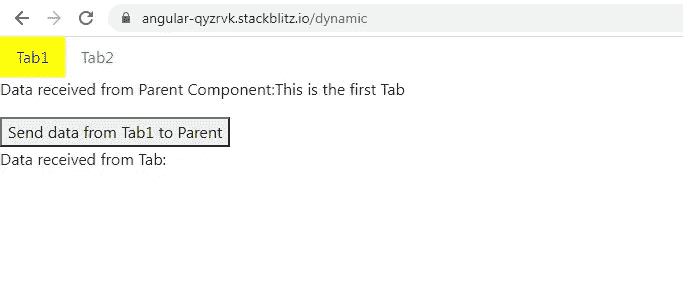
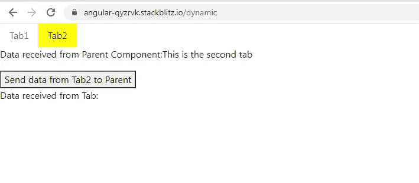
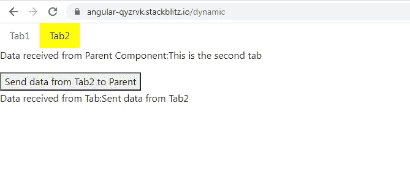

# Angular:将数据传入和传出使用 ComponentFactoryResolver 创建的动态组件

> 原文：<https://medium.com/geekculture/angular-passing-data-into-and-out-of-dynamic-components-created-using-componentfactoryresolver-64c5d08c61e8?source=collection_archive---------0----------------------->

我探索了两种创建动态组件的方法:**componentforyresolver**和**ngcomponentfoutlet**，以及如何将数据传入传出组件。

在这个故事中，我们只是在看第一种方法。

如果你正在寻找第二种方法，请点击下面的链接。

[](https://link.medium.com/Bi48Ihtu0kb) [## Angular:将数据传入和传出使用 ngComponentOutlet 创建的动态组件

### 我已经写了一个故事，探讨了如何将数据传入和传出使用…

link.medium.com](https://link.medium.com/Bi48Ihtu0kb) 

我假设你知道什么是动态组件，为什么需要它。这超出了本故事的范围。

让我们从创建两个选项卡开始，它们实际上是两个组件: **Tab1Component 和 Tab2Component** 动态加载到父组件 **TabContainerComponent** 中

**TabContainerComponent 模板:**

```
<ul class=”nav”>
<li ***ngFor=”let x of tabs**;let ind = index**”** class=”nav-item”>
<a **[ngClass]="x.isActive ? 'activeTab' : ''"** 
class=”nav-link” **(click)=”loadTabs(x.component, x.data,ind)”**>**{{x.tab}}**</a>
</li>
</ul>**<ng-template #view></ng-template>**<p>Data received from Tab:**{{ receivedData }}**</p>
```



Tab1 is active in TabsContainerComponent



Tab2 is active in TabsContainerComponent

我们正在迭代一个变量 **tabs，**，它是一个包含每个选项卡的数据、组件细节和活动状态的 2 个对象的数组。

单击一个特定的选项卡，我们调用一个方法 **loadTabs()** ，传递组件名、选项卡数据和选项卡索引作为参数。

该选项卡将加载到 **< ng 模板>** 内，该模板已被分配了一个名为**视图**的引用。

**TabContainerComponent 类:**

```
export class **TabsContainerComponent** implements OnInit {
constructor(**private resolver: ComponentFactoryResolver**) {}**@ViewChild(‘view’, { read: ViewContainerRef }) view: ViewContainerRef;**
//read property must be added to avoid undefined errors in //loadTabs()public **tabs**: any = [{
tab: ‘Tab1’,
component: **Tab1Component**,
data: ‘This is the first Tab’,
isActive:true
},
{
tab: ‘Tab2’,
component: **Tab2Component**,
data: ‘This is the second tab’,
isActive:false
},
];public **receivedData**: string;ngOnInit() {}**ngAfterViewInit()** {
this.loadTabs(this.tabs[0].component, this.tabs[0].data,0);
}**setActiveTab(tabInd: number) {**
this.tabs.forEach((tab, tabIndex) => {
tab.isActive = tabIndex === tabInd;
});
}**loadTabs(tabComponent: any, tabData: string,tabIndex: number) {**
this.view.clear();
setTimeout(() => {this.**setActiveTab(tabIndex)**;
this.receivedData = ‘’;
let componentFactory =
this.resolver.**resolveComponentFactory**(tabComponent);let componentRef: ComponentRef<typeof tabComponent> =
this.view.**createComponent**(componentFactory);componentRef.instance.data = tabData;
componentRef.instance.output.subscribe((results) => {
this.receivedData = results;
});}, 0);}}
```

在这个类中，我们定义了数组 **tabs** ，这是一个由两个对象组成的数组。每个对象包含 4 个属性:**选项卡、组件、数据和 isActive**

选项卡包含要在模板中显示的选项卡名称；组件包含该页签对应的组件名称，即**页签 1 组件和页签 2 组件**；数据包含一个小字符串，它将作为输入传递给组件；isActive 告诉我们该选项卡当前是否被选中。

我们正在使用**视图**引用访问<ng-template>。</ng-template>

```
**@ViewChild(‘view’, { read: ViewContainerRef }) view: ViewContainerRef;**
```

**receivedData** 包含从选项卡发送到 TabContainerComponent 的数据。我们在 TabContainerComponent 中显示如下的**接收数据**。

```
<p>Data received from Tab:**{{ receivedData }}**</p>
```


TabsContainerComponent receives data from Tab1



TabsContainerComponent receives data from Tab2

在应用程序加载时，我们希望创建 Tab1Component 并显示其数据。因此在**ngafterviewit()**中，我们调用 **loadTabs()** 传递组件、**选项卡数组**的第一个对象的数据属性和选项卡索引作为参数。

为什么要 ngAfterViewInit()？因为@ViewChild 引用视图仅在 ngAfterViewInit 生命周期挂钩中可用。

```
**ngAfterViewInit()** {
this.loadTabs(this.tabs[0].component, this.tabs[0].data,0);
}
```

现在让我们跳到 loadTabs()方法。

```
**loadTabs(tabComponent: any, tabData: string,tabIndex:number) {**
this.view.clear();
setTimeout(() => {this.**setActiveTab(tabIndex);**
this.receivedData = ‘’;
let componentFactory =
this.resolver.**resolveComponentFactory**(tabComponent);let componentRef: ComponentRef<typeof tabComponent> =
this.view.**createComponent**(componentFactory);componentRef.instance.data = tabData;
componentRef.instance.output.subscribe((results) => {
this.receivedData = results;
});}, 0);}
```

**clear()** 调用引用**视图**会破坏任何已有的视图。

```
this.view.clear();
```

将其余代码包含在 setTimeout()中的目的是为了避免 ExpressionChangedAfterChecked 错误。

我们首先调用 **setActiveTab()** ，将选项卡索引作为参数传递，以便设置选项卡的 **isActive** 属性值。基于这个属性值，我们使用 ngClass 添加或删除 CSS 类 **activeTab** ，如下所示。

这个 CSS 类只是添加了一个背景色到活动标签中，以示区别。

```
<li ***ngFor=”let x of tabs**;let ind = index**”** class=”nav-item”>
<a **[ngClass]="x.isActive ? 'activeTab' : ''"** 
class=”nav-link” **(click)=”loadTabs(x.component, x.data,ind)”**>**{{x.tab}}**</a>
</li>
```

我们接下来将 **receivedData** 属性设置为空字符串，这样在切换选项卡时，前一个选项卡的数据将被删除。

```
this.receivedData = ‘’;
```

**ComponentFactory** 是可以动态创建组件的工厂的基类。

**componentffactoryresolver**将组件映射到 ComponentFactory 类。

**resolve** 是在构造函数内部创建的**componentffactoryresolver**的引用。我们在这个解析引用上调用方法**resolveComponentFactory()**,并将组件名作为参数传递给它。

工厂**组件工厂**从方法 **resolveComponentFactory()返回。**

```
let componentFactory =
this.resolver.**resolveComponentFactory**(tabComponent);
```

通过将 **componentFactory** 传递给引用**视图的 **createComponent()** 方法，**创建了动态组件的一个实例，并将其宿主视图插入到视图容器中。

```
let componentRef: ComponentRef<typeof tabComponent> =
this.view.**createComponent**(componentFactory);
```

创建的动态组件实例: **componentRef** 可以用来访问组件的属性和方法。

我们将使用这个实例向动态选项卡组件传递数据，并从它那里接收数据。

```
componentRef.instance.data = tabData;
componentRef.instance.output.subscribe((results) => {
this.receivedData = results;
});
```

我们将数据传递给实例的名为 **data** 的属性。这个属性**数据**将是动态标签组件内部的@Input()属性。

我们还为这个实例附加了一个属性**输出**，它实际上是动态标签组件中的一个**主题**。这将有助于父 TabContainerComponent 从子动态选项卡组件接收数据。

为了理解这是如何发生的，让我们检查一下彼此非常相似的 tab 1 组件和 tab 2 组件。

**tab 1 组件模板:**

```
<p>Data received from Parent Component:**{{data}}**</p><button (click)=”**sendData()**”>Send data from Tab1 to Parent</button>
```

**表 1 组件类:**

```
export class Tab1Component implements OnInit {
constructor() {}**@Input(‘data’) data: string;
private output = new Subject<string>();**ngOnInit() {}**sendData() {**
this.output.next(‘Sent data from Tab1’);
}
}
```

每当我们点击**将数据从 Tab1 发送到父**按钮时，主题**输出**正在被传递一些数据。如前所述，我们在 TabsContainerComponent 中订阅这个输出主题。

Tab2Component 现在是不言自明的，因为它只是 Tab1Component 的副本，只做了一些小的改动。

**tab 2 组件模板:**

```
<p>Data received from Parent Component:**{{data}}**</p><button (click)=”**sendData()**”>Send data from Tab2 to Parent</button>
```

**tab 2 组件类:**

```
export class **Tab2Component** implements OnInit {
constructor() {}**@Input(‘data’) data: string;
private output = new Subject<string>();**ngOnInit() {}**sendData() {**
this.output.next(‘Sent data from Tab2’);
}
}
```

这是一个非常简单的例子，但是一旦理解了这个想法，实现复杂的例子将是轻而易举的事情。

您可以在下面的链接查看整个工作:

[](https://stackblitz.com/edit/angular-qyzrvk?file=src/app/tabs-container/tabs-container.component.html) [## 角形(叉形)堆叠

将数据传入和传出使用 componentforyresolver stackblitz.com 创建的动态组件](https://stackblitz.com/edit/angular-qyzrvk?file=src/app/tabs-container/tabs-container.component.html)