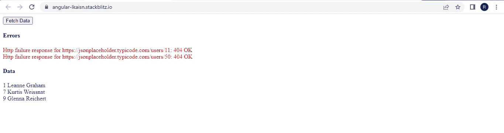
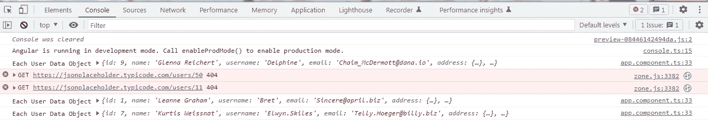
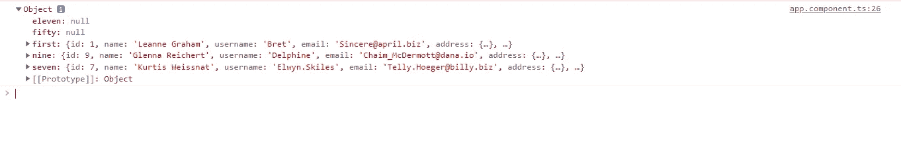

# Angular:当多个内部可观察对象中有几个失败时，防止 forkJoin 操作符中的数据丢失

> 原文：<https://medium.com/geekculture/angular-prevent-loss-of-data-in-forkjoin-operator-when-few-of-the-multiple-inner-observables-fail-c38225a1adf1?source=collection_archive---------3----------------------->

除了 **mergeMap** ， **forkJoin** 是另一个能够并行执行可观测量的操作符。

如果你对 mergeMap 更感兴趣，你可以看看下面的故事，它探讨了同样的想法。

[](https://ramya-bala221190.medium.com/angular-avoid-losing-all-data-in-mergemap-rxjs-operator-when-few-of-the-multiple-inner-observables-448251b6e8e1) [## Angular:避免在 mergeMap RXJS 运算符中丢失所有数据

### RXJS 操作符:mergeMap 和 forkJoin，当你想并行执行任务时非常有用，例如所有重要的任务…

ramya-bala221190.medium.com](https://ramya-bala221190.medium.com/angular-avoid-losing-all-data-in-mergemap-rxjs-operator-when-few-of-the-multiple-inner-observables-448251b6e8e1) 

考虑一下这个场景。

1.  我使用 **forkJoin** 操作符并行获取 5 个用户的数据: **A、B、C、D 和 E** 。获取每个用户数据的 API 调用将对应于一个内部可观察订阅。
2.  假设，2 个用户 **B，C** 不存在。因此，对应于这两个用户的 API 调用将失败，并出现 HTTP 404。这意味着 2 个可观测量将出错，并且对应于其他 3 个用户 **A、D 和 E** 的 API 调用可能有成功的机会，如果它们仍在进行中，也将取消。
3.  我不想仅仅因为 2 个用户 **B，C** 的 API 调用失败，就丢失剩余 3 个用户: **A，D，E** 的数据。
4.  我还想显示与两个用户 **B、C** 相关的错误。

下面是我想实现的东西的截图。这是一个小角度的应用。我试图获取 5 个用户的数据，其中 2 个不存在。但是我没有丢失其他 3 个用户的数据。



我们显示了与 2 个用户相对应的错误消息，还显示了 3 个用户的 ID 和名称，我们可以获取他们的数据。

**组件模板:**这正是我们在截图中看到的。

按钮**获取数据，**将调用 **fetch()，**，在这里我们尝试获取 5 个用户的数据。

我们订阅了两个观察值: **errorObservable$** 和 **data$** ，分别显示错误和用户数据。

**组件类别:**

在 **fetch()** 中，我们使用 **forkJoin** 操作符进行了 API 调用来并行获取 5 个用户的数据。我们已经调用了**数据服务**中的 **getUser()** 来进行 API 调用以获取数据。

```
**getUser(id: number)** {
return this.http
.get(`**https://jsonplaceholder.typicode.com/users/${id}**`)
.pipe(**catchError((err) => throwError(err))**);
}
```

我们已经将 **handleRequest()** 管道化为从 **getUser()** 返回的可观察对象，如下所示。

在 **handleRequest()** 中，我们返回了一个自定义的可观察对象，它将从 **getUser()** 返回的可观察对象作为参数，并将 **map** 和 **catchError** 操作符通过管道传递给它。

如果由 **getUser()** 发出的 API 调用成功，那么**映射操作符**就会执行并简单地返回响应，该响应只是一个包含用户数据的简单对象。我们在下面记录了**地图操作符**返回的每个用户的响应。



API 调用失败怎么办？执行 **catchError** 操作符，首先将 Error 对象传递给 **error$ subject** 。我们在模板中订阅这个主题来显示所有的错误。

我们如何将错误对象列表连接成数组格式？我们通过管道将 **RXJS 扫描操作符**传递给下面的 **error$ subject** 来实现这一点。

```
public **errorObservable$** = **this.error$.asObservable()**
.pipe(**scan((acc, curr) => (acc = acc.concat(curr)), [])**);
```

我们还使用运算符的**将错误的可观察对象映射为成功的可观察对象，以防止 **forkJoin** 返回的可观察对象出错。这个成功的可观测值将发出空值。**

请注意，在 **fetch()** 中，我们有另一个**映射操作符**，它直接通过管道传递给由 **forkJoin 操作符**返回的可观察对象。在**映射操作符**中，我们从 **forkJoin** 操作符得到如下最终结果，该操作符是一个包含所有用户数据的对象。



观察到属性**五十和十一**包含 **null。**这是因为我们已经在 **catchError** 操作符内部完成了 error= >成功的可观测映射。

我们已经使用 **Object.values()将对象转换为数组**。该数组仅包含对象中属性的值。当在模板中订阅时， **data$ observable** 将发出这个数组。

您可以在下面找到完整的工作示例。

[](https://stackblitz.com/edit/angular-qktmqq?file=src/app/app.component.ts) [## 角形(叉形)堆叠

### 一个基于 rxjs，tslib，core-js，zone.js，@angular/core，@angular/forms，@angular/common 的 angular-cli 项目…

stackblitz.com](https://stackblitz.com/edit/angular-qktmqq?file=src/app/app.component.ts)