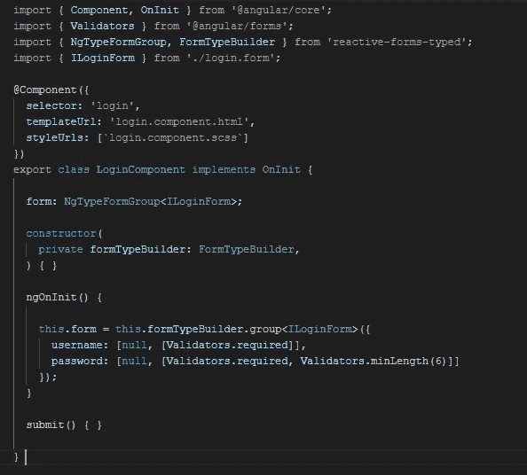
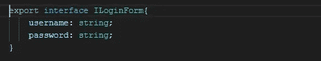
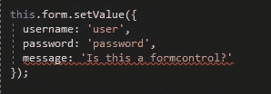
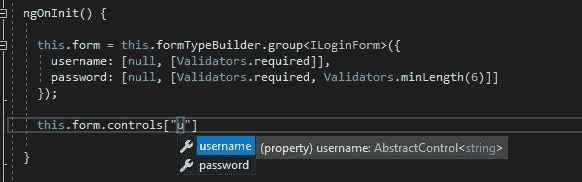
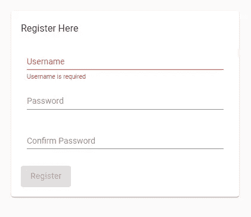

# 类型的角反应形式

> 原文：<https://medium.com/geekculture/angular-reactive-forms-with-type-b5cd6b7234e2?source=collection_archive---------2----------------------->

# 挑战

这一条主要是一种观点的一部分。我发现它能帮助我迅速地解释和创造一个易于推导的结构。我喜欢有助于我的系统 1——大脑的直觉和无意识思维模式——的东西，不管是在语法上还是组织上。然而，这只是一种观点，也许 Angular 作为一个图书馆社区会提出一个更有说服力的观点。

我创建了一个图书馆，它以反应形式的思想为中心，并以一种感觉完整和集成的方式来反应形式。我不设计其他的方式来做表格，也不提倡一种特定的方式。我只是碰巧讨论了我喜欢的、带给我快乐的方法。

对于那些熟悉反应形式的人来说，下面是一个非常熟悉的视图。

```
this.formGroup = this.formBuilder.group({
  username: [null, Validators.required],
  password: [null, [Validators.required, Validators.minLength(6)]]
});
```

太好了，我们可以解析我们的表单在另一面，模板面看起来是什么样子。但是，类型安全没有集成到 API 体验中，这让人感觉不完整。形式是非常重要的，鉴于这种重要性，应该实施和加强类型安全。

缺乏类型安全会引发各种挑战。然而，我不会在这一点上考虑或停留太久，而是以下面的事情为例:

```
this.formGroup.setValue({
  username: 'user',
  password: 'password',
  message: 'Is this a formcontrol???'
});
```

奇怪的是，作为一个原则，表单组并不知道表单控件是它的树的一部分，这种意识的缺乏也在表单组内的所有交互中表现出来。

# 另一种选择

如上所述，我引入了一个库来强制类型。精神不是改变反应形式，而是以一种感觉完整的方式扩展它，带来更好的体验。

```
npm install reactive-forms-typed --save
```

并进入角度模块

```
import { ReactiveFormsTypedModule } from 'reactive-forms-typed';
…
@NgModule ({....
  imports: [...,
  	ReactiveFormsTypedModule,
	…]
})
```

这将使我们能够利用 formbuilder，但有一些细微差别——以声明方式集成类型识别。比如，像这样:



login.component.ts



login.form.ts

结果是一个非常不同的遭遇



当介绍这个库时，我在项目中使用了一个常见的树结构，如下所示:

```
login-component
│   login.component.html
│   login.component.scss
|   login.component.ts
|   login.form.ts
```

表格对项目生态系统非常重要，这就是为什么我喜欢给他们的合同提供自己的空间和文件。它缓解了我的直觉，提供了清晰度，它为我提供了视觉帮助，让我传达期望和我的模型将如何被塑造。

代码只是在与 API 的交互中获得感知


# 超越声明

我们还可以在其他领域引入类型意识，比如在验证器中。为此，我引入了这个库的通用助手实现，这意味着我们可以像这样声明验证器:

```
form: NgTypeFormGroup<IRegisterForm>;

  constructor(
    private formTypeBuilder: FormTypeBuilder
  ) {}

  ngOnInit() {

    this.form = this.formTypeBuilder.group<IRegisterForm>({
      username: [null, [Validators.required, Validators.email]],
      password: [null, [Validators.required, Validators.minLength(6)]],
      confirmPasword: [null,
        [(c: NgTypeFormControlValidator<string, IRegisterForm>) => {
          if (c && c.parent && c.parent.value.password === c.value) {
            return null;
          }
          return { notMatch: true };
        }]
      ]
    });
 ...
```

# 超越类型

保持我们对形式所做的普通事情的精神。我们声明性地处理的一个动作项目是在表单组件中引入错误状态。

```
<!-- in material angular  -->
<mat-error *ngIf="emailFormControl.hasError('email') && !emailFormControl.hasError('required')">
   Please enter a valid email address
</mat-error><!-- in bootstrap -->
<small class="text-danger" *ngIf="emailFormControl.hasError('email') && !emailFormControl.hasError('required')">
    Please enter a valid email address
</small>
```

然而，上面的内容非常冗长和多余，特别是在为每个表单控件引入*必需的*错误状态时。不用说，相对于验证器的数量，标记的大小可能会增加，从而导致错误状态。这引发了扩展挑战。

元素知道在哪里显示错误消息和故事的结尾不是很简单吗？令人欣慰的是，我已经介绍了一个可能对这项工作有用的指令

```
<form [formGroup]="form" >

  <mat-form-field class="block">
    <input matInput type="text" placeholder="Username" formControlName="username">
    <mat-error formControlOnErrorItem="username"></mat-error>
  </mat-form-field>
...
```

注意在***formControlOnErrorItem***中我们指定了***formControlName****—*这是使用的表单控件。



尽管如此，这是一个关于类型的反应式表单的帖子。为了坚持将类型集成作为首要原则的原则；我引入了一个助手，它可以在表单组级别声明错误状态，如下所示:

```
form: NgTypeFormGroup<IRegisterForm>;

  constructor(
    private formTypeBuilder: FormTypeBuilder
  ) {}

  ngOnInit() {

    this.form = this.formTypeBuilder.group<IRegisterForm>({
      username: [null, [Validators.required, Validators.email]],
      password: [null, [Validators.required, Validators.minLength(6)]],
      confirmPasword: [null,
        [(c: NgTypeFormControlValidator<string, IRegisterForm>) => {
          if (c && c.parent && c.parent.value.password === c.value) {
            return null;
          }
          return { notMatch: true };
        }]
      ]
    });

    this.form.setFormErrors({
      username: {
        required: 'Username is required',
        email: 'Username must be a valid email'
      },
      password: {
        required: 'Password is required',
        minlength: 'Password is invalid'
      },
      confirmPasword: {
        notMatch: 'Password must match'
      }
    });
...
```


在这里体验一下[的例子](https://stackblitz.com/github/wilsonsergio2500/reactive-forms-typed-example)

[](https://github.com/wilsonsergio2500/reactive-forms-typed) [## wilsonsergio 2500/反应型-类型化

### 整合角反应形式与打字反应形式与打字这主要是一个意见的一部分。一…

github.com](https://github.com/wilsonsergio2500/reactive-forms-typed) 

享受编码，并保持强类型我的朋友😄