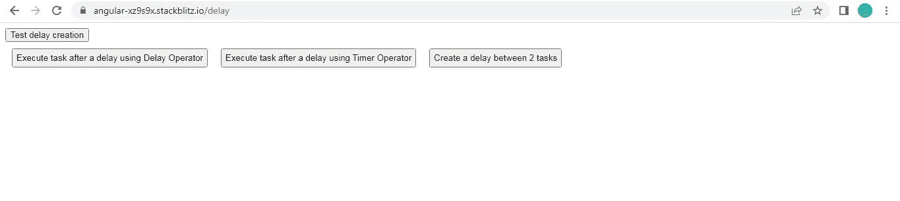
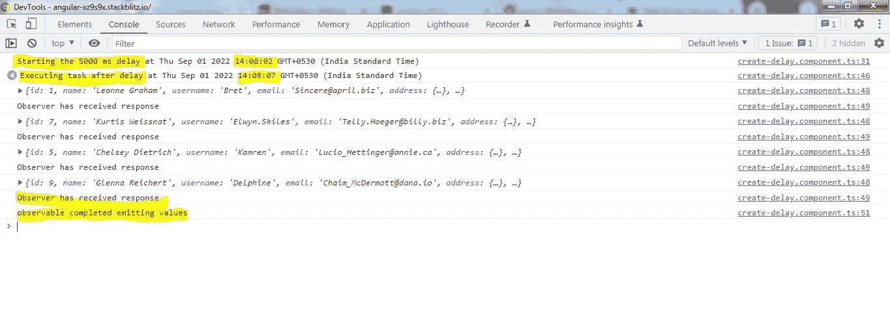
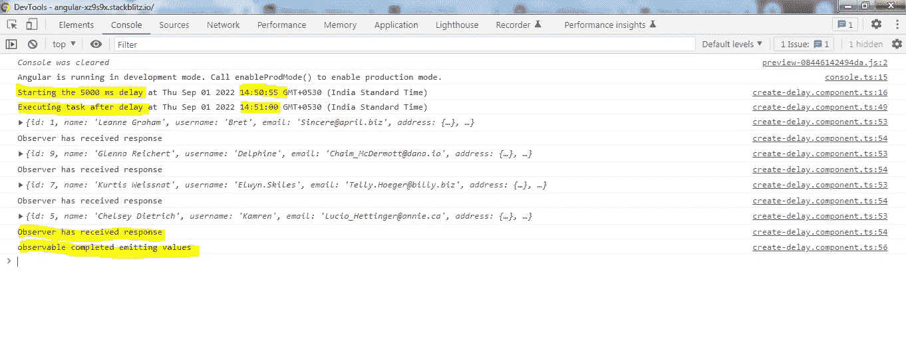
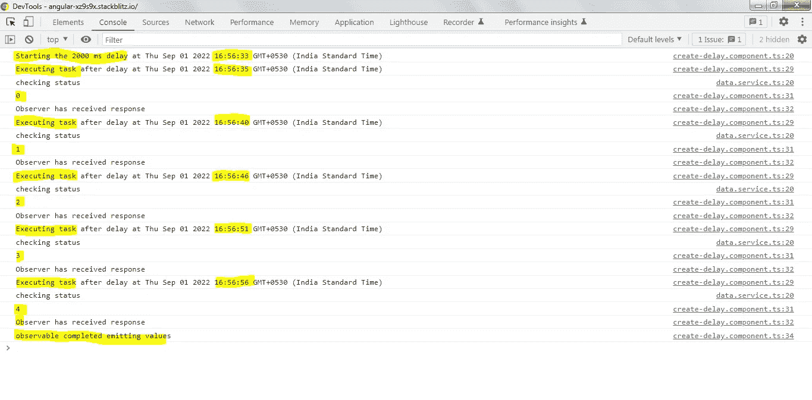

# Angular:用 RXJS 计时器和延迟运算符替换 setTimeout()和 setInterval()

> 原文：<https://medium.com/geekculture/angular-replacing-settimeout-and-setinterval-with-rxjs-timer-and-delay-operators-cf291b1cdadd?source=collection_archive---------2----------------------->

**setTimeout()和 setInterval()** 非常好用。但是 RXJS 提供了两个操作符，可以使用可观察的方法做完全相同的工作。如果你是一个喜欢用可观察的方法完成任务的开发人员，那么这个故事可能对你有用。

我有一个非常简单的例子，RXJS 中的**延迟和定时器操作符**如何以两种方式提供帮助:

= >在执行某项任务之前制造延迟。

= >在任务 1 完成后和任务 2 开始前创建延迟。

首先，让我用简单的语言简单介绍一下这些运算符是如何工作的:

1.  **delay(x)** 是指被观测者要发射的所有物品都要经过 **x ms** 的延迟后才会发射。**请注意，所有项目将在延迟后同时发出。两次连续发射之间没有延迟。**
2.  定时器操作符有两种使用方式:

=> **timer(x)** 表示**所有由可观察对象发出的项目**只有在延迟 **x ms 后才会发出**这里 timer 的工作方式与延迟算子完全相同。

=> **timer(x，y)** 表示被观测者发射的**第一项**将在 **x ms** 后发射，剩余的**项**将在发射间隔 **y ms** 后发射。

有些人更喜欢将 x 设置为 0 ms，这样第一个项目立即发射，其余项目在发射之间有 y ms 的延迟。

从例子开始。我们只有三个按钮来实现我们的目标。



Timer and Delay Application

**使用延迟操作符**按钮延迟一段时间后执行任务。我们使用**延迟操作符**来演示这一点。

**使用定时器操作器**按钮延迟一段时间后执行任务，几毫秒后再次执行任务。我们使用**定时器操作器**来演示这一点。

**在两个任务之间创建延迟**按钮将多次执行一个任务，但每次执行之间会有延迟。这里我们将再次使用**定时器操作器**。

你可能想知道，**测试延迟创建**按钮是干什么的？点击按钮只是导航到 **/delay** 路径来加载组件，上面列出了我们的 3 个按钮。因为我们已经在这条路上，所以**测试延迟创建**按钮的目的已经完成。

**组件模板:**这正是我们在截图中看到的。 **task1()** 、 **task2()** 和 **task3()** 是这个类中的方法，它们演示了我们如何准确地使用延迟和定时器操作符来达到我们的目的。

**组件类**

I .从**延迟操作符开始，下面的 createDelayUsingDelay()** 用于返回延迟操作符创建的可观察值。我们还记录了操作符将执行并创建延迟值 **delayValue(毫秒)的时间戳。**

使用延迟操作符按钮延迟后点击**执行任务将调用 **task1()。****

= >我们首先使用操作符**从数组[1，5，7，9]中创建了一个 cold observable。**数组中的数字对应于 4 个用户的 userId，一旦延迟完成，我们将获取其数据。

= >在管道操作符内部，我们又链接了 3 个操作符。

1.  首先，我们调用**createDelayUsingDelay()**来创建一个 5 秒的延迟。**延时操作器**也可以直接加在**管操作器**内，而不是单独的方法。在一个单独的方法中添加**延迟操作符**的目的是展示如何使用它来创建动态延迟。
2.  一旦 5 秒的延迟结束， **tap 操作符**执行日志中延迟结束的时间戳，获取用户数据的任务将开始。
3.  最后，我们使用了 **mergeMap 运算符**来并行获取 4 个用户的数据。

= >最后，我们已经从操作符订阅了由**创建的外部可观察对象，以执行可观察对象。**

当我点击**执行任务后，使用延迟操作符**按钮进行延迟，下面是控制台日志。



请注意延迟操作符执行的时间戳。现在是 **14:08:02。**准确地说，5 秒钟后， **tap 操作符**在**管道操作符**中记录时间戳 **14:08:07** ，获取用户数据的任务将在该时间开始。

还要注意的是， **tap 操作符**已经对由 **from 操作符创建的可观察值发出的 4 个值执行了 4 次。**

二。接下来，我们将移动到**定时器操作符**，在获取 4 个用户的数据之前创建一个类似的延迟。

**createDelayUsingTimer()** 将返回一个使用**计时器操作符**创建的可观察值。此处的可观察对象将仅发出 1 值，即延迟后的 0，可观察对象将完成。

使用定时器操作器按钮延迟后点击**执行任务，我们执行下面定义的 **task2()，**。**

= >这里我们首先调用 **createDelayUsingTimer()** 来创建一个 5 秒的延迟。

= >在管道操作符中，我们又链接了 3 个操作符。

1.  5 秒延迟完成后， **tap 操作符**执行以记录获取用户数据任务开始的时间戳。
2.  **mergeMap 运算符**是用于避免嵌套订阅的扁平化运算符。传递给 **mergeMap** 的**参数 x** 只不过是由**定时器操作符**创建的外部可观察对象发出的值。参数 x 包含值 0。mergeMap 操作符期望返回一个内部可观测值。

```
mergeMap((x) => {
**return from([1, 5, 7, 9]).pipe(
mergeMap((y) => this.service.getUser(y))
);**
})
```

我们已经使用来自操作符的**将 4 个用户 Id 的数组转换为一个冷可观察值。我们已经用**管道将另一个 mergeMap** 传输到这个 cold observable，以并行获取对应于这 4 个用户 id 的数据。**

= >最后，我们已经订阅了由**定时器操作符**创建的外部可观察对象来执行该可观察对象。

在浏览器中，单击按钮将在控制台中产生以下结果。



请注意计时器操作符执行的时间戳。现在是 **14:50:55。**准确地说，5 秒钟后， **tap 操作符**在**管道操作符**中记录时间戳 **14:51:00** ，在该时间获取用户数据的任务将开始。

三。最后，我们将使用**定时器操作符**来演示它如何模仿 **setInterval()。**

**createIntervalUsingTimer()**返回一个由**计时器操作符**创建的可观察值。**定时器操作符**接受 2 个参数。第一个参数 **delayValue1** 表示时间(单位为 ms ),在此之后，第一个值(即 0)将由可观察对象发出。接下来将有一个**延迟值 2** ms 的间隙，之后将发出第二个值，即 1。其余值将遵循类似的模式，即发射之间的**延迟值 2** 毫秒间隙。

点击**创建两个任务之间的延迟**按钮，将调用 **task3()** 。

= >首先调用**createIntervalUsingTimer()**，这将从**计时器操作符**创建一个可观察值。这个可观测的将在 2 秒后发射 0。在发射 1 之前，它将等待 5 秒。它将再次等待 5 秒，然后发射 2 次，依此类推。每当可观察对象发出一个值，我们就调用**数据服务**中的方法 **checkStatus()** ，它在执行时会简单地记录一条消息。这是我们正在执行的任务。

= >在管道操作符中，我们链接了多个操作符。

1.  **take(5)** 确保我们只想从由**定时器操作符**创建的可观察对象中发出 5 个数字，之后可观察对象必须完成。原因是当第二个参数被提供给 timer 操作符时，它无限地发出数字。所以我们需要在某个地方结束它。
2.  我们使用 **tap 操作符**来指示延迟结束和任务执行的时间戳。
3.  最后，我们有另一个 tap 操作符来执行任务，即调用 **DataService 中的 **checkStatus()** 。**

= >最后，我们已经订阅了由**定时器操作符**创建的外部可观察对象来执行该可观察对象。

在浏览器中，单击按钮将在控制台中产生以下结果。



从 **16:56:33** 开始延时 2 秒。延迟完成，observable 发出 0，在 **16:56:35 调用 **checkStatus()** 。**我们还记录了使用计时器操作符创建的可观察值发出的值，即 0、1、2、3 和 4。

每次调用 checkStatus()时，我们都会记录**“检查状态”**。

在此之后，有一个 5 秒的间隙，在此之后，可观察对象发出 1，并且 **checkStatus()** 在 **16:56:40** 再次执行，以此类推**。**

完整的工作示例如下:

[](https://stackblitz.com/edit/angular-xz9s9x?file=src/app/create-delay/create-delay.component.ts) [## 角形(叉形)堆叠

### 一个基于 rxjs，tslib，core-js，zone.js，@angular/core，@angular/forms，@angular/common 的 angular-cli 项目…

stackblitz.com](https://stackblitz.com/edit/angular-xz9s9x?file=src/app/create-delay/create-delay.component.ts)