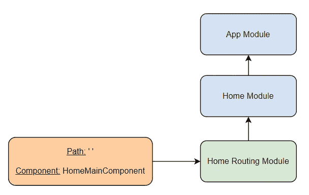
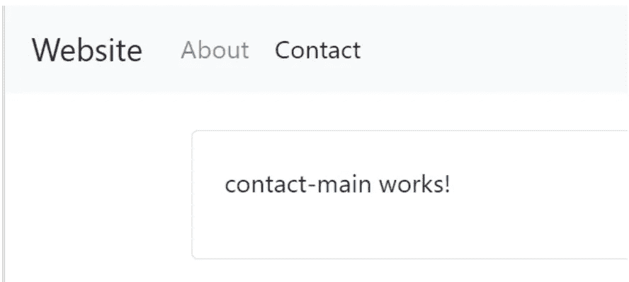
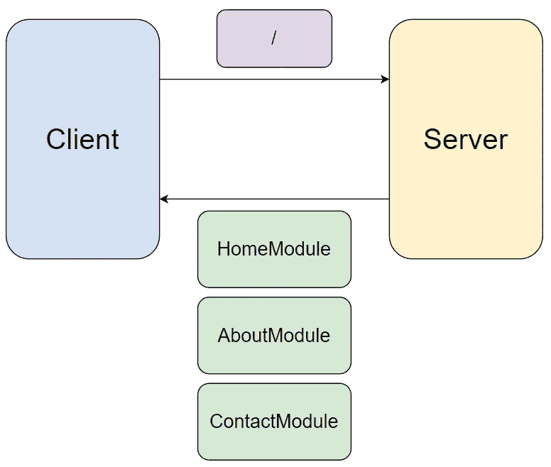

# 角度路由指南:如何优化应用程序导航

> 原文：<https://medium.com/geekculture/angular-routing-guide-how-to-optimize-app-navigation-50ba5882f577?source=collection_archive---------3----------------------->


Image Source: Author

Angular 是最受欢迎的前端框架之一，有 30%的开发人员喜欢在他们的项目中使用它。角度对于具有许多不同视图和构件的大型项目尤其有用。

让这些大型项目引人入胜的关键是一个逻辑导航结构，允许用户轻松地浏览和重访页面。幸运的是，Angular 的路由功能使优化导航变得简单。

今天，我们将了解更多关于 Angular Router 的功能，并帮助您制作一个完全可导航的应用程序。

**这是我们今天要讲的内容:**

*   什么是角路由器
*   什么是通配符路由
*   子路由
*   RouterLink 指令
*   添加活动链接样式
*   延迟加载模块
*   接下来学什么

# 什么是角路由器？

**Angular Router** 是 Angular 2+默认内置的一个重要包。它用于构建具有多个视图的单页面应用程序，可以通过 URL 进行导航，称为“路由”。

URL 由域名和路由定义(称为路径)组成。路径是服务器用来访问数据库中特定资源的 JavaScript 对象。当服务器为我们的应用程序提供服务时，Angular 将从 URL 中获取路径，并将其与我们已经设置的任何有效路径进行匹配。本质上，我们设置了一个键/值关系，将类似于`/blog`的路径作为键，将期望的页面作为`value`。

这使得用户可以轻松地导航您的应用程序并访问他们想要的页面，而不必从主页组件开始。路由支持常见的浏览器行为，如前进/后退箭头和页面书签。

路由器还包含用于高级行为的工具，如多个路由器出口、不同的路径匹配策略、轻松访问路由参数以及保护组件免受未授权访问的路由防护。

# 路由模块和路由输出

路由模块是定义新路由并帮助配置路由器的特殊角度模块。所有路由模块的名称后都有后缀`-routing`，这是 Angular CLI 自动添加的。

每个路由模块为具有相同基本名称的配对模块设置路由行为。例如，我们的`home`模块的路由行为将在路由模块`home-routing`中。

下面是我们的`home`模块的路由模块示例，称为`home-routing.module.ts`:

```
import { NgModule } from '@angular/core';
import { Routes, RouterModule } from '@angular/router';
import { HomeMainComponent } from './home-main/home-main.component';const routes: Routes = [
  { path: '', component: HomeMainComponent }
];@NgModule({
  imports: [RouterModule.forChild(routes)],
  exports: [RouterModule]
})
export class HomeRoutingModule { }
```

您可以在`routes`数组变量中找到我们的路线。`routes`数组的每个元素代表一个组件视图的路径。

这些元素由两部分组成，一个是提供 URL 路径的属性`path`,另一个是定义哪个组件将被加载到所提供的路径的属性`component`。

在这种情况下，我们输入一个空字符串(解释为正斜杠)来表示这个组件是我们的主页，如果有人只是输入域名就应该加载。然后我们输入 Angular 应该获取的组件名作为我们的主页，`HomeMainComponent`。

> *如果我们希望用户在其他地方登陆，我们也可以使用* `*redirectto*` *将空的路径 URL 指向另一个页面。*

接下来，我们需要从`HomeModule`的输出中移除`HomeMainComponent`。这种路由的使用意味着我们不再导出组件，而是让路由器在用户访问路由时负责加载组件。

最后，我们将用下面一行替换`app.component.html`文件的内容:

```
<router-outlet></router-outlet>
```

这里，`<router-outlet>`充当组件的占位符。我们的模板不是定义一个组件，而是简单地拉取用传递的 URL 路径呈现的任何组件。通过使用这个占位符，我们不必导出组件。相反，我们可以导出模块。

您现在可以通过在浏览器地址栏中输入`http://localhost:4200`来查看此应用程序。



Image Source: Author

回顾一下，`HomeRoutingModule`是一个路由模块，我们在其中定义路由。我们有一条由空白路径组成的路线。我们将检查客户端的 URL 条目是否与该路径匹配。如果是，我们将通过`HomeMainComponent`加载主页。

由于一系列导入，主页组件是可用的。首先，我们将`home-routing`模块导入到它的配对标准模块`home`中。然后，我们将`home`模块导入到 app 模块中。最后，我们使用`app.component.html`文件中的`<router-outlet>`指令来加载原来的
`routes`数组中注册的`HomeMainComponent`。

# 什么是通配符路由？

*用户输入无效路径会怎样？*我们可以通过包含一个**通配符路由**来避免一个错误，它捕获所有未注册的路径并将它们定向到某个页面。您可以将通配符视为“其他”类别，它与任何未注册的路径相匹配。

大多数网站都有一个指向“404 页面未找到”页面的通配符。要为我们的应用程序创建一个错误组件，请在命令提示符下输入以下内容:

```
ng generate component PageNotFound
```

> *我们不需要模块，因为这个错误屏幕只是简单的文本。*

您可以通过输入`**`代替`routes`数组中的标准路径来设置通配符。

```
import { NgModule } from '@angular/core';
import { Routes, RouterModule } from '@angular/router';
import { PageNotFoundComponent } from './page-not-found/page-not-found.component';const routes: Routes = [
  { path: '**', component: PageNotFoundComponent }
];@NgModule({
  imports: [RouterModule.forRoot(routes)],
  exports: [RouterModule]
})
export class AppRoutingModule { }
```

现在，任何无效的网址将重定向到我们的 404 错误页面。

我们需要确保这个组件是在`app.module.ts`文件中最后导入的，这样我们的其他组件才能正确加载。这是因为从第一个匹配路径角度加载元件。如果先导入`AppRoutingModule`, Angular 将总是加载`PageNotFoundComponent`,因为通配符将总是作为匹配读取，因此 Angular 将返回该组件。

```
imports: [
    BrowserModule,
    HomeModule,
    AboutModule,
    ContactModule,
    AppRoutingModule,
  ],
```

在`imports`数组底部的通配符确保了任何有效的匹配都被返回，并且只有当没有其他匹配时才返回 404。

# 子路由

有时，将路由分类为路由中的子组是有意义的。例如，我们的“关于我们”页面可以为员工信息、`/about/team`和过去客户信息、`/about/clients`提供单独的子页面。只有当用户在父`/about`路径上时，才会呈现子组件。

首先，我们将通过在命令提示符下输入以下内容来生成组件:

```
ng generate component about/team
ng generate component about/clients:
```

然后，我们通过向`about-routing.module.ts`中的`about`路由添加一个`children`数组属性，将这些设置为“关于我们”页面的子页面。

```
import { NgModule } from '@angular/core';
import { Routes, RouterModule } from '@angular/router';
import { AboutMainComponent } from './about-main/about-main.component'
import { BioComponent } from './bio/bio.component';
import { TeamComponent } from './team/team.component';
import { ClientsComponent } from './clients/clients.component';const routes: Routes = [
  {
    path: '',
    component: AboutMainComponent,
    children: [
      { path: '', component: BioComponent },
      { path: 'team', component: TeamComponent },
      { path: 'clients', component: ClientsComponent },
    ]
  }
];@NgModule({
  imports: [RouterModule.forChild(routes)],
  exports: [RouterModule]
})
export class AboutRoutingModule { }
```

`children`数组的作用类似于`routes`数组的缩小版，具有类似格式的`path`和`component`属性。不同之处在于，子路由的路径属性被附加到它们的父路径上，这意味着您不需要写入完整的路径。

例如，到达`TeamComponent`的完整路径将是`/about/team`，而不仅仅是`'/team'`。

最后，我们将用`<router-outlet>`更新`about-main.component.html`模板文件，让它显示`about`的任何子组件。

```
<h1>About Page</h1><router-outlet></router-outlet>
```

# RouterLink 指令

大多数应用程序允许用户通过特定的 URL 和用户点击链接元素来导航。我们将需要引导添加链接。您可以使用标准的`href`属性创建链接。但是，每当页面发生变化时，就需要刷新站点和重新加载资源。

我们可以使用 Angular Router 的`routerLink`指令来加速加载，它利用历史 API 来让 Angular 访问您的即时浏览器历史。这意味着浏览器只需要加载每个页面一次，因为以后的访问可以显示以前加载的元素。

为了实现`routerLink`，将`app.component.html`的内容替换为:

```
<nav class="navbar navbar-expand-md navbar-light bg-light mb-4">
  <a class="navbar-brand" routerLink="/">Website</a> <div class="collapse navbar-collapse">
    <ul class="navbar-nav mr-auto">
      <li class="nav-item">
        <a class="nav-link" routerLink="/about">About</a>
      </li>
      <li class="nav-item">
        <a class="nav-link" routerLink="/contact">Contact</a>
      </li>
    </ul>
  </div>
</nav><main class="container">
  <div class="card">
    <div class="card-body">
      <router-outlet></router-outlet>
    </div>
  </div>
</main>
```

浏览这些链接时，地址栏中的 URL 仍会改变，但浏览器不会在回访时刷新页面或重新加载资源。

# 添加活动链接样式

基于我们新的导航链接，我们还需要一种方法来告诉用户他们当前在哪个页面。在 Angular 中最好的方法是使用`active`类，如果链接当前处于打开状态，它将改变链接的样式，以表明它是活动的。

在 Bootstrap 中，`active`类可以应用于包装在`<a>`元素周围的`<li>`元素。我们将使用 Angular 的`routerLinkActive`指令来实现这一点。

```
<nav class="navbar navbar-expand-md navbar-light bg-light mb-4">
  <a class="navbar-brand" routerLink="/">Website</a> <div class="collapse navbar-collapse">
    <ul class="navbar-nav mr-auto">
      <li class="nav-item" routerLinkActive="active">
        <a class="nav-link" routerLink="/about">About</a>
      </li>
      <li class="nav-item" routerLinkActive="active">
        <a class="nav-link" routerLink="/contact">Contact</a>
      </li>
    </ul>
  </div>
</nav><main class="container">
  <div class="card">
    <div class="card-body">
      <router-outlet></router-outlet>
    </div>
  </div>
</main>
```

我们用`nav-item`类在`<li>`元素上应用指令。该指令将检查地址栏中的 URL 是否与`routerLink`指令中的路径匹配。

如果路径匹配，我们将把它添加到`active`类中，以改变链接文本，用较暗的文本颜色显示它是活动的。



Image Source: Author

# 延迟加载模块

我们可以通过从**急切加载**转换到**懒惰加载**来提高我们模块的性能。

急切加载是指浏览器被指示加载`app`模块中的所有组件，而不管它将使用哪个组件。



Image Source: Author

惰性加载将模块分成单独的文件，因此应用程序只加载当前页面渲染所需的组件。延迟加载通常是首选，因为它允许页面为每次渲染加载最少量的数据，从而加快加载速度。


Image Source: Author

为了实现延迟加载，我们首先从`app.module.ts`中移除所有模块导入:

```
import { BrowserModule } from '@angular/platform-browser';
import { NgModule } from '@angular/core';import { AppRoutingModule } from './app-routing.module';
import { AppComponent } from './app.component';
import { PageNotFoundComponent } from './page-not-found/page-not-found.component';@NgModule({
  declarations: [
    AppComponent,
    PageNotFoundComponent,
  ],
  imports: [
    BrowserModule,
    AppRoutingModule,
  ],
  providers: [],
  bootstrap: [AppComponent]
})
export class AppModule { }
```

我们仍然渴望装载`PageNotFoundComponent`，因为它重量轻，我们随时都可能需要它。

我们还需要更新在`app-routing.module.ts`中找到的`routes`数组中的信息。这是在用户初始请求时发送的唯一路由模块。Angular 然后可以使用这个文件来加载任何需要的未来模块。

```
const routes: Routes = [
  { path: '', loadChildren: () => import('./home/home.module').then(m => m.HomeModule) },
  { path: 'about', loadChildren: () => import('./about/about.module').then(m => m.AboutModule) },
  { path: 'contact', loadChildren: () => import('./contact/contact.module').then(m => m.ContactModule) },
  { path: '**', component: PageNotFoundComponent },
];
```

请注意，我们没有使用 component 属性来告诉 Angular 在访问路线时加载什么组件。相反，我们使用的是`loadChildren`属性。这将告诉 Angular 延迟加载一个模块。我们将它设置为一个箭头函数，它将通过`import()`函数请求模块。`import()`函数返回一个承诺。我们链接了`then()`函数来处理响应。

这些`loadChildren`路径将沿着任何先前的路径元素传递，作为后面路径的前缀。因此，我们必须将每个路由模块的`Routes`数组更新为空路径，以确保不会像`/about/about`那样重复路径名。

```
{ path: '', component: AboutMainComponent }
```

# 接下来学什么

恭喜你完成了一个完全可导航的角度应用程序！路由是保持用户参与你的应用的关键，尤其是对于大型应用。但是，这只是做一个优秀的 Angular app 的一部分。

这里有一些**更先进的概念**你已经准备好在你的角度之旅中解决:

*   高级路由(私有路由，配对 CSS 样式表)
*   生命周期挂钩
*   模态分量
*   证明
*   属国

*快乐学习！*