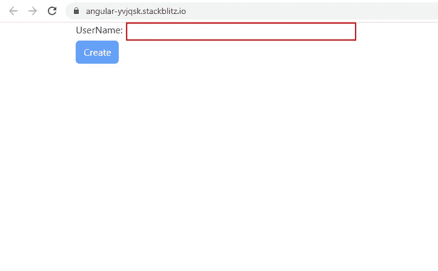
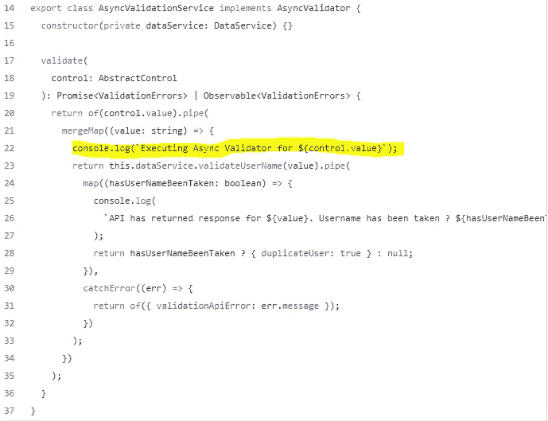
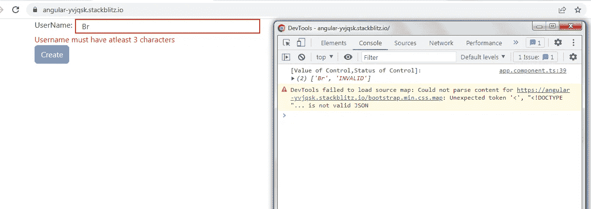
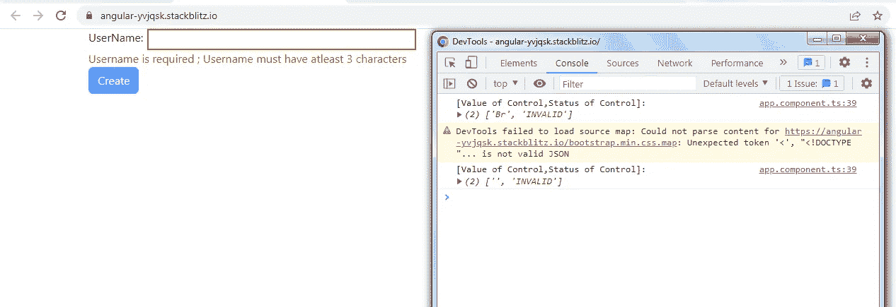
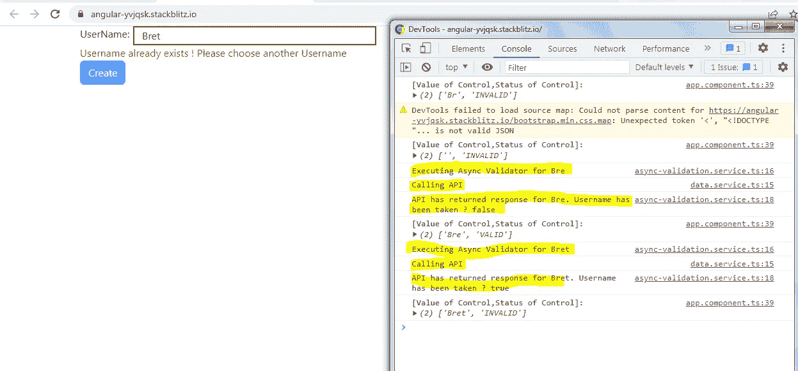
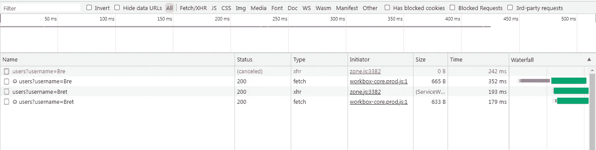
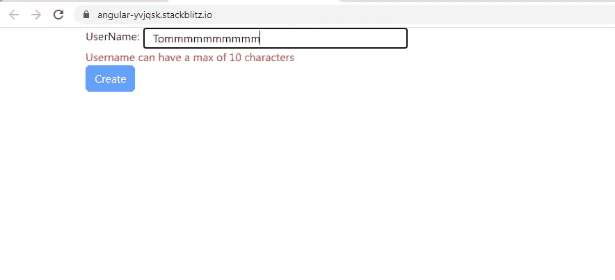
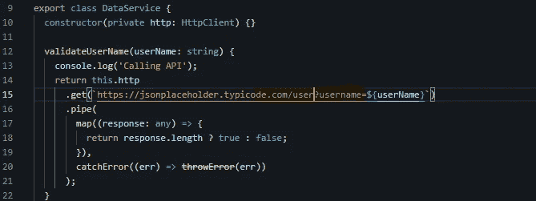
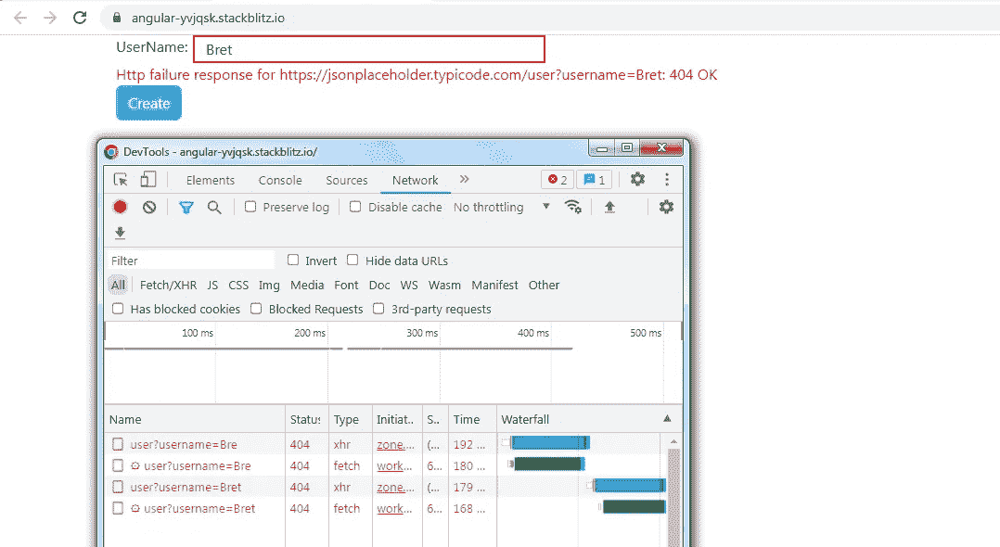

# Angular:显示了以反应形式加载带有自定义异步验证器的微调器和错误消息

> 原文：<https://medium.com/geekculture/angular-showing-loading-spinner-and-error-messages-with-custom-async-validator-in-reactive-forms-5fae1fedf1f1?source=collection_archive---------1----------------------->

几乎我们每个人都有一个谷歌账户。创建帐户时，您一定遇到过以下错误信息。这是一个**异步验证**的例子，在表单提交之前，我们通过对服务器的**异步 HTTP 调用**来验证**用户名字段**。


受到这个例子的启发，我创作了一个小角度的项目，展示了以下几点:

1.  异步验证器**仅在同步验证器通过**后执行。
2.  **当异步验证器的执行正在进行时，显示一个加载微调器**。
3.  显示同步和异步验证器的错误消息。

应用程序就像下面的截图一样简单。我们所拥有的只是一个用于填充**用户名字段**的文本框和一个**“Create”**按钮，该按钮在本例中实际上什么也不做。添加按钮的目的是展示在同步/异步验证过程中如何禁用/启用它。



**AppComponent 模板:**

1.  该模板包含一个根**表单组 asyncForm** ，它有 1 个**表单控件用户名**。

2.我们还有一个**“创建”**按钮，当**异步表单**处于**无效**状态或者当**用户名表单控件**处于**挂起**状态时，该按钮被禁用。当异步验证正在进行时，FormControl 处于**挂起**状态。

3.我们在模板中显示同步/异步错误消息(如果有的话)。

4.最后，当异步验证正在进行时，我们还会在文本框旁边显示一个**加载微调器**。

移动到 **AppComponent 类:**

从 **ngOnInit 生命周期**开始。

1.  下面是**异步形式**结构。

```
this.asyncForm = this.fb.group({
username: [‘’,
[Validators.required, GenericValidator.syncUsernameValidator(3, 10)],
this.usernameValidator.validate.bind(this.usernameValidator),
],
});
```

**username** 是 FormControl，它有 **2 个同步验证器** : **验证器，required** 是内置的， **syncUserNameValidator** 是我们定义的自定义验证器。

它还有 **1 个异步**验证器: **userNameValidator** 。

2.让我们转到同步和异步验证器的实现。

下面是 S **ync 验证器**，它只是检查最小和最大字符长度是否符合预期。这可以通过使用内置的**验证器.最小长度**和**验证器.最大长度**来实现。但是我想包含一个内置的自定义同步和自定义异步验证器来演示这三者如何一起工作。

**数据服务:**

在移动到自定义异步验证器之前，首先让我们检查下面的**数据服务**类。在这个服务中，我们调用假的 JSON 占位符 API 来验证文本框中输入的用户名**是否与数据库中 10 个用户的用户名**相匹配。

如果有匹配，即如果来自 API 的响应有数据，那么我们返回一个**可观察到的发射真**。

如果没有匹配，即在文本框中输入的用户名是唯一的，并且 API 响应为空，那么我们将返回一个发出 false 的**可观察值。**

如果在进行 API 调用时有任何错误，我们只是返回一个**可观察到的错误。**

**自定义异步验证器**只是一个服务类，它实现了**异步验证器**接口。这个接口要求 **validate()** 必须在类内部实现。

**validate()** 返回一个**可观察值或验证错误的承诺**。

基于**数据服务**中 **validateUserName()** 返回的值，我们或者返回一个 **ValidationError** 对象 **{duplicateUser:true}** 或者返回 null。

如果文本框中输入的用户名与数据库中的 10 个用户之一相匹配，则返回该对象。如果不匹配，则返回 null。

如果在 API 调用过程中遇到任何错误，我们将返回一个**validation error**object**{ validation API error:err . message }。**

3.现在让我们检查所有场景。

回到我们之前列出的目标。

= >异步验证器**仅在同步验证器通过**后执行。

正如您在下面突出显示的异步验证器代码中看到的，我们在消息执行时记录它。所以异步验证器将只在下面的同步验证通过后执行。

1.  用户名字段必须填写。
2.  用户名必须至少包含 3 个字符，最多包含 10 个字符。



我最初只在用户名字段中输入了 2 个字符。请注意文本框下方显示的错误消息和控制台中记录的消息。**内置验证程序已通过，但自定义同步验证程序未通过**。我们看不到声明异步验证器正在执行的消息。



现在让我删除我输入的两个字符。我们在文本框下看到两条错误消息，暗示**内置和自定义同步验证都失败了**。同样，控制台中没有记录任何消息来指示异步验证器的执行。



现在我已经在用户名字段中输入了“Bret ”,异步验证器开始执行。**异步验证器已经执行了两次**——一次是针对字符串“Bre ”,另一次是针对字符串“Bret”。因为用户名“Bret”已经存在于假的 JSON 占位符数据库中，所以我们显示了错误消息。

请注意，Create 按钮也被禁用。



**但是，对于异步验证器的两次执行，API 调用都成功执行了吗？**让我们检查一下网络选项卡。**取消了对“Bre”的 API 调用，只有对“Bret”的 API 调用成功**。这可能不会一直发生。这取决于用户打字的快慢。

如果用户一次输入“Bre ”,需要一些时间，然后输入“t ”,那么“Bre”的内部可观察对象(Http 请求)可能会在“Bret”的下一个内部可观察对象(Http 请求)开始之前完成执行。在这种情况下，两个 API 调用都有可能成功。



= >在异步验证器执行过程中显示加载微调器。

当异步验证器执行时， **FormControl 用户名**处于**挂起**状态。我们利用这一点，展示了一个旋转器。

```
<span class=”spinner-border col-md-1"
*ngIf=”asyncForm.get(‘username’).pending”></span>
```



Sync Validator failing


Async Validator executing with spinner

让我们来看看 API 不成功或被取消的场景**。它因任何其他原因而失败。为了检查这个场景，我将数据服务中的端点更新为一个不存在的端点。**



我们已经在文本框下显示了确切的错误信息，如下图所示。“创建”按钮保持禁用状态。



= >最后，我们转到同步和异步验证器的错误消息的**显示。**

我真的不想让每个验证错误类型的模板都有多个 ngIf。相反，我把这个逻辑移到了类中的一个小方法中，这样模板看起来就像下面这样清晰。只有一行代码显示与用户名表单控件相关的所有错误消息。

```
<span class=”error” *ngIf=”errorMap.username.length”>{{errorMap.username}}
</span>
```

我们希望在每次**用户名**表单控件的**值/状态**改变时显示验证错误消息，但是要有 2 秒的反跳时间。

为什么我们要寻求地位的改变？如果在 FormControl 上只定义了同步验证器,我们真的不需要它。但是因为，我们也有一个异步验证器，**,我们需要检查 FormControl 状态的变化来监控异步验证器执行的进度。**

```
combineLatest(
this.asyncForm.get(‘username’).valueChanges,
this.asyncForm.get(‘username’).statusChanges
)
.pipe(debounceTime(2000))
.subscribe((result) => {
console.log(‘[Value of Control,Status of Control]:’, result);
this.setValidationMessage(this.asyncForm.get(‘username’), ‘username’);
});
```

我们已经将**值变化**和**状态变化**可观察值输入到**组合测试**操作器。每当值/状态发生变化时，就会调用 **setValidationMessage()** 。我们将用户名**form control 和控件名作为参数传递。**

在我们继续进行 **setValidationMessage()之前，**让我们看看类中的以下两个属性。

```
errorMap = {
username: ‘’,
};

validationMessages = {
username: {
required: ‘Username is required’,
minlength: ‘Username must have atleast 3 characters’,
maxlength: ‘Username can have a max of 10 characters’,
duplicateUser: ‘Username already exists ! Please choose another Username’,
},
};
```

**errorMap 属性**是一个包含所有 FormControl 的**名称(在本例中:username 是唯一的 form control)作为关键字**的对象。所有键的值都将是一个空字符串。

稍后，该项的值将被设置为错误消息。我们使用这个 **errorMap 属性**来显示与模板中任何 FormControl 相关的错误，如下所示。

```
<span class=”error” *ngIf=”errorMap.username.length”>{{errorMap.username}}
</span>
```

**validationMessages 属性**是一个包含所有 FormControls 名称作为关键字的对象。每个键对应的值是另一个对象。该对象的属性是 FormControl 键可能的所有“错误名称/类型”。

如下图所示， **username** FormControl 是一个键，它的值是一个错误名称/类型的对象。对应于每个错误名称/类型，我们指定了要显示的错误消息。这些错误消息可能看起来很熟悉。

```
validationMessages = {
username: {
required: ‘Username is required’,
minlength: ‘Username must have atleast 3 characters’,
maxlength: ‘Username can have a max of 10 characters’,
duplicateUser: ‘Username already exists ! Please choose another Username’,
},
};
```

现在让我们转到 **setValidationMessage()。**

```
setValidationMessage(c: AbstractControl, controlName: string) {
this.errorMap[controlName] = ‘’;

if (c.errors) {
this.errorMap[controlName] = Object.keys(c.errors).map((key: string) => {

if (key === ‘validationApiError’) {
return c.errors[key];
} else {
return this.validationMessages[controlName][key];
}
})
.join(‘ ; ‘);
}
}
```

1.  由于 FormControl **用户名**只有一个，显然**参数 c** 是 FormControl，**控件名**是“用户名”。

我们正在将 errorMap 属性对象的“用户名”属性重置为“”，以清除任何现有的错误消息。

```
this.errorMap[controlName] = ‘’;
```

2.如果**用户名** FormControl 有任何错误，我们使用 **Object.keys** 将 FormControl 上的 errors 属性对象的键提取到一个键数组中。每个键都是错误名称/类型，例如:required、minlength、maxlength 等。

接下来，我们在键数组上应用**映射操作符**。如果键名不是“validationApiError”，我们直接从**validation messages****属性**中提取该键的错误消息。

我们没有在 **validationMessages** 属性中包含“validationApiError ”,因为我们无法预测 API 失败的错误消息。可能是任何原因。

因此，对于“validationApiError”错误类型，我们从 FormControl 本身的 errors 属性中选取消息。

3.最后，我们**在映射操作符**的结果上应用 join()，以用分号组合所有对应于错误类型的错误消息。

请查看下面的截图，看看两种错误类型的错误消息是如何使用分号组合在一起的: **required 和 minlength** 。


您可以在下面找到完整的工作示例。

[](https://stackblitz.com/edit/angular-yvjqsk?file=src/app/app.component.ts) [## 角形(叉形)堆叠

### 一个基于 rxjs，tslib，core-js，zone.js，@angular/core，@angular/forms，@angular/common 的 angular-cli 项目…

stackblitz.com](https://stackblitz.com/edit/angular-yvjqsk?file=src/app/app.component.ts)