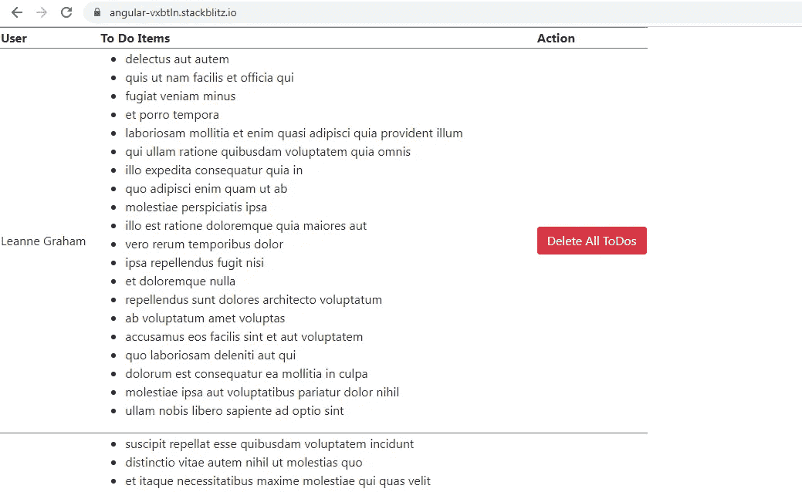
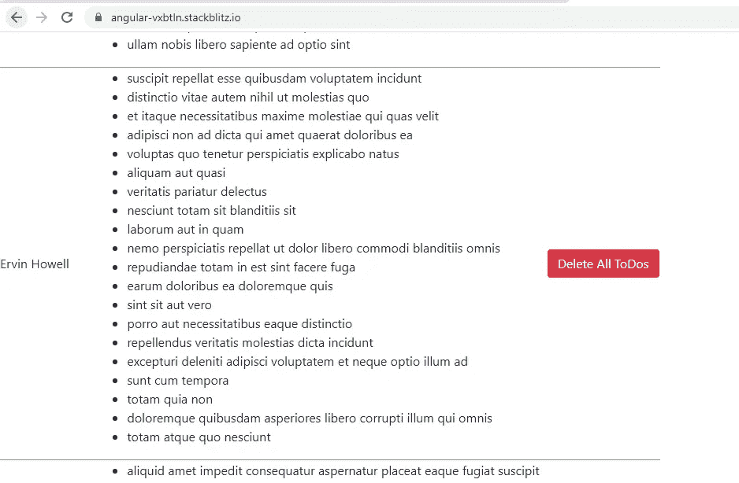
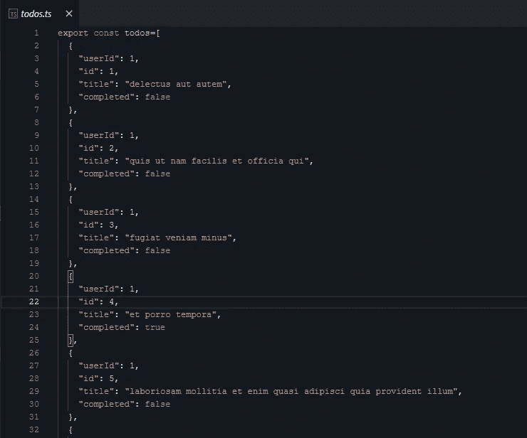
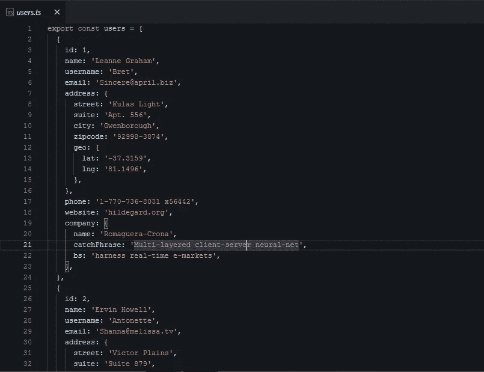
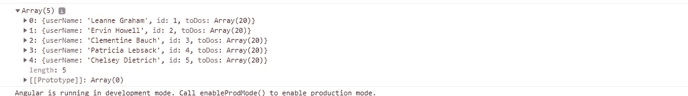
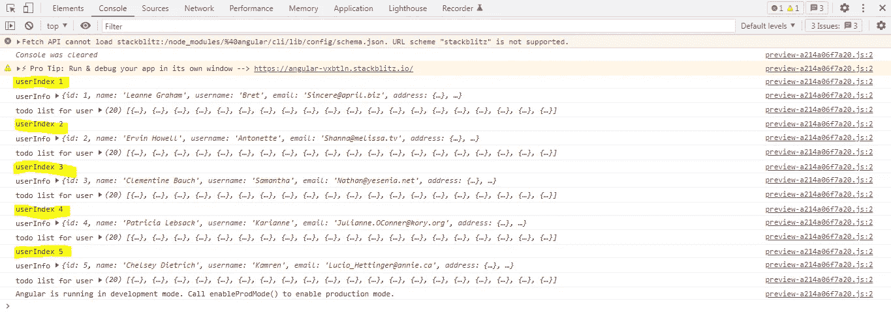
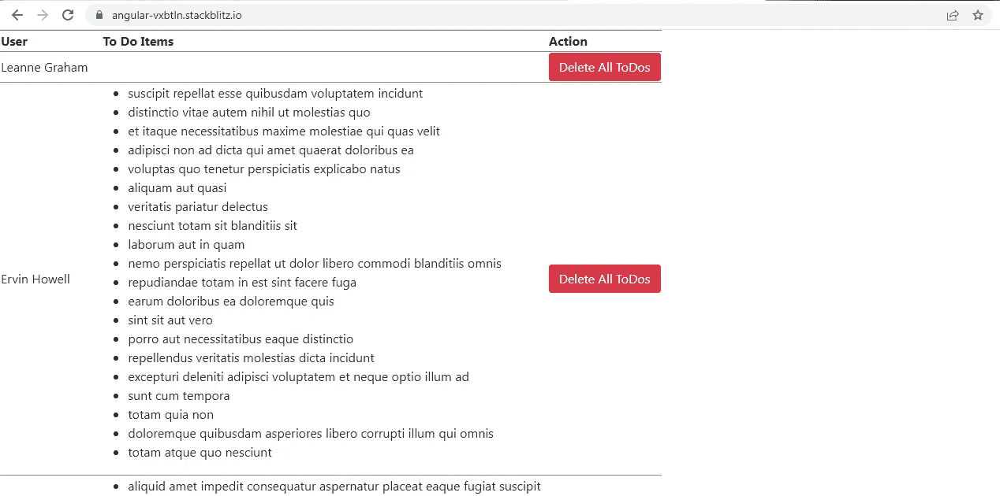

# Angular:使用 RXJS 顺序执行依赖和独立方法的简单实例

> 原文：<https://medium.com/geekculture/angular-simple-practical-example-for-executing-dependent-and-independent-methods-in-sequence-using-af2db1f74a8c?source=collection_archive---------4----------------------->

在我的工作项目中，我遇到过多种需要按顺序执行操作的情况。我们将检查两个场景:

1.  按顺序执行两个方法，其中一个方法依赖于另一个方法获取数据。
2.  按顺序执行两个方法，其中两个方法相互独立。

这些是我们的目标:

1.  以表格形式显示 5 个用户的列表和每个用户的待办事项列表。



First user



Second user

2.我们没有使用数据库来获取数据。相反，我们从两个文件中导出了用户数据和每个用户的待办事项列表数据: **todos.ts 和 users.ts** 。下面的截图将有助于理解用户和待办事项列表数据的结构。

在 **todos.ts** 中，我们已经导出了一个数组 **todos。**数组中的每个对象包含创建了待办事项的用户的 **userId** 、待办事项的 **id** 、待办事项的**标题**和事项的**完成状态**。



在 **users.ts** 中，我们已经导出了一个数组 **users。**这个数组包含用户的 **id** 和用户的所有其他信息，这些信息在这个例子中是不相关的。



将首先获取用户数据，然后使用每个用户的信息来检索相应的待办事项列表数据。这将演示第一个场景。

为了演示第二个场景，我们为每个用户添加了一个“**删除所有待办事项**”功能。当我们点击用户对应的“**删除所有待办事项**按钮时，该用户的所有待办事项将被删除，更新的数据将被提取。这里，删除和获取将按顺序进行。

让我们从 **AppComponent 模板**开始:

该模板有一个简单的表，它是通过迭代数组 **todos 构建的。**这个数组中的每个对象都有 3 个属性:**用户名，id** 和 **toDos** 。属性名称本身表明它包含什么数据。 **userName** 是包含用户名的字符串属性， **toDos** 是包含该用户对应的待办事项列表的数组属性， **id** 是包含用户 id 的数字属性。

我们还有对应于每个用户的**删除所有待办事项**按钮。当我们点击按钮时，调用 **delete()** 将相应用户的 id 作为参数传递。在这个方法中，我们将删除用户的 ToDos 列表。

**AppComponent 类:**

让我们一步一步地在课堂上演示场景 1。

一、在 **ngOnInit()** 生命周期钩子中，我们调用了一个方法 **getUsers()。**顾名思义，在这个方法中，我们将依次获取 5 个用户的列表以及每个用户对应的 ToDos 列表。

```
**//AppComponent Class**ngOnInit() {
this.getUsers().subscribe((todos) => {
**this.constructJSON(todos);**
});
}
```

我们先来检查一下 **getUsers()** 。

1.  **变量 users** 将保存前 5 个用户的详细信息，而**变量 todos** 将保存一个对象数组，每个对象包含用户名、用户的待办事项列表以及用户的 id。这两个变量都被初始化为一个空数组。

```
**this.users** = [];
**this.todos** = [];
```

2. **users.ts** 文件导出了一个包含 10 个对象的 users 数组，这些对象对应于 10 个用户，但是在本例中，我们想要演示的是只按顺序检索前 5 个用户的详细信息。

```
public arr = [1, 2, 3, 4, 5];
```

由数字 1-5 组成的数组 **arr** 已使用 rxjs 运算符的**转换为冷可观察值。每个数字对应一个用户的 ID。这个可观察值将仅发出 5 个值，并将完成。我们将利用这一点从 API 中检索前 5 个用户的详细信息。**

```
return **from(this.arr)**.pipe(
tap((elem) => console.log('userIndex', elem)),
**concatMap((userId, index) => this.service.getUsers(userId))**
).pipe(
tap((elem) => console.log('userInfo', elem)),
**concatMap((userInfo: any, index) => {
this.users.push(userInfo);
return this.service.getToDos(userInfo.id);
})**
);
```

3.来自操作符的**将数组 **arr** 转换为一个可观察值(外部可观察值),该值为 1-5。**

4.当它发出第一个值 1 时，第一个 **concatMap** 操作符将值 1 映射到由**this . service . get users(userId)返回的内部可观察对象。**请注意，我们正在使用**点击操作符**记录每个步骤。

在继续之前，让我们检查一下 **TestService** 类。

我们将从 **users.ts** 和 **todos.ts** 导出的数组 **users** 和 **todos** 分别赋给两个变量 **userList 和 todosList** 。

```
public userList = […users];
public todosList = […todos];
```

在 **getUsers()** 方法中，我们将用户的 ID 作为参数传递。我们正在过滤数组 **userList** ，以检索与作为参数传递的用户 ID 相对应的用户信息。我们使用来自操作符的**将包含用户信息的对象转换成可观察对象，并将其返回给组件。**

```
**//TestService Class****getUsers(index: number)** {
let filteredUsersList = this.userList.filter((users: any) => users.id == index
);
return from(filteredUsersList);
}
```

5.从 TestService 的 **getUsers()返回的这个可观察对象现在成为外部可观察对象，它发出包含用户信息的对象作为值。**

**2nd concatMap** 操作符将这个值映射到一个内部可观察对象中，这个内部可观察对象将由 **this.getToDos(userInfo.id)返回。**还要注意，在内部可观察对象返回之前，我们将外部可观察对象发出的对象(包含用户信息)推入**用户**数组。

```
**concatMap((userInfo: any, index) => {
this.users.push(userInfo);
return this.service.getToDos(userInfo.id);
})**
```

6.移动到 **TestService 类**中的 **getToDos()** 方法。

```
**//TestService Class****getToDos(index: number) {**
let filteredToDosList = this.todosList.filter((todos: any) => todos.userId == index
);
return of(filteredToDosList);
}
```

我们已经将用户的 ID 作为参数传递给了这个方法。我们正在通过**ToDo list**数组进行过滤，以检索与用户 ID 相对应的所有待办事项列表项。

使用来自操作符的**将过滤后的列表作为可观察对象返回给组件。**

最后，在我们已经讨论过的下面这段代码中，第一个用户的这个过滤后的待办事项列表将作为订阅结果被接收。

```
**//AppComponent Class**ngOnInit() {
this.getUsers().subscribe((todos) => {
**this.constructJSON(todos);**
});
}
```

我们将这个过滤后的 ToDo 列表作为参数传递给 **constructJSON()** 来创建最终的数组 **todos** ，它将形成表数据。这个方法的内容并不重要。您需要知道的是，我们正在将第一个用户的用户信息和对应于该用户的待办事项列表推送到 **todos** 数组中。

```
**//AppComponent Class****constructJSON(todos) {**
let obj: any = {};
obj.userName = this.users[this.users.length — 1].name;
obj.id = this.users[this.users.length — 1].id;
obj.toDos = todos;
this.todos.push(obj);
}
```

同样的过程也将发生在其他 4 个用户身上。下面是最终 **todos** 阵列的结构。



Final todos used in the table

请观察控制台中的以下日志，了解如何使用 **concatMap** 操作符按顺序执行所有操作。这就完成了**场景 1** 。



Log to demonstrate the methods executing in sequence

二。现在让我们继续进行**场景 2** ，其中两个独立的操作:删除和检索将依次发生。

假设我点击第一个用户“符晓薇·格拉汉姆”的“**删除所有待办事项**”按钮。它将执行 delete()，将用户的 ID 作为参数传递。

```
**//AppComponent Class****delete(userId: number) {**
**concat(this.handleDelete(userId), this.getUsers())**.subscribe(
(todos: any) => {
if (Array.isArray(todos)) {
**this.constructJSON(todos);**
}
},
(err) => console.log(err),
() => console.log(‘completed’)
);
}
```

这里我们将使用 **concat 操作符**依次执行 **handleDelete()** 和 **getUsers()** 。

```
**//AppComponent Class****handleDelete(userId: number) {**
let updatedToDosList = this.service.todosList.filter(
(todo, todoIndex) => todo.userId !== userId
);
return this.service.updateToDosList(updatedToDosList);
}
```

在 **handleDelete()** 中，我们再次传递了相同的用户 ID 作为参数。我们通过 TestService 的**ToDo list 变量进行过滤，以检索所有用户的 ToDo 列表，除了其 ID 作为参数传递的用户。**

目的是创建一个数组 **updatedToDosList** ，其中没有 ID 作为参数传递的用户的待办事项列表项。

我们调用测试服务的 **updateToDosList()，将 **updatedToDosList** 作为参数。**

```
**//TestService Class****updateToDosList(updatedList) {**
this.todosList = updatedList;
return of(‘Updated Data Successfully’);
}
```

在 **updateToDosList()** 中，我们只是用更新后的数据更新了 **todosList** 变量，以便在检索时，我们可以获得除第一个用户之外的所有用户的待办事项列表信息，第一个用户的 ID 在参数中传递。

在此之后， **concat** 操作符将调用我们已经讨论过的 **getUsers()** 来检索更新的数据并填充表格。

这就完成了场景 2。



Table after deleting the ToDo list of the first user

你可以在下面的链接中找到完整的例子。

[](https://stackblitz.com/edit/angular-vxbtln?file=src/app/test.service.ts) [## 角形(叉形)堆叠

### 一个基于 rxjs，tslib，core-js，zone.js，@angular/core，@angular/forms，@angular/common 的 angular-cli 项目…

stackblitz.com](https://stackblitz.com/edit/angular-vxbtln?file=src/app/test.service.ts)