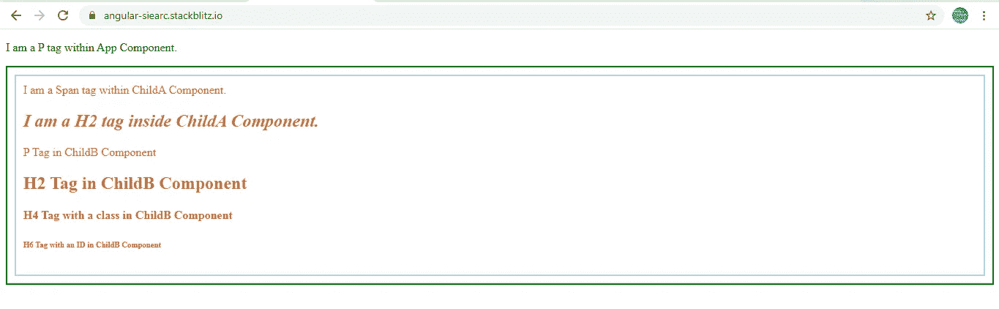
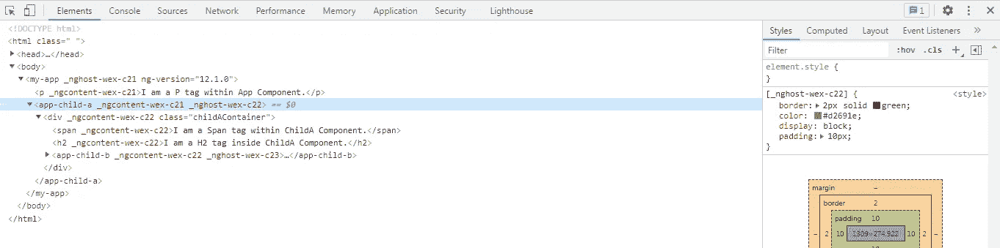
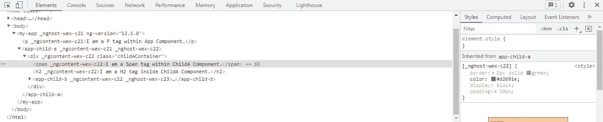
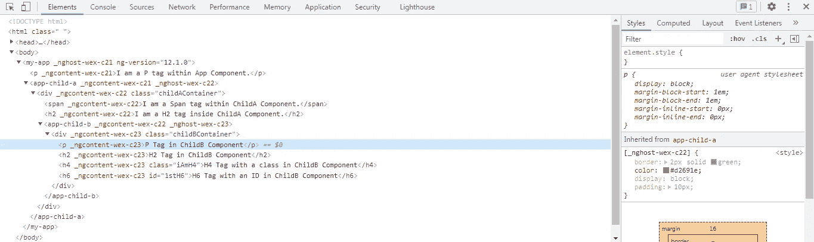
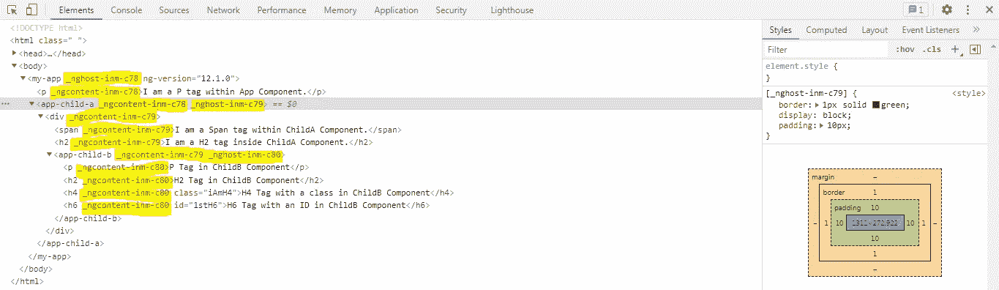
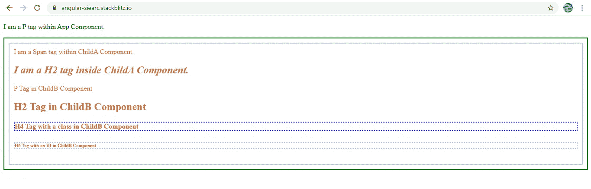
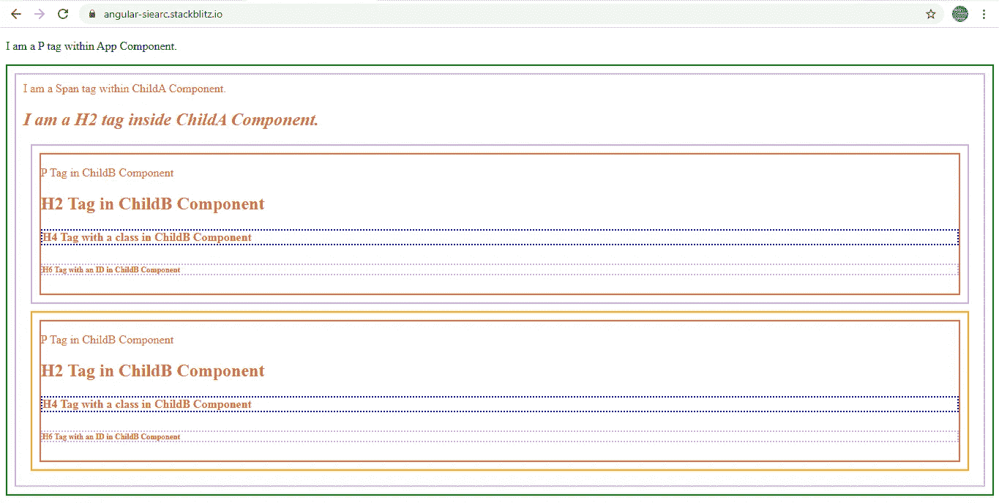
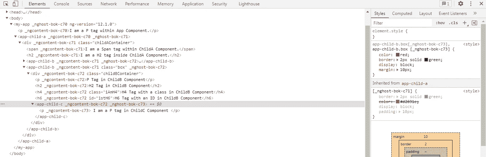
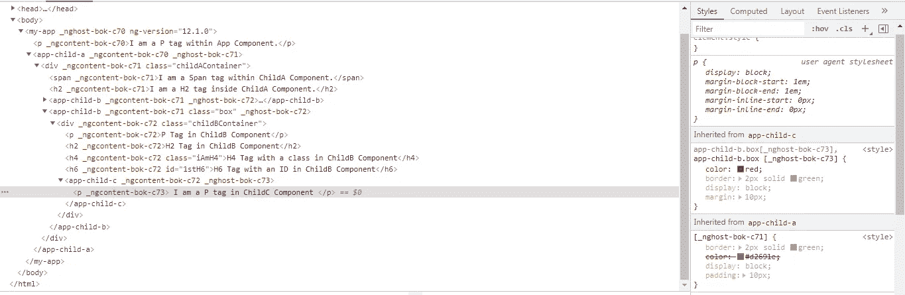

# Angular:这是我最终理解的:host，:host-context 和::ng-deep 选择器

> 原文：<https://medium.com/geekculture/angular-this-is-how-i-finally-understood-host-and-ng-deep-selectors-c829098cf194?source=collection_archive---------4----------------------->

让我们从:主机选择器开始。

那么，什么是主体元素呢？假设我有一个包含一些内容的组件。该组件有一个选择器<app-comp-a>T52/app-comp-a>。

那么<app-comp-a>单独就是宿主元素</app-comp-a>。 <app-comp-a></app-comp-a> 的内容不是宿主元素。

不可能在组件的 CSS 文件中设置 <app-comp-a></app-comp-a> 元素的样式。

**:host** 选择器是一个主要针对 host 元素进行样式化的概念:<app-comp-a>/app-comp-a>及其后代。

考虑一下这个场景。

在根 AppComponent 中，我添加了一个名为 **ChildAComponent** 的子组件。

**AppComponent 模板:**

```
<p>I am a P tag within App Component.</p>**<app-child-a></app-child-a>**
```

**ChildAComponent 模板:**我们添加了一个< span >标签和另一个子组件: **ChildBComponent** 。这两个元素都包含在一个带有类 **childAContainer** 的< div >标签中。

```
<div **class="childAContainer"**>
<span>I am a Span tag within ChildA Component.</span>**<app-child-b></app-child-b>**
</div>
```

**ChildBComponent 模板:**我们有一个< p >、< h2 >、< h4 >，带有一个**类 iAmH4** 和一个< h6 >标签，带有一个 **ID 1stH6** 。所有这些标签都包含在一个带有类 **childBContainer** 的< div >标签中。

```
<div **class="childBContainer"**>
<p>P Tag in ChildB Component</p><h2>H2 Tag in ChildB Component</h2><h4 **class="iAmH4"**>H4 Tag with a class in ChildB Component</h4><h6 **id="1stH6"**>H6 Tag with an ID in ChildB Component</h6>
</div>
```

为了演示 **:host** 如何工作，让我将下面这段代码添加到 ChildAComponent 的 CSS 文件中。

**子组件 CSS:**

```
.**childAContainer**{
border: 2px solid lightblue;
padding: 10px;
}**:host {**
border: 2px solid green;
color:chocolate;
display: block;
padding: 10px;
}**:host h2 {**
font-style: italic;
}**:host .iAmH4 {**
border: 2px dotted blue;
}**:host [id='1stH6'] {**
border: 2px dotted violet;
}
```

我假设到目前为止**子组件**还没有定义 CSS 样式。

上述代码的结果将是:



:host selector applied to <app-child-a>

当我们看结果时，我们的推论是什么？

```
**:host {**
border: 2px solid green;
color:chocolate;
display: block;
padding: 10px;
}
```

**:host** 会将其下定义的样式添加到 host 元素:< app-child-a >及其后代。


:host applied to <app-child-a>

一些样式属性仅添加到<app-child-a>中，例如:一个**绿色边框**仅添加到< app-child-a >元素中。</app-child-a>



Styles applied to <app-child-a>

但是样式属性**颜色**已经应用于< app-child-a >和< app-child-b >的所有元素。

这是 DOM 目前的样子:



<span> tag inherits color property from host element <app-child-a>

如果你注意到，<app-child-a>下的标签只继承了颜色属性，而没有继承其他属性，如边框、填充和显示。</app-child-a>

这种行为的原因是有些样式属性是可继承的，而有些是不可继承的。**可继承属性可以从父组件< app-child-a >传递到子组件< app-child-b >，即使组件被封装**。

例如:<app-child-b>下的</app-child-b>

标签也继承了<app-child-a>的颜色属性。</app-child-a>



<p> tag under <app-child-b> has inherited color from <app-child-a>

请检查下面的链接，查看可继承和不可继承的属性列表。

 [## 全属性表

### 注:本规范的几个章节已被其他规范更新。请参见“层叠风格…

www.w3.org](https://www.w3.org/TR/CSS21/propidx.html) 

**:主机**不影响主机元素的父组件: **AppComponent** 。

```
.**childAContainer**{
border: 2px solid lightblue;
padding: 10px;
}
```

另外一个**蓝色边框**已经被应用到< div >标签上，在< app-child-a >中带有类 **childAContainer** 。向带有类 **childAContainer** 的< div >标签添加蓝色边框的目的是**区分应用于< app-child-a >内内容的边框和直接应用于< app-child-a >的边框。**

```
**:host h2 {**
font-style: italic;
}
```

**可以在:host 选择器之后添加额外的选择器来选择子元素。**例如:在上面的例子中，我们在:host 之后添加了标记名 h2，以选择 host 元素< app-child-a >下的所有< h2 >元素。

只有<app-child-a>的</app-child-a>

## 标签使用**字体样式:斜体。**在< app-child-b >中的< h2 >标签不会受到影响，因为 Angular 为组件提供了默认的**仿真封装**。

```
**:host .iAmH4 {**
border: 2px dotted blue;
}
**:host [id='1stH6'] {**
border: 2px dotted violet;
}
```

正如你所看到的，在< app-child-b >中有一个带有 class **iAmH4** 的

#### 标签和带有 ID **1stH6** 的< h6 >标签。但是以上两种风格根本没有产生任何影响。正如已经讨论过的，这都是由于默认的**仿真封装**造成的。

在继续下一步之前，让我简要介绍一下这种封装是如何工作的。下面是 DOM 现在的截图。



Emulated Encapsulation

正如你所看到的，每个组件都有一个独特的属性，以应用于它的 **_nghost** 开始。例如:

= >根组件<my-app>具有属性 **_nghost-inm-c78**</my-app>

=><app-child-a>具有属性 **_nghost-inm-c79**</app-child-a>

=><app-child-b>具有属性 **_nghost-inm-c80**</app-child-b>

类似地，上述每个组件中的每个元素都有一个以应用于它的 **_ngcontent** 开头的属性。

另一点需要注意的是，同一组件下的所有元素都有相同的 **_ngcontent** 属性。例如:

= >在<app-child-a>下的</app-child-a>

、和

## 标签具有相同的 **_ngcontent-inm-c79** 属性。 

= >在<app-child-b>下的</app-child-b>

、

## 、

#### 和

###### 标签具有相同的 **_ngcontent-inm-c80** 属性。

= >因为<app-child-a>是<my-app>下的一个元素，所以它也有一个 **_ngcontent-inm-c78** 属性。</my-app></app-child-a>

= >因为<app-child-b>是<my-child-a>下的一个元素，所以它也有一个 **_ngcontent-inm-c79** 属性。</my-child-a></app-child-b>

由于 **_ngcontent-inm-c79** 是一个只有< app-child-a >中的元素才有的属性，所以< app-child-a >的 css 文件中定义的所有样式都将被限制或限定在这个组件的元素范围内。

同样，由于 **_ngcontent-inm-c80** 是一个只有< app-child-b >中的元素才有的属性，所以< app-child-b >的 css 文件中定义的所有样式都将被限制或限定在这个组件的元素范围内。

这就是 Angular 如何使用这两个属性来实现组件中的样式封装。

为了绕过这种封装，**:ng 深度选择器**派上了用场。假设我修改了上面的两种风格，如下所示:

```
:host **::ng-deep** .iAmH4 {
border: 2px dotted blue;
}:host **::ng-deep** [id=’1stH6'] {
border: 2px dotted violet;
}
```

结果将如下图所示。**子组件< app-child-b >中的< h4 >和< h6 >标签被父组件<app-child-a>添加了虚线边框。**

ng-deep 非常强大，能够将它定义的样式渲染为全局样式。这里需要注意的是，必须在:host 选择器之后使用 **::ng-deep，以确保定义的样式的范围仅限于< app-child-a >组件及其后代组件< app-child-b >。**



::ng-deep selector

现在让我修改一下 **ChildAComponent** 模板，添加另一个< app-child-b >，带有一个类**框**。

```
<div **class="childAContainer"**>
<span>I am a Span tag within ChildA Component.</span><h2>I am a H2 tag inside ChildA Component.</h2><app-child-b> </app-child-b>**<app-child-b class="box"></app-child-b>**</div>
```

这样做的目的是演示如何以不同的方式对多次使用的同一个主机元素进行**样式化。**

让我们给 **ChildBComponent 的 css 文件添加一些样式。**

**ChildBComponent CSS:** 我想给没有类的< app-child-b >主机元素添加一个**紫色背景色**，给有类的< app-child-b >框添加一个**橙色背景色**。

```
**:host {**
border: 2px solid violet;
display: block;
padding: 10px;
margin: 10px;
}**:host(.box) {**
border: 2px solid orange;
}**.childBContainer {**
border: 2px solid tomato;
}
```

在:host()选择器中，括号内给出的条件决定了要设计哪个主机元素的样式。可以看到， **:host(。box)** 帮我给**<app-child-b class = " box "></app-child-b>添加不同的背景色。**

我们还添加了带有类 **childBContainer** 的

标签，它包含了带有番茄边框颜色的< app-child-b >的所有内容。目的是区分应用于< app-child-b >的边框和应用于< app-child-b >内容的边框。

结果如下所示:



:host applied to <app-child-b>

最后，让我们来看看 **:host-context()** 选择器。主机上下文的概念是根据 CSS 类是否应用于主机元素的任何祖先来设计主机元素的样式。

让我们将另一个子组件 **ChildComponentC** 添加到 ChildComponentB。

```
<div class=”childBContainer”>
<p>P Tag in ChildB Component</p>
<h2>H2 Tag in ChildB Component</h2>
<h4 class=”iAmH4">H4 Tag with a class in ChildB Component</h4>
<h6 id=”1stH6">H6 Tag with an ID in ChildB Component</h6>
**<app-child-c></app-child-c>**
</div>
```

**ChildComponentC 模板:**

```
<p>I am a P tag in ChildC Component</p>
```

**儿童组件 CSS:**

```
**:host-context(app-child-b.box) {**
 color: red;
border: 2px solid green;
display: block;
margin: 10px;
}
```

这意味着如果<app-child-b>元素有一个类 **box，**那么**颜色:红色**样式将被应用到主机元素< app-child-c >。</app-child-b>

正如所料，**边框、边距和显示属性仅应用于< app-child-c >主机元素**。



styles applied to <app-child-c>

由于继承，只有**颜色属性**应用于< app-child-c >下的< p >标签，因为颜色属性是可继承的。上面提到的其他属性是不可继承的。



styles applied to the <p> tag under <app-child-c>

你可以通过下面的链接查看整个例子。

[](https://stackblitz.com/edit/angular-siearc?file=src/app/child-a/child-a.component.scss) [## 角形(叉形)堆叠

### 编辑描述

stackblitz.com](https://stackblitz.com/edit/angular-siearc?file=src/app/child-a/child-a.component.scss)