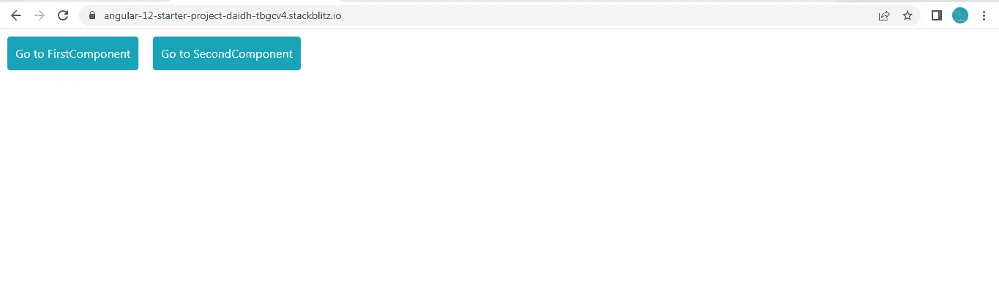
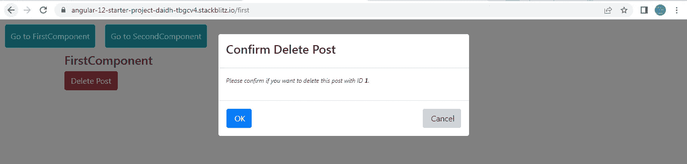
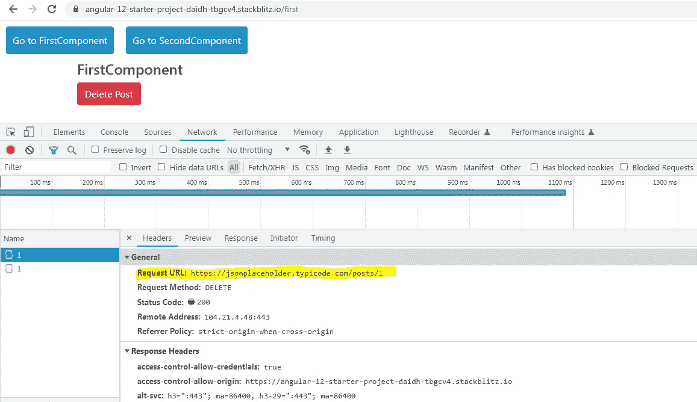
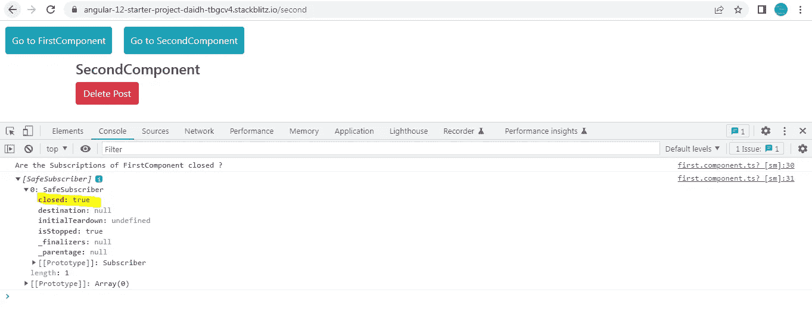
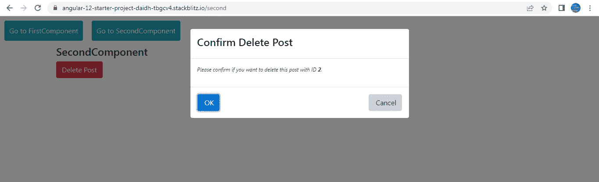
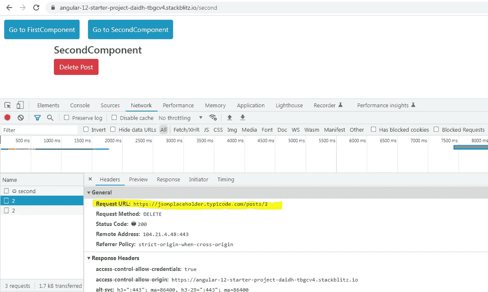
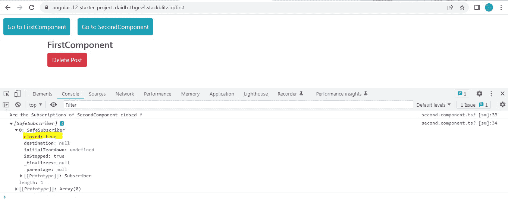

# Angular:这就是我如何理解如何使用 Mixins 来重用组件之间的逻辑

> 原文：<https://medium.com/geekculture/angular-this-is-how-i-understood-how-to-use-mixins-to-reuse-logic-between-components-cda729297de2?source=collection_archive---------0----------------------->

一开始，关于 Mixins 的文档可能会非常混乱，让人不知所措。简单来说，

一个 mixin 类被用来处理一些行为，其他常规类只需扩展这个 mixin 类就可以很容易地访问这个行为。这是提高多个类之间逻辑可重用性的一种简单方法。

假设你有一个名为 ABC 的类，ABC 想重用其他类 PQR 和 MNO 的一些方法。

ABC 可以使用**扩展**关键字一次扩展两个类吗？不要！Typescript 不支持此功能。通过扩展，ABC 一次只能访问一个类别(PQR/MNO)的方法。

Mixin 类帮助一个类 ABC 一次访问多个类的方法。

我在 Angular 中创建了一个简单的例子来演示上面的想法。



Mixins Application

该应用程序只有两个组件:**第一组件**和**第二组件**，这两个组件将用于演示我们如何使用 mixin 类重用一个行为。

我们的目标是:

1.  创建 2 个组件**第一组件**和**第二组件。**这些组件将通过按钮导航，如您在上面的屏幕截图中所见。
2.  这两个组件都被赋予了通过点击按钮**删除帖子的能力。**在删除 HTTP 请求实际发送之前，我们将为用户提供一个**确认对话框**来删除帖子。我们将创建一个 mixin 类来重用两个组件之间的确认对话。
3.  当我们从 FirstComponent 切换到 SecondComponent 时，或者反之亦然，在组件中对 observables 的任何**订阅都必须关闭**。通过创建一个 mixin 类，这个行为将再次被重用。

让我们从定义删除帖子的方法的**数据服务**开始。

**deletePost()** 接受一个 **postId** 并发出一个 **DELETE** Http 请求，删除与 **postId** 对应的帖子。

DataService

现在让我们转到 **mixins.ts** 文件。

```
type **GConstructor<T = {}>** = new (…args: any[]) => T;
```

1.  **g 构造器**是我们已经创建的一个类型，用于创建某个**通用类型 T** 的对象。 **< T={} >** 表示 **{}** 应该是 T 的默认值，除非另有说明。

我们来分解一下语法。

=> **()= > T** 表示不带参数的基于箭头的函数，返回**类型** **T** 。

=> **(…args:any[])= > T** 表示一个函数，它接受任意数量的参数(这就是[])的原因**类型 any** 并且这个函数返回**类型 T** 。

= >**new****(…args:any[])=>T**表示该函数是一个**类构造函数**，可以用 **new 关键字**调用。它是一个函数，类构造函数可以作为参数传递给它。

2.我们已经导出了两个方法:**confirmationDialogueMixinFunction()**和**commonObservableUnsubscribeMixinFunction()**来帮助创建一个用于重用行为的 mixin 类。

让我们从**confirmationDialogueMixinFunction()开始。**

1.  **confirmationDialogueMixinFunction()**是一个 **mixin 函数**，它接受一个**基类**作为参数，这个基类属于**类型**类型**基类**。
2.  现在让我们检查下面的语法:

```
export function confirmationDialogueMixinFunction
**<BaseType extends GConstructor<ModalType>>**
**(BaseClass: BaseType)**
```

**< BaseType 扩展 g constructor<modal type>>**表示 BaseType 必须与 **GConstructor** 类型兼容，即 BaseType 类型的 BaseClass 必须是类构造函数。

类中的构造函数必须有参数，其名称和类型与类型中的参数相匹配。

```
type **ModalType** = {
ngModalService: NgbModal;
};
```

正如你所看到的，那个**模式类型**有一个类型 **NgbModal 的参数 **ngModalService** 。这意味着基类的构造函数必须传递相同的参数。没有 NgbModal 类型的 ngModalService** 我们不能调用引导对话。所以这个检查很重要。

**3。**mixin 函数返回一个匿名类，它扩展了这个**基类**。我们已经定义了这个匿名类并返回了它。这个匿名类现在可以访问基类的所有属性和方法。

我们在这个匿名类中定义了一个方法**openconfirmdiation()**，它将打开一个引导确认对话框，以确认用户是否真的想要删除这篇文章。

注意我们能够从 **this 关键字**中访问 **ngModalService** 属性。我们还没有在匿名类的任何地方定义 ngModalService。记住，匿名类扩展了基类，所以它必须能够访问基类的所有属性。

```
const modalReference = **this.ngModalService**.open
( ConfirmationDialogueComponent, modalOptions );
```

**ConfirmationDialogueComponent**是向用户显示确认消息的组件。组件的内容在这里并不重要。

现在让我们转到**commonObservableUnsubscribeMixinFunction()**。这和我们之前看到的非常相似。

```
export function commonObservableUnsubscribeMixinFunction
**<BaseType extends GConstructor>
(BaseClass: BaseType)**
```

请注意，从 **< BaseType 扩展 GConstructor >，**它暗示了 BaseType 的 BaseClass 一定是一个类构造函数。

但是这里对基类的构造函数中必须传递的参数没有限制。这是因为我们没有向 GConstructor 传递任何类型参数。任何基类都有资格访问这个方法，其中基类中所有可观察对象的所有订阅都将被关闭。

定义的 mixin 函数返回一个匿名类，它将扩展基类。在这个匿名类中，我们定义了一个名为 **unsubscribeSubject** 的主题，并定义了一个方法 **destroy()** 。

只要**取消订阅 Subject** 不发出值，基类中的所有订阅都将打开。

我们现在将看到两点:

= > first component 如何使用我们在 mixins.ts 中定义的两个方法返回的匿名类创建 mixin 类

= >还有 **FirstComponent** 如何能够访问 mixin 类中定义的方法。

SecondComponent 的行为是 FirstComponent 的复制，因此它是不言自明的。

**AppComponent 模板:** FirstComponent 和 SecondComponent 托管在 AppComponent 内部。正如您在下面看到的，我们提供了导航到这些组件的按钮。


Mixins Application

当我点击**“转到第一个组件”，**第一个组件看起来如下。它只有一个标题和删除文章的按钮。


FirstComponent

**FirstComponent 模板**:如前所述，该模板包含一个删除帖子的按钮**。**点击按钮调用 **confirmAction()** ，传递一个对象作为参数。这个对象包含两个属性: **action** 和 **postId** 作为参数。为了简单起见，我们对要删除的文章的 postId 进行了硬编码。

**第一个组件类别**:

```
const **firstComponentMixin** = commonObservableUnsubscribeMixinFunction(
confirmationDialogueMixinFunction(**class Parent {
constructor(public ngModalService: NgbModal) {}
}**
)
);
```

**firstComponentMixin** 持有 FirstComponent 将要扩展的 **mixin 类**。让我们看看它是如何创建的。

我们调用了**confirmationDialogueMixinFunction()**，将一个名为 **Parent** 的类作为参数传递。这个类的父类包含一个构造函数，我们已经向它传递了与类型 **ModalType** 中所期望的相同的参数。因此，这个父类就是我们作为参数传递给 mixin.ts 中的**confirmationDialogueMixinFunction()**的**基类**

**confirmationDialogueMixinFunction()**将返回第一个匿名类，它将扩展父类。因此，返回的第一个匿名类现在将是作为参数传递给**commonObservableUnsubscribeMixinFunction()的**基类**。**

**commonObservableUnsubscribeMixinFunction()**将再次返回扩展第一个匿名类的第二个匿名类。

**第二个匿名类是 firstComponentMixin** 中的 mixin 类。因为 mixin 类扩展了第一个匿名类，而第一个匿名类扩展了父类，这意味着 **mixin 类可以访问父类和第一个匿名类**的属性和方法。

```
export class **FirstComponent extends firstComponentMixin** implements OnInit {**constructor(private service: DataService, ngModalService: NgbModal) {super(ngModalService);}**
```

正如你在上面看到的， **FirstComponent 扩展了我们已经创建的 mixin 类**。

当点击“删除帖子”按钮时，调用 **confirmAction()** ，该函数调用**confirmationDialogueMixinFunction()返回的匿名类定义的**openconfirmindialogue()**。**

```
**confirmAction(details: any)** {this.modalOptions.backdrop = ‘static’;
this.modalOptions.keyboard = false;
this.modalOptions.windowClass = ‘first-component-confirm-modal’;let data = {
heading: `Confirm ${details.action}`,
body: `Please confirm if you want to delete this post with ID <b>${details.postId}</b>.`,
};**this.openConfirmDialogue(this.modalOptions, data)**.subscribe((data) => {
**this.deleteExistingPost(details.postId);**
});}
```

**openConfirmDialogue()** 完全负责打开引导对话，接受来自用户的肯定/否定确认，并将其返回给 FirstComponent，以它想要的方式处理它。



Confirmation Dialogue

FirstComponent 将调用 **deleteExistingPost()，**，后者又调用**数据服务**中的 **deletePost()** 删除帖子**，**，如果用户确认删除帖子。

```
**deleteExistingPost(postId: number) {**
let subs = this.service
.deletePost(postId)
**.pipe(takeUntil(this.getObservable()))**
.subscribe((x) => console.log(x));
this.subscriptions.push(subs);
}
```

请注意，只要 **getObservable()** 返回的 subject 没有发出值，对**数据服务**中 **deletePost()** 返回的 observable 的订阅就会持续。

**getObservable()** 是**commonObservableUnsubscribeMixinFunction()返回的匿名类中定义的方法。**



现在，如果我点击“**转到第二个组件**”按钮，将会触发**ngondestory()生命周期挂钩**

在这个钩子中，我们将调用**commonObservableUnsubscribeMixinFunction()返回的匿名类中定义的 **destroy()** 。**

在 **destroy()** 中，我们调用主题上的 **next()** ，这将自动关闭 FirstComponent 中的所有订阅。

正如您在下面的屏幕截图中看到的，SecondComponent 已经加载，在控制台日志中，我们还可以看到 FirstComponent 中的单个订阅已经关闭。



SecondComponent 将显示类似的行为，通过这种方式，您可以跨多个组件重用“打开确认对话”和“取消订阅可观察的”逻辑。

下面是在 SecondComponent 中点击**【Delete Post】**按钮时的确认对话框截图。



用户给出肯定的确认，postId 为**2 的帖子被删除。**



最后，当通过点击**“Go to FirstComponent”**按钮切换回 first component 时，我们看到 SecondComponent 中的单个订阅被关闭。



我总是发现先在 typescript 项目中做一个简单的例子来清楚地理解这个概念，因为我们只有一个文件，没有太多的依赖关系需要关注。

下面是一个工作的 typescript 项目示例，它不同于 angular 示例，但说明了 mixin 概念。

您可以查看下面的整个工作角度示例。