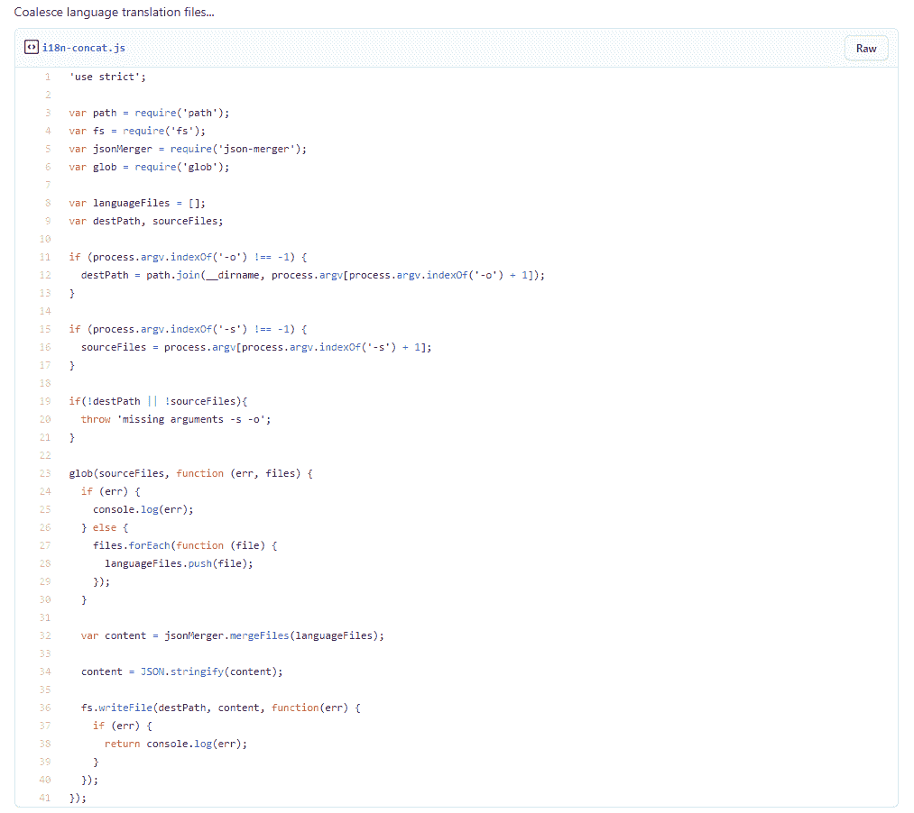
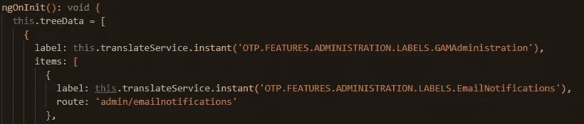
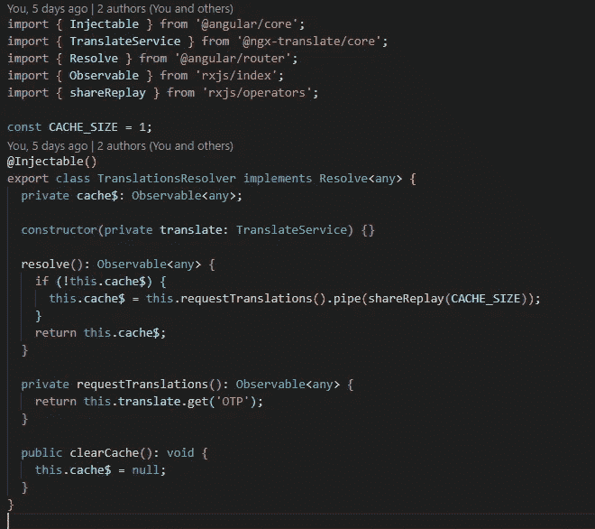
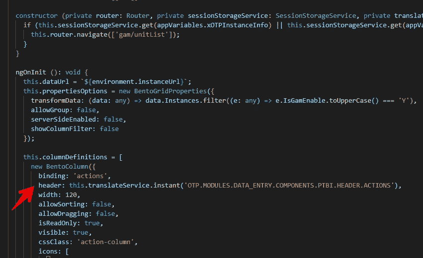

# 角度平移:一种新方法

> 原文：<https://medium.com/geekculture/angular-translations-a-novel-approach-2fbeb542b470?source=collection_archive---------29----------------------->

*对语言文件使用 ngx-translate*

## 介绍

我一直在研究如何处理翻译，现在，我不得不接受错误的方式…也就是说，在应用程序中管理翻译文件(而不是我认为合适的方式，由第三方 CMS 支持的 API 抽象，等等)。).管理应用程序中的翻译意味着开发人员可能需要对翻译、构建、测试等进行修改。等等。—开发周期。管理这些*类型的问题*很可能不是您的应用程序的责任。

出于本文的目的，我分两个阶段，第一个阶段是预先加载翻译，第二个阶段(也是即将到来的阶段)是支持动态语言翻译。)

在开发翻译解决方案的过程中，我发现了几个微妙的方面，迫使我提出一个解决方案来处理翻译，与 ngx-translate 库规定的略有不同。*规定的管理异步加载的翻译的方式*是使用*异步*管道。

这种技术将异步地响应变化，而不需要进行任何手工编码。我们遇到的问题主要是设置我们的第三方网格列标题网格— *我们需要在组件中提供翻译，而不是直接在视图中提供*。

## 组件翻译文件

我决定为每个组件创建一个翻译文件(并作为原理图的一部分)，我有一个构建脚本，它将*连接*所有这些翻译到一个文件中(我的计划是按模块分解它，让每个*懒惰*模块*加载*处理它们自己的所有翻译，但是为了讨论的缘故，这不是必需的)。

> 用于在整个应用程序中连接语言文件的脚本

# 问题

在某些情况下，我们需要通过组件添加翻译，而不是在视图中添加:

Example of fetching translations via the component — this is *sync*, since all is preloaded.

这意味着在组件初始化时，我们需要网格列标题(第三方@grapecity wijmo flexgrid)组件的即时同步翻译。然而，同步方面(使用即时方法)与加载语言文件翻译相冲突，因为它是一个异步过程。*我们如何解决这个问题，而不会因为竞争条件而妨碍我们的翻译输出呢？*

# 解决办法

我决定给我们的惰性加载路由添加一个解析器，以便在路由解析之前将所有翻译加载到内存中——在一个*可观察的$cache* 中。

**TranslationsResolver** 将通过 *get* 进行 http 调用，并将结果加载到＄cache—***相关模块中的翻译现在立即可用(通过 ngx 翻译服务使用即时方法)*** 。

****

**Translations resolver will load translation file into memory.**

**下面是一个路由解析器，可以根据需要显式地应用于任何惰性加载的模块。它将缓存每个路由解析的翻译。**

****

**Add the resolver for the lazy loaded route.**

# **结论**

**现在，您可以在应用程序中使用翻译，而不会受到惩罚——不需要等待或担心将翻译文件加载到内存中的异步过程。您现在可以使用下面的 ***即时*** 方法，而不用担心翻译不可用。**

****

**Use the instant method to load translation without any async wait time.**

****第 2 部分:**按需/即时处理语言翻译——根据用户输入指导的语言选择重新绑定新翻译。**