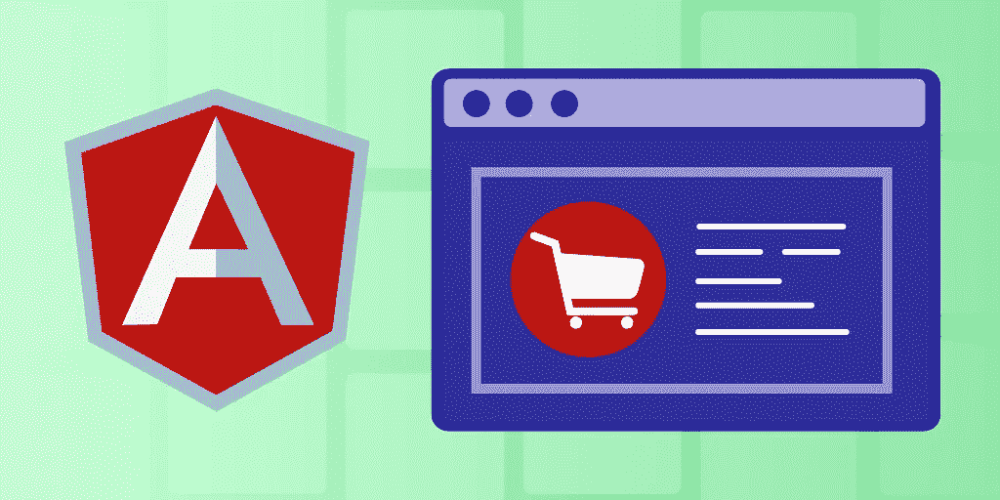
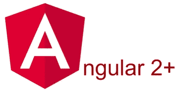
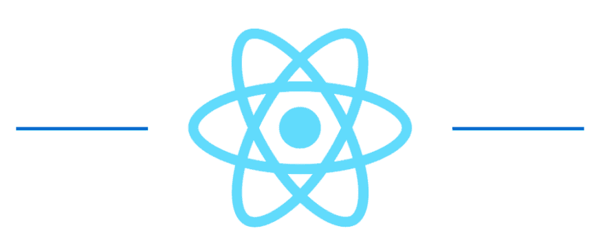
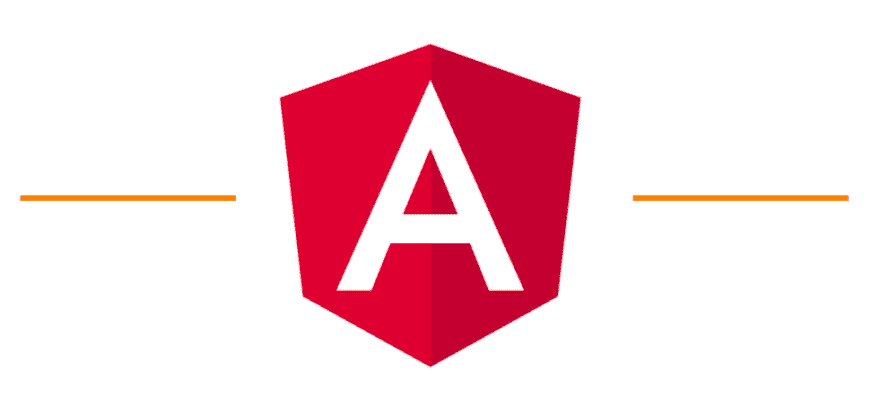
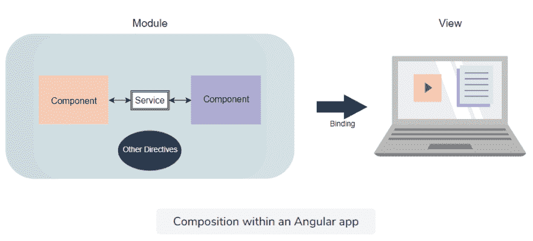

# Angular 教程:Angular 2+入门

> 原文：<https://medium.com/geekculture/angular-tutorial-getting-started-with-angular-2-f196fc40e25e?source=collection_archive---------2----------------------->



Source: Author

前端框架定义了现代 web 开发工作，因为它们的组件简单而强大。Angular 2+从其他框架中脱颖而出，为开发人员提供了对应用程序每个细节的最大控制权。

虽然 Angular 比 React 更难上手，但它丰富的工具和高级功能使其成为谷歌和亚马逊等公司的最爱。

今天，我们将帮助您开始使用 Angular，分解任何 Angular 应用程序的基本元素，并带您完成 Angular 安装。

**这是我们今天要讲的:**

*   什么是 Angular 2+？
*   角度与反应
*   熟悉角度元素
*   构建您的第一个角度应用程序
*   接下来学什么



# 什么是 Angular 2+？

Angular 2+是一个**类型脚本框架**,用于使用 CSS、HTML 和 TS 构建客户端应用程序。任何 Angular 应用程序的主要构建块都是包含执行特定行为的代码集合的组件。

Angular 允许您使用 HTML 作为模板语言，并在构建组件时扩展 HTML 的语法。Angular 应用程序通过读取页面的 HTML 并将属性解释为指令来将页面绑定到基于标准 TypeScript 变量的模型。

> *Angular 受到前端开发人员的喜爱，因为它简化了应用程序的创建，提供了通用服务的即用型包、代码的预览浏览器模板、后端集成以及表达性 HTML 等功能。*

虽然 Angular 不像其他框架那样对初学者友好，但它是市场上最成熟的前端框架，拥有多年的完整包供您利用。

Angular 的用户群仍在增长，并长期被谷歌和亚马逊等公司采用。随着每天越来越多的公司从 Angular.js 迁移到 Angular 2+，2021 年是加入 Angular 社区的好时机。

## 角度的主要特征

*   **MVC 架构**(模型-视图-控制器):将程序组件分成模型、视图和控制器的桶，将表示层与业务逻辑分开。
*   **双向数据绑定** : Angular 自动同步你的 HTML 视图和你的代码，允许你实时观察视图的更新。
*   **路由支持**:轻松构建单页应用程序(spa)，在视图间导航时提供桌面体验。
*   **依赖注入**:允许用依赖容器自动注入代码依赖，所以不需要`main()`方法。
*   **表单验证**:利用 Angular 易于实现的表单验证，改善用户在 CRUD 应用中的体验。

# 角度与反应

Angular 的主要竞争对手是脸书的 React 框架。每一种都有自己的优点、缺点和不同的设计理念，决定了何时使用它们。让我们来分解一下主要的区别，看看 Angular 的闪光点在哪里。



## 反应

React 的设计是轻量级的，对初学者友好，但缺乏 Angular 可能有的深度控制。

**优势**

*   使用结合了 HTML 和 JavaScript 的语法提供了一个简单的 JS 设计。React 还为初级学习者提供了很好的文档。React 的虚拟 DOM 实现和渲染优化使它非常快
*   顶级的渐进式 Web 应用程序(PWA)支持，尤其是其`create-react-app`模板生成器。
*   为可重用和模块化的代码而构建。这使得应用程序更容易维护和构建，允许复杂的基础设施更容易开发和扩展。

## **局限性**

*   React 是一种非常不固执己见的技术，这意味着开发人员必须做出自己的设计选择。
*   React 技术在不断更新，因此很难跟上最新的文档。
*   React 依赖于 JSX，这对一些新开发人员来说是一个学习障碍。



## 有角的

Angular 与 React 相反:以新手友好为代价最大化控制。

一旦你掌握了 Angular，你就拥有了控制和微调应用程序各个方面的工具，而这是 React 所不能做到的。

## **优点**

*   Angular 得到了 Google 的支持，有详细的文档和庞大的社区。有许多高质量的资源可以帮助你更快地学习。
*   Angular-language-service 通过高级编码特性加快开发速度，例如外部 HTML 模板文件的自动完成。
*   先进的 MVC 架构可以更好地划分职责和组织代码。
*   支持测试驱动的开发，提供即时的代码到视图的更新以及端到端和单元测试的工具。

## **限制**

*   比 React 更难学，因为 Angular 提供了各种不同的结构，比如可注入的、组件、管道、模块等等。这需要时间来学习每一个结构的位置，而不仅仅是学习做出反应的组件。
*   默认情况下性能较慢，因为它使用真正的 DOM。需要额外的工作才能像 React 一样快地执行，例如渲染过程的手动控制。

# 熟悉角度元素

要理解 Angular，您需要将应用程序分解成不同的元素，并理解它们是如何交互的。



Angular 应用程序有许多相似的组件，称为模块。组件是一种特殊类型的指令，它决定特定 UI 元素的行为。组件使用称为服务的连接器相互引用和后端资源。

最后，所有这些代码都使用数据绑定从模型到视图组件实时自动显示。

## 模块

模块是相似组件、指令和管道的容器，它们都与相同的功能相关。这些模块可以一次导入和导出，允许在整个应用程序中轻松重用。每个组件只能是一个模块的一部分。

可以把模块看作是类和容器的混合体。

这是一个角度模块的示例:

```
import { BrowserModule } from '@angular/platform-browser';
import { NgModule } from '@angular/core';
import {FormsModule} from '@angular/forms';
import { AppRoutingModule } from './app-routing.module';
import { AppComponent } from './app.component';
import { AssessmentsModule } from './assessments/assessments.module';
import { CoreModule } from './core/core.module';
import { SharedModule } from './shared/shared.module';
import { BrowserAnimationsModule } from '@angular/platform-browser/animations';
@NgModule({
  declarations: [
    AppComponent,
  ],
  imports: [
    BrowserModule,
    AppRoutingModule, AssessmentsModule, CoreModule, SharedModule, FormsModule, BrowserAnimationsModule
  ],
  providers: [],
  bootstrap: [AppComponent]
})
export class AppModule { }
```

*   `bootstrap`数组包含第一个组件，它将随着 Angular 应用程序的启动而被初始化和渲染。
*   `declarations`数组包含模块中定义的组件、管道和指令的列表。
*   `imports`数组包含我们的应用程序将从其他库或 Angular 模块导入的所有模块。
*   `exports`数组允许我们从这个模块向其他模块共享组件、管道或指令。

## 成分

组件是任何角度应用的最基本构件。每个组件控制用户界面的一部分，称为**视图**。

这些组件可以在组件的类中定义动态元素，以响应点击或悬停等事件。

当用户在应用程序中导航时，组件被更新、创建和销毁。

组件看起来是这样的:

```
@Component({
  selector: 'app-child-one',
  templateUrl: './child-one.component.html',
  styleUrls: ['./child-one.component.scss']
})
export class ChildOneComponent{ }
```

*   `selector`设置组件的名称。模块和指令使用该名称来引用该组件。
*   `templateUrl`属性声明该组件将引用哪个 HTML 文件来实现其行为。您还可以使用`template:`后跟您的代码来创建一个内联 HTML 模板。

```
template: `
<h1>Hello from App Component</h1>
`
```

*   属性声明这个组件将引用哪个 CSS 文件。如上所述，你也可以使用`styles:['div { font-weight: 600; }']]`内联你的 CSS 样式

## 指令

指令扩展了任何 HTML 元素的行为。这种行为通常是布局或外观的改变。除了组件之外，还有另外两种主要类型的指令。

## **属性指令**

这些指令帮助我们扩展模板中元素的行为或外观。最常用的属性指令是`NgStyle`，它允许你一次改变几个元素的样式。

## **结构指令**

结构指令是 Angular 应用程序中使用最广泛的指令。这些指令帮助我们处理数据的布局，例如遍历数据、对数据应用条件等。结构化指令的惯例是在指令名前使用一个星号(`*`)。

常用的结构指令有`*ngFor`和`*ngIf`。

*   `*ngFor`充当一个`for`循环，允许我们遍历一个数组:

```
<table class ="table table-striped" >
  <tr *ngFor="let u of users">
    <td>
      {{u.id}}
    </td>
    <td>
      {{u.name}}
    </td>
    <td>
      {{u.model}}
    </td>
  </tr>
</table>
```

*   `*ngIf`充当数据条件渲染的`if`语句:

```
<div *ngIf="showElement">
  <div>This element is based on the showElement condition</div>
</div>
```

## 服务

组件需要服务来获取要显示的数据。这些数据可以直接来自后端或另一个不相关的组件。您可以将服务视为将组件连接到其数据源的信使。

```
import { Injectable } from '@angular/core';
@Injectable({
  providedIn: 'root'
})
export class ExampleService {
  constructor() { }
}
```

服务使用 Angular 的依赖注入系统来跟踪哪些类(`export class`)依赖于哪些数据源(`providedIn`)。

# 安装角形

在开始之前，您需要使用命令行来安装 Angular。您还需要 Node.js 和 npm 包管理器的更新版本。

首先，通过在终端窗口中输入以下命令来安装 Angular CLI:

```
npm install -g @angular/cli
```

CLI 允许您创建项目、生成应用程序/库代码，以及实现测试和部署等任务。

接下来，您需要创建一个角度工作空间和初始应用程序。

在您的终端中，输入 CLI 命令:

```
ng new my-app
```

系统会提示您输入新应用程序的信息，但现在，您只需接受默认值。
最后，找到新创建的工作区文件夹`my-app`并运行以下命令:

```
cd my-app
ng serve --open
```

这将建立一个响应的本地应用服务器，并在您的浏览器中将其打开到`localhost:4200`。该网页将提供几个继续学习的资源或选项，如`+ New Component`，让你不断发展。

# 接下来学什么

恭喜你完成了掌握 Angular 2+的第一步。现在你已经知道了基本的组件，你已经准备好进入更高级的概念并构建你的第一个应用了。继续学习的下一步是:

*   形式
*   按指定路线发送
*   依赖注入
*   使用 API 和 CRUD 操作

*快乐学习。*