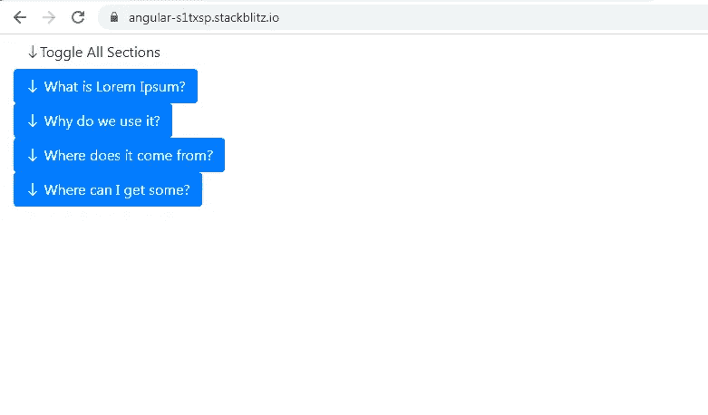
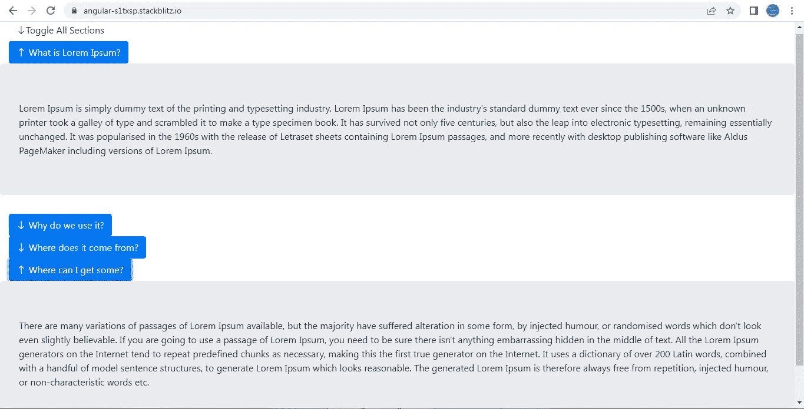
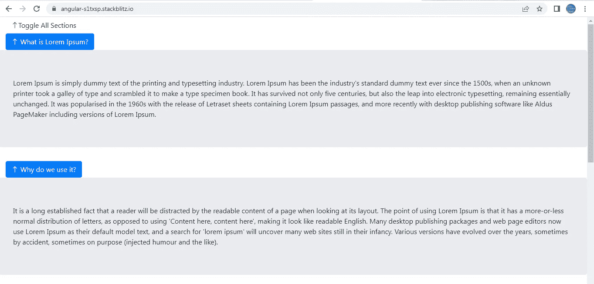
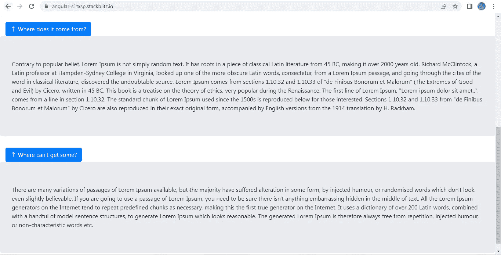

# 角度:对多个截面使用 ngx 引导折叠功能

> 原文：<https://medium.com/geekculture/angular-using-ngx-bootstrap-collapse-feature-for-multiple-sections-b4c801346a8?source=collection_archive---------5----------------------->

与 bootstrap 提供的折叠特性不同，ngx-bootstrap 模块的折叠特性需要更多的代码才能工作。

我经常看到跨多个平台的通用查询，其中开发人员被迫使用多个变量来跟踪多个部分的折叠状态。这个故事主要集中在:

1.  如何使用单个变量来跟踪多个部分的折叠状态。
2.  如何在没有 jquery 的情况下添加一个按钮来切换多个部分的折叠/展开状态。

这是应用程序的外观。我们有一个**“切换所有部分”**按钮，后面是 4 个折叠部分。每个部分都可以展开或折叠，单击描述该部分的按钮的任意位置，并提供一个指示该部分折叠状态的箭头图标。

**【切换所有部分】**按钮将根据**【切换所有部分】**按钮状态展开所有部分或折叠部分。



当我们单击第 1 部分和第 4 部分按钮时，下面是展开状态的第 1 部分和第 4 部分的屏幕截图。请注意，对于展开的部分，箭头图标的方向也发生了变化。



最后，当我们点击**“切换所有部分”**按钮时，我们注意到所有部分现在都处于展开状态。这是因为**“切换所有部分”**按钮的状态已经从折叠变为展开。请注意，箭头图标的方向已针对该部分以及**“切换所有部分”**按钮进行了切换。



让我们来看看 **AppComponent 模板**。

由于所有部分具有相似的外观，我们创建了引用 **collapsibleSection，**的模板，以便它可以在所有 4 个部分中重复使用。在这个模板中，我们有两个部分:

```
<button type="button" class="btn btn-primary"        **(click)="toggleSectionVisibility($event, options, sectionIndex)"        [attr.aria-expanded]="options[sectionIndex]"        
[attr.aria-controls]="sectionIndex"**>        
<a><i class="bi bi-arrow-down"            
**[ngClass]="options[sectionIndex] ? 'bi bi-arrow-up' : 'bi bi-arrow-down'"**></i>          
<span>{{ data.question }}</span></a>      
</button>
```

= >一个按钮，包含一些描述该部分内容的文本和一个指示该部分折叠状态的箭头图标。

= >**[ng class]属性**负责切换图标类。

= >我们有一个带有**属性**的

标签。这包含该部分的内容。带有布尔值的[collapse]属性控制该部分的展开和折叠状态。

请注意包含节内容的< div >标签的 **ID 必须与节按钮的 **aria-controls 属性**相同。我们已经将部分**的**索引分配给了 ID 和 aria-controls 属性。**

```
<div class=”row” **id=”{{ sectionIndex }}” [collapse]=”!options[sectionIndex]”**> 
<div class=”jumbotron col-md-12"> **{{ data.answer }}** </div> 
</div>
```

为了在屏幕上呈现所有 4 个部分的模板，我们有下面这段 HTML。

```
<button 
**(click)="toggleAllSections($event)"** class="btn btn-default">      
<a>
<i class="bi bi-arrow-down" **[ngClass]="            allSectionsToggleState ? 'bi bi-arrow-up' : 'bi bi-arrow-down'          "**>
</i><span>Toggle All Sections</span></a>    
</button> <div *ngFor="let item of sectionData; let i = index">      
<ng-container  **[ngTemplateOutlet]="collapsibleSection"        [ngTemplateOutletContext]="{data: item,options: sectionOptions[i],          sectionIndex: i}"**>     
</ng-container>    
</div>
```

**sectionData** 是一个由 4 个对象组成的数组，包含 4 个部分的数据。我们正在遍历它，并在带有 **collapsibleSection** 引用的模板上显示它。

**sectionOptions** 是一个由 4 个对象组成的数组，其中每个对象都包含决定节的折叠和展开状态的数据。因此，我们对所有部分都使用一个对象。

现在让我们转到 **AppComponent 类**。

**allsectionstogglegate**属性控制“切换所有部分”按钮和 4 个部分的展开/折叠状态。由于它最初是假的，所有 4 个部分也处于折叠状态。

我们已经定义了 **sectionData，**，它是一个由 4 个对象组成的数组。每个对象包含 2 个属性:**问题**和**答案**。当用户单击相应的部分按钮时，question 属性的值显示在每个部分按钮上，answer 属性的值显示为部分内容。

在 **ngOnInit()** 生命周期钩子中，我们根据 **sectionData 的长度设置 **sectionOptions** 的值。**我们正在迭代 **sectionData** 并且对于每一次迭代(对应于每一个部分)我们已经创建了一个对象 **obj** 。

obj 的**键将是**迭代或段索引**并且该键**的**值对于所有段将初始为**假**。这确保所有部分最初都处于折叠状态。**

```
**ngOnInit() {** 
**this.sectionData.forEach**((item, itemIndex) => { 
let obj = {}; 
**obj[`${itemIndex}`] = false; 
this.sectionOptions.push(obj);** 
}); 
}
```

当 4 个部分按钮中的任何一个被点击时，我们调用**toggleSectionVisibility()**方法，传递对应于该部分的**选项对象**以及**部分索引**作为参数。

正如已经看到的那样，**选项对象**包含作为节索引的键，并且值最初为假。在这个方法中，我们将把这个键的值从 false 切换到 true，或者从 true 切换到 false(基于初始值)。切换该值也将切换该部分的展开或折叠状态。

```
**toggleSectionVisibility(event, options, sectionIndex) {**
options[`${sectionIndex}`] = !options[sectionIndex];
}
```

当点击“切换所有部分”按钮时，我们调用 **toggleAllSections()。**在这个方法中，我们首先切换**allsectionstogglegate**的值。接下来，我们将遍历 **sectionOptions** 数组。正如我们已经知道的，这个数组包含 4 个对象，对应于 4 个部分。每个对象包含作为键的节索引和作为值的节的展开/折叠状态。

在每次迭代中(对应于每个部分)，我们将键(部分索引)的值设置为**allsectionstogglegate。**

```
**toggleAllSections(event) {** 
this.allSectionsToggleState = !this.allSectionsToggleState;    this.sectionOptions.forEach((item, itemIndex: number) => {      **item[`${itemIndex}`] = this.allSectionsToggleState;**    
});
}
```

完整的工作示例可以在下面找到。

[](https://stackblitz.com/edit/angular-s1txsp?file=src/app/app.component.ts) [## 角形(叉形)堆叠

### 一个基于 rxjs，tslib，core-js，zone.js，@angular/core，@angular/forms，@angular/common 的 angular-cli 项目…

stackblitz.com](https://stackblitz.com/edit/angular-s1txsp?file=src/app/app.component.ts)