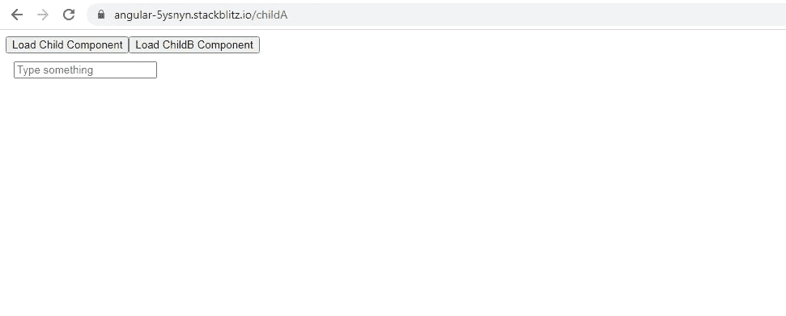
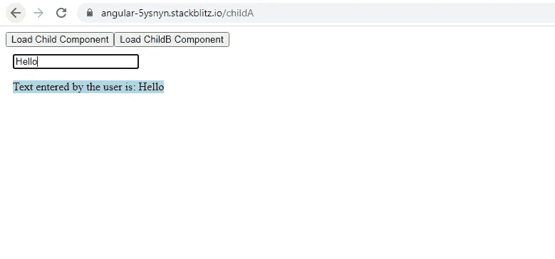
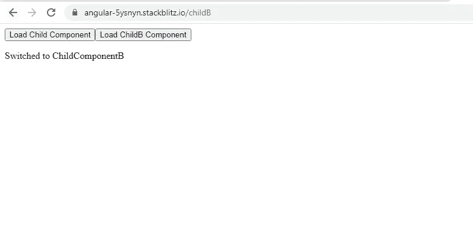
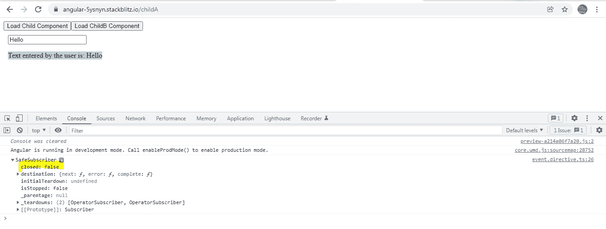
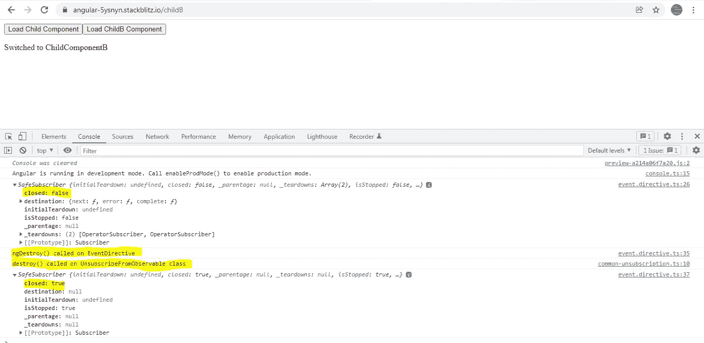

# Angular:在可跨多个组件重用的指令中使用带有@HostListener 的 SwitchMap 运算符

> 原文：<https://medium.com/geekculture/angular-using-switchmap-operator-with-hostlistener-in-a-directive-that-is-reusable-across-multiple-7d014b6f80c6?source=collection_archive---------5----------------------->

我一直认为 switchMap 是 RXJS 在搜索或过滤操作等场景中提供的最有用的扁平化操作符之一，在这些场景中，用户会非常快速地改变要搜索的数据。

在每个场景中，用户的一个 **keyup 事件或一个变化事件**触发搜索或过滤过程。指令对于事件处理来说是最理想的，因为 angular 负责清理过程，我们真的不必担心删除事件侦听器。

这些是我们的目标:

1.  在 AppComponent 中创建两个子组件:**子组件**和**子组件**。正如你在下面的截图中看到的，这两个组件都是通过点击按钮来加载的。

前一个组件将包含一个应用了指令 **EventDirective** 的**文本框**，以演示如何使用 **switchMap 操作符和@HostListener** 进行优化的搜索操作。



ChildComponent

2.我们将显示作为 Http 请求的一部分发送的**最终搜索文本**,或者用于消息中的任何其他操作，如下所示。



Search Text displayed

3. **ChildBComponent** 的目的纯粹是为了演示当我从 ChildAComponent 切换到 ChildBComponent 时，即当 ChildComponent 被销毁时，在 **EventDirective** 中订阅的 **observable** 将如何取消订阅。



ChildComponentB

让我们从**子组件模板开始。**该模板包含一个文本框，其中应用了一个指令**event directive(app event)**和一个< p >标签，该标签显示了 **final** **搜索词**，该搜索词将用于进一步操作或作为 http 请求的一部分发送到服务器。

**子组件类:**

1.  消息属性是包含两个属性的对象:**状态**和**结果**。**结果属性**包含从 **EventDirective** 接收的最终搜索词。根据指令中执行的优化操作的结果，状态属性可以包含字符串“成功”或“危险”。我们很快就会看到这是如何发生的。
2.  **showAlert()** 在 EventDirective 通过 **@Output** 向 ChildComponent 发回最终搜索词时触发。该方法为**消息属性**赋值，以便在模板上显示。在这个方法中，我们可以使用最终的搜索词来进一步操作它，或者将它作为 Http 请求的一部分来发送，以获取搜索结果。

**EventDirective 类:**该指令将包含整个优化逻辑，以便在需要时可以多次重用。

1.  让我们从**ngOnInit()**lifecycle 钩子开始。

**服务**是对**测试服务**的引用，它定义了**主题 sub** 。

```
@Injectable()
export class **TestService** {
constructor() {}
**public sub = new Subject<any>();**
}
```

我们已经在 EventDirective 内订阅了这个 sub**sub**。在实际订阅发生之前，我们执行 3 个操作。让我们看看这里到底发生了什么。

= >当用户按下文本框中的一个键时，触发一个 **keyup** 事件。EventDirective 中的 **@HostListener()** 被配置为监听此类 keyup 事件，并调用 **onKeyUp()** 来处理事件。在这个方法中，我们在 subject **sub** 上调用 **next()** ，将文本框中输入的文本作为参数传递。

= >当调用 **next()** 传递作为参数键入的文本时，外部可观察对象**sub asobservable()**发出作为值的键入文本。

=> **反跳时间操作符延迟外部可观察到的键入文本的发射。**在本例中，它延迟了 3 秒钟。

=> **switchMap** 正在将这个文本映射到一个使用()操作符的**创建的内部可观察对象。()操作符**的**的目的仅仅是创建一个与外部可观察对象发出的文本相对应的内部可观察对象。**

每 3 秒执行一次检查，3 秒后用户输入的文本使用 of()操作符映射到内部可观察对象。用户在这 3 秒钟内输入的任何文本都将被丢弃。

= >开关映射也订阅内部可观察值。怎么会？**当外部可观察体发出用户输入的任何新文本时，开关映射取消订阅当前订阅的不完整内部可观察体。**这确保了先前的搜索文本被丢弃，并且仅使用最近的搜索文本。

= >如果以上步骤没有错误，一切顺利，我们调用**this . return data({ status:' success '，result:result })**else**this . return data({ status:' error '，result: err })**

**结果属性**包含最终搜索文本或错误细节，而**状态属性**将包含“成功”或“错误”。

= >最后我们还有 **takeUntil()** 操作符，它必须是**管道**中的最后一个操作符。该操作符确保外部可观察对象**asobservable()**将一直发出值，直到作为参数传递给 takenUntil()的 **stop$ observable** 发出一个值。这有助于我们在 ChildComponent 被销毁时取消订阅外部可观察对象。我们将很快看到什么是 stop$以及它如何帮助我们退订。

2.在 **returnData()** 中，我们使用 **@Output** 触发一个事件，将作为参数传递给该方法的对象(包含结果和状态属性)发送给 ChildComponent。

3.现在让我们转到“退订可观察”部分。我们已经讨论过 **takeUntil** 操作员如何帮助退订。现在让我们看看什么是**止损$可观察值**。

请注意 EventDirective 类扩展了一个父类**UnsubscribeFromObservable**。我们给这个类分配了创建 stop$ observable 的任务，从 stop$ observable 发出一个值，最后完成 observable。

```
export class EventDirective **extends UnsubscribeFromObservable**{
**constructor(private service: TestService) {
super();
}**
//remaining methods
}
```

当我点击 AppComponent 中的 **Load ChildB Component** 按钮时，EventDirective 中的 **ngOnDestroy()** 被调用。在 ngOnDestroy()中，我们调用父类**的 **destroy()** 。**

```
**ngOnDestroy() {**
console.log(‘ngDestroy() called on EventDirective’);
**super.destroy();**
console.log(this.subs1);
}
```

现在让我们看看在父类的 **destroy()** 方法中发生了什么。我们在 **stop$ observable** 上调用了 **next()** ，以防止 EventDirective 中的外部可观察对象**sub asobservable()**发出任何进一步的值，最后我们也完成了 stop$ observable。

这个父类也是可重用的，可以用于取消订阅应用程序中任何组件的任何可观察对象。

请在销毁 ChildComponent 之前和销毁 ChildComponent 之后，观察 EventDirective 中订阅对象的 **closed 属性，确认该可观察对象已经成功退订。**



Before the ChildComponent is Destroyed



After ChildComponent is destroyed

您可以在这里查看整个工作示例。

[](https://stackblitz.com/edit/angular-5ysnyn?file=src/app/event.directive.ts) [## 角形(叉形)堆叠

### 编辑描述

stackblitz.com](https://stackblitz.com/edit/angular-5ysnyn?file=src/app/event.directive.ts)