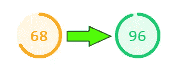
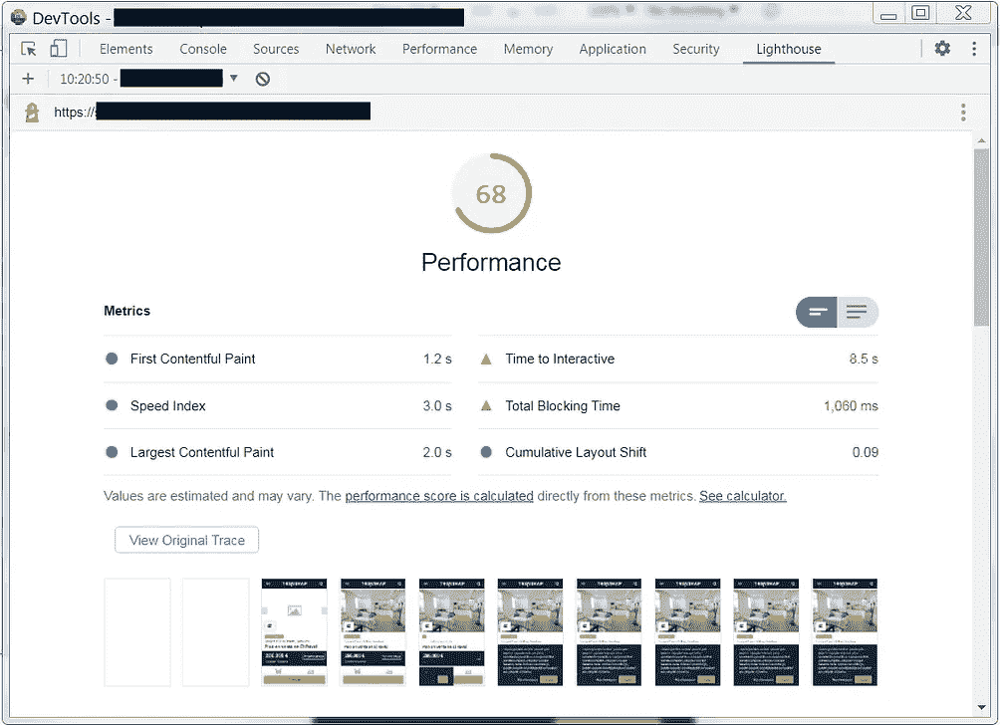
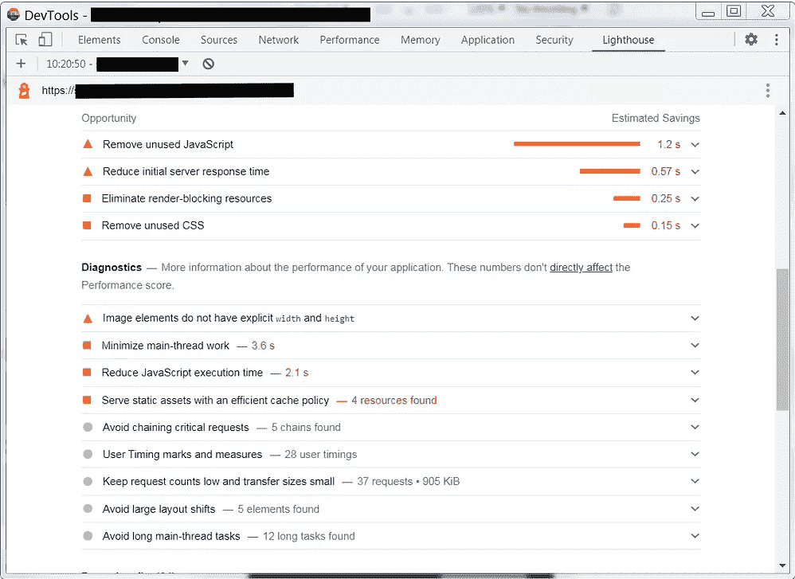
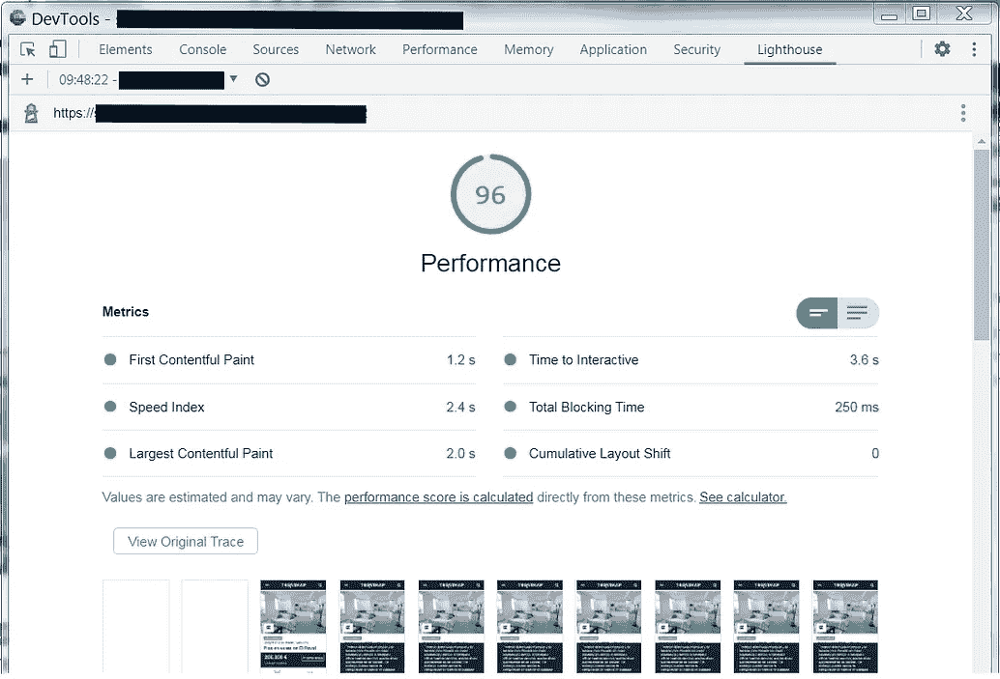
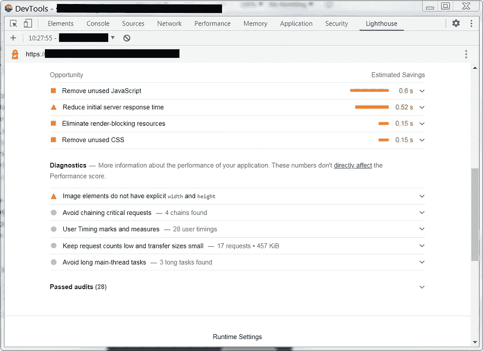

# 角度与灯塔—第 1 部分

> 原文：<https://medium.com/geekculture/angular-vs-lighthouse-part-1-27a9ac6584f?source=collection_archive---------4----------------------->

## 提高分数的技巧和窍门。

这篇文章需要很好的角度知识。

如果尽管应用了常见的优化技术，比如这里描述的[](https://faun.pub/44-quick-tips-to-fine-tune-angular-performance-9f5768f5d945)**或这里描述的[](/swlh/angular-performance-optimization-techniques-5b7ca0808f8b)**，但您的分数仍然很低，那么请阅读本系列文章中描述的技术和技巧。****

********

****在移动(最重要的测试设备)中，我的优化页面从 68 分增加到 96 分，在桌面中从 96 分增加到 100 分。
这使用 Chrome 90 修复了 LCP (Larget Contentful Paint)问题。
另一个优化后的页面，使用了 Chrome 87，在移动测试中从 34 分提高到 83 分。****

********

****使用 Angular 时在 Lighthouse 上获得好成绩并不像一些文章描述的那样简单。
有些文章显示 100 分，但在像“Hello World”页面这样的项目、没有第三方库的项目或简单的页面上很容易达到这个分数……
现实是不同的:在一个项目中有对第三方库、表单、跨页面的共享逻辑、共享样式等的多种依赖是很常见的……
因此，达到一个好分数(可能不是 100 分)的优化过程很长，并且包括几个步骤。****

******注意** :
我们将只关注影响 SEO 排名的页面，所以灯塔评分更重要。
对于其他页面，我们无法应用本指南中介绍的所有优化。****

****我在优化步骤中使用的通用原则(我称之为 **5M** )是:****

*   ****最小主包大小:
    尽可能减小 main.js 文件和其他第一次加载文件的大小是最基本的。css，。json，。svg 文件。上传的数据越少，您获得的积分就越多！
    而且，处理的 javascript 代码越少，增量越大！
    JavaScript 1.5 MB 以下建议加载。****
*   ****最小代码精化:
    代码精化会显著影响分数，所以在代码脚本和 DOM 页面中执行最小代码精化是可取的。****
*   ****最小请求数:
    减少必要的请求数，因为浏览器只能执行有限的并发请求，否则一些请求会等到上一个请求完成后再执行。我们必须避免认为只执行一个非常大的请求，因为最好执行并行请求，例如 load。css，。js，。jpg 文件分开。我们还必须避免串行请求。****
*   ****最少组件:
    对于页面中使用的每个组件，Angular 必须构建并解析一个 DOM 对象，在其上附加监听器等等。因此，加载构建页面的唯一必要组件，就像它是一个静态页面一样。还要避免非常深的组件链。****
*   ****最小样式:
    只加载页面中使用的样式，只将最小样式放入全局 css 文件中。****

****我使用了'**最小**'术语，因为每个项目都是独特的，所以每个项目都有不同的需求和优先级，因此您可以自行决定使用一些优化技术。
你必须努力“最小化”满足页面需求所需的资源，有时你必须努力在分数和易开发性/可维护性之间达成良好的妥协。****

****每个建议都标有可能增加的分数(**低**、**中**、**高**)****

****************

****Before optimizations****

****************

****After optimizations****

## ****高的****

****如果你使用一些分析脚本，那就延迟它。您可以选择在一些用户交互后或 X 秒后(至少 3-4 秒)加载这些脚本。
如果你在 X 秒后选择，你将失去子 X 秒的报告，但可能这并不重要。
我们来看看 Angular 启动后，如何延迟加载 Google Tag Manager (GTM)。
**注意**:在开发模式下，我不喜欢延迟的 GTM。****

```
**main.ts
...
const tag_manager_key = '';
document.addEventListener('DOMContentLoaded', () => {      
       // In production mode
       if (environment.production) {window['dataLayer'] = [];
         /** init gtm after 3500 seconds - this could be adjusted */
         setTimeout(initGTM, 3500);/*       
   document.addEventListener('scroll', initGTMOnEvent);
   document.addEventListener('mousemove', initGTMOnEvent);
   document.addEventListener('touchstart', initGTMOnEvent); function initGTMOnEvent (event) {
           initGTM();
           event.currentTarget.removeEventListener(event.type, initGTMOnEvent); // remove the event listener that got triggered
         }*/function initGTM () {
           if (window['gtmDidInit']) {
             return false;
           }
           window['gtmDidInit'] = true; // flag to ensure script does not get added to DOM more than once.
           const script = document.createElement('script');
           script.type = 'text/javascript';
           script.async = true;
           script.onload = () => { window['dataLayer'].push({ event: 'gtm.js', 'gtm.start': (new Date()).getTime(),
             'gtm.uniqueEventId': 0 }); }; // this part ensures PageViews is always tracked
           script.src = '[https://www.googletagmanager.com/gtm.js?id='](https://www.googletagmanager.com/gtm.js?id=') + tag_manager_key;document.head.appendChild(script);
         }
       }
       // In development mode
       else {         
     const scriptGTM = document.createElement('script');
     scriptGTM.innerHTML = '(function(w,d,s,l,i){w[l]=w[l]||[];w[l].push({\'gtm.start\':\n' +
    'new Date().getTime(),event:\'gtm.js\'});var f=d.getElementsByTagName(s)[0],\n' +
    'j=d.createElement(s),dl=l!=\'dataLayer\'?\'&l=\'+l:\'\';j.async=true;j.src=\n' +
    '\'[https://www.googletagmanager.com/gtm.js?id=\'+i+dl;f.parentNode.insertBefore(j,f);\n'](https://www.googletagmanager.com/gtm.js?id=\'+i+dl;f.parentNode.insertBefore(j,f);\n') +
    '})(window,document,\'script\',\'dataLayer\',\'' + tag_manager_key + '\');';
     document.body.appendChild(scriptGTM);
       }

    platformBrowserDynamic().bootstrapModule(AppModule, {preserveWhitespaces: true})
           .catch(err => console.log(err));
});**
```

## ****高的****

****从 app.module 和 shared.module(典型文件)中删除所有并非绝对必要的模块和组件，例如 modals、autocomplete、uploaders 实用程序等等。
让我们以一个自动完成字段为例:我们将创建一个假的输入字段，当它接收到焦点或点击时，我们将加载自动完成模块和组件。
我们使用 ng-dynamic-component 从 ngx-bootstrap 库中动态注入组件和类型化模块。****

****创建包含自动完成文件的模块:****

```
**auto-complete.module.tsimport {NgModule} from '[@angular/core](http://twitter.com/angular/core)';
import {FormsModule} from '[@angular/forms](http://twitter.com/angular/forms)';
import {TypeaheadModule} from 'ngx-bootstrap/typeahead';
import {PositioningService} from 'ngx-bootstrap/positioning';import {SearchAutoCompleteComponent} from '../search/auto-complete/search-auto-complete.component';
import {SharedModule} from '../shared.module';
import {SearchAutoCompleteService} from '../search/auto-complete/search-auto-complete.service';[@NgModule](http://twitter.com/NgModule)({
  imports: [
    FormsModule,
    SharedModule,
    TypeaheadModule.forRoot()
  ],
  declarations: [
    SearchAutoCompleteComponent
  ],
  exports: [
    SharedModule,
    FormsModule,
    TypeaheadModule,
    SearchAutoCompleteComponent,
  ],
  providers: [PositioningService, SearchAutoCompleteService ]})
export class AutoCompleteModule {
  static components = {
    searchAutoComplete: SearchAutoCompleteComponent
  };
  static services = {
    searchAutoCompleteService: SearchAutoCompleteService
  };
}**
```

****创建一个允许轻松加载和使用已移除模块的服务:****

******注**:看如何映射模块的相关服务，让它们也可以延迟使用。****

```
**load-module.service.ts[@Injectable](http://twitter.com/Injectable)({providedIn: 'root'})
export class LoadModuleService {autoCompleteModuleComponents;constructor(private compiler: Compiler, private injector: Injector) {}loadAutocompleteModule() {
    return import('../../shared/search/auto-complete.module')
      .then(m => m.AutoCompleteModule)
      .then((autoCompleteModule) => {
        this.autoCompleteModuleComponents = (autoCompleteModule).components;
        if (autoCompleteModule instanceof NgModuleFactory) {
          return autoCompleteModule;
        } else {
          return this.compiler.compileModuleAsync(autoCompleteModule);
        }
      })
      .then(factory => {
        const moduleRef = factory.create(this.injector); const searchAutoCompleteService: any =  moduleRef.injector.get((<any>factory.moduleType).services.searchAuto CompleteService); return {
          module: factory,
          injector : moduleRef.injector,
          services: {searchAutoCompleteService},
          components: this.autoCompleteModuleComponents};
      });
  }
}**
```

****放置(伪)输入字段的组件:****

```
**app.component.ts
...
showFakeInput = true;
searchAutoComplete: Type<SearchAutoCompleteComponent>;
moduleFactory;
loadingAutoCompleteModule = false;
SACinputs;
SACoutputs;
SAS;
SACinjector;constructor(private loadModuleService: LoadModuleService) { }...
loadAutocompleteModule() {
    if (this.loadingAutoCompleteModule)
      return;
    this.loadingAutoCompleteModule = true;
    this.SACinputs = {
      ...
    };
    this.SACoutputs = {
      searched: result => {
        ...
      },
    };
    this.loadModuleService.loadAutocompleteModule()
       .then(autoCompleteModule => {
          this.searchAutoComplete = autoCompleteModule.components.searchAutoComplete;
          this.moduleFactory = autoCompleteModule.module;
          this.SAS = autoCompleteModule.services.searchAutoCompleteService;
          this.SACinjector = autoCompleteModule.injector;
          this.showFakeInput = false;
          this.changeDetRef.markForCheck();
    });
  }**
```

****相对模板文件:****

```
**app.component.html
...
<div *ngIf="showFakeInput">
  <div class="form-group">
 <input type="text" name="asyncSelected"  [placeholder]="type here..."
     autocomplete="off"
     disableautocomplete
     (click)="loadAutocompleteModule()" (focus)="loadAutocompleteModule()" [value]="">
  </div>
</div>
<ng-template [ngComponentOutlet]="searchAutoComplete"
    [ndcDynamicInputs]="SACinputs"
    [ndcDynamicOutputs]="SACoutputs"
    [ngComponentOutletInjector]="SACinjector">
</ng-template>**
```

****使用这种技术，我们只加载 ng-dynamic-component 库和少量代码，节省了大量的 kb 并增加了许多 Lighthouse 分数。
尽可能多地应用这种技术**，例如对于折叠下面的元素、用户菜单、模态、地图、图表等等。
尽量把上面的折叠部分做成静态页面或者至少做很少的处理。******

## ******低的******

******如果您的域中有映像服务器，请使用“预连接”将其添加到 index.html:******

```
****<link href=’[https://image.my-site.com'](https://image.my-site.com') rel=’preconnect’ crossorigin>****
```

******如果你加载外部字体，做同样的事情，用 rel='preload '加载它:******

```
****<link rel="dns-prefetch" href="[https://fonts.googleapis.com](https://fonts.googleapis.com)"><link rel="preload" as="style" onload="this.onload=null; this.rel='stylesheet';" href="[https://fonts.googleapis.com/css?family=Source+Sans+Pro:400&display=swap](https://fonts.googleapis.com/css?family=Source+Sans+Pro:400&display=swap)">****
```

## ******低的******

******使用一个性能更好的函数来克隆对象，而不是 lodash 的 cloneDeep(前提是你不需要复制函数)。******

```
****export function deepCopy(o) {
  let newobject = {};
  if (o !== undefined && o !== null && o.constructor)
    newobject = new o.constructor();
  return typeof o === 'object' && o !== null ?
    (Array.isArray(o) ?             
        o.map(e => deepCopy(e)) : 
        Object.keys(o).reduce(
          (r, k) => (r[k] = deepCopy(o[k]), r), newobject 
        )
    ) :
    o;
}****
```

******下周我将发布第二部分，那里会有更多有趣的提示和技巧。敬请关注并留下评论！******

********更新** : Part 2 这里是[](https://francesco-cantarella.medium.com/angular-vs-lighthouse-part-2-1ae627ca9aab)**！********