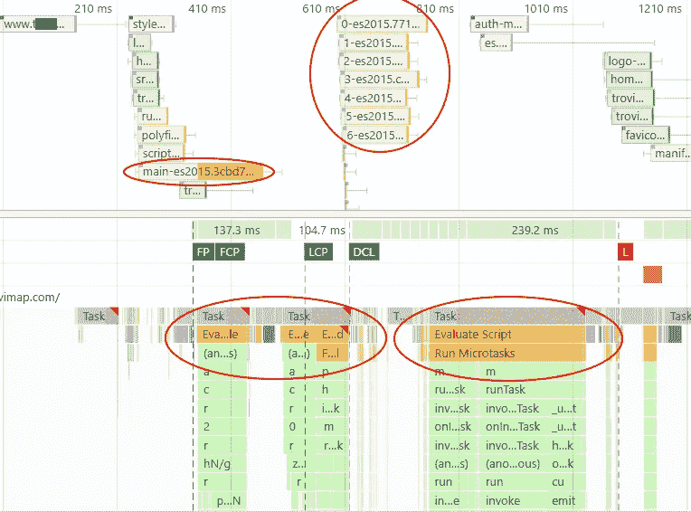

# 角度与灯塔—第二部分

> 原文：<https://medium.com/geekculture/angular-vs-lighthouse-part-2-1ae627ca9aab?source=collection_archive---------15----------------------->

## 提高分数的技巧和窍门。

这是一些有用的技巧和诀窍的第二部分，可以提高 Lighthouse 的分数，从而减少首页的加载时间。你可以在这里找到第一部分[](https://francesco-cantarella.medium.com/angular-vs-lighthouse-part-1-27a9ac6584f)**。**

****

## ****高****

**为了取得好成绩，我们必须尽可能地减少代码细化，比如繁重的任务或繁重的 DOM 操作。**

**例如:如果我们有一个带有货币符号的价格列表，我们可以轻松地编写以下代码:**

```
**app.component.ts** ...list = [{name: 'item 1', price: '50 &euro;'}, {name: 'item 2', price: '70 &euro;'}];app.component.html
...
<div *ngFor="let item of list">
 <div>Price <span [innerHTML]="item.price"></span></div>
</div>
```

**如果我们有一个 50 个项目的列表，我们甚至会损失 4-5 个点！
因此优化后的代码可以是:**

```
**app.component.ts**
...list = [{name: 'item 1', price: '50 **€**'}, {name: 'item 2', price: '70 **€**'}];app.component.html
...
<div *ngFor="let item of list">
 <div>{{item.name}} - price <span **[textContent]**="item.price"></span></div>
</div>
```

**当我们使用**【innerHTML】**Angular 必须解析一个模板并应用一个 DOM 杀毒器。当我们使用**【text content】**Angular 时只插入一个文本，所以尽量避免使用‘innerHTML’。**

## ****低****

**另一个例子:我们有一个列表，我们想为每个条目包含一个相对的 JSON-ld 脚本。**

**如果我们使用 SSR，那么我们可以避免计算 2 倍的 JSON-ld。只需使用[**TransferState**](https://angular.io/api/platform-browser/TransferState)。**

```
**app.component.ts**
const LIST_JSONLD = makeStateKey('LIST_JSONLD');...
constructor(private seoService: SeoService, private state: TransferState) {}ngOnInit() {
 if (this.isSSR) { // Calculate json-ld only in server side
  // Long list
  const list = [{field1: '...'}...];
  this.listJsonLd = this.seoService.getListJsonLd(list);
  this.state.set(LIST_JSONLD, this.listJsonLd as any);
 } else {
  this.listJsonLd = this.state.get(LIST_JSONLD, null as any);
  this.state.remove(LIST_JSONLD);
 }
}**seo.service.ts**
...
getListJsonLd(array) {
    if (array) {
      const jsonldArray = [];
      forEach(array, (value) => {
        if (value && value.fields) {
          const jsonld = this.getItemJsonLd(value);
          if (jsonld)
            jsonldArray.push(jsonld);
        }
      });
      return jsonldArray;
    }
  }getItemJsonLd(value) {  
...
// Long calculations
} **app.component.html**
...
<app-json-ld [json]="listJsonLd"></app-json-ld>
```

## ****高****

**通常情况下，角度应用程序会根据使用“loadChildren”参数的路线拆分成单独的文件。
然后会先加载 main.js 文件，然后 Angular 会启动，然后路由器模块会加载相关的路由文件。**

****

**Using loadChildren route with module not included into the main bundle**

**使用这种方法，浏览器会执行一系列调用，使我们损失 4-5 个点。**

**这可以通过将路由模块包含到 app.module 中来避免，因此在编译时，main.js 将包含路由模块文件。**

****

**Using loadChildren route with the module included into the main bundle**

**但是这只能为一个路由模块完成，否则主模块会增长过多。怎样才能做到不止一条路线？**

**诀窍是为每条需要的路线编译不同的应用程序。**

**这将大大增加编译时间，但这是进行这种优化的唯一选择。**

**创建将用于非优化路线的环境文件:**

```
**environment_optimized.ts**export const environment_optimized = {
  preloadedModule: false,
  moduleName: undefined
};
```

**为每个优化路线创建一个环境文件:**

```
**env_my_module.ts**import {MyModule} from '../app/my.module';export const environment_optimized = {
  preloadedModule: [MyModule],
  moduleName: 'MyModule'
};
```

**将其添加到应用程序模块导入:**

```
**app.module.ts**const imports: any = [
 BrowserModule.withServerTransition({ appId: 'my-app' }),
 HttpClientModule
 ...
 ];

if (environment_optimized.preloadedModule)
  imports.push(environment_optimized.preloadedModule);
```

**将“moduleName”属性添加到路由中，这在以后会很有用:**

```
**app-routing.module.ts**const routes = [
 {  path: 'my-route1',
  loadChildren: import('./my.module').then(m => m.MyModule),,
  data: {moduleName: 'MyModule'}
 }
 ...
];
```

**添加将替换 environment_optimized.ts 文件的新配置:**

```
**angular.json**...
  "configurations": {
            "production": {
              ...
            },
            "mymodule": {
              "outputPath": "dist/mymodule",
              "index": {
                "input": "src/index.html",
                "output": "index_mymodule.html"
              },
              "optimization": true,
              "outputHashing": "all",
              "sourceMap": false,
              "extractCss": true,
              "namedChunks": false,
              "aot": true,
              "extractLicenses": true,
              "vendorChunk": false,
              "buildOptimizer": true,
              "fileReplacements": [
                {
                  "replace": "src/environments/environment.ts",
                  "with": "src/environments/environment.prod.ts"
                },                {
                  "replace": "src/environments/environment_optimized.ts",
                  "with": "src/environments/env_my_module.ts"
                }
              ],
              "serviceWorker": true
            }
          }
...
```

**创建一个文件，其中保存要加载的相对于路线的索引文件:**

```
**optimized_routes_config.js**
/**
 *
 * routeRegex: regular expression for run specific optimized index
 * indexFileName: name of the specific index generated
 * folder: folder where retrieve relative optimized files
 */module.exports = {
  config: [
    {
      routeRegex: [/^\/my-route1\//],
      indexFileName: 'index_mymodule.html',
      folder: 'mymodule'
    }
  ]
};
```

**修改 server.ts 文件以加载所请求的优化路由的正确索引或默认索引:**

```
**server.ts**import * as ORConfig from './optimized_routes_config';
...
const foundORIndex = [];app.get('*', (req, res) => {
  let indexFileName = 'index';

  for (let i = 0; i < ORConfig.config.length; i++) {
    for (let j = 0; j < ORConfig.config[i].routeRegex.length; j++) {
      const pattern_index = new RegExp(ORConfig.config[i].routeRegex[j]);
      if (pattern_index.test(req.url)) {
        if (!foundORIndex[ORConfig.config[i].indexFileName])
          foundORIndex[ORConfig.config[i].indexFileName] = fs.existsSync(ORConfig.config[i].indexFileName);
        if (foundORIndex[ORConfig.config[i].indexFileName])
          indexFileName = ORConfig.config[i].indexFileName;
        break;
      }
    }
  }res.render(indexFileName, {
    req, res},
    function (err, html) {
      res.send(html);
    }
  );
});
```

**为了便于部署，创建一个文件，该文件将复制所有优化的路线。js 文件放到默认的 dist 目录中。只有。必须复制 js 文件和 index_xxxx.html，因为 ngsw.json(由 angular service worker ngsw 创建的文件)必须是默认编译的文件。**

```
**deploy_optimized_routes.js**const ORConfig = require('./optimized_routes_config');const fs = require('fs-extra');const path = require('path');for (let i = 0; i < ORConfig.config.length; i++) {
  let dirPath = path.resolve('dist/' + ORConfig.config[i].folder); // path to your directory goes here
  let filesList;
  fs.readdir(dirPath, function(err, files){
    filesList = files.filter(function(e){
      return path.extname(e).toLowerCase() === '.js'
    });
    // console.log(filesList);
    filesList.forEach(file => {
      fs.copyFileSync(dirPath+ '/'+ file, 'dist/' + file, err => {
        if (err)
          console.log('error copying file', file, err);
      });
    });
    fs.copyFileSync(dirPath + '/' + ORConfig.config[i].indexFileName, 'dist/' + ORConfig.config[i].indexFileName, err => {
      if (err)
        console.log('error copying file', file, err);
    });
    fs.removeSync(dirPath);
  });
}
```

**下周我将发布第 3 部分，那里会有更多有趣的提示和技巧。敬请关注并留下评论！**

****更新** : Part 3 这里是[](https://francesco-cantarella.medium.com/angular-vs-lighthouse-part-3-848761a629f0)**！****