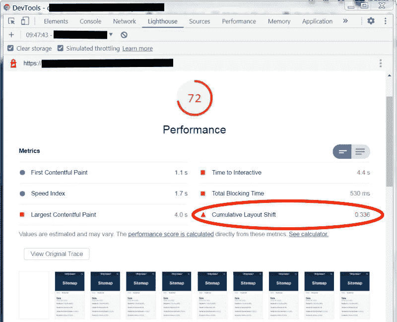
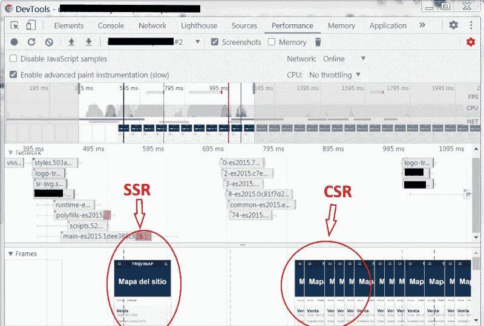
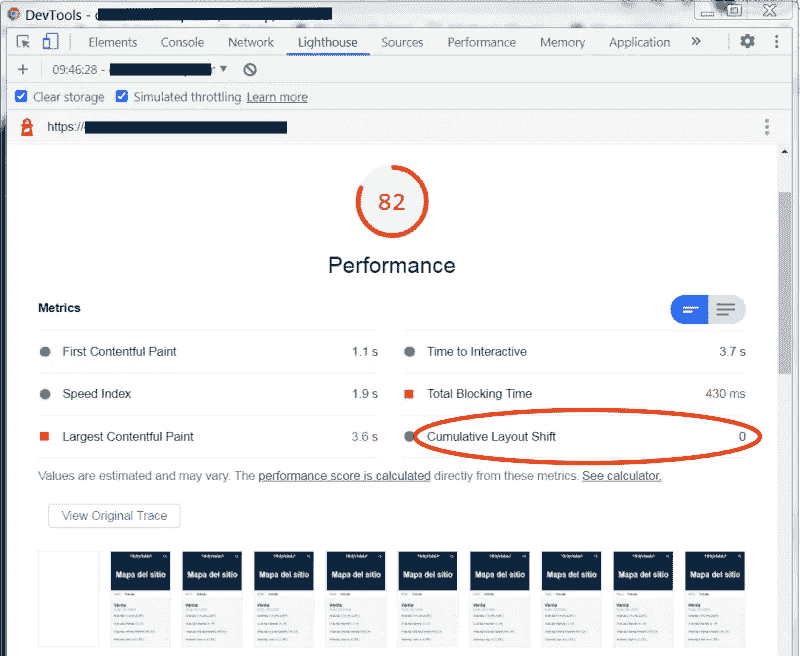

# 角度与灯塔—第三部分

> 原文：<https://medium.com/geekculture/angular-vs-lighthouse-part-3-848761a629f0?source=collection_archive---------16----------------------->

提高分数的技巧和窍门。

这是一些有用的技巧和诀窍的第 3 部分，以增加灯塔得分，从而减少首页加载时间。你可以在这里 找到 Part 1 [**，在这里**](/geekculture/angular-vs-lighthouse-part-1-27a9ac6584f) 找到 Part 2 [**。**](/geekculture/angular-vs-lighthouse-part-2-1ae627ca9aab)


## 高的

如果您的项目需要下载一个外部文件翻译(比如使用 [@ngx](http://twitter.com/ngx) -translate 和[@ ngx](http://twitter.com/ngx)-translate/HTTP-loader 和一个. json 翻译文件)，然后将这个文件包含到 main.js 包中。

如果没有这种技术，Angular 启动后，当翻译文件下载完成时，浏览器会重新绘制整个页面。因此，您将有一个双页重新绘制/重新布局，这可能会导致累积布局转移(CLS)了。


Download translation file after Angular was started. Between SSR (server side rendering) and CSR (client side rendering) there are no translations provided so for each key there is a “**…**” instead



Relative Lighthouse penalty in score and CLS

要将翻译文件包含到 main.js 包中，请遵循以下步骤:
**1)** 为了方便起见，在 environments 文件夹下创建一个环境文件:

```
**env_lang.ts**export const env_lang = {
  defaultLanguage: 'en',
  inlineTranslations: require('../assets/i18n/en.json')
};
```

**2)** 创建一个实现 TranslateLoader 的服务:

```
**language-loader.ts**const translations = env_lang.inlineTranslations;[@Injectable](http://twitter.com/Injectable)({providedIn: 'root'})
export class LanguageLoader implements TranslateLoader {
  constructor(private http: HttpClient) {}getTranslation(lang: string) {
    if (translations && lang === env_lang.defaultLanguage) {
      return of(translations);
    } else {
      return this.http.get(`./assets/i18n/${lang}.json`);
    }
  }
}
```

**3)** 在 TranslateModule 配置中提供 LanguageLoader 服务(在 app 模块导入中):

```
**app.module.ts**imports: [
...
 TranslateModule.forRoot({
  loader: {
    provide: TranslateLoader,
    useExisting: **LanguageLoader**,
    deps: [PLATFORM_ID, HttpClient]
  }
   })
...
]
```



Translation file included into main causes no difference between SSR and CSR



No CLS! No wait for download another file! +10 points!

如果您的翻译文件太大，请尝试只包含优化页面所需的子集，并延迟下载整个文件。
这不是一个简单的任务，但提高分数非常重要。如果有人对如何实现它感兴趣，请留下评论，我会准备一篇专门的文章。

**注意:**一般来说，当加载一个< div >(或类似的)的内容时会发生 CLS，它会改变 div 本身的高度或宽度，所以尽量设置一个固定的大小。当字体改变 div 的大小时，也会发生 CLS。

## 低/中

通常我们为一个主题组织和分组代码，这是一个很好的实践。但是，如果我们希望更好地执行的页面只使用了一部分，那么我们必须分成两个不同的组:一个只用于最少的必要部分，另一个用于其余部分。
如果另一页只使用第一组的一部分，理想的做法是另一次拆分。这个过程可以无限期地进行，但是你可以决定重复几次，因为你会在开发阶段失去一些轻松。这个问题通常出现在服务中，我们在服务中放了很多关于问题域的方法。

## 低的

下面你会发现几个小技巧。

*   移除旧的浏览器支持:

```
**.browserslistsrc**> 0.5%
last 2 versions
Firefox ESR
not dead
**IE 11 // Or remove totally IE support**
```

*   尝试删除 HTML 中的空格:

```
**tsconfig.app.json**{
  ...
  "angularCompilerOptions": {
    **"preserveWhitespaces": false**
  }
  ...
}
```

*   rxjs 类的错误导入:

```
**Bad**
import {Subscription} from 'rxjs/index';**Good**
import {Subscription} from 'rxjs';
```

*   如果您有一个大查找表，则将每个键拆分成一个单独的“导出常量”，并在为每个键生成一个文件后:

```
**lookup_data.ts**export const features = {
  'feature1' : 1,
  'feature2' : 2,
  ...
};
export const status = {
  'new' : 0,
  'active' : 1,
  'closed' : 3,
  ...
};
...
```

为轻松生成文件创建脚本:

```
**generate_keys_file.ts**const fs = require('fs-extra');
import * as datas from './src/app/shared/lookup_data';Object.keys(datas).map(value => {
  fs.writeFileSync('./src/app/shared/' + value + '.ts' ,
    'export const ' + value + ' = ' + JSON.stringify(datas[value]) + ';', {encoding: 'utf-8'});
});
```

运行这个脚本后，您将拥有 **features.ts** 、 **status.ts** (etc)文件，这样您就可以只导入您需要的文件。

*   如果您使用 moment js，您可能不需要他的语言环境，因此不需要他们创建 webpack 配置文件:

```
**extra-webpack.config.ts**const webpack = require('webpack');
module.exports = {
  plugins: [
    new webpack.IgnorePlugin(/^\.\/locale$/, /moment$/),
  ]
};
```

修改 angular.json 文件:

```
**angular.json**{
 ...
  "projects": {
    "myproject": {
      ...
      "architect": {
        "build": {
          "builder": "[@angular](http://twitter.com/angular)-builders/custom-webpack:browser",
          "options": {
            "customWebpackConfig": {
              "path": "./extra-webpack.config.js",
              "mergeStrategies": {
                "loaders": "replace"
              },
              "replaceDuplicatePlugins": true
            }
         }
   ...
}
```

Lighthouse 一直在不断发展，随着时间的推移，它已经改变了指标和相对分数，因此页面优化过程永远不会结束。
我希望这些建议对我有所帮助，我邀请你留下评论和/或澄清。