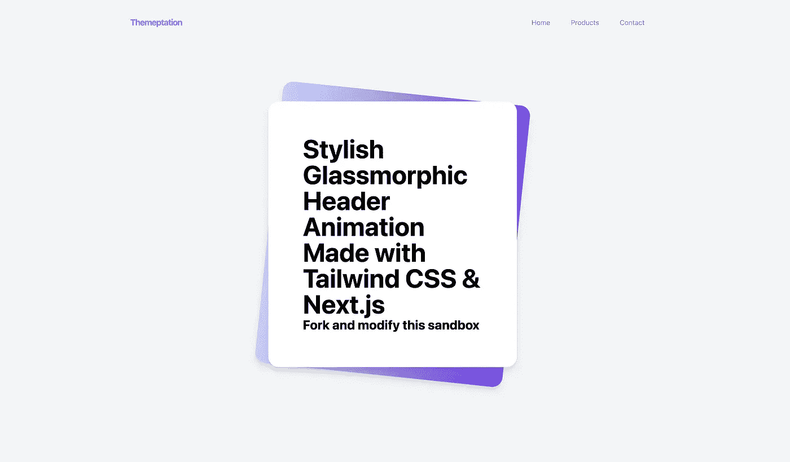

# 使用下一步动画滚动一个玻璃形状的标题。JS 12 和顺风 CSS

> 原文：<https://medium.com/geekculture/animate-a-glassmorphic-header-on-scroll-using-next-js-12-and-tailwind-css-6fe8bd2c3a7?source=collection_archive---------4----------------------->

在本教程中，我将向您展示如何做到这一点。让我们直接开始吧。

# 演示