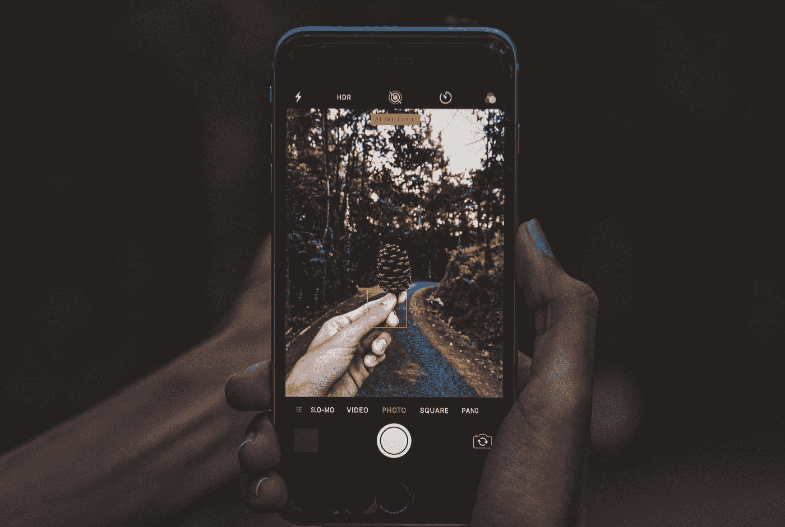

# 滚动时动画显示图像大小

> 原文：<https://medium.com/geekculture/animating-image-size-while-scrolling-f1328f18b97d?source=collection_archive---------11----------------------->

Photo by [Jatniel Tunon](https://unsplash.com/@tosshio?utm_source=medium&utm_medium=referral) on [Unsplash](https://unsplash.com?utm_source=medium&utm_medium=referral)

动画是你构建的任何应用程序的重要组成部分，因为它帮助用户在应用程序中顺利导航。

动画在 android 中一直是一个复杂的话题，但有了 jetpack compose，它变得更加简单和直观。

> 正如他们所说，Jetpack Compose 将动画的标准从“波兰，如果我们有时间”提高到“如此简单，没有理由不做”。

## 我们今天将要制作的动画预览。

1.  **包含依赖关系**

添加线圈图像库 Gradle 依赖项，以在您的应用程序中显示图像。

确保添加最新的线圈库版本(在我的例子中是 1.3.2)。你可以在这里查看最新版本[。](https://coil-kt.github.io/coil/compose/)

2.**添加权限**

添加 internet 权限以从 Internet 获取图像。(您也可以使用您的 drawable 中的图像，您不必为其添加此权限。)

3.**创建一个数据类**

为可滚动列的各个项目的数据创建一个数据类。

函数绘制可滚动列表的单个列表项。

4.**制作图像动画**

这里，我们必须根据用户是向上、向下还是根本不滚动列表来改变图像的大小和角半径。

为此，我们必须在用户开始滚动列表时访问一个回调。

**LazyListState** :是一个状态对象，可以被吊起控制和观察滚动。

LazyListState 为我们提供了关于用户是否滚动了列表的信息，这是第一个可见的项目，等等。

在大多数情况下，这将通过`[rememberLazyListState](https://developer.android.com/reference/kotlin/androidx/compose/foundation/lazy/package-summary#rememberLazyListState(kotlin.Int,kotlin.Int))`创建。

这里，当用户向上滚动(即第一项不可见)时，我们将动画显示图像，当用户向下滚动(即第一项可见)时，我们将动画显示回原始图像。

我们可以基于我们想要的动画的逻辑创建一个转换对象(这里即 liststate . firstvisibleitemindex！= 0)并且可以调用 animate 对象来改变我们的图像修改器的参数。

每当用户的值滚动列表时(即 listState 的值发生变化)，我们的图像就会产生动画效果。

*   我们可以使用`rememberImagePainter`函数创建一个`ImagePainter`，它可以由`Image`可组合组件绘制:
*   `ImagePainter`管理异步图像请求，并处理占位符/成功/错误的绘制。
*   阅读更多关于 [**ContentScale**](https://developer.android.com/reference/kotlin/androidx/compose/ui/layout/ContentScale) 的内容。
*   将 listState 传递给 LazyColumn 的 State 参数可以确保对列状态的任何更新都会更新 listState 变量 state。

这是该项目的完整代码。

 [## GitHub-pundirAbhishek/imagesize animation-Compose

### 在 GitHub 上创建一个帐户，为 pundirAbhishek/ImageSizeAnimation-Compose 开发做贡献。

github.com](https://github.com/pundirAbhishek/ImageSizeAnimation-Compose) 

下次我们将看看 jetpack compose 中的一些其他主题。

**直到快乐作曲！**