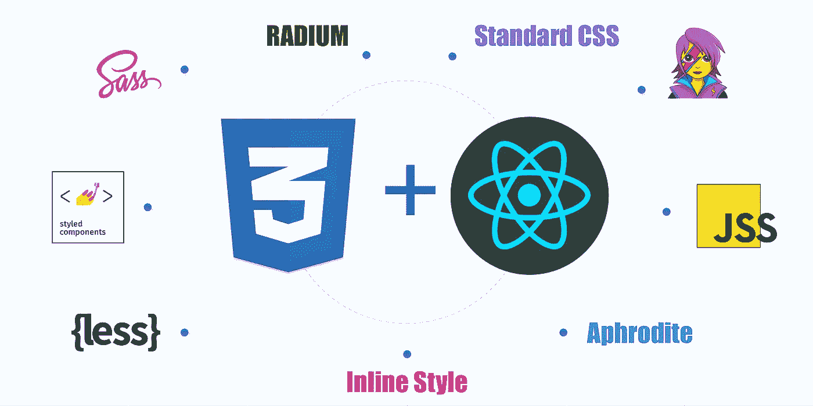
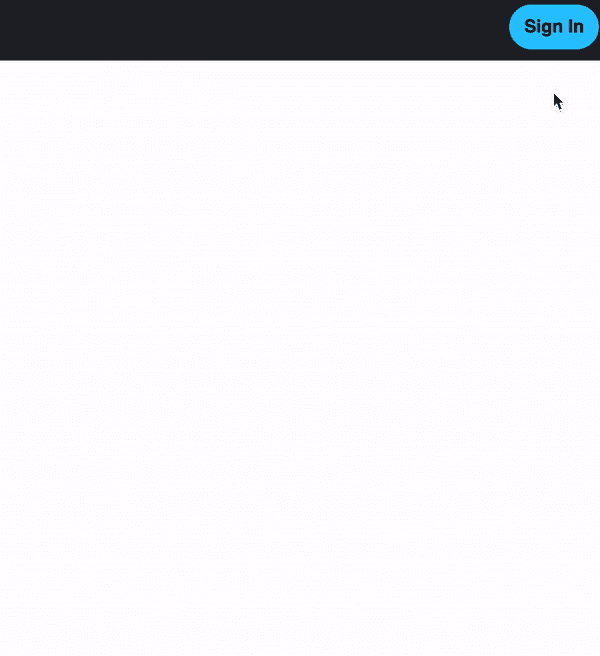
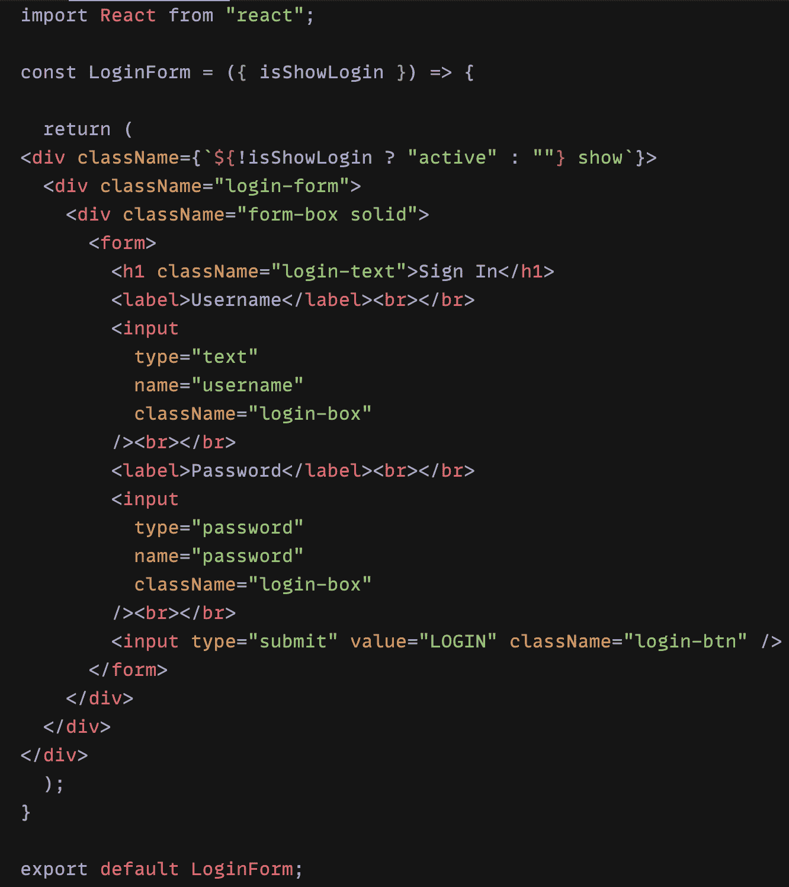
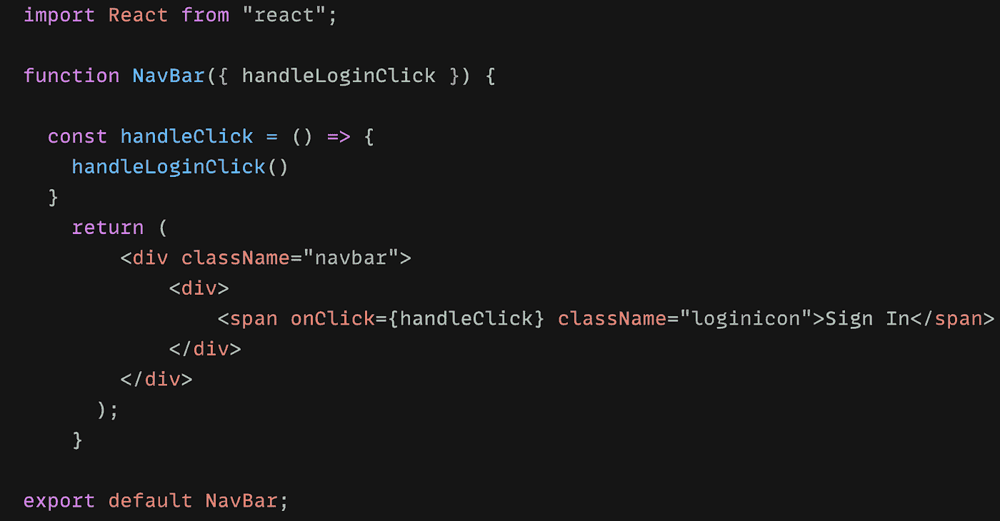
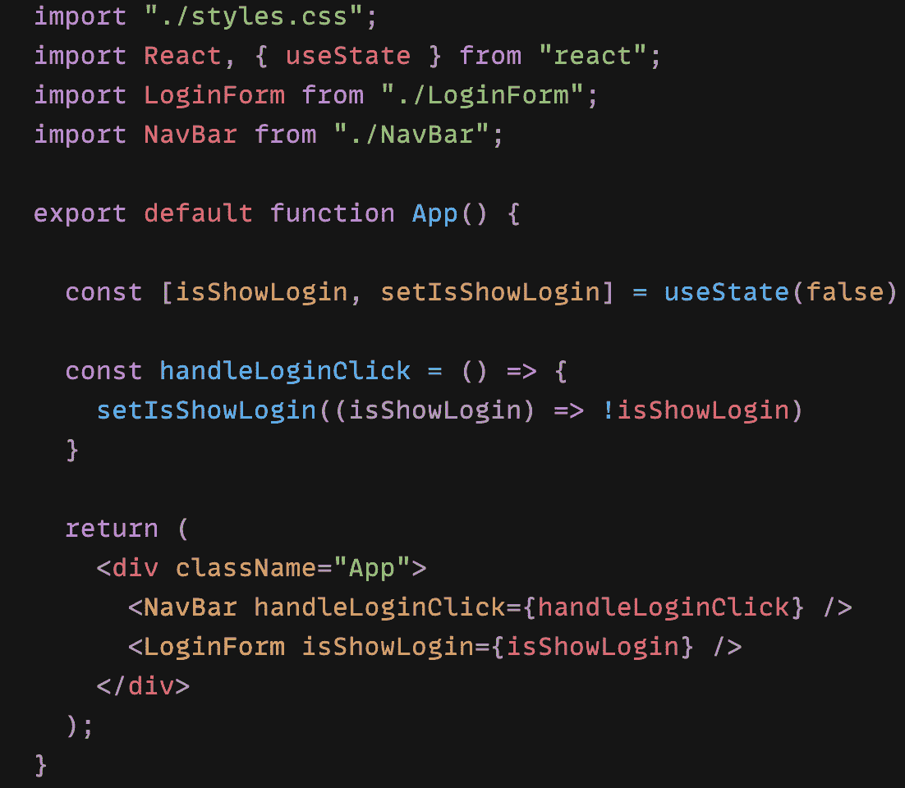
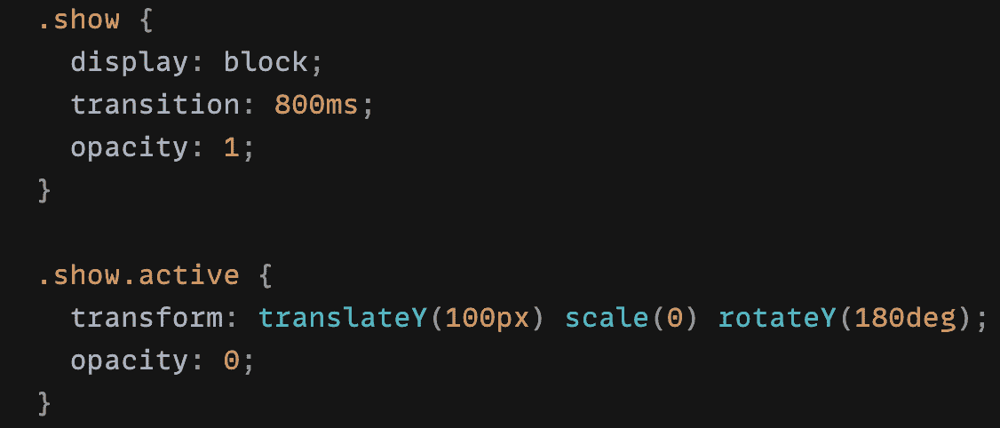

# 利用 React 状态钩子和 CSS 实现动画登录弹出窗体

> 原文：<https://medium.com/geekculture/animation-login-popup-form-by-using-react-state-hook-and-css-7ecf803f1fa9?source=collection_archive---------0----------------------->

你喜欢在你的应用程序中有很酷的动画弹出窗口吗？如果你有，那你就来对地方了。最近，我玩 **React 状态钩子**和 **CSS** 玩得很开心。我发现**反应状态**可以用 **CSS** 做这么多很酷的事情。将动画实现到应用程序中可以极大地改善客户体验，并使您的应用程序感觉更加专业。在这篇文章中，我将向你展示如何使用**状态钩子**和 **CSS** 制作一个动画登录弹出窗口。

**如何开始:**

在我们开始之前，您应该已经知道 React 中的状态是什么，以及 React 组件是如何工作的。首先，我们必须创建我们需要的所有组件。我们将在 react app **src** 文件夹中创建简单的 **NavBar** 和 **LoginForm** 组件。并且我们将**导航栏**和 **LoginForm** 组件导入到 **App** 组件中。

**LoginForm 组件代码:**

**导航条组件代码:**

**App 组件代码:**

**我们来看看 styles.css 文件:**

上面所有的图像，都是设置好的。我将一步一步地解释它们。在我们设置好所有组件之后。我们知道 **App** 是父组件。**导航栏**和 **LoginForm** 是子组件。我们将 **NavBar** 和 **LoginForm** 导入到 **App** 中，因为我们希望它们显示在网站页面中( **App** 组件在 **index** 组件的内部)。

现在，我们要从 React **导入 React 的 **useState Hook，从“React”导入{ useState }；**为了使用**状态挂钩。**让我们为我们的弹出表单声明一个**状态**变量，我们称之为 **isShowLogin** 。我们的变量叫做 **isShowLogin** ，但是我们也可以叫它别的名字，比如 **isShow** 或者 **apple** 。我建议将变量命名为对您有意义的名称。当你回头看这个变量时，你会立刻知道这个**状态**是干什么用的。我们称这个变量为 isShowLogin，所以我们知道它是用于我们的弹出登录表单的。当应用程序变得非常大时，我们希望确保我们知道所有东西的用途。**

接下来我们要做一个名为 **handleLoginClick 的箭头函数。**这个函数是让我们使用 **setIsShowLogin** 来更新我们的状态。然后我们将把 **handleLoginClick** 函数传递给 **NavBar** ，因为我们的登录按钮位于 **NavBar** 组件内部。

我们必须调用**导航栏**组件中的 **handleLoginClick** 函数，我们必须在**导航栏**中制作一个 **handleClick** 函数。所以我们可以在登录按钮中做 **onClick={handleClick}** 。这时，我们有了我们的**导航条**登录按钮设置。现在，让我们将 **isShowLogin** 从 **app** 组件传递到 **LoginForm** 组件。

在 **LoginForm** 组件中，我们看到我们的 isShowLogin 位于**div****class name(class name = { ` $ {！isShowLogin？" active" : ""} show`})。**我们没有做任何类似于 **null** 的事情来隐藏登录表单，因为我们想使用 **CSS** 来隐藏表单。

这是基本的 CSS 设置:

**。显示{**

**-过渡属性为 800ms :** 动画的持续时间 800 毫秒=0.8 秒。我们可以把它设置成我们想要的任何速度，但我们不希望它移动得忽慢忽快。800 毫秒很好。

**-不透明度为 1** **:** 显示登录表单时不透明

**}**

**.show.active {**

**-transform:translate Y(100px)**:将对象移动到 Y 轴， **scale(0)** :将当前对象缩小到 0 =消失， **rotateY(180deg)** :将形状旋转 180 度

**-不透明度为 0** **:** 开始透明

**}**

正如我们可以看到的，我们的表单在开始时没有显示出来，因为我们在 **useState(false)中将它设置为 **false** 。**如果我们删除 **CSS** 中的 **.show.active** ，登录表单将不再隐藏。希望你们都喜欢阅读这个 React State Hook 和 CSS 动画博客。

请自己试一下。我在下面附上了 **CodeSandbox** 的链接。你可以测试外面的一切。请让我知道是否还有什么困惑或者我错过了什么。非常感谢你阅读我的博客。