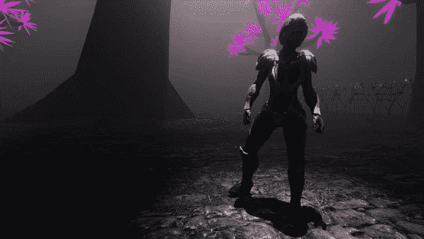

# 动画覆盖和头像遮罩

> 原文：<https://medium.com/geekculture/animation-overrides-and-avatar-masks-92309d5cb851?source=collection_archive---------12----------------------->

现在我们已经有了一些将角色动画放在一起的一般知识，让我们看看我们可以用*动画覆盖*和*化身遮罩*做些什么。

**超驰轨道**

我有一个动画中的角色。点击*三点图标*显示一些选项。选择*添加覆盖轨道。*