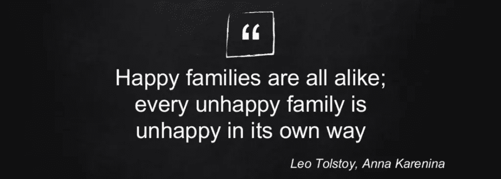

# 数据科学中的安娜·卡列尼娜原理

> 原文：<https://medium.com/geekculture/anna-karenina-principle-in-data-science-15f41ddce495?source=collection_archive---------24----------------------->

## 一个失败的机器学习项目是一个“不幸的家庭”

安娜·卡列尼娜的小说以引用的话开头:

> ***所有幸福的家庭都是相似的；每个不幸的家庭各有各的不幸。*** *列夫·托尔斯泰*