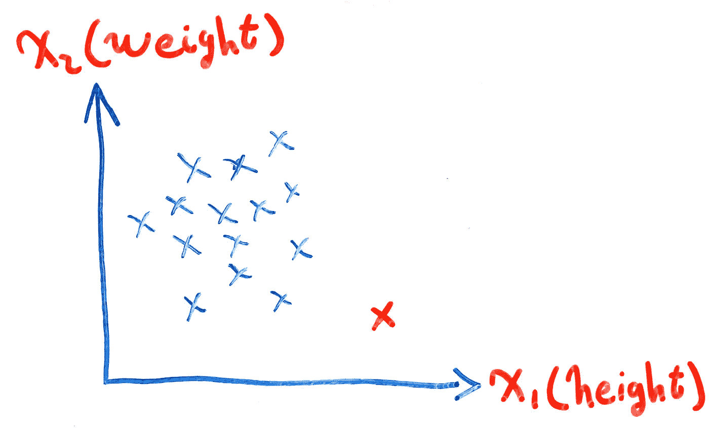
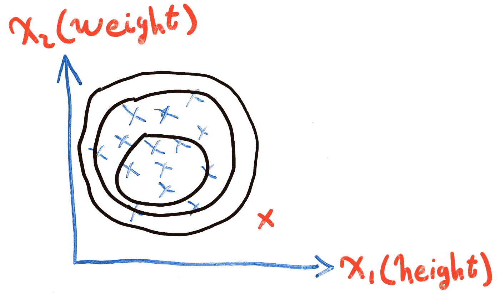
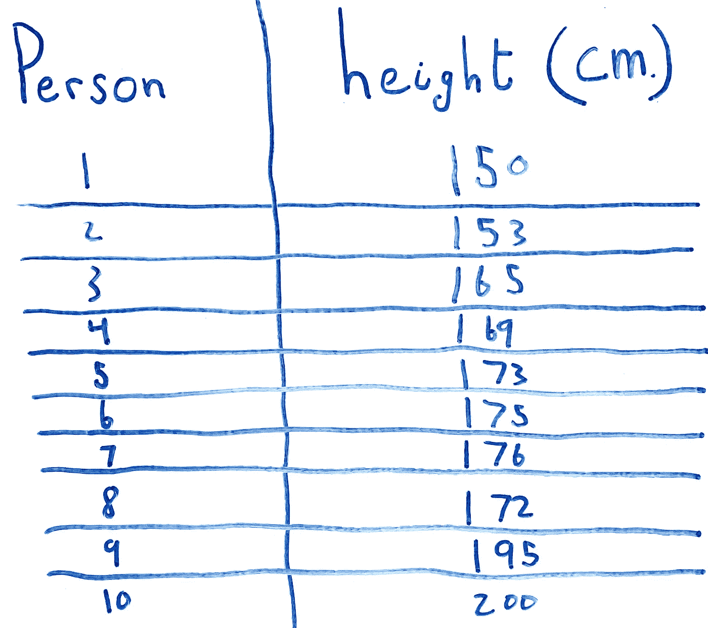
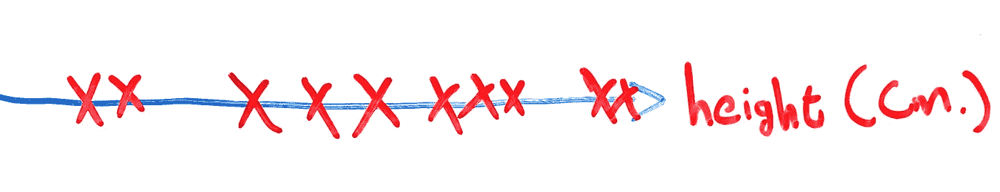
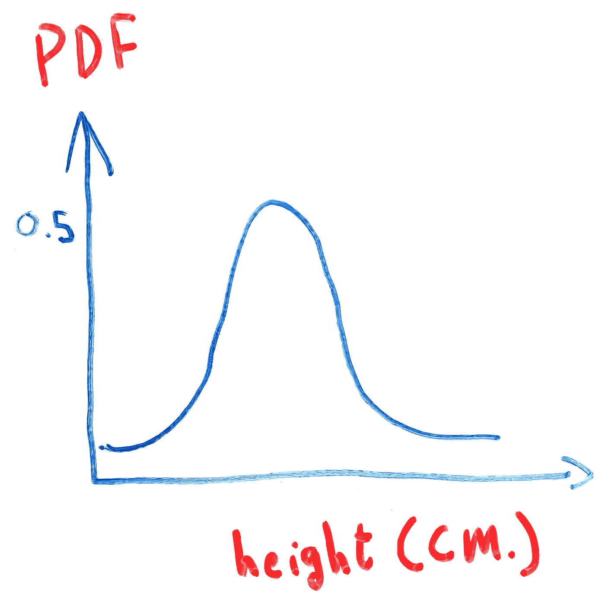
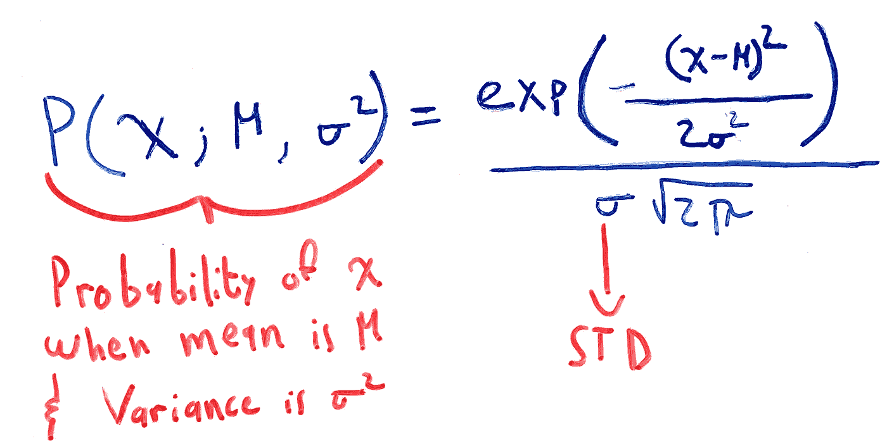
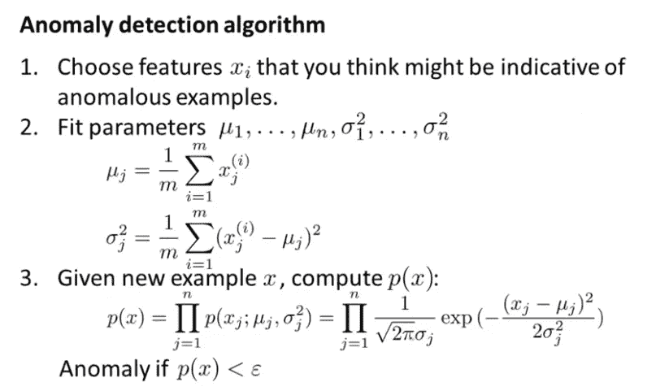

# 异常检测

> 原文：<https://medium.com/geekculture/anomaly-detection-55cd6cb066d5?source=collection_archive---------14----------------------->

Photo by [Will Myers](https://unsplash.com/@will_myers?utm_source=medium&utm_medium=referral) on [Unsplash](https://unsplash.com?utm_source=medium&utm_medium=referral)

## 利用高斯分布捕捉异常值的算法

这是我正在从事的系列文章的第十部分，其中我们将讨论和定义介绍性的机器学习算法和概念。在这篇文章的最后，你会找到这个系列的所有前几篇文章。我建议你按顺序读这些。原因很简单，因为我在那里介绍了一些概念，这些概念对于理解本文中讨论的概念至关重要，我将在许多场合引用它们。

在本文中，我们将快速回顾高斯分布，定义什么是异常，以及我们如何检测它们。

让我们开始吧。

# 什么是异常？

形式上，异常(也称为**异常值**)定义为:

> 不同的、不正常的、奇特的或不易分类的事物。偏离共同规则*【2】*

这个定义在机器学习领域成立。每当你有一个数据点明显不同于其他数据点，我们就说这个数据点是**异常**。

例如，考虑以下描述一个人的身高和体重的数据集:

**Figure 1:** Height vs Weight

红色的叉号远远偏离了数据集的总体分布，我们将其标记为异常，即这个特定人的身高和体重不符合我们通常在人体中看到的身高体重比。

然而，你可能已经感觉到红色的叉号并没有远离其余的数据点。因为我们还没有定义一个阈值，超过这个阈值，我们就把一个点标为异常或不异常，你的感觉是完全有效的。

**Figure 2:** Example of Different Possible Thresholds

在本文中，我们将了解如何得出这个阈值，它将为我们提供一个具体的基线，以确定哪些数据点是异常的，哪些不是。

## 异常与错误数据点

重要的是，我们能够区分错误的数据点和异常的数据点。

当数据点由于数据输入或分布中的一些**非预期错误**而不符合我们训练集的总体分布时，我们不会将其归类为异常值，而是需要修复的错误。例如，数据通常是由人类手工构建的，因此我们很可能会遇到一些数据输入错误。如果我们正在收集人们的身高数据，并且我们有两厘米的值，那么很明显这是数据输入中的错误，而不是异常。

异常是不寻常的可能结果，如网络上的高流量或高 CPU 使用率。

# 高斯(正态)分布

这个系列不是关于概率论和统计学的，所以我不会详细讨论概率密度函数(pdf)和连续概率分布。相反，我将简单介绍一下，以及理解异常检测算法所需的所有信息，剩下的留给您自己研究。

考虑下面的表格，该表格定义了由 10 个人组成的人群的身高。你被要求用图形表示这些高度。

**Figure 3:** Table of Population Height in Centimeters

这是一个一维数据集，所以我们只需要一个一维笛卡尔坐标系，就像这样:

**Figure 4:** Height of a Population

从图 4 中我们注意到了什么？首先，我们大多数人的身高在 165 到 180 厘米之间。第二，我们注意到有些人比大多数人矮或高。

接下来，你被要求用图形表示这个群体中的一个人有一定身高的概率。更正式地说，对于任意高度`X`，确定`X`所有可能结果的概率。

在我们深入思考之前，先从逻辑上思考一下。如果我们大多数人的身高在 165 到 180 厘米之间，那么在这个范围内，这个概率不是最高的吗？此外，因为我们有这么少的人低于或高于这个范围，一个人处于这些高度的概率不会更小吗？一旦你这样想，画我们的图表就变得简单多了:

**Figure 5:** Density Curve of Our Population

在**图 5** 中，y 轴代表该曲线的概率密度函数值(PDF)，x 轴代表人口高度。y 轴上的 0.5 是任意选择的。

为了得出数据的**分布**，我们经历了整个过程。我们得到了一个图表，描述了某个变量`X`的可能值以及它们出现的频率。我们的变量可以用许多不同的方式分布。想象一下，我们有更多身高在 140 到 150 厘米之间的人。在这种情况下，我们的图表会更加向左倾斜:

**Figure 6:** Density Curve Skewed to the Left

当我们的大部分数据处于平均值时，我们有一个**高斯(正态)分布**。这种形式的分布通常以其平均值和标准差(STD)来表征。

在继续讨论算法之前，需要注意几点:

*   当变量`X`的值是连续的(可以取无限多的值)，那么就不可能得到具体某一点的概率。比如让你计算身高 165 厘米的概率，也就是计算`P(X = 165)`。一个人**正好** 165 厘米的概率是不可能的。它们可能是 165.00001 厘米，164.9999 厘米，但 165 厘米是不可能的。相反，我们寻找一系列值的概率。比如`P(164.9 <= X <= 165.1)`。这个概率是通过找出这两点之间的密度曲线下的面积来计算的。
*   整个密度曲线的面积总是等于 1。

第一点可能会让你有点害怕，但是不要担心，每次你想从分布曲线计算概率的时候，你不需要拿出积分技巧。而是直接用它的 PDF。高斯分布的 PDF 如下:

**Equation 1:** PDF of Gaussian Distribution

# 异常检测算法

因此，我们了解了什么是高斯分布，剩下要做的就是了解这些信息在异常检测的情况下如何有用。

我们先来看看算法，然后试着理解所有的细节。以下算法摘自[吴恩达](https://medium.com/u/592ce2a67248?source=post_page-----55cd6cb066d5--------------------------------)的机器学习入门课程[1]:

**Figure 7:** Anomaly Detection Algorithm

1.  一些特征将比其他特征具有更大的异常趋势。例如，像 CPU 使用率这样的特性可能会在某个时候显示异常结果，因此在计算机系统的异常检测系统中包含该特性是一个很好的特性。
2.  计算所有要素的平均值和方差。这些将用于通过高斯分布的 PDF 计算概率。
3.  给定一个新的数据点`x`，通过计算其特征概率的**乘积**来识别该数据点是否异常。理解这一点最简单的方法是通过一个例子。假设我们已知一个人的身高和体重`x=[x_1=165cm, x_2=140lb]`。要计算一个人身高 165 厘米，体重 140 磅的概率，就要计算`p(x_1=165cm and x_2=140lb) = p(x_1=165cm)*p(x_2=140lb)`。如果这个数据点小于某个预定义的阈值ε，我们认为它是异常的。

关于第三步的最后一句话:你如何选择 epsilon 取决于你想要多严格。一个更大的基准意味着你将会更加严格，要求所有的数据点尽可能没有异常。较小的ε意味着你愿意接受较低概率的数据点。

# 结论

在本文中，我们介绍了异常检测的概念。我们首先描述了什么是异常，什么不是异常。从那里，我们回顾了高斯分布的概念，并使用它来开发一个异常检测算法。

大多数数据科学和机器学习应用程序中都存在异常，因此掌握这些信息将有助于您未来的项目。虽然我们给了你一个很好的概述，但有些地方我们没有考虑到。我们让您负责研究以下几点:

*   我们如何测试一个异常检测系统？
*   我们必须使用高斯分布吗？我们可以使用任何其他类型的分布吗？如果是，使用其中一种的优势和劣势是什么？如果没有，为什么没有？
*   有没有为我们的异常检测系统选择特征的算法，或者我们总是必须依靠我们的直觉？

# 过去的文章

1.  **第一部分:** [数据预处理](https://ali-h-khanafer.medium.com/data-pre-processing-ee81bbe5cc77)
2.  **第二部分:** [使用梯度下降的线性回归:直觉和实现](https://ali-h-khanafer.medium.com/linear-regression-using-gradient-descent-intuition-and-implementation-522d43453fc3)
3.  **第三部分:** [使用梯度下降的逻辑回归:直觉和实现](/geekculture/logistic-regression-using-gradient-descent-intuition-and-implementation-36a8498afdcb)
4.  **第四部分— 1:** [神经网络第一部分:术语、动机和直觉](/geekculture/neural-networks-part-1-terminology-motivation-and-intuition-73675fc43947)
5.  **第四部分— 2:** [神经网络第二部分:反向传播和梯度检测](/geekculture/neural-networks-part-2-backpropagation-and-gradient-checking-4f8d1350fb0b)
6.  **第六部分:** [评估你的假设，理解偏差与方差](/geekculture/evaluating-your-hypothesis-and-understanding-bias-vs-variance-86512cce4253)
7.  **第七部分:** [支持向量机和内核](/geekculture/support-vector-machines-and-kernels-8b064ee53fc3)
8.  **第八部分:** [无监督学习和 K-Means 聚类背后的直觉](/geekculture/unsupervised-learning-and-the-intuition-behind-k-means-clustering-9805ed89fa0)
9.  **第九部分:** [降维和主成分分析](/geekculture/dimensionality-reduction-and-principal-component-analysis-6e4d8ec6a312)

# 无耻的插头

*   **推特:**twitter.com/ali_khanafer2

# 参考

1.  [吴恩达的机器学习 Coursera 课程](https://www.coursera.org/learn/machine-learning?page=1)
2.  [异常|韦氏词典对异常的定义](https://www.merriam-webster.com/dictionary/anomaly)