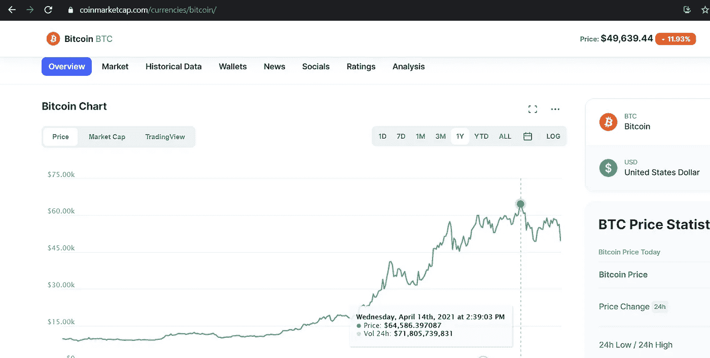
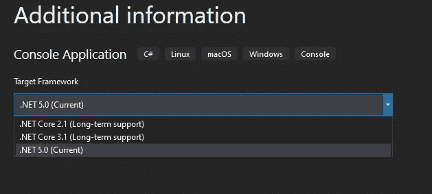
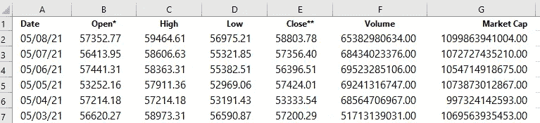
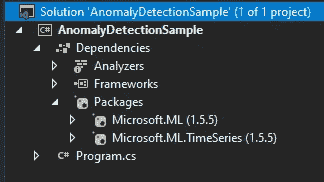
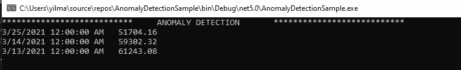
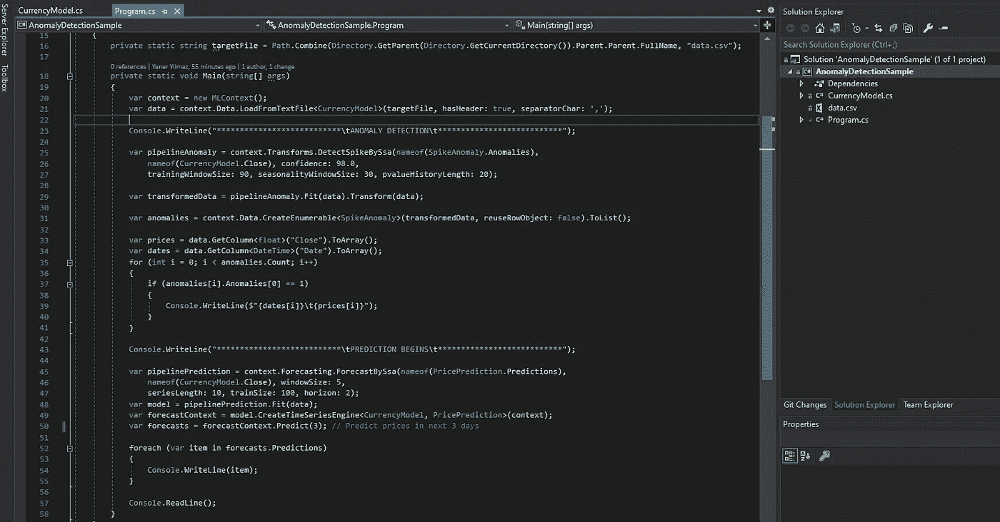
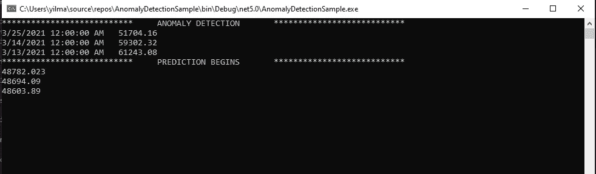

# 使用 ML.Net 时间序列库进行异常检测和预测

> 原文：<https://medium.com/geekculture/anomaly-detection-and-prediction-using-ml-net-timeseries-library-e91838ca0ba3?source=collection_archive---------5----------------------->

有许多方法可以在软件服务中利用人工智能，尤其是在商业智能中。ML.Net 微软公司的机器学习库有许多算法，它的性能日益改善，可以帮助我们在这些方面前进。异常检测是这些技术中最重要和最常用的技术之一。

***什么是异常检测？*** 在数据分析中，异常检测是通过与大多数数据显著不同来识别引起怀疑的罕见项目、事件或观察值。它通常用于。

*   欺诈检测
*   系统健康监控
*   传感器网络中的事件检测
*   生态系统干扰
*   数据清理
*   入侵检测

我们将通过使用微软的预测算法来检测比特币价格时间序列数据的异常。时间序列

***什么是时序数据？*** 时间序列数据是指在特定时间范围内捕获的数据，如公司的股票价格、银行账户的交易等。这些是时间序列数据的经典例子。
在我们的特殊情况下，这将是过去 180 天的比特币价格，我们将使用这些数据来训练我们的模型，以检测异常并预测未来的价格



Bitcoin chart that shows fluctuations in the last 12 months

> [⚠](https://graphemica.com/%E2%9A%A0) 警告:在现实生活中，有大量的参数会影响比特币的价格，用人工智能是不可能处理的。我们只会参考最近 6 个月的价格。我们的模型只会根据数字说同样的话。所以，永远不要把你的真金白银投入到任何声称有能力做到这一点的应用程序中

我们应该遵循这些步骤来开发应用程序；

🛈:让我说，下面的这些步骤简要解释了我们为什么这样做，但是如果你想跳过这个难题并下载源代码，请随意阅读文章结尾。

1.  首先，我们需要收集比特币数据，用于训练我们的网络。前往[https://coinmarketcap.com](https://coinmarketcap.com/)点击比特币，然后点击[历史数据](https://coinmarketcap.com/currencies/bitcoin/historical-data/)选项卡。您将看到一个数据网格，其中列出了所选日期范围内的价格记录。很遗憾没有导出为文件选项，他们不认为有人可能需要它:)
    所以我们需要复制它。Anway 选择“日期范围”和“最近 180 天”复制粘贴数据，包括标题(Btw coinmarketcap 也提供开发者 API 来共享资源，但这是题外话)


Our training data source is [https://coinmarketcap.com/currencies/bitcoin/historical-data/](https://coinmarketcap.com/currencies/bitcoin/historical-data/)

2.创建一个空的。Net 核心控制台应用程序，并检查`Place solution and project in the same directory``然后点击下一步，选择 SDK，这个例子与 3.1 版也很好，但我会去。NET 5.0 的最新版本。网络核心



然后创建一个空的 CSV 文件，并将 coinmarketcap 中的数据粘贴到其中。
不要忘记格式化日期，这需要我们的应用程序读取文件中的数据

选择日期列和`Format Cells-> Date -> *3/14/2012`然后选择所有其他的`Format Cells-> Currency -> 1,234.10`点击确定然后再次格式化相同的货币列`Format Cells-> Currency -> Use 1000 Seperator(,)`现在我们完成了。
文件内容应该是这样的:



Dont forget to format data otherwise you gonna encounter an error during loading data to model



翻回到 VS，我们需要 2 个库，我们可以通过 NuGet 包管理器安装它们。这些是**微软。ML** 和**Microsoft . ML . time series .**您的项目解决方案在他看来应该是这样的。

在第一部分，我们将涵盖异常检测，然后给定数据的价格预测。在此之前，我们应该从文件中读取数据，让我们开始编写代码:创建一个 MLContext 实例并加载目标文件的内容。这是我们应该做的；

```
var context = new MLContext();
var data = context.Data.LoadFromTextFile<CurrencyModel>(targetFile, hasHeader: true, separatorChar: ‘,’);
```

接下来，创建一个估计器来检测异常，我们将在 ML 上下文的变换目录中使用奇异谱分析，并变换想要形成的数据:

```
var pipelineAnomaly = context.Transforms.DetectSpikeBySsa(nameof(SpikeAnomaly.Anomalies),nameof(CurrencyModel.Close), confidence: 98.0,trainingWindowSize: 90, seasonalityWindowSize: 30, pvalueHistoryLength: 20);
var transformedData = pipelineAnomaly.Fit(data).Transform(data);
```

🛈:我发现比特币的“*收盘*价格出现异常，这表明这是当天的最终价格。如果您想检测*最高*或*最低*价格，只需根据需要更改此列，它必须与目标数据列名称相同。

最后，创建一个列表来存储检测到的异常:

```
var anomalies = context.Data.CreateEnumerable<SpikeAnomaly>(transformedData, reuseRowObject: false).ToList();
```

然后向控制台写入检测到的异常给定数据:

```
var prices = data.GetColumn<float>("Close").ToArray();
var dates = data.GetColumn<DateTime>("Date").ToArray();
for (int i = 0; i < anomalies.Count; i++) {
   if (anomalies[i].Anomalies[0] == 1) {
      Console.WriteLine($"{dates[i]}\t{prices[i]}");
   }
}
```

就这样，现在运行应用程序，看看它是否像预期的那样工作，你应该会看到一个类似这样的窗口；



异常检测到此结束，现在让我们开始第二部分
价格预测:
我们已经将数据加载到 ML 上下文中，因此我们只需要通过预测奇异谱分析(SSA)函数创建一个新的估计器并创建一个模型；

```
var pipelinePrediction = context.Forecasting.ForecastBySsa(nameof(PricePrediction.Predictions), nameof(CurrencyModel.Close), windowSize: 5, seriesLength: 10, trainSize: 100, horizon: 2); 
var model = pipelinePrediction.Fit(data);
```

然后为时序管道创建预测引擎，并调用预测函数。您还可以定义将要计算的预测数。在我们的例子中，它将是 3，因此未来 3 天的比特币价格将通过使用预测引擎来预测。

```
var forecastContext = model.CreateTimeSeriesEngine<CurrencyModel, PricePrediction>(context); 
var forecasts = forecastContext.Predict(3); // Predict prices in next 3 days
foreach (var item in forecasts.Predictions) {       Console.WriteLine(item); 
}
```

`Predict`功能中的参数表示预测的数量将由引擎计算。在我们的例子中，我们希望看到接下来的 3 天。完成此步骤后，您的代码解决方案文件应该如下所示:



让我们运行这个项目，看看它是如何工作的。



如果你在你的控制台上看到这样的东西，那就是了。我们对包含比特币价格的给定文件(data.csv)的异常检测和预测非常有效🤘

这就是我在这篇文章里想分享的全部。你可以在这里下载完整的[源代码，自己运行或者改进项目。如果您有任何问题，请在下面的部分留言。祝大家快乐健康！](https://github.com/y3n3rrr/AnomalyDetectionSample)

再会，
买买提·耶纳尔·耶尔马兹