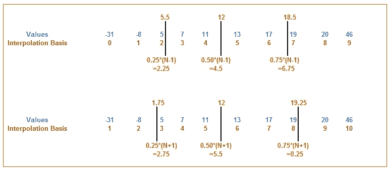
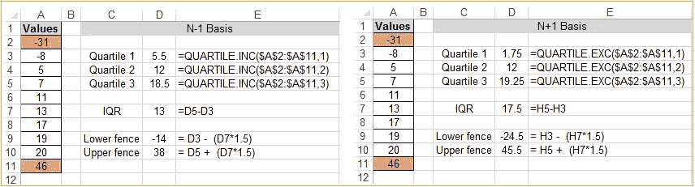

# 异常检测:非编程方式

> 原文：<https://medium.com/geekculture/anomaly-detection-non-programming-way-4d37353d327a?source=collection_archive---------32----------------------->

#AnomalyDetection #Excel

曾经有人问我，如何在不使用任何分析工具或编程语言的情况下确定数据集中的异常/离群值？多加了一个条件，没有历史数据，也没有给定上下限。我想到的一件事是 Excel *Quartile* 函数。

> 异常值/离群值是不在数据集中大多数数据点的公共范围内的任何数据点。异常值/异常值要么太高，要么太低，不能作为真正有代表性的数据。

# 四分位数

四分位数是将一个数据集统计分成四个相等的组，每个组占数据的 25%。集合的前 25%被认为是第一个四分位数，而后 25%被认为是第四个四分位数。这种估计四分位数分界值的概念叫做内插法。

让我们来看看这是如何工作的。我们将取 10 个值(按升序排序)并将它们并排放置。然后在下面，我们添加一种索引，给每个值一个位置。这个指数可以被认为是一个插值的基础。插值有 N-1 基和 N+1 基两种。n 代表值的计数，-1 表示我们开始索引的位置。在 Excel 中，四分位数和四分位数。INC 函数在 N-1 的基础上计算，而 QUARTILE。EXC 是在 N+1 的基础上计算的。

# N-1 基础

为了找出四分位线的位置，我们计算

*Q1 = 0.25 *(N-1)= 0.25 *(10–1)= 2.25*

*Q2 = 0.50 *(N-1)= 0.50 *(10–1)= 4.5*

*Q3 = 0.75 *(N-1)= 0.75 *(10–1)= 6.75*

# N +1 基础

为了找出四分位线的位置，我们计算

*Q1 = 0.25 *(N+1)= 0.25 *(10+1)= 2.75*

*Q2 = 0.50 *(N+1)= 0.50 *(10+1)= 5.5*

*Q3 = 0.75 *(N+1)= 0.75 *(10+1)= 8.25*

取这两个四分位数，我们可以通过从第一个四分位数减去第三个四分位数来计算数据集的统计 50%。这个统计上的 50%被称为四分位距(IQR)。统计学家普遍认为，IQR*1.5 可以用来建立一个合理的上下围栏。任何大于上限或小于下限的值都被视为异常值。

*下围栏等于第一个四分位数— IQR*1.5。*

*上围栏等于第 3 个四分位数+ IQR*1.5。*

# 有几点需要注意:

1.在您使用的任何四分位数方法之间，第二个四分位数总是相同的。第二个四分位数实际上是中间值，因此是固定的。

2.四分位数。EXC 排除了人口中的中位数。该函数导致离整体中心更远的四分位数。这为我们提供了对实际总体的更好的估计，并为我们提供了关于哪些值应该被视为异常值的潜在更准确的视图。

3.四分位数和四分位数。确定插值时，INC 包括中值(中间数)。如果您需要相对对称的四分位数，这些函数非常方便。然而，这些函数缩小了您的四分位数间距(上下四分位数之间的距离)，使得识别真正的统计异常值更加困难

现在，我们将使用 Excel 条件格式来突出显示数据集中的异常值。

*   选择目标区域中的数据单元格(在本例中为单元格 A2:A11)，单击 Excel 功能区的“主页”选项卡，然后选择“条件格式”→“新建规则”
*   单击“使用公式确定要格式化的单元格”选项
*   在公式输入框中，输入公式=OR(A2 $D$10)
*   单击格式按钮。单击填充选项卡。
*   选择您选择的颜色，然后单击“确定”。
*   返回“新建格式规则”对话框，单击“确定”按钮确认您的格式规则。

如果你有任何问题，我很乐意帮忙。此外，如果您能分享任何非编程的方法来确定数据集中的异常/异常值，我将很高兴听到您的意见。

> 如果你是一个#AdobeAnalytics 爱好者，请加入我们的群组[adobe analytics 专业人士和招聘人员](https://www.linkedin.com/groups/10346833)。
> 
> 如果你喜欢阅读我的其他文章，
> 
> [使用 Adobe Analytics 进行访客保留分析](https://pradeep-jaiswal.medium.com/visitor-retention-analysis-using-calculated-metric-function-f2fb3454f4cd)
> 
> [使用 SQL 的客户参与度分析](https://pradeep-jaiswal.medium.com/sql-for-data-analytics-part-1-ecf4738e9061)
> 
> [SQL 谋杀之谜第 1 部分](https://pradeep-jaiswal.medium.com/sql-murder-mystery-part-1-59a473f378c0)