# IP 地址数据的异常检测

> 原文：<https://medium.com/geekculture/anomaly-detection-on-ip-address-data-1520955fa568?source=collection_archive---------7----------------------->

## 使用高斯混合模型(GMM)聚类的简单示例

Photo by [Randy Fath](https://unsplash.com/@randyfath?utm_source=medium&utm_medium=referral) on [Unsplash](https://unsplash.com?utm_source=medium&utm_medium=referral)

在本文中，我们将尝试聚类的无监督机器学习方法，根据 IP 地址的相似性将 IP 网络中的主机分组到不同的集群中。重要的是，我们将看到 K-Means 和 GMM(高斯混合模型)在聚类方法上的差异，并比较它们的结果。我们还将看到如何使用 GMM 更有效地找出数据中的异常值

# 介绍

聚类是一类无监督的 ML 算法，它将给定的数据点分离并分组到不同的数据组中，使得任何聚类中的数据点在特征上彼此相似。聚类使用我们提供的特征来学习数据点总体中的相似性模式，然后相应地对它们进行分组。

有许多不同的聚类算法，如 K-Means 聚类，DBSCAN 和 GMM，仅举几个流行的例子。
在下面的练习中，我们将从庞大的网络数据包数据集中提取数据包的源和目的 IP 地址，并使用无监督的 ML 聚类方法，根据 IPv4 地址的四个八位位组将其聚类到不同的组中。在路上，我们将做一些异常检测，并看看 GMM 和 K-Means 如何相互比较。异常是离群值(尽管它们是已形成的集群的成员)。由于与同一群中的其他人有很大程度的不相似性，或换句话说有很小程度的相似性，所以他们离群中的其他人相对较远。

# K-均值和 GMM 聚类算法的基础

我们不会深入研究 K-Means 和 GMM 算法如何工作的细节，因为这超出了本文的范围。相反，我们将两者应用于对 IP 地址群体进行聚类的任务，注意两种算法采用的不同方法如何对最终的聚类形成产生影响，以及 GMM 如何看起来更适合我手头的数据集。

**关于这两种算法的一些基本信息如下。**

**K-Means 算法**在选择初始聚类质心之后，循环迭代两步，直到结果聚类收敛。

1.  将每个数据观测值分配给最近的聚类质心
2.  将每个质心更新为分配给它的数据点的平均值。

因此，对于 K-Means，每个数据点被分配到任何一个聚类，这被称为**硬聚类**或硬聚类分配。

**硬聚类:**在硬聚类中，数据点被完全分配到任何一个聚类中。这意味着对于硬聚类**来说，在数据点的分配中没有考虑不确定性。**

**软聚类:** 在软聚类中，将数据点分配给一个聚类是**基于该数据点存在于该聚类中的概率或可能性。**

对于软聚类，我们有一种称为 GMMs 或高斯混合模型的算法。
**GMM** 相比 K 均值有两个优势:

1.  GMM 在聚类协方差方面更加灵活，更适合椭圆形斑点。
2.  GMM 模式适应混合成员。

现在让我们进入示例练习的细节..

# 数据先决条件

我取了一个[公开可用的 pcap 文件](https://www.netresec.com/?page=PcapFiles)，其中包含数百万个数据包，提取了数据包的详细信息，如 IP 报头字段、TCP 报头字段等，并将其保存在一个大的 csv 文件中。我使用了流行的 [**python 工具** **Scapy**](https://scapy.net/) 提取 pcap 文件中每个包的协议数据。因此，我们将从一个现成的 csv 文件开始练习，该文件包含数百万行，每行描述一个网络数据包。

# 本练习的代码

这个练习的完整代码可以在这个 [github 链接](https://github.com/raja-surya/Anomaly-Detection-IP-Address)中找到。
笔记本大多是不言自明的，所以我在本文中只解释练习的重要步骤和方面。建议读者浏览这里跳过的其他步骤的完整代码。

# 1.数据准备

## 读取 csv 文件并提取源和目标 IP 地址

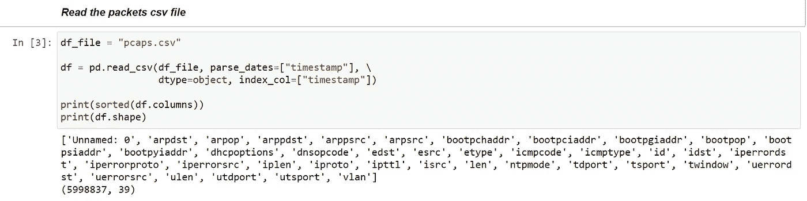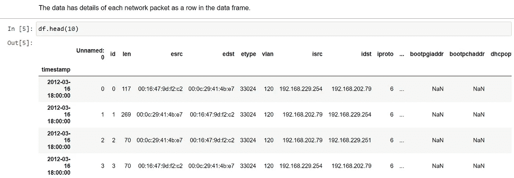

上面，我们已经阅读了包含数据包数据的 csv 文件，该文件有近 6 百万行和 39 列。每行包含一个数据包的详细信息。我们将只使用数据包的 isrc(源 IP 地址)和 idst(目的 IP 地址)进行进一步分析。

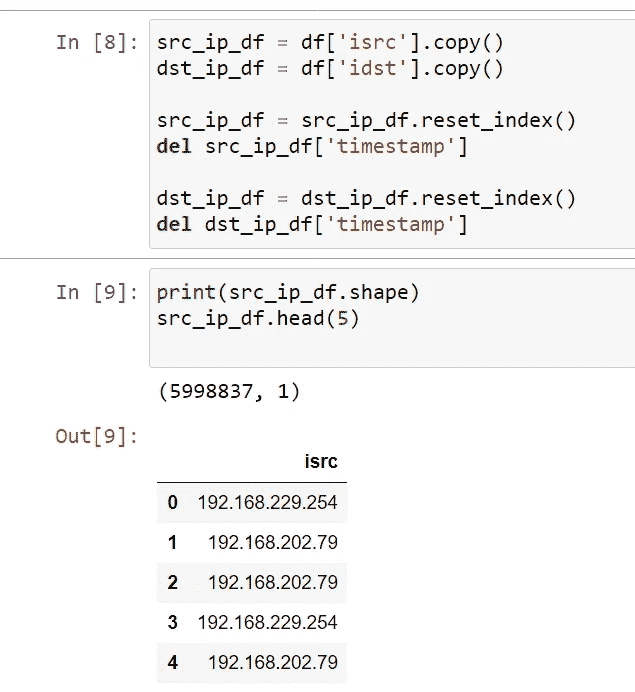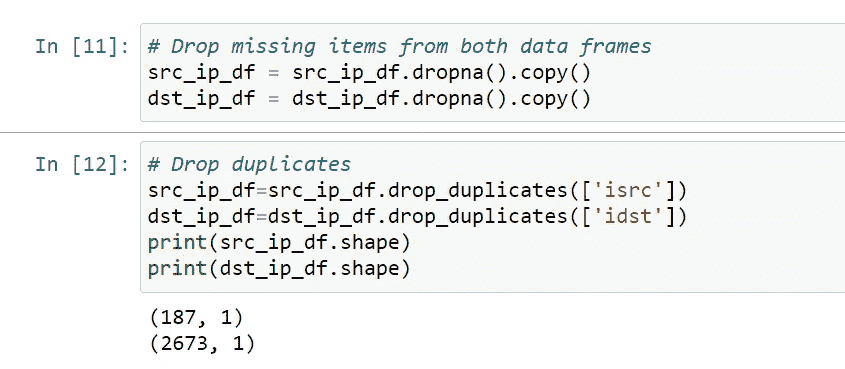

在数据清理和删除重复条目后，我们有 187 个源 IP 地址和 2673 个目的 IP 地址用于分析。

# 2.从 IP 地址中提取特征

对于数据的聚类，我们需要选择数据的特定特征，基于这些特征，聚类算法可以将数据分成相似成员的聚类。在这里，因为我们希望基于 IPv4 地址进行聚类，所以我们需要某种方法将 IP 地址编码到一个特征向量中。

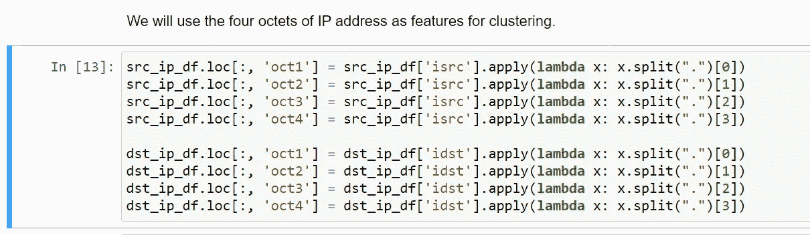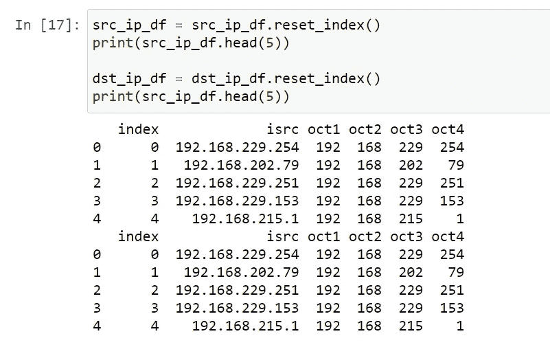

我们选择了拆分每个 IPv4 地址的四个八位字节，并将它们用作长度为 4 的向量，以提供给聚类算法来表示每个数据(IP 地址)。选择这种方法背后的理由摘自[这篇研究论文。](https://hammer.purdue.edu/articles/thesis/Encoding_IP_Address_as_a_Feature_for_Network_Intrusion_Detection/11307287)

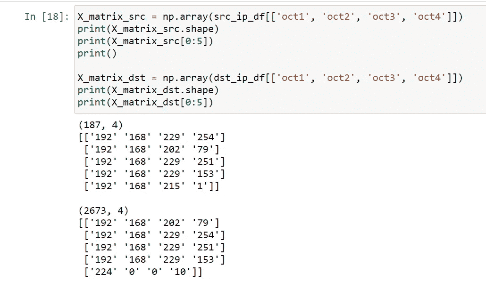

然后，我们将 PCA 应用于 X_matrix，将维数从 4 降低到 2，这样我们就可以很容易地用 2 维散点图来可视化聚类。

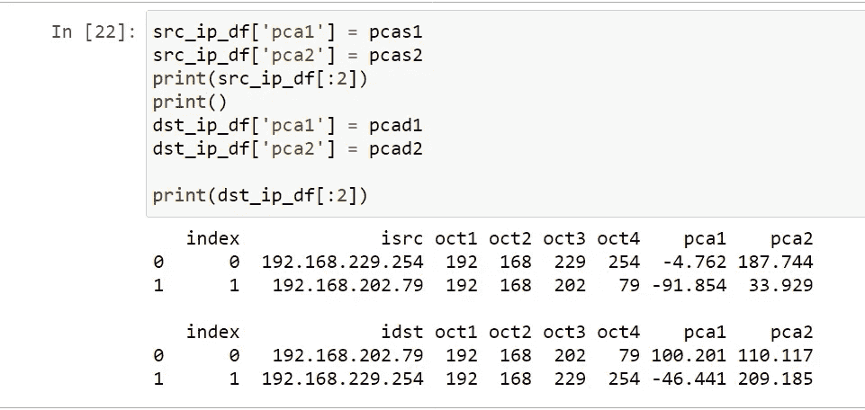

当我们对 src_ip_df 的 pca1 和 pca2 进行散点图绘制时，我们会得到以下图

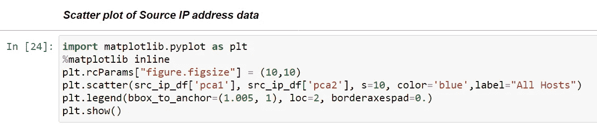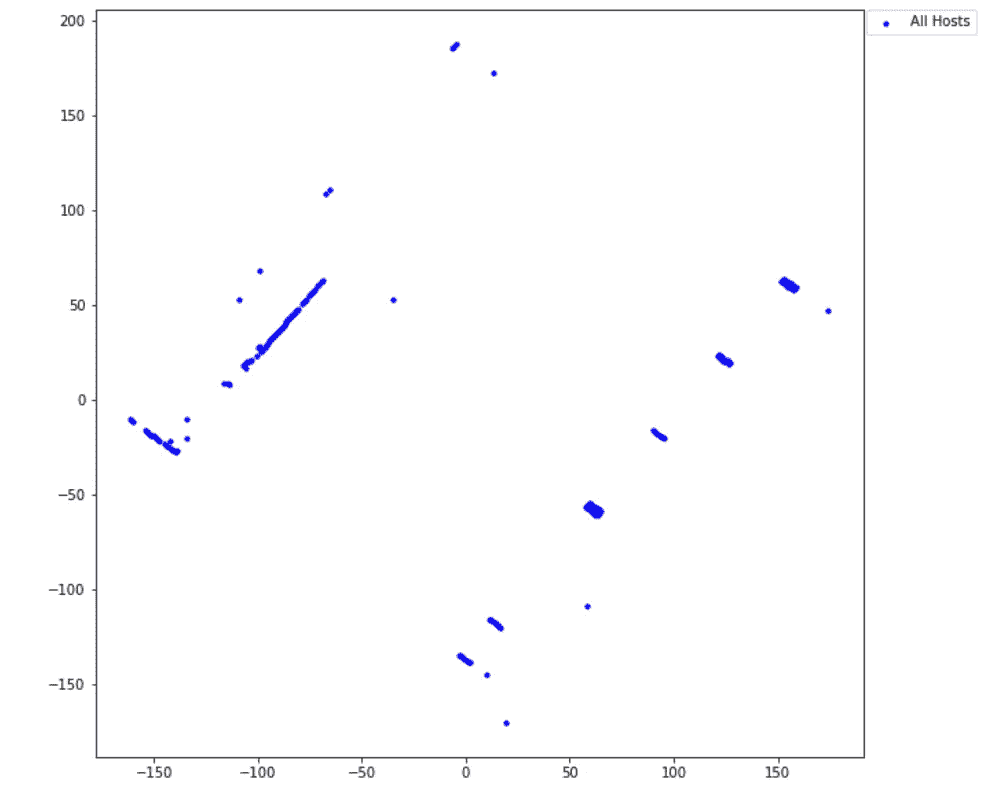

从视觉上看，似乎有 6 或 7 个小集群。广义上讲，有两个椭球形的大星团，它们的方向相似。星团模式更接近椭圆形，尤其是左边的。

# 3.对源 IP 地址数据使用高斯混合模型(GMM)聚类算法

高斯混合模型(GMM)聚类比适合球形斑点的 K-均值聚类更适合椭圆形聚类。GMM 也是一种概率聚类算法，并提供了更容易的方法来检测异常。让我们尝试用 GMM 对源 IP 地址进行聚类。

我们使用 BayesianGaussianMixture 类，它帮助我们找到给定数据所需的最佳聚类数。如果我们输入的聚类数超过了最佳值，它会通过给那些不必要的聚类赋予等于或接近于零的权重来消除不必要的聚类。

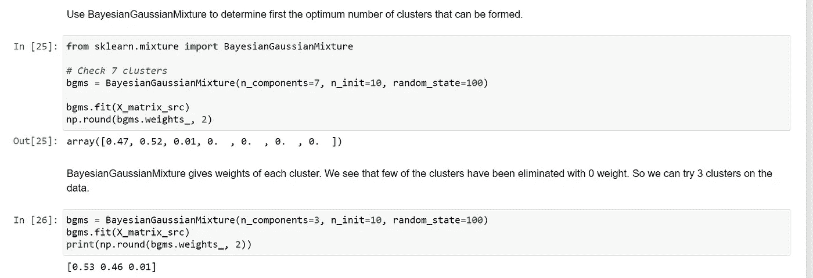

我们尝试了 7 个集群，但是根据给定的权重，3 个似乎足够了。然后，我们在源 IP 数据上训练 BGM(贝叶斯高斯混合),要求创建三个聚类。在上面看到的输出中，我们看到 BGM 为算法创建的三个聚类中的每一个分配的权重。

我们还可以获得三个聚类的高斯平均值，并通过 PCA 对其进行转换，如下所示，以便在可视化过程中定位聚类的平均值。

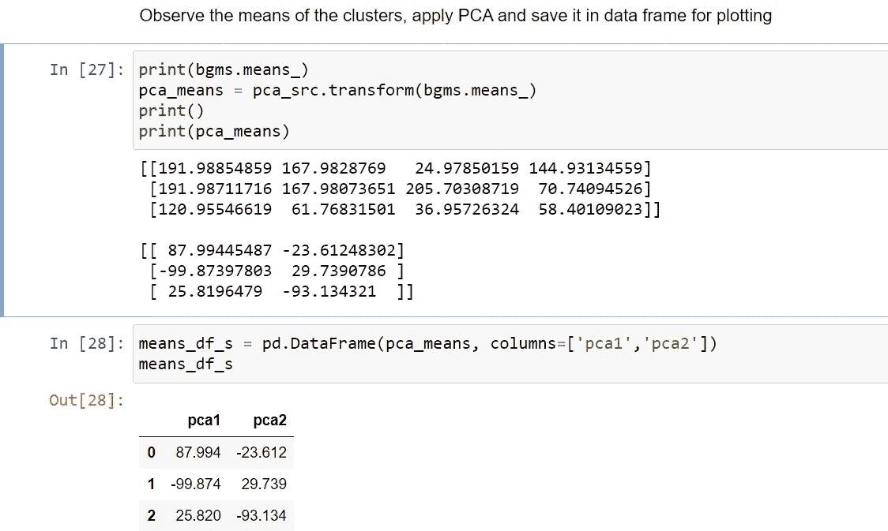

接下来，我们预测所有源 IP 数据的群集

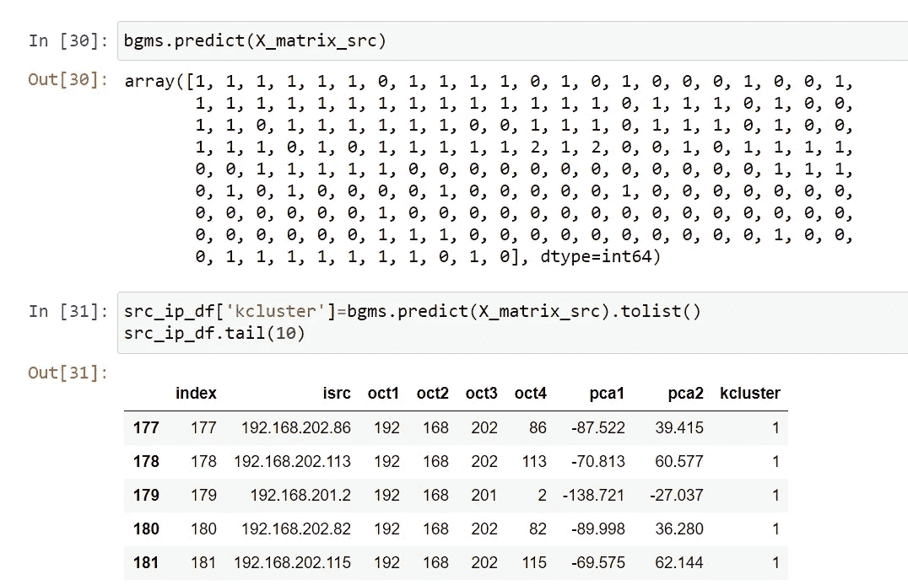

如上所示，我们将每个 IP 地址的集群标签存储为一个单独的列‘k cluster’。此外，我们为每个聚类创建单独的数据框，以便有助于绘制聚类。

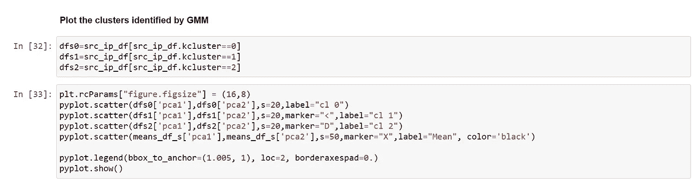

我们绘制了 GMM 创建的三个集群，如下图所示。

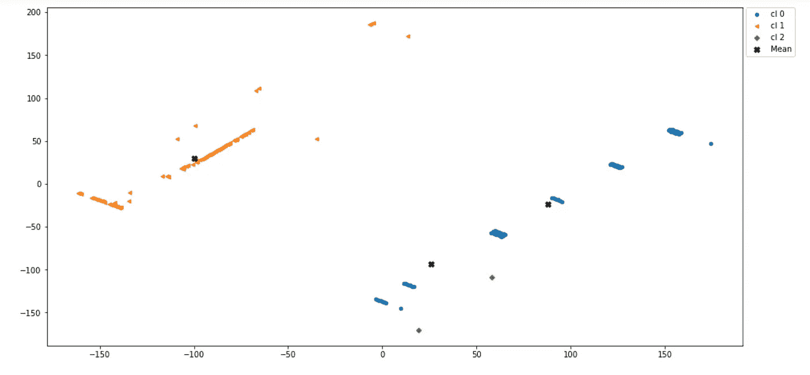

我们可以看到 3 个集群形成整齐，但确实包含一些异常值/异常。

## 在分析每个集群的成员时，我们看到，使用 GMM 集群，3 个集群明显是从源 IP 地址形成的。

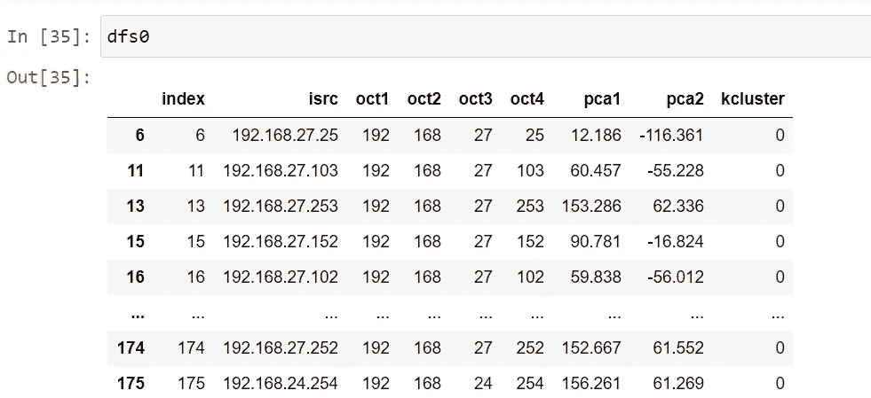

簇 0 主要由 192.168 组成。(21–27)子网有几个可能的异常值/异常值。

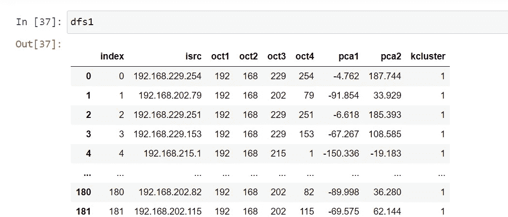

簇 1 主要由 192.168 组成。(200+)个子网。这个集群不是很紧密，有一个稀疏的第三个八位字节的范围，似乎有可能异常。

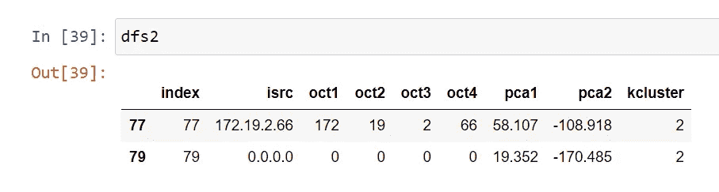

群集 2 只包含两个 IP 地址，与群集 0 和 1 的地址相比，这两个地址显然是异常的。

# 4.从 IP 地址集群中查找异常/异常值

我们使用 GMM 的 score_samples()方法来估计聚类中每个数据点所在位置的密度。分数越大，该数据点位置的聚类密度越高。位于低密度区域的任何实例都可以被认为是异常。我们可以定义一个密度阈值，比如说 4%,并且将位于低于密度值范围的第 4 个百分点的密度区域中的所有数据视为异常。这个阈值是任意的，我们可以根据自己的判断来选择。

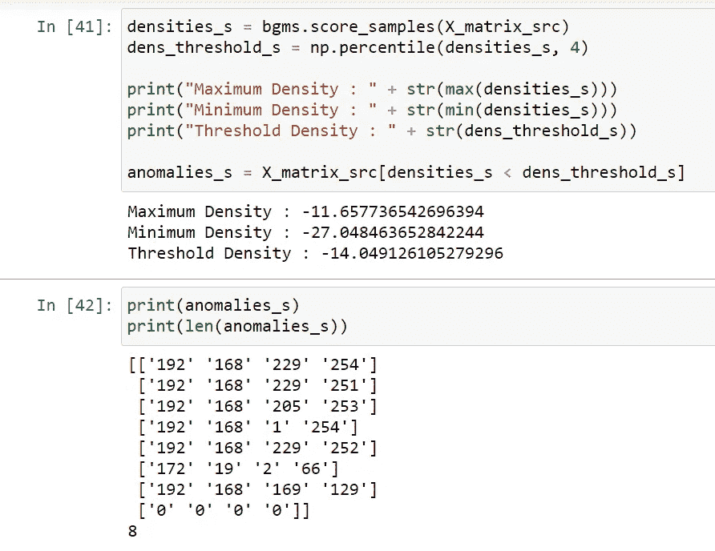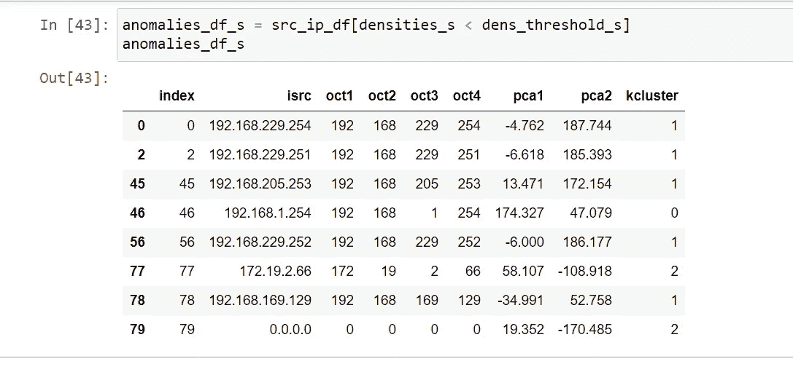

我们在源 IP 地址集中发现了八个异常 IP 地址。

我们再次绘制聚类图，这次标记异常数据点。

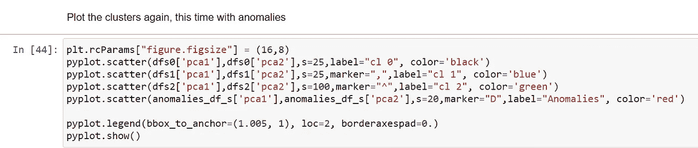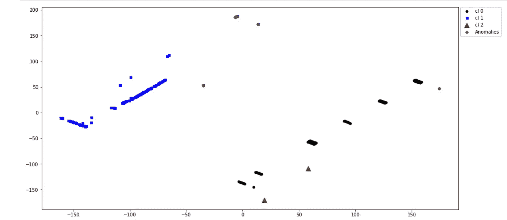

聚类图清楚地显示了远离紧密聚类组的异常(红色)。此外，如果您将异常 IP 地址与集群中常见的 IP 地址进行比较，您会发现显著的差异。

例如，许多异常以范围> 250 的最后一个八位字节结束(即接近八位字节范围 0–255 的末尾)。集群 2 的地址 172.19.2.66 和 0.0.0.0 都被标记为异常。从 192.168 中可以看出他们的价值。群集 0 和 1 中的 IP 地址。
192 . 168 . 169 . 129 也是如此，它的第三个八位字节 169 不在观测范围内。

**因此，我们成功地使用高斯混合模型对数据包中的源 IP 地址进行了聚类，并提取了所用地址中可能存在的异常/异常值。**

# 5.对目的 IP 地址重复同样的练习，看看 GMM 的情况如何。

这里，我们对目的 IP 地址重复我们已经对源 IP 地址遵循的相同步骤。
首先，我们使用两个相应的 PCA 组件绘制 IP 地址数据。

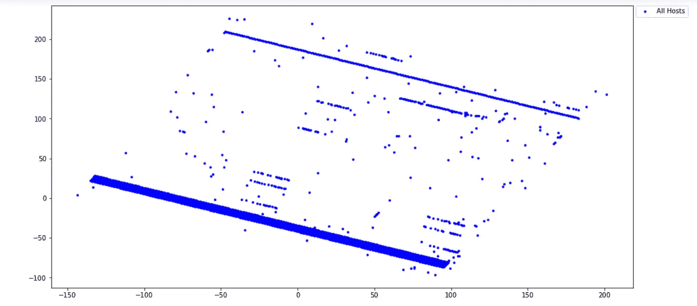

目的地 IP 地址显然看起来更像椭圆形，在顶部和底部至少有两个形状和方向相似的长簇。

下面我们估计集群的最佳数量为 4，并相应地使用目的地 IP 数据进行训练。

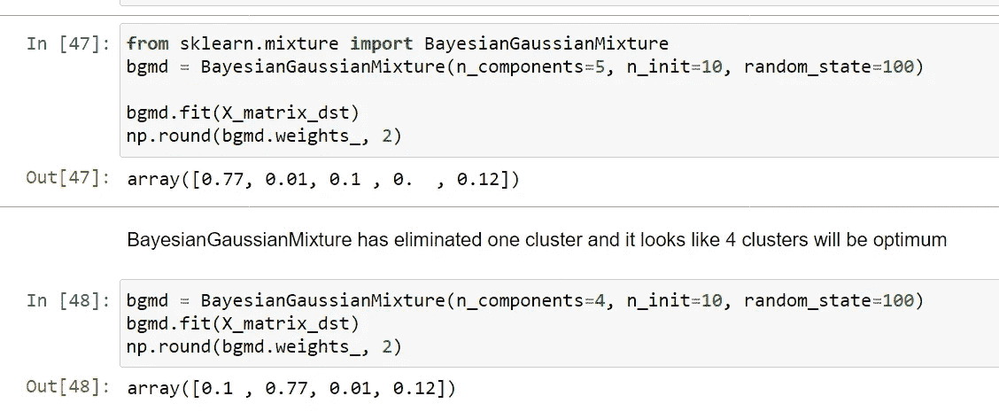

与我们在前面几节中看到的源 IP 数据类似，我们可以预测每个目的 IP 地址的群集，并绘制如下图。

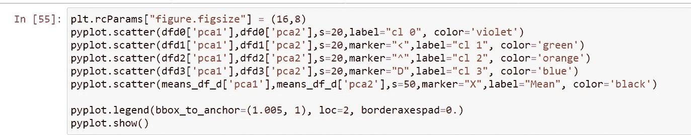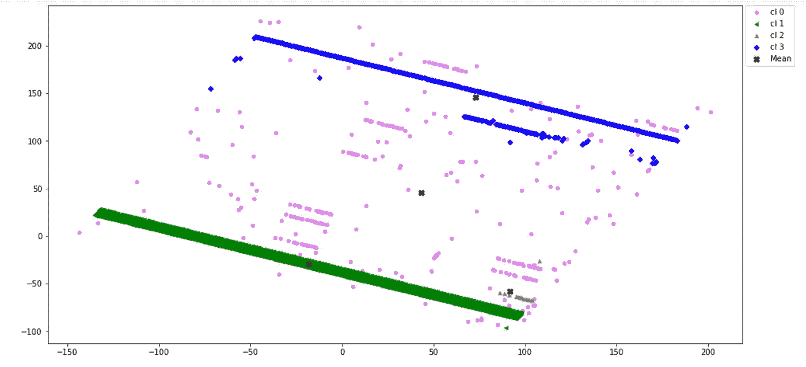

我们可以看到，GMM 已经将 IP 地址合理地分为三个大集群和一个小集群(cl 2)。

需要注意的是 **GMM 很好地考虑了星团的椭球形状和方向。这就是 GMM 与 K-Means 的不同之处，K-Means 假设聚类是球形的(我们将在下面看到)。**

然后，我们分析每个集群，看每个集群中的 IP 地址有多相似。

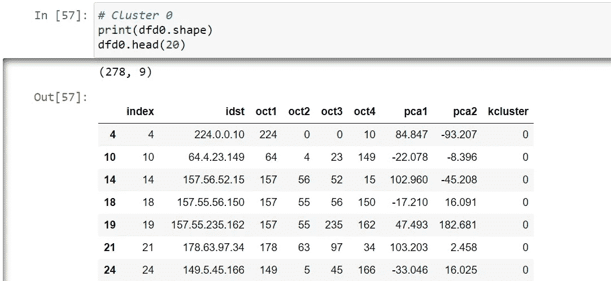

群集 0 看起来非常分散，地址来自广泛的子网。从上面的聚类图中我们也可以看到这一点。**看起来里面会包含很多异常情况。**

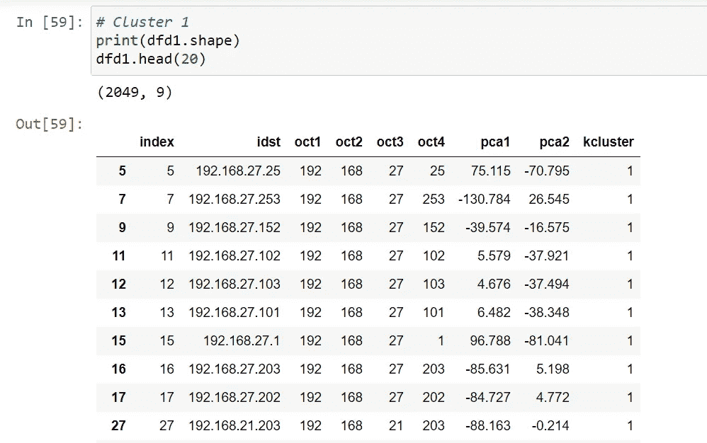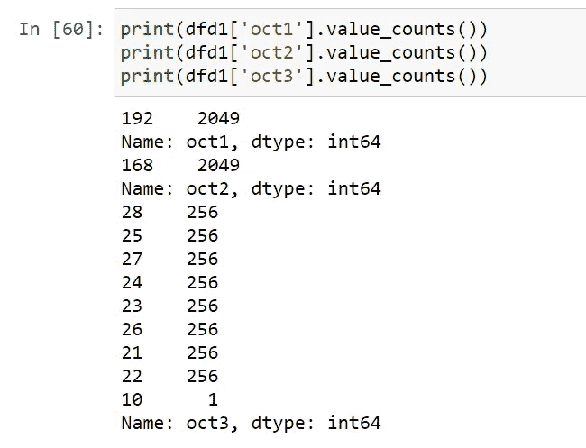

聚类 1 非常紧密，几乎只包含 192.168。[21–28]子网地址。在所有四个集群中，这个集群是最多的。只有一个异常值— 192.168.10。*我们也可以在聚类图中看到远处。

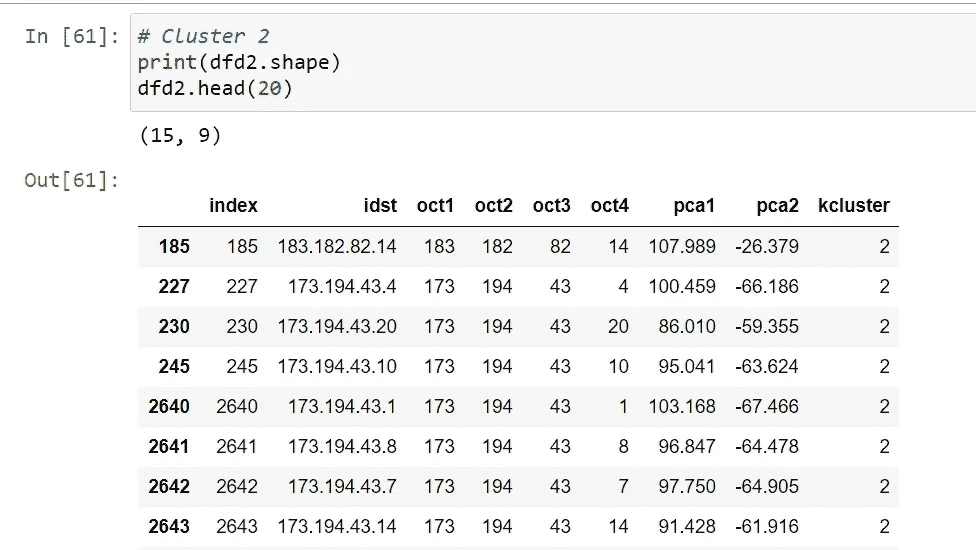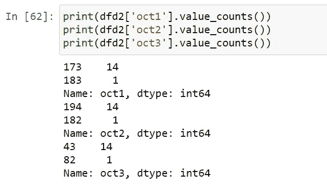

群集 2 很小，非常紧凑，包含 173.194.43 个子网地址。该集群是所有四个集群中最少填充的。可以看到一个异常值 183.182.82.14，它在上面的聚类图中也很突出。

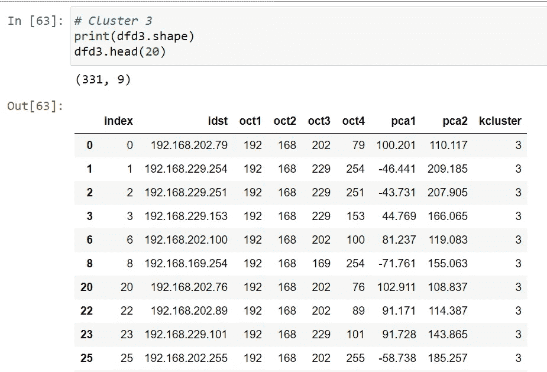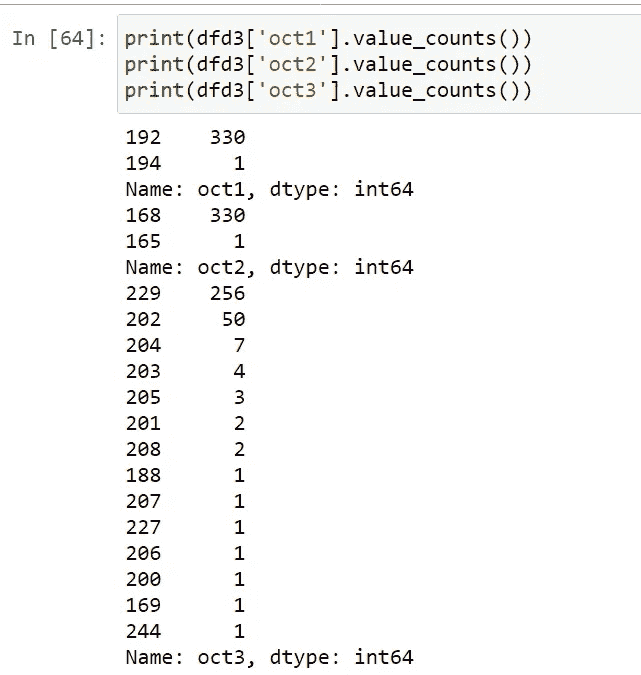

聚类 3 是紧密的，主要包含 192.168。[>200]个子网地址。

因此，通过 GMM 集群，我们可以清楚地看到上述四个集群是由目的 IP 地址组成的。

然后，我们使用与源 IP 地址分析相同的密度阈值比较，从数据中分离出异常。

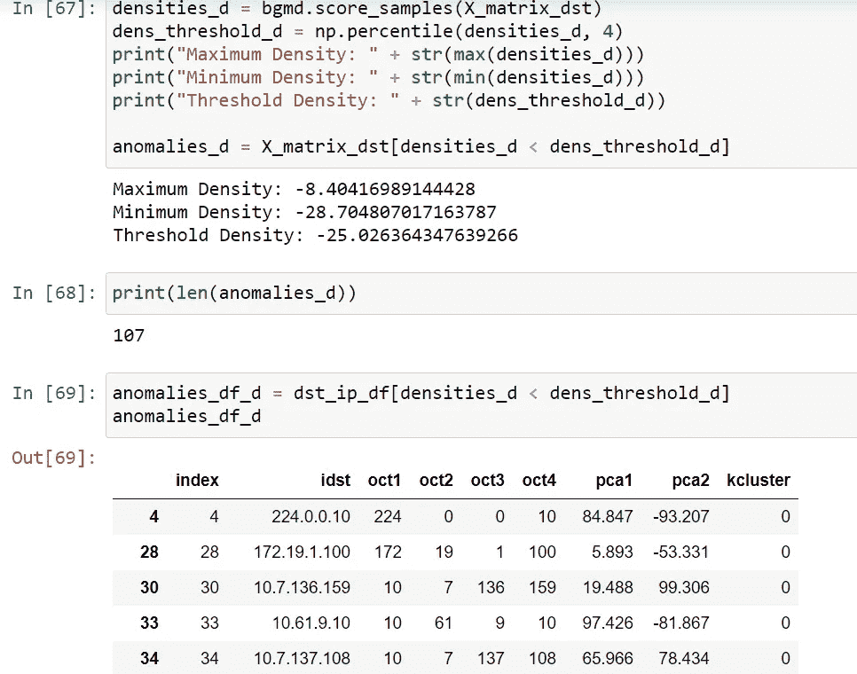

我们绘制了检测到的 107 个异常，以及如下所示的集群。

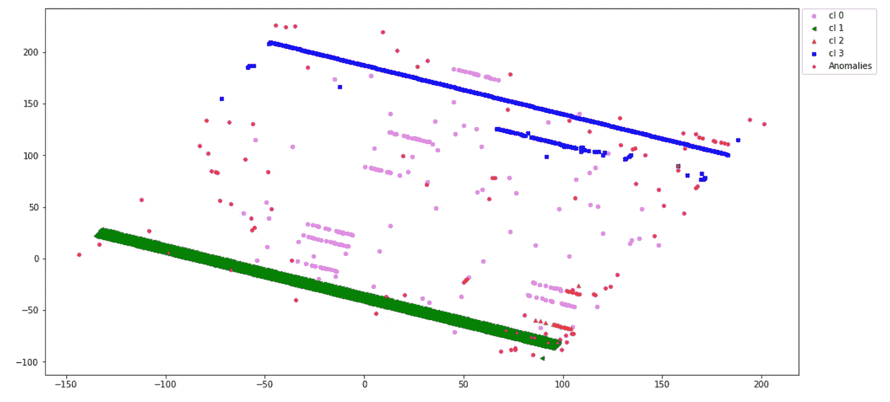

我们可以看到，所有的异常都是广泛分散的星团 0 的一部分。我们可以看到上面用红色标出的他们的位置。

**因此，我们已经使用 GMM 成功地群集了源 ip 地址和目的 ip 地址，并且还检测到了流程中的异常。**

# 6.尝试在目标 IP 地址上进行 K-Means 聚类，并与 GMM 进行比较。

首先，我们通过使用不同数量的簇来尝试 KMeans，并检查图中簇紧密度和簇数量之间的“肘”点，来估计最佳的簇数量。

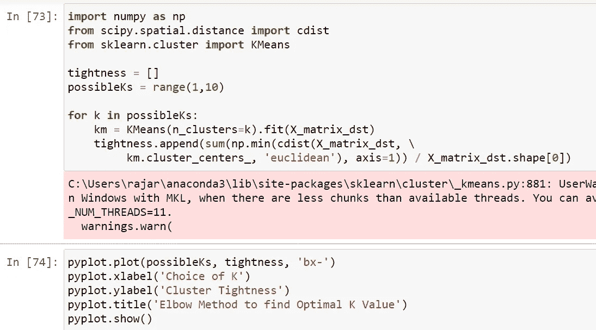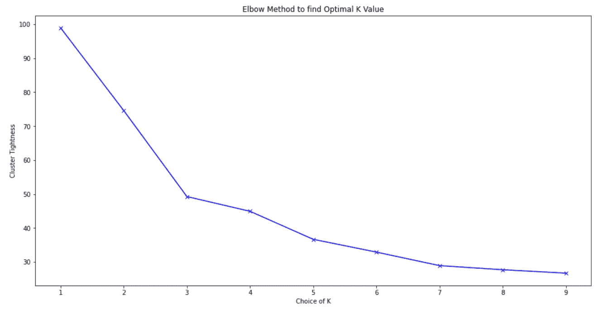

没有明确的一个肘点。我们将选择 5 作为聚类的最佳数量，并通过 K-Means fit_predict 对数据点进行聚类。

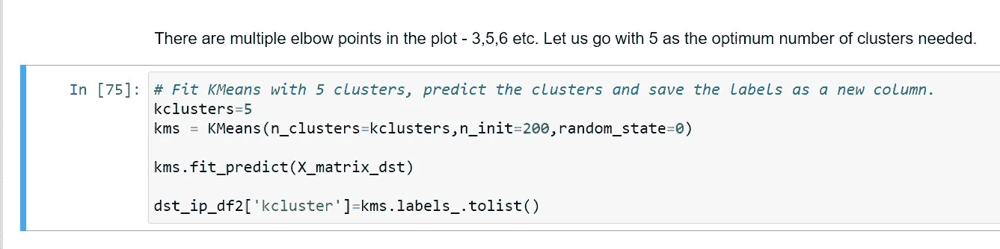

我们绘制了由 K-均值确定的聚类。

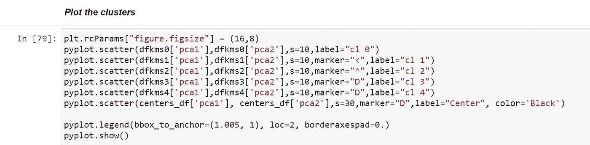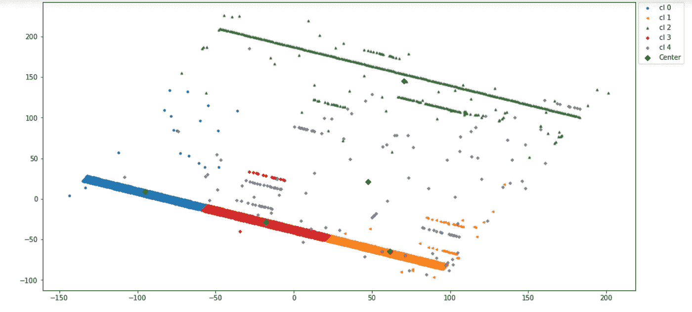

我们可以看到，K-Means 所做的聚类是不同于 GMM。

1.  底部的椭圆体数据点被分成 3 个簇，而 GMM 将它们聚集成一个大簇。
2.  聚类看起来没有清楚地分开，并且包含来自分散数据点的混合数据点。

**总的来说，集群没有 GMM 做得好，界限也不清楚。** **这应该是因为 K-Means 基于聚类中心方法，该方法更适合球形数据块，而不是不同大小和方向的椭球形。**

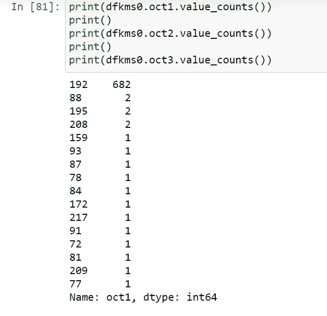

查看群集 0 的第一个二进制八位数本身，我们可以看到它包含子网的混合。虽然它主要由 192.168 组成，但也包含 208。, 195.等等。

K-Means 打破了 192.168 的同质聚类。[21–28]将 IP 地址划分为三个更小的集群，并将它们与分散集中的其他不同 IP 地址混合在一起。

但是如果你还记得，GMM 已经把所有 192.168 年的。[21–28]将地址划分到一个集群(集群 1)中，并且不要与其他 IP 地址混淆。**因此，如预期的那样，对于椭圆形群组，GMM 聚类比 K 均值聚类提供了更好的结果。**

# 结论

我们使用 GMM 和 K-Means 聚类算法对数据集中的 IP 地址进行聚类。

我们看到，GMM 通过清晰地划分椭圆形数据块，比 K-Means 提供了更好的结果，特别是对于目的 IP 地址。

在此过程中，我们还发现了所用 IP 地址中的异常情况。

**谢谢！
希望这很有趣，并对学习有所帮助！**

# 参考资料

*   [IT 网络数据分析](https://www.ciscopress.com/store/data-analytics-for-it-networks-developing-innovative-9780135183465) -作者 John Garret
*   [使用 Scikit-Learn、Keras 和 TensorFlow 进行机器实践学习，第二版](https://www.oreilly.com/library/view/hands-on-machine-learning/9781492032632/)