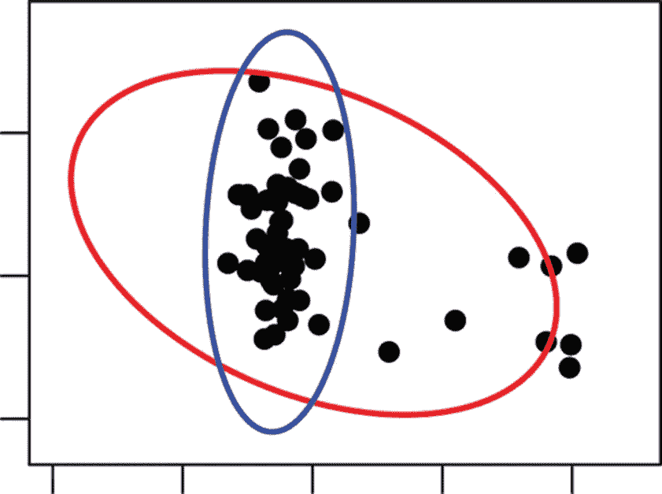
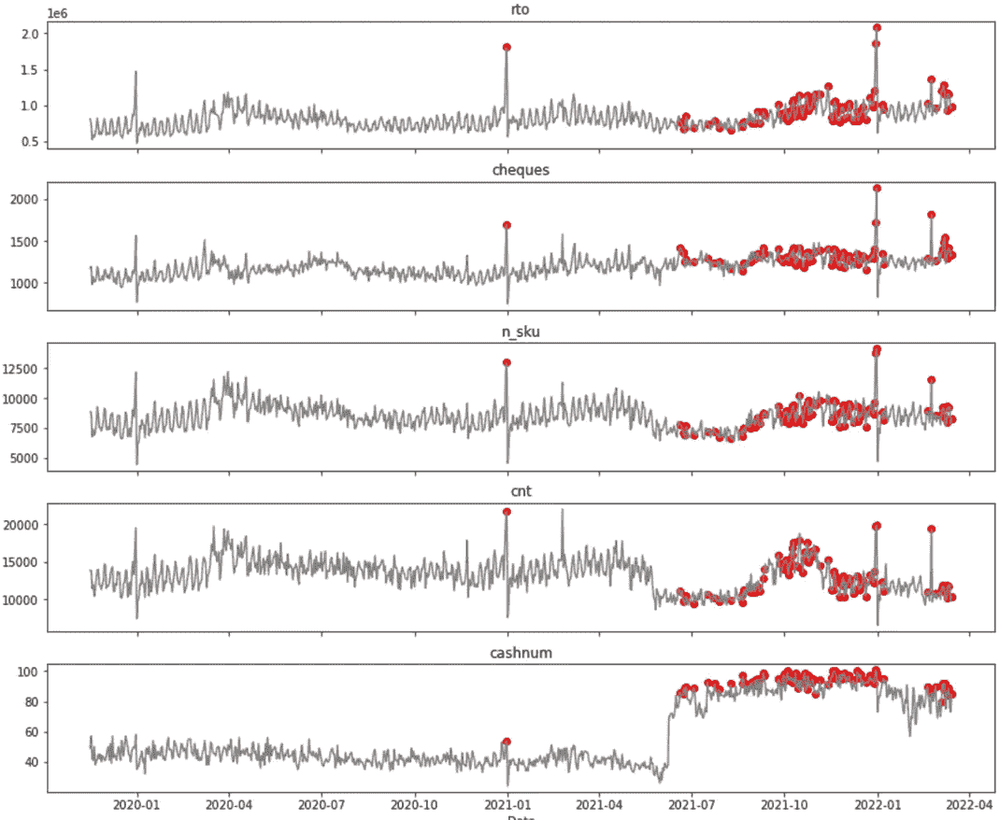

# 使用最小协方差行列式(MCD)的异常检测

> 原文：<https://medium.com/geekculture/anomaly-detection-using-minimum-covariance-determinant-mcd-41dc28ccc8a?source=collection_archive---------1----------------------->

在处理数据的过程中，我们通常面临的任务是对这些数据建立模型以进行预测和数据分析。

可能需要分析来监控和响应过程中的某些变化。工厂里也有类似的任务来控制生产过程。此外，这种分析可能与监控数据中心等中的应用程序和基础架构的负载和状态相关。

数据预测在多个领域都很有趣，例如预测股票市场的汇率或零售店的客流量和购买量。为了解决此类问题，需要创建某种数据模型，并使用它来预测或识别需要特别关注和决策的偏差。

然而，数据中偏差的存在会导致不正确的数据模型。为了消除构建模型时的负面影响，根据合适的策略，寻找异常、将它们从训练样本中清除或替换它们正是所需要的。

在本文中，我将回顾最小协方差行列式(MCD)异常搜索方法，并尝试对此方法给出直观的解释。

**最小协方差行列式(MCD)解释。**



当我们处理数据时，我们假设它是由一定的概率分布产生的。那么具有低概率密度的点可以被识别为异常。对于椭圆分布的数据(例如高斯分布)，这可以通过计算每个点到平均值的马氏距离来实现。异常将是距离最大为某一阈值的点。

马哈拉诺比斯距离是给定点和质心之间的距离除以椭球在给定点方向上的宽度。马氏距离需要分布参数(均值和协方差矩阵)。

中间大家应该都不陌生。协方差是两个随机变量相关性的度量。因此，向量的协方差矩阵是方阵，向量分量的方差位于方阵的对角线上，非对角线元素是分量之间的协方差。

由于在处理原始数据时，均值和协方差矩阵在我们的情况下是未知的，因此需要根据数据对它们进行估计。这就是问题出现的地方，因为数据中的异常会扭曲参数估计，使这些点看起来不那么异常。例如，远异常值会将样本均值拉向自身，并人为地放大样本协方差矩阵。如果我们预先知道哪些点是异常的，我们可以简单地将它们从参数估计中排除，但是这种信息通常是不可用的。

MCD 是一种估计均值和协方差矩阵的方法，可以最大限度地减少异常的影响。这个想法是从被选择为没有异常的数据的子集来估计这些参数。

为此，取一组给定大小的数据子样本，从中确定均值和协方差矩阵。然后存储协方差矩阵具有最小行列式的子集的估计。最小化行列式背后的思想是协方差矩阵的行列式测量分布有多宽。因此，MCD 选择数据分布最密集的子集。这样做是为了排除可能与其余数据相距较远的异常。

**实施**

例如，考虑具有以下结构的杂货店数据集:

*   日期时间—记录观察结果的日期和时间
*   rto—收入
*   支票——这一小时内在商店购买的数量
*   n_sku —售出的 sku 数量
*   cnt —售出的商品数量
*   cash num——商店中该小时营业的收银台数量

这个方法的实现在 PyOD 库中，我们将使用这个库。

```
import pandas as pd
import numpy as np
from pyod.models.mcd import MCDoutliers_fraction = 0.05
random_state = np.random.RandomState(42)

mcd_detector = MCD(contamination=outliers_fraction, random_state=random_state)```read Input data to df:DataFrame
```df = df.set_index('Datetime')
df = df[columns].resample('D').sum()X = df.valuesmcd_detector.fit(X)pred = mcd_detector.predict(X)
```

这是上述数据的算法结果。



可以看出，在商店增设收银台后的观察结果是异常的，因为其余指标保持在同一水平。因此，指标之间的关系发生了显著变化。根据这个情节，我们可以说，这家商店增加收银台并不影响销售，但可能会影响顾客的等待时间，遗憾的是我们没有这样的数据。

**结论**

因此，在本文中，我们研究了如何使用 MCD 方法搜索异常，并尝试在实践中使用 PyOD 包中的实现。

**链接**

[https://wis . kule uven . be/stat/robust/papers/2010/wire-MCD . pdf](https://wis.kuleuven.be/stat/robust/papers/2010/wire-mcd.pdf)

[https://www . machine learning plus . com/statistics/Mahalanobis-distance/](https://www.machinelearningplus.com/statistics/mahalanobis-distance/)

 [## 所有型号- pyod 1.0.2 文档

### 基于角度的离群点检测器(ABOD)基于连通性的离群点因子(COF)算法模型组合的集合…

pyod.readthedocs.io](https://pyod.readthedocs.io/en/latest/pyod.models.html#pyod.models.mcd.MCD) [](https://stats.stackexchange.com/questions/475636/intuitive-explanation-of-minimum-covariance-determinant-mcd) [## 最小协方差行列式的直观解释

### begingroup$检测异常的一种方法是假设常规(非异常)数据是由特定的…

stats.stackexchange.com](https://stats.stackexchange.com/questions/475636/intuitive-explanation-of-minimum-covariance-determinant-mcd)