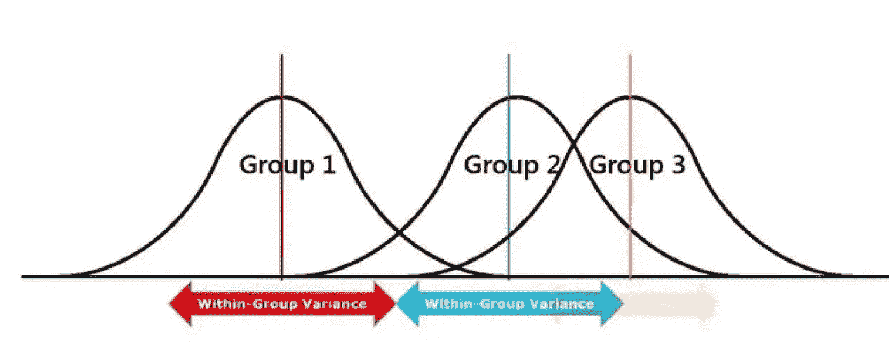
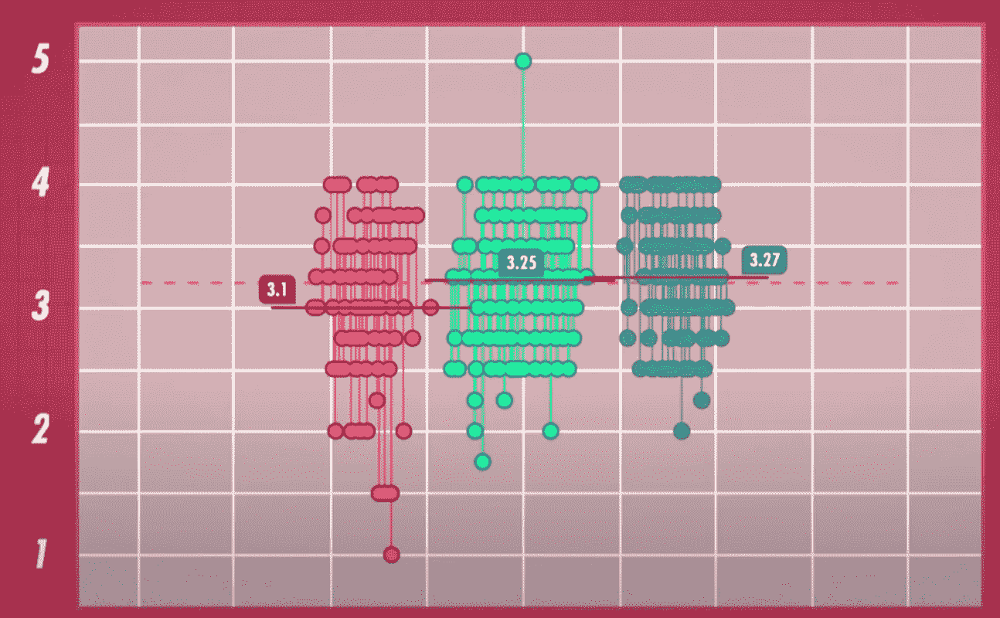
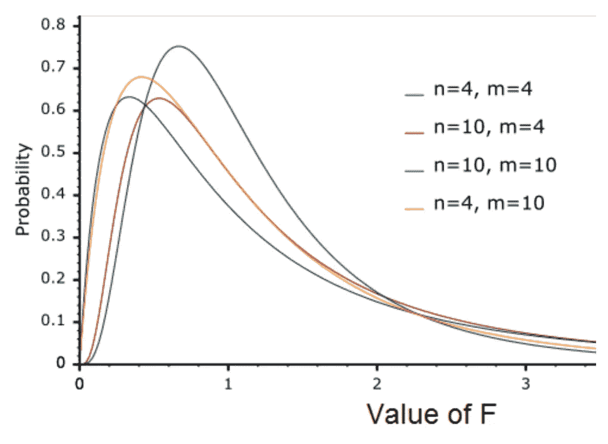
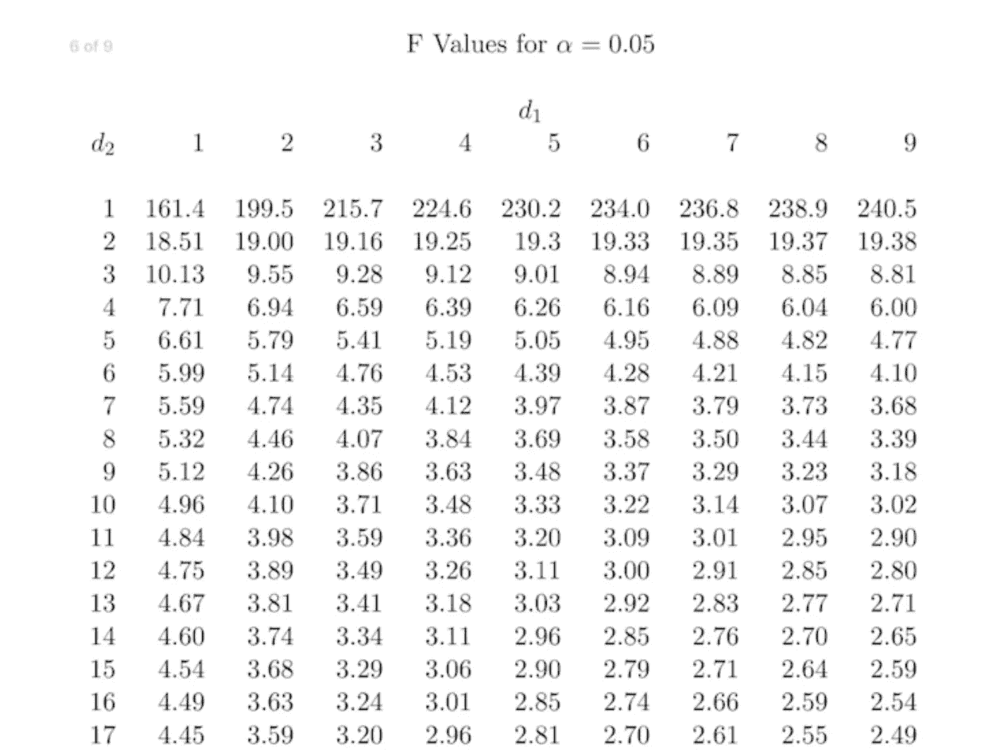

# 方差分析:利用变异性来比较两个以上群体的特征

> 原文：<https://medium.com/geekculture/anova-using-variability-to-compare-characteristics-of-more-than-two-groups-41dab3d4a67e?source=collection_archive---------19----------------------->

credit: leansixsigmadefinition.com

如果我们有 t 检验和假设检验的初步知识，我们可以很容易地比较两个数据集来检验它们是否来自同一人群。这个世界不是二元的，很多时候我们需要比较两个以上的数据集。方差分析是解决这个问题的一个很好的工具。方差分析是一种综合测试，这意味着它表明不同组之间是否存在统计上的显著差异，但需要进行休克后测试来确认不同的确切组。让我们用一个简单的例子来理解这一点。为了简单起见，我将解释单向 ANOVA 检验，它本质上是观察一个变量对不同组的影响。假设我们用三种不同的肥料来种植土豆。我们在花园里选择了三个不同的区域，给每个区域分别施肥。现在，在我们的马铃薯种植完成后，我们从每种类型中挑选 100 个样本，利用这些信息来研究肥料对马铃薯大小的影响。

Variability of three groups of potatoes with grand mean 3.2 inches

分析上述问题的过程之一是使用称为 ANOVA 的可变性数据。在继续之前，我们必须非常清楚正态分布、可变性以及最重要的假设检验的概念。这个想法是比较单个组内的方差和所有样本的总体方差，以查看这些组是否属于同一总体。

该测试的无效假设和替代假设是:

Ho: μ(第 1 组)= μ(第 2 组)= μ(第 3 组)，μ代表从中抽取每个样本的总体平均值)

哈:至少有两个群体来自不同的人群

正如我提到的，我们将考虑方差，它有两个部分，**平方和**和**自由度**。我们正在研究组方差和总体方差。以下各节详细介绍了与每种方差相关的术语

## 组差异:

这与个体群体有关，在我们的例子中，马铃薯是用每种肥料种植的。

**模型的平方和(SSM):** 这个术语解释了每组的可变性。例如，组 1 的样本均值是 3.1。我们首先找出每个样本大小和样本均值之间的差异，并对它们求平方。我们称之为这个模型是因为它给了我们一个可变性的信号，但是没有考虑由整体可变性引起的噪声。

**自由度:**有 3 个单独的组，所以自由度是 3–1 = 2。样本量为 n 的分类变量的自由度是 n-1。

**均方误差(MSE (Model)):** MSE 是从平方和中获得的独立信息。我们用自由度划分 SSM 来得到 MSE。SSM =(3.2–3.1)+(3.25–3.2)+(3.27–3.2)= 0.0174，df(M) = 2，MSE=0.0174/2 = 0.0087

## 总体差异:

这与每个数据点相对于总体平均值的总体可变性有关。这也被称为误差或噪声，因为模型没有考虑整体可变性。

**误差平方和(SSE(Error)):** 它遵循与 SSM 相同的步骤，只添加来自总体平均值的每个数据点的平方和。在我们的例子中，SSE = 63.261

**自由度:**误差的自由度计算为 n2-n1，其中 n2 为所有组中数据点的总数，n1 为组数。在我们的例子中，df = 300–3 = 297

**均方误差(MSE (error)):** 遵循与 MSE(model)相同的公式，有 SSE(error)，df(error)。MSE(误差)=63.261/297 = 0.213

## f 统计量:

为了理解 F 统计，我们首先需要知道 F 分布。F-table 看起来与 z-table 或 t-table 等任何其他统计表格都非常不同。f 分布是一条右偏卡方曲线，取决于自由度。

F-distribution for different degrees of freedom

F 的值总是正的，因为它是平方的比值。我们教科书中的 F 表(如下图所示，α= 0.05)给出了不同置信区间和自由度组合的 F 值。对于 n1 = 3，n2 = 15，α = 0.05，F 值为 3.29。我们通常让计算机计算 F 值，而不是查看冗长的 F 表

**我们土豆的 F 统计量**示例= **MSE(模型)/MSE(误差)= 0.01995/0.213 = 0.09366**

F 统计用于在我们的显著性水平上比较临界 F 值，以确认是否有任何统计显著性，如在假设 t 检验中。

**α= 0.05，n1 =2，n2 = 297 时的临界 F 值**为 3.02615

现在，临界 F 值大于 F 统计量，因此方差在显著性水平 0.05 时位于可接受区域，因此，**我们未能拒绝零假设，根据我们的测试，使用不同肥料对马铃薯大小没有太大影响(记住，根据我们的样本大小和显著性水平 0.05！！！！！！)**

我们可以使用任何在线工具来为我们的 F 统计量寻找 p 值。F = 0.09366 的 p 值是 0.91062 >>0.05。因此，我们再次未能拒绝与上述结果一致的零假设。

当我们有很多样本，并且我们想要发现一个因素是否影响样本时，方差分析非常有用。上面的解释给出了单向 ANOVA 检验的简要概念，它可以扩展到更复杂的方差分析。

我想用统计学家罗纳德·费希尔爵士的话来结束这篇文章**“方差分析不是一个数学定理，而是一种安排算术的方便方法”**