# 汇总统计会骗人。以下是如何通过数据可视化变得更聪明——Anscombe 的四重奏

> 原文：<https://medium.com/geekculture/anscombes-quartet-b66d2a3ae6ba?source=collection_archive---------41----------------------->

为了说明这一点，让我给你介绍一下安斯科姆的四重奏。它包括四个具有相似统计概要的数据集。它们具有相同的集中趋势、相关性度量，甚至相同的线性回归模型。他们在各方面看起来都很像。然而，你把数据可视化和一个完全不同的故事开始出现。在接下来的博客中，您会发现关于数据集及其使用 python 库的可视化的详细注释。

**数据集**

为了解释这个概念，我用了四个数据集，11 个数据点，分别代表 x 和 y 值。

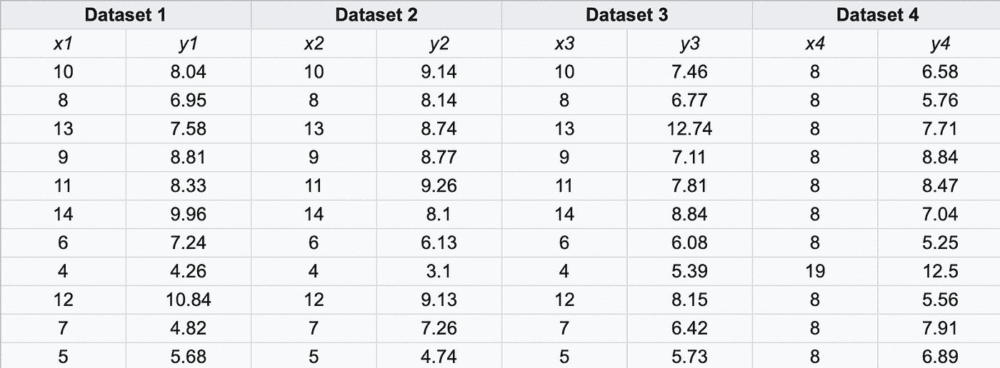

所有四个数据集的统计摘要如下。我在下面的博客中分享了创建回归模型的详细代码。

做一个散点图(博客末尾的详细代码)，你瞧，图表如下所示:

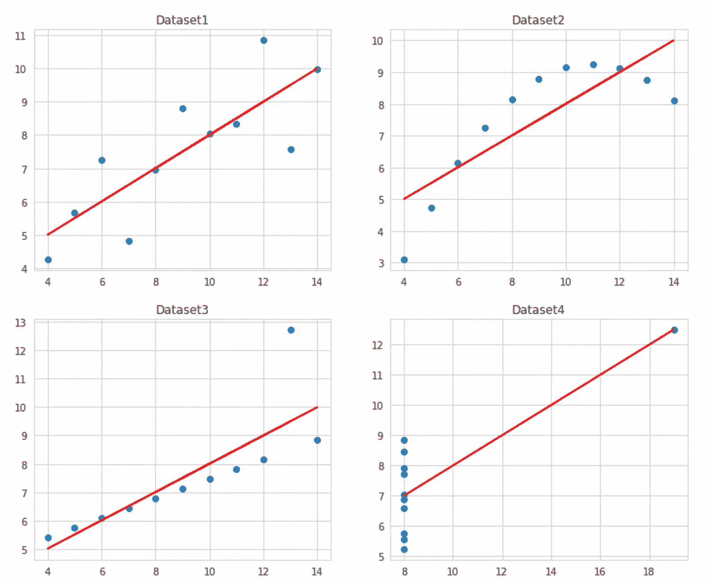

*   数据集 1:我们可以看到 x 和 y 值之间明显的正相关关系。
*   数据集 2:x 和 y 之间缺乏线性关系
*   数据集 3:虽然 x 和 y 之间存在线性关系，但我们也有一个异常值，它导致相关性从 1 下降到 0.816
*   数据集 4:在第四个图中，我们可以看到一个高杠杆离群点如何导致高相关值。**杠杆**是测量一个观察的独立值与其他观察的独立值之间的距离

如上所述，很明显，我们不能仅仅依靠统计摘要。当我们试图感受数据并分析它时，可视化是关键的一步。

在余下的博客中，我将带您了解理解每个数据集、得出统计值和绘制图表的详细步骤。

下面是我用来演示这一点的 python 库:

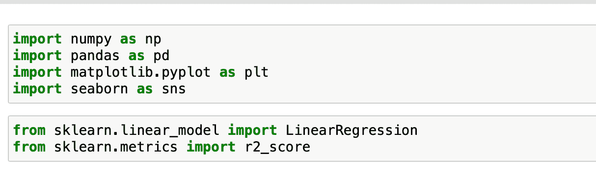

1.  Numpy —对数据集执行数值和统计操作
2.  熊猫-用于创建数据框
3.  Matplotlib & Seaborn 执行数据可视化和开发推理
4.  Scikit 库中的线性回归，通过训练模型获得系数和截距
5.  scikit 的 R2 分数了解如何获得 r 的平方值

让我们开始分析数据集:

**第一个数据集**

1.构建第一个数据集

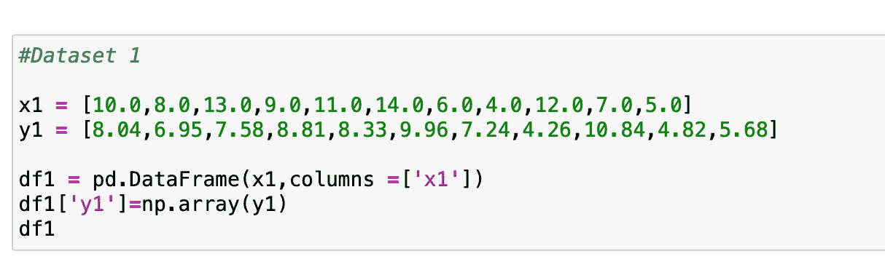

2.检查数值

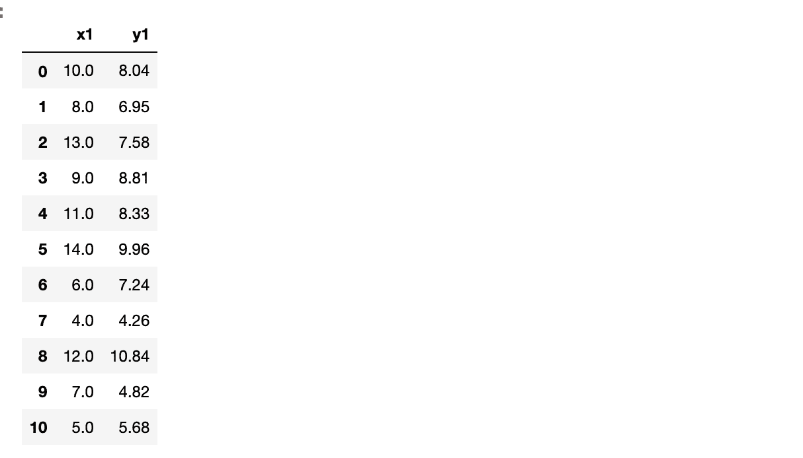

3.检查统计摘要

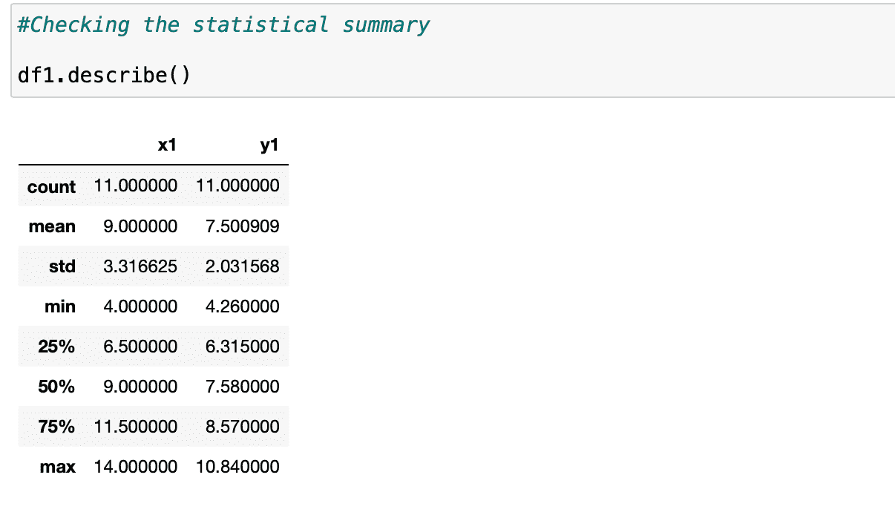

我们可以观察到 x1 的平均值是 9，y1 的平均值是 7.5

4.现在让我们检查 x1 和 y1 之间的相关性

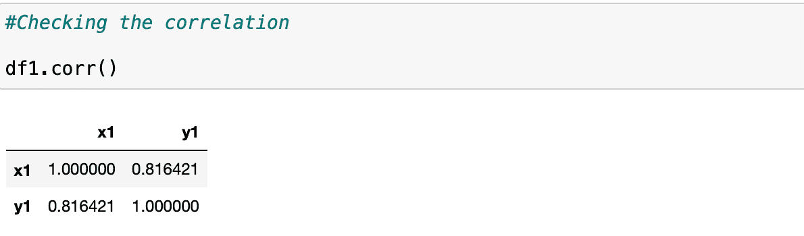

x1 和 y1 之间的相关性是. 816

5.让我们得到线性回归直线方程

将值整形为二维数组，即从(11，)到(11，1)，因为 Scikit learn 学习库需要一个 2D 数组。

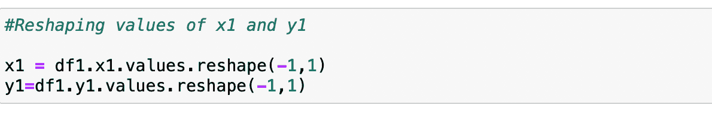

训练模型

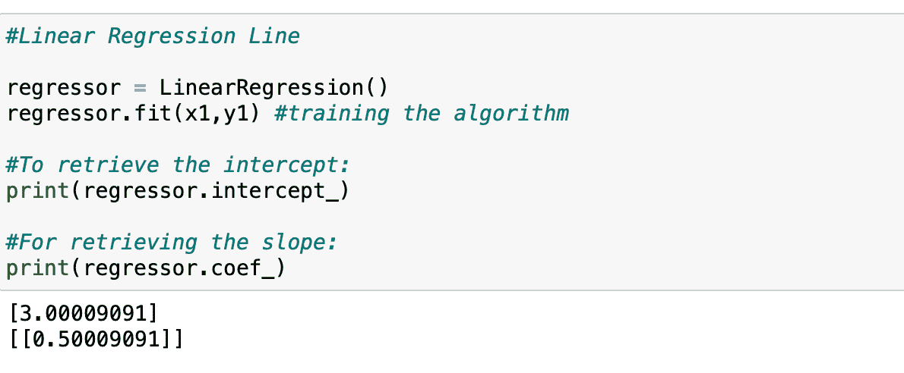

我们可以看到，使用 scikit 学习库用 x1 和 y1 值训练模型后，我们得到截距为 3.0，斜率为 0.5

y1=3.0+0.5*x1

6.现在让我们检查一下 r 的平方值

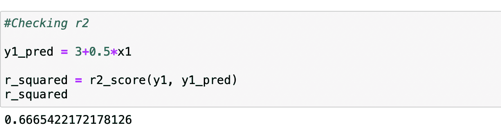

r 的平方值是 0.67

总之，我们得到数据集 1 的以下值

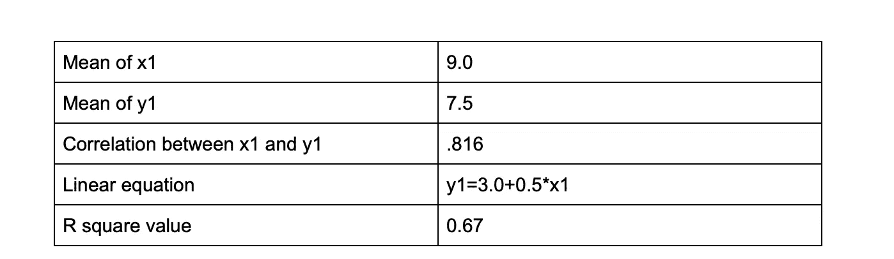

同样，我们可以分析其他数据集，其代码可以在我的 git [链接](https://github.com/akanshakhandelwal/Python-Notebooks/blob/main/Anscombe%27s_quartet.ipynb)中找到。

为了便于比较，让我们并排绘制所有四个数据集。

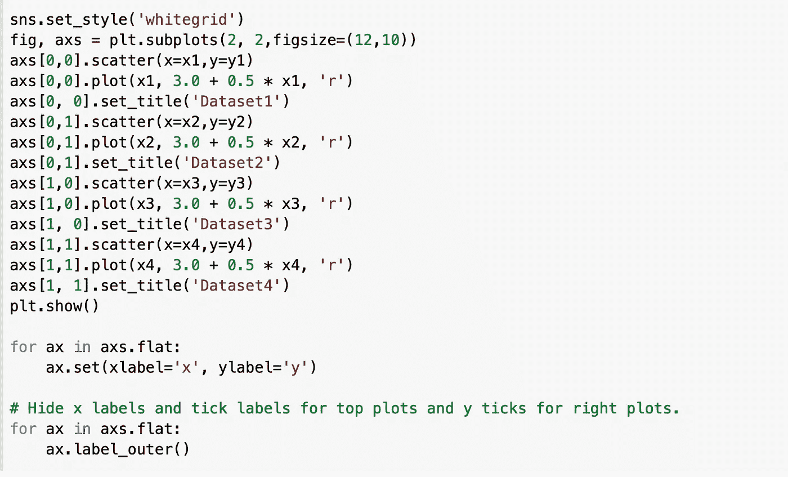

由此产生的情节将是我们前面已经看到的

**结论:**

当涉及到理解数据时，可视化可以揭开面纱，并使您免于根据汇总统计数据对数据做出错误的假设，正如我们在 Anscombe 的 quartet 数据集中看到的那样。

**参考文献:**

[**https://en.wikipedia.org/wiki/Anscombe's_quartet**](https://en.wikipedia.org/wiki/Anscombe's_quartet)