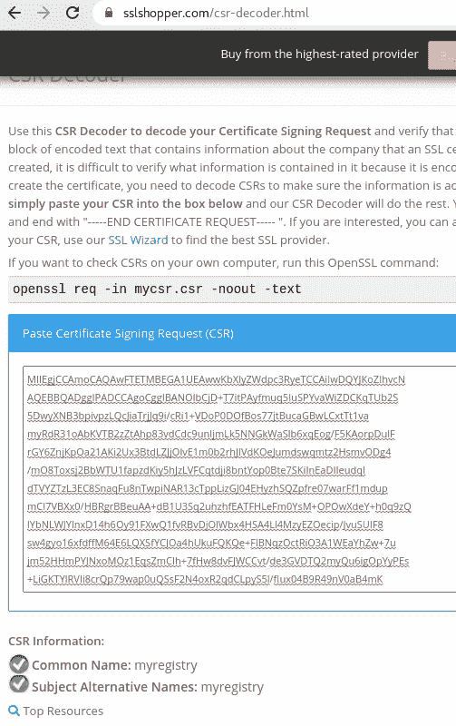
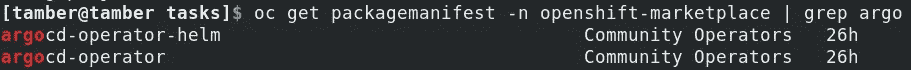
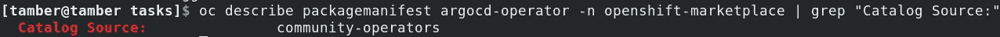

# ansi ble Automation——在受限网络中将运算符导入 OCP OLM——第 1 部分

> 原文：<https://medium.com/geekculture/ansible-automation-importing-operators-into-ocp-olm-in-restricted-networks-part-1-7839ce8fca92?source=collection_archive---------23----------------------->


# 自动化是关键

我不得不承认，我手动做这个过程太多次了；直到有一次我忘记了一个命令，解决这个问题只是耗费时间(和动力)。

最终，不可避免地，一个(明显的)解决方案会出现；所以我坐下来，写了一个“小”可行的剧本，从头到尾做了所有的工作，我唯一的遗憾是我没有早点这么做。

完全公开——我写它是为了个人使用，因此——它是作为“概念验证”来写的——这意味着有很大的空间来完善它，但作为一个原型，它工作得非常好。

## 该操作有两个主要步骤

1.  镜像我的目标操作员需要的所有相关图像，并将其存档
2.  提取内部/受限网络中的档案，并将其导入到我们的 Openshift 集群中

这篇“第 1 部分”文章将关注第一步，我将为另一个写另一篇。


整个 ansible-driven 解决方案位于我的 [Github](https://github.com/tommeramber/ocp-automations) 中，本文将描述它包含的内容和需要的步骤。

# 安全说明

由于某些任务需要更高的权限，因此本行动手册可以作为高权限用户运行。由于首先应该运行它的只有集群管理员，而且它运行在一个连接的网络中，所以在 Fedora/RHEL 虚拟机上以 root 用户身份运行它看起来并没有那么不合理。

# 先决条件

1.克隆我的回购

```
$ sudo su -
# git clone [https://github.com/tommeramber/ocp-automations.git](https://github.com/tommeramber/ocp-automations.git)
# cd ocp-automations/Operator-Importing-for-Restricted-Networks
```

2.安装下列 Ansible 模块；不必要地提到你必须确保你已经安装了 Ansible。

```
# sudo ansible-galaxy collection install community.crypto
# sudo ansible-galaxy collection install containers.podman
# sudo ansible-galaxy collection install community.general
```

3.**确保对 YAML *角色/部署-本地-注册表/任务/生成-拉取-秘密. yaml*** *做所有需要的调整。*此处指定了所需的更改:[https://github . com/tommeramber/OCP-automations/blob/ansi ble-roles/Operator-Importing-for-Restricted-Networks/roles/deploy-local-registry/tasks/readme . MD](https://github.com/tommeramber/ocp-automations/blob/main/Operator-Importing-for-Restricted-Networks/roles/deploy-local-registry/tasks/README.md)

# 角色结构

```
[Operator-Importing-for-Restricted-Networks]# tree
.
├── **playbook.yaml**
├── README.md
└── roles
    ├── **cleanup**
    │   ├── tasks
    │   │   └── main.yml
    ├── **deploy-local-registry**
    │   ├── tasks
    │   │   ├── generate-pull-secret.yaml
    │   │   ├── login-to-external-registries.yaml
    │   │   ├── main.yml
    │   │   └── run-registry.yaml
    ├── **install-required-tools**
    │   ├── tasks
    │   │   └── main.yml
    └── **run-custom-index-container-and-mirror**
        ├── tasks
        │   ├── generate-custom-index-image.yaml
        │   ├── main.yml
        │   ├── mirror-manifests-and-generate-mapping-file.yaml
        │   └── skopeo-copy-the-relevant-images-and-compress.yaml
```

本行动手册由 4 个角色组成

```
---
- hosts: localhost
  vars:
    # In use in both: "run-custom-index-container-and-mirror" and "cleanup" roles
    index_image: community-operator
    index_image_version: v4.6roles:- role: **deploy-local-registry**
      vars:
        user: "dummy"
        password: "dummy"- role: **install-required-tools**
      vars:
        ocp_version: "4.6.8"
        opm_version: "v1.18.0"
        grpcurl_latest_version_number: "v1.8.2"- role: **run-custom-index-container-and-mirror**
      vars:
        required_operator: argocd- role: **cleanup**
```

正如你所看到的，它是以这样一种方式设计的，你只需要改变几个变量就可以用最少的努力得到不同的操作符。

它一次只对一个操作员有效。

在上面的代码中，你可以看到我正在使用 community-operator-index-image(var:`index_image`)，用于 openshift v4.6 (var: `index_image_version`和 var: `ocp_version`)，并且我想获得 *ArgoCD* 操作符(var: `required_operator`)。


如果我想得到官方的 RedHat Openshift-GitOps 操作符，我需要做的就是改变:

```
# In the playbook role I'm using a "like" comparison that gives the first match found 
required_operator: **gitops** index_image: **redhat-operator**
```

如果我想要一个不同版本的 Openshift 集群的映像，我将更改:

```
# Change X to correleate to your OCP minor-version
ocp_version: "4.7.**X**"
index_image_version: v4.7
```

注意`index_image_version`也应该被改变。

另外，请注意，您可能需要根据文档中的[规范，为您的特定 Openshift 版本(我在此概念验证中使用的是 4.6 版本)更改一些其他变量(例如`opm_version`)。](https://docs.openshift.com/container-platform/4.6/operators/admin/olm-restricted-networks.html)

# 角色 1 — **部署本地注册表**

> 我们将关注以下路径中的 YAML 文件:**OCP-automation/roles/deploy-local-registry/**

该过程从创建一个本地注册表开始，该注册表最终将包含我们期望的操作符所需的所有图像，以及使导入部分尽可能平滑所需的所有额外文件；

这第一部分是根据红帽在 Openshift 博客中的精彩文章:[https://cloud . Red Hat . com/blog/open shift-4-2-disconnected-install](https://cloud.redhat.com/blog/openshift-4-2-disconnected-install)

**注意！**我不会在这里展示每一个可行的任务，因为很多都是非常基本的。

## 第 1 部分—角色/部署-本地-注册表/任务/运行-注册表. yaml

最初的几项任务非常简单；我们正在确保机器上安装了 Podman、Httpd 和 Httpd-tools。

之后，我们将创建 3 个目录，作为我们本地注册表的未来卷；从这些，本地注册表容器将从&到&拉&推数据/文件。

接下来，我们将记录“myregistry”添加到`/etc/hosts`中，这样我们以后就可以通过名称来访问它。

现在我们为以后的证书创建生成一个 OpenSSL 私钥；为此，我们安装了`community.crypto` Ansible 模块；

```
- name: Generate an OpenSSL private key with the default values (4096 bits, RSA)
community.crypto.openssl_privatekey:
  path: /tmp/myregistry/certs/myregistry_key.pem
```

然后，我们为将要生成的未来证书生成一个基本证书签名请求(CSR)。注意`common_name`等于我们编辑的`/etc/hosts`文件中的记录

```
- name: Generate an OpenSSL Certificate Signing Request
community.crypto.openssl_csr:
  path: /tmp/myregistry/certs/myregistry.csr
  privatekey_path: /tmp/myregistry/certs/myregistry_key.pem
  common_name: myregistry
```

如果你在这方面遇到问题，只需复制 CSR 文件的内容并解码；请确保常用名是正确的。



一旦我们有了有效的 CSR 文件，我们就可以为我们的注册中心生成自签名证书:

```
- name: Generate a Self Signed OpenSSL certificate for myregistry
  openssl_certificate:
    path: /tmp/myregistry/certs/myregistry_crt.crt
    privatekey_path: /tmp/myregistry/certs/myregistry_key.pem
    csr_path: /tmp/myregistry/certs/myregistry.csr
    provider: selfsigned
```

稍后，我们将新生成的证书复制到我们的`/etc/pki/ca-trust/source/anchors`，并运行`update-ca-trust extract` *。*

我们为我们的注册中心添加相关的端口，以便正确地操作`firewalld`策略，最后，我们用所有需要的附件和卷运行注册中心；

```
- name: Create a registry container
  containers.podman.podman_container:
    name: myregistry
    image: docker.io/library/registry:2
    state: started
    ports:
      - 5000:5000
    volume:
      - /tmp/myregistry/data:/var/lib/registry:z
      - /tmp/myregistry/auth:/auth:z
      - /tmp/myregistry/certs:/certs:z
    env:
        REGISTRY_AUTH: "htpasswd"
        REGISTRY_AUTH_HTPASSWD_REALM: "Registry"
        REGISTRY_HTTP_SECRET: "ALongRandomSecretForRegistry"
        REGISTRY_AUTH_HTPASSWD_PATH: /auth/htpasswd
        REGISTRY_HTTP_TLS_CERTIFICATE: /certs/myregistry_crt.crt
        REGISTRY_HTTP_TLS_KEY: /certs/myregistry_key.pem
```

## 解释者

*   使用图像:`docker.io/library/registry:2`
*   通过主机上的端口`5000/tcp`导出对注册服务`(5000/tcp)`的访问
*   附上相关的卷

1.  主机上的`/tmp/myregistry/data`将被装载到`/var/lib/registry`，这是我们所有镜像映像最终将被保存的位置
2.  主机上的`/tmp/myregistry/auth`将被挂载到`/auth`上，这样容器就可以访问`htpasswd`文件，并且能够验证它从我们这里接收到的调用
3.  主机上的`/tmp/myregistry/certs`将被安装到`/certs`上，因此该容器将允许 HTTPS 访问它

*   配置所需的环境变量

最后但同样重要的是，我们将`podman save` 作为我们的注册表基础映像；我们将把它`(podman load)`导入到受限网络中，以便运行 myregistry 容器，其中包含操作员的所有图像。

```
- name: Podman save the registry image to tar
  shell: "podman save > registryimage.tar docker.io/library/registry:2"
```

## 第 2 部分—roles/deploy-local-registry/tasks/generate-pull-secret . YAML

在这个 yaml 文件中，我们正在运行与创建 pull-secret.json 文件相关的任务；这将有助于我们登录所有不同的注册表。

> 请注意，您需要使用不同的令牌来编辑它。

**此处指定了所需的更改:**[https://github . com/tommeramber/OCP-automations/blob/main/Operator-Importing-for-Restricted-Networks/roles/deploy-local-registry/tasks/readme . MD](https://github.com/tommeramber/ocp-automations/blob/main/Operator-Importing-for-Restricted-Networks/roles/deploy-local-registry/tasks/README.md)

## 第 3 部分—roles/deploy-local-registry/tasks/log in-to-external-registries . YAML

这个 YAML 由我们之前创建的 pull-secret.json 文件中指定的所有注册中心的`podman login` 任务组成。

# 角色 2—安装所需工具

这个名字太字面了，老实说，我没有什么别的要说的了。

该角色 yaml 位于:**roles/install-required-tools/tasks/main . yml**

# 角色 3 —运行-自定义-索引-容器-镜像

棘手的部分来了。

## 第 1 部分-roles/run-custom-index-container-and-mirror/tasks/generate-custom-index-image . YAML

我们需要知道哪个索引图像提供了我们的操作符；您可以在这里看到不同的选项:


如果您不确定，只需登录到一个已连接的 Openshift 环境，并为所需的操作员运行以下命令:

```
$ oc get packagemanifest -n openshift-marketplace | grep <operator>
```



```
$ oc describe packagemanifest <desired_operator_name> -n openshift-marketplace | grep "Catalog Source:"
```



**根据您的发现编辑 OCP-automations/Operator-Importing-for-Restricted-Networks/playbook . YAML**中的 *index_image* 和*required _ Operator*ansi ble 变量。

1.  拉出相关的索引图像
2.  运行它
3.  抓住它提供的运营商包

```
- name: Pull the Marketplace index image
  containers.podman.podman_image:
    name: registry.redhat.io/redhat/{{index_image}}-index:{{index_image_version}}
    auth_file: /tmp/pull-secret.json- name: Run the index image
  containers.podman.podman_container:
    name: "{{index_image}}-index"
    image: registry.redhat.io/redhat/{{index_image}}-index:{{index_image_version}}
    state: started
    ports:
      - 50051:50051- name: Run grpcurl to get the list of packages (Operators) available
  shell: /usr/local/bin/grpcurl -plaintext myregistry:50051 api.Registry/ListPackages > operators-packages.txt
```

然后，我们使用所需的操作符名称过滤 operators-packages 列表——注意，如果我们的字符串有多个匹配项，那么只有第一个匹配项会出现。

```
- name: filtering for desired operators from the index list
  shell: cat operators-packages.txt | grep "{{ required_operator }}" | sed 's/"//g'| awk '{print $2}' | head -n 1
  register: filtering_result
```

之后，我们修剪原始列表并生成一个定制的索引图像，其中只包含我们想要的操作符。将新的索引图像保存在本地的`my-{{index-image}}-index:v1`下

```
- name: 'Prunning the original index image and generate a new one'
  shell: "sudo /usr/local/bin/opm index prune -f registry.redhat.io/redhat/{{index_image}}-index:{{index_image_version}} -p {{ filtering_result.stdout }} -t my-{{index_image}}-index:v1"
  register: prunning_output
```

最后，使用 auth.json(我们复制到另一个位置的 pull-secret.json)删除旧的索引图像并将新的图像推送到我们的 myregistry 容器中；

```
- name: Stop the original index container
  containers.podman.podman_container:
    name: "{{index_image}}-index"
    state: absent- name: Push new image to local registry
  containers.podman.podman_image:
    name: "my-{{index_image}}-index:v1"
    push: yes
    auth_file: /run/containers/0/auth.json
    tag: v1
    push_args:
      dest: "myregistry:5000/myindeximages/my-{{index_image}}-index:v1"
    validate_certs: no
```

## 第 2 部分-roles/run-custom-index-container-and-mirror/tasks/mirror-manifest-and-generate-mapping-file . YAML

此时，我们可以开始镜像我们想要的操作员所需的映像清单

```
- name: mirror the manifests of the required operators from the new, custom index image on myregistry
  shell: sudo /usr/local/bin/oc adm catalog mirror myregistry:5000/myindeximages/my-{{index_image}}-index:v1 myregistry:5000 -a /run/containers/0/auth.json --manifests-only --insecure
```

这个命令将在我们当前的目录中创建一个新的目录，这个目录以我们的自定义索引图像命名，它应该包含我们稍后将使用的`mapping.txt`文件和`imageContentSourcePolicy.yaml`。

这一部分以我们基于自动生成的映射文件创建一个新的映射文件结束。

```
- name: "Generate my_mapping.txt file."
  shell: "cat my-{{index_image}}-index-manifests/mapping.txt | awk -F'=' '{print $1}' | awk -F'{{url_prefix.stdout}}' '{print $2}' >> my_mapping.txt"
```

## 第 3 部分-roles/run-custom-index-container-and-mirror/tasks/sko peo-copy-the-relevant-images-and-compress . YAML

基于我们新的映射文件，我们将生成包含更新后的`skopeo copy`命令的`run.sh`文件

```
- name: Generate the Skopeo commands for mirroring the operators required images to your local registry
  shell: cat my_mapping.txt | awk '{print "sudo skopeo copy --all --authfile=/run/containers/0/auth.json docker://{{url.stdout}}"$1" docker://myregistry:5000"$1 " --dest-tls-verify=false"}' >> run.sh
```

然后，剧本将所有相关数据(包括我们的操作员所需的图像)复制到一个目录中，并对其进行压缩，以便以后在受限网络中提取。

# 角色 4—清理

我们希望在系统上留下最少的剩余部分，并让系统做好再次运行剧本的准备，以防我们需要额外的操作员。

**位于:OCP-automations/Operator-Importing-for-Restricted-Networks/roles/clean up/tasks/main . yml**

# 情况就是这样

只需在您运行剧本的同一个目录中运行`ls`，您应该会看到`data.tar.gz` —将其复制到可移动介质并导入受限网络。

另一篇后续文章即将发表。