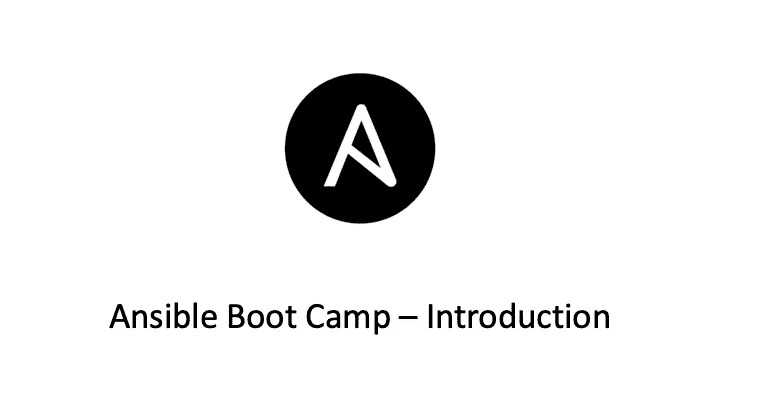

# Ansible 新兵训练营 1 —什么是 Ansible

> 原文：<https://medium.com/geekculture/ansible-boot-camp-1-what-is-ansible-b80abff314ac?source=collection_archive---------5----------------------->

## Ansible 新兵训练营系列

# 什么是可能的

Ansible 是一款自动化运维工具，基于 Python 开发，集合了众多运维工具(Puppet、chef、fabric 等)的优点。)，并实现了批量系统配置、批量程序部署、运行命令等功能。