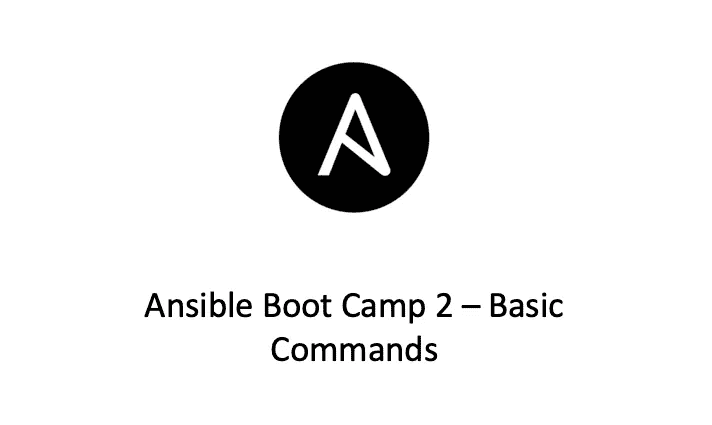

# Ansible Boot Camp 2—基本命令

> 原文：<https://medium.com/geekculture/ansible-boot-camp-2-basic-commands-433435df7e65?source=collection_archive---------8----------------------->

## Ansible 新兵训练营系列



在我的上一篇文章中，我介绍了什么是 Ansible 以及如何安装最新版本。在本文中，让我们看看 Ansible 的一些基本命令。

# 可变公共参数

常见的 Ansible run 命令语法如下所示:

```
ansible [-i INVENTORY] [-f FORKS] [-m MODULE] [-a…
```