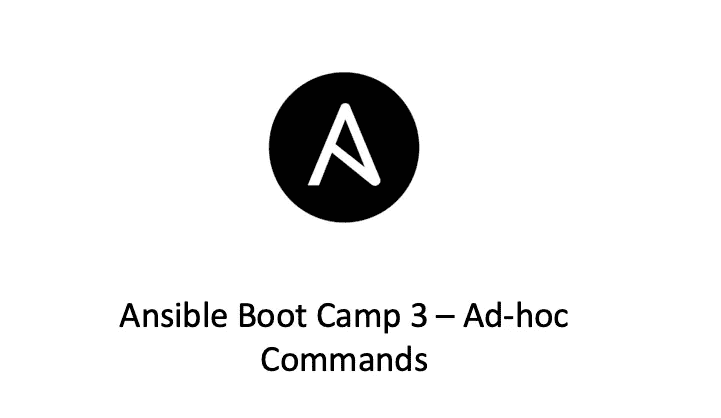

# Ansible Boot Camp 3 —临时命令

> 原文：<https://medium.com/geekculture/ansible-boot-camp-3-ad-hoc-commands-4387140fcef5?source=collection_archive---------6----------------------->

## Ansible 新兵训练营系列

在本文中，我将向您展示 Ansible 如何帮助您快速执行一些常见操作，并使用一些特别的命令收集数据。

Ansible 允许 DevOps 工程师在一台服务器上运行特别的命令，或者同时在数百台服务器上运行。使用这些特别命令，它将使您的基础架构管理和…