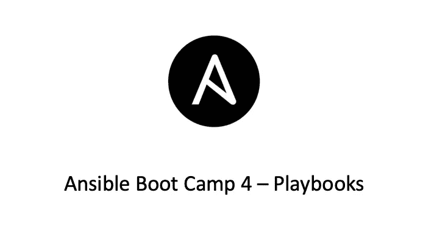

# Ansible Boot Camp 4 —行动手册

> 原文：<https://medium.com/geekculture/ansible-boot-camp-4-playbooks-21084361e492?source=collection_archive---------4----------------------->

## Ansible 新兵训练营系列

# 什么是可行的行动手册

Playbook 是 Ansible 用来描述其配置文件的比喻。Ansible 行动手册提供了一个可重复、可重用、简单的配置管理和多机部署系统。

行动手册包含一个任务(行动)列表，任务(行动)的执行顺序应与一组任务相对应…