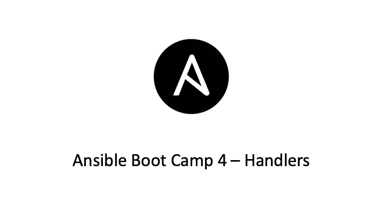

# ansi ble Boot Camp 5-处理程序

> 原文：<https://medium.com/geekculture/ansible-boot-camp-5-handlers-4290f1839c12?source=collection_archive---------4----------------------->

## Ansible 新兵训练营系列

在我之前的 Ansible 文章“[剧本基础](/geekculture/ansible-boot-camp-4-playbooks-21084361e492)”中，我介绍了什么是 Ansible 剧本以及一些简单的 Ansible 剧本用法。在本文中，我们来谈谈一些高级剧本用法。

# 经理人

有时，您希望任务仅在主机发生更改时运行。例如，您可能想要重新启动您的…