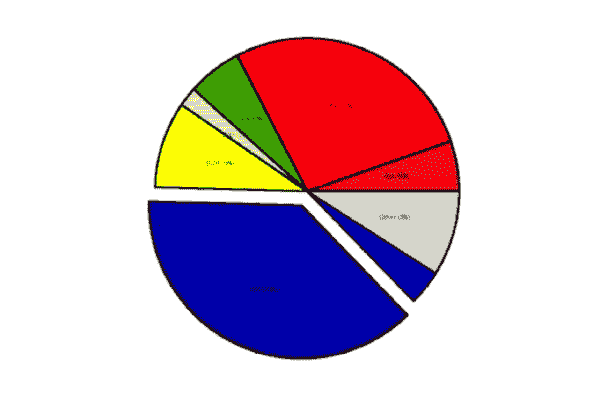

# 反稀释条款:你应该知道什么

> 原文：<https://medium.com/geekculture/anti-dilution-provisions-what-you-should-know-46752486faae?source=collection_archive---------18----------------------->

Image credit: [CC BY-SA 3.0](https://creativecommons.org/licenses/by-sa/3.0/), on Wikipedia

当创业公司和投资者谈判条款清单时，他们理解反稀释条款是很重要的。稀释是指股东在公司中的所有权百分比的减少。公司股份总数的增加会导致稀释。反稀释条款它们还保护投资者在未来的融资中免受持股比例下降的影响。

## **股权稀释的原因**

反稀释条款是创业公司在谈判中需要注意的最重要的保护措施之一。每当一家初创公司发行额外的股本时，发行在外的股票数量的增加会导致每个投资者持有的现有所有权比例发生变化。行使股票期权或认股权证会导致公司已发行股票总数的增加。

Photo by [Adeolu Eletu](https://unsplash.com/@adeolueletu?utm_source=unsplash&utm_medium=referral&utm_content=creditCopyText) on [Unsplash](https://unsplash.com/s/photos/corporate-stock-certificate?utm_source=unsplash&utm_medium=referral&utm_content=creditCopyText)

## 下行轮次中的反稀释

估值的提高可以伴随着额外股票的发行。在这种情况下，稀释效应通常很小。随后的一轮融资通常会提高公司的估值。例如，一家公司通常在 B 轮融资中获得比 A 轮融资更高的估值。然而，相对于之前的估值，一家公司的估值下降了。然后，投资者可能会看到他们在该公司的持股比例大幅下降。公司估值在随后一轮融资中的下降被称为[下跌轮](https://www.investopedia.com/terms/d/downround.asp)。

下行轮次触发反稀释条款，以保护投资者的投资价值免受重大损失。风险资本交易中的文件通常包括反稀释条款，以保护投资者在下跌时免受损失。

反稀释条款保护公司优先股的持有者，而不是普通股。

这是通过调整优先股转换为普通股的转换比率来实现的。转换率规定了投资者将从其持有的每股优先股中获得的普通股的数量。一个简单的公式可以得出转换率:

> 转换比率=购买价格/转换价格

当反稀释条款到位时，转换率上升。因此，优先股投资者每股优先股获得更多的普通股股份。因此，普通股股东持有的股份将被进一步稀释。

转换价格调整可以用不同的方法计算。两种最常见的变化是完全棘轮条款和加权平均条款。

## **全棘轮条款**

在不同的反稀释条款中，完全棘轮条款对优先投资者最为有利。因此，它们是对普通股股东最不友好的条款。

全面棘轮条款的作用是，在随后的一轮融资中，调整转换价格，使其等于较低的股票发行价格。举例来说，假设一个优先投资者最初以每股 2 美元的价格购买了该公司的股票。如果随后的一轮融资是下跌轮，并且股票仅以每股 1.00 美元发行，那么优先投资者的转换价格将同样调整为每股 1.00 美元。这也意味着转化率提高了。投资者可以将其持有的每股优先股兑换为该公司的两股普通股。

全面的棘轮条款可能会对以后的融资产生负面影响。尽管全面的棘轮条款高度保护了公司的早期投资者，但它们可能会阻止一些潜在的新投资者。这是因为后期投资者将无法获得反稀释条款的全部好处。

## **加权平均准备金**

与完全棘轮条款不同，加权平均条款涉及更复杂的计算。完全棘轮条款将优先投资者的转换价格降低到下一轮融资发行的较低价格。加权平均条款仅将转换价格降低到优先投资者的初始购买价格和较低的后续融资价格的平均值。

在加权平均反稀释准备金类别中，有两种计算方法—广义公式和狭义公式。广义和狭义规定的区别在于发行在外的普通股(CSO)的定义。

在一个广泛的公式中，CSO 定义计算了公司的已发行普通股(包括公司优先股转换后可发行的所有普通股)以及通过转换衍生证券(如股票期权)可获得的普通股股份数。狭义准备金的计算不包括这些衍生证券。

## **条款清单中的反稀释条款**

在典型的条款清单中，反稀释条款可能如下所示:

> 反稀释条款:A 轮优先股的转换价格将受到[全棘轮/宽基/窄基加权平均]调整，以减少公司发行额外股权证券时的稀释。

## **战略思考**

在条款清单谈判中，初创企业应该仔细考虑反稀释条款的内容，以及如何构建转换调整的计算。围绕反稀释条款的决定可能会对初创企业创始人和投资者产生重大影响，尤其是在低迷时期。