# 软件开发中应该避免的反模式

> 原文：<https://medium.com/geekculture/anti-patterns-in-software-development-that-you-should-avoid-780841ce4f1d?source=collection_archive---------0----------------------->

Photo by [Free To Use Sounds](https://unsplash.com/@freetousesoundscom?utm_source=medium&utm_medium=referral) on [Unsplash](https://unsplash.com?utm_source=medium&utm_medium=referral)

# 语境

软件开发是一种混乱的活动。因此，明智地应用设计模式**将通过提供成熟的设计范例来帮助你加速开发过程。基本上，设计模式为常见问题提供了可重用的解决方案。除此之外，如果您在解决方案中使用设计模式，您的源代码将变得更加灵活、可重用和可维护。**

****反模式**在设计模式的反面，不可取。人们通常使用的反模式的另一个术语叫做**设计味道。****

# **它们是什么？**

> **注意:下面的列表可能并不详尽。他们只是从我的角度出发。请根据您的经验随意添加更多内容:)**

# **银弹(金锤)**

****

**Photo by [Will Porada](https://unsplash.com/@will0629?utm_source=medium&utm_medium=referral) on [Unsplash](https://unsplash.com?utm_source=medium&utm_medium=referral)**

**Golden Hammer 是一个反模式，不仅在软件开发中，而且在生活的每个方面，你都可以很容易地找到一个样本。有些人倾向于在理解问题之前就准备好解决方案，就像医生开处方，而患者仍在讲述症状，或者像开发人员试图使用现代 UI/UX 框架来构建一个简单的反馈表单，其中包含 4 个文本字段…**

**在软件开发中，每种设计模式、每种框架甚至每种编程语言都适用于典型的问题。然而，有些人对于他们必须解决的每个问题都执迷不悟地使用同一个方法。**

**结果，金锤导致…**

*   ****性能差的代码**:选择的代码不是问题的有效解决方案。**
*   ****过于复杂的代码**:在上面的例子中，开发人员没有使用简单的 HTML 代码，而是使用了 Angular 这样的现代框架，这导致了难以维护，甚至直接影响了性能。**
*   ****多余的代码:****选中的代码不仅没有增加任何好处，还会带来很多无用的代码。****

******如何避免这种反模式？******

*   ****如果你在一个团队中工作(尤其是一个领导者)，你应该先学会倾听别人的意见——不要心胸狭窄。****
*   ****对一个问题至少要有两个解决方案，并对它们进行基准测试。列出每个解决方案的所有优点和 CONS，然后选择更好的一个。****

# ****神级****

********

****Photo by [Rick Mason](https://unsplash.com/@egnaro?utm_source=medium&utm_medium=referral) on [Unsplash](https://unsplash.com?utm_source=medium&utm_medium=referral)****

****一个典型的神类将控制许多其他类，承担许多责任以及许多依赖。这种反模式直接违反了“单一责任”原则。****

****God 类很难进行单元测试、调试和文档化。到时候，它们会和你的应用一起成长，成为维护的噩梦甚至是碰不得的。****

****你的应用程序在一开始就可以设计得很好，根本没有什么神类。然而，需求和开发团队的规模将与日俱增。这样一来，单一的明确定义的类在某个时候就会变成神类。****

****下面是一个神级的例子:****

****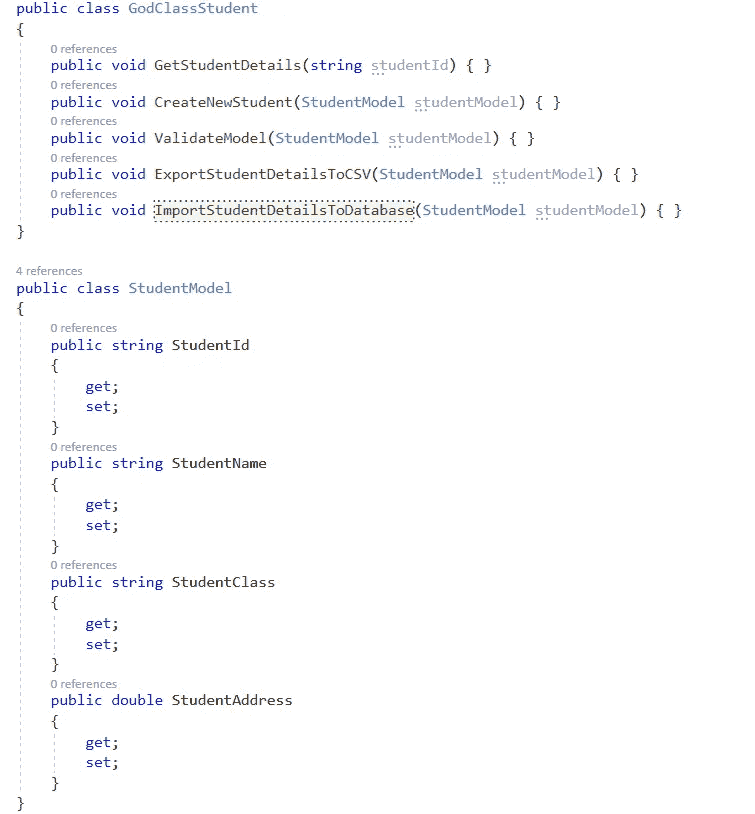****

****figure 1: God Class****

****为了重构上面的 God 类，我们应该将功能分为不同的类和接口，如下所示:****

******导入导出功能及接口:******

****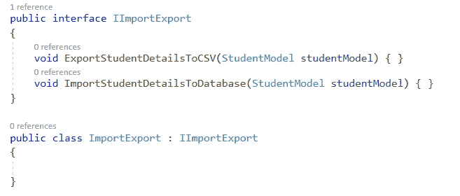****

****figure 2: Import/Export function****

******数据库集成******

****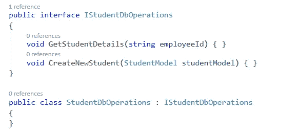****

****figure 3: database integration****

******验证******

****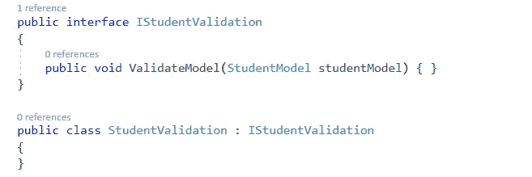****

****figure 4: validation****

******如何避免这种反模式？******

*   ****开发团队应该遵循“单一责任”和“界面分离”的原则。****
*   ****经常做代码审查，检测技术债。****
*   ****类应该被很好地记录。****

# ****大泥球****

********

****Photo by [Gabriel Sanchez](https://unsplash.com/@gabrielsanchez?utm_source=medium&utm_medium=referral) on [Unsplash](https://unsplash.com?utm_source=medium&utm_medium=referral)****

> ****"数周的编码将为你节省数小时的计划时间."—未知****

****大泥球是一种非常常见的反模式，当您的解决方案/应用程序缺乏可感知的、灵活的、合适的架构时就会出现这种情况。如果您的应用程序有以下症状，那么可以认为是“大泥球”。****

*   ****随意和草率的结构，没有编码注释。****
*   ****包含了 6000 多行代码的很多神类。****
*   ****静态变量/函数无处不在。****
*   ****方法被多次重载。****
*   ****没有编码约定。****
*   ****到处都是重复的代码。****

****这种反模式是非常危险的，因为，我们没有意识到我们的应用程序正在变成“一团泥”，直到我们不能再重构它，不得不决定重写。我们不能更早认识到的原因可能来自不同的原因，如需求变化、截止日期临近、采用新的开发人员，甚至我们对初始设计架构过于自信…****

******如何避免这种反模式？******

****一般来说，我们很少能在问题发生时发现它，所以每一个行动都应该在项目开始时应用。如果我们可以检测到问题，那么减轻问题的选择是非常有限和昂贵的。****

*   ****我们应该有一个发现阶段来设计未来的系统，并在开发阶段之前选择最合适的设计来应用。(在一些项目中，为了节省成本，我们通常会绕过这个阶段)。****
*   ****经常检查代码，以便尽早发现问题。****
*   ****在某些时候，如果你的架构不能赶上需求，那么你应该立即采取行动，不要等到太晚。****

# ****错误隐藏和异常吞咽****

********

****Photo by [MIKHAIL VASILYEV](https://unsplash.com/@miklevasilyev?utm_source=medium&utm_medium=referral) on [Unsplash](https://unsplash.com?utm_source=medium&utm_medium=referral)****

****每个应用程序中有效的错误和异常处理在每个应用程序中都非常重要。它们有助于为用户提供愉快的体验，并支持开发人员在出现意外故障时轻松调试和修复问题。****

****等等…我们这里不是在讨论设计模式或最佳实践！****

> ****在计算机编程中，**错误隐藏**(或**错误吞咽**)是捕捉错误或异常，然后继续而不记录、处理或向软件的其他部分报告错误的做法。在计算机编程中，以这种方式处理错误被认为是不好的做法和反模式。在支持异常处理的语言中，这种做法被称为**异常吞咽**。—维基百科。****

****在错误被吞下的情况下，开发人员将不会知道问题的根本原因。因此，很难找出哪里出了问题或者如何解决问题。****

****以下是一些异常吞咽样本:****

*   ******重新抛出一个异常:**我们可以从“catch”块中重新抛出一个异常，并传递给调用者，让调用者以他们想要的方式处理它，以确保**不会使用异常参数**重新抛出一个异常。请看看下面的样品:****

****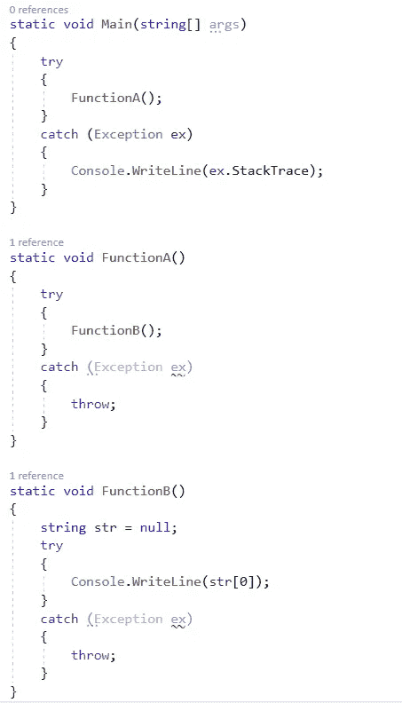****

****figure 5: re-throw an exception****

****你可以很容易地发现“FunctionB”中有一个异常，而“FunctionB”中的“catch”块只是使用“throw”关键字抛出该异常。顺便说一下，从“FunctionB”捕获的异常将在“FunctionA”中处理——我们称之为“重新抛出”。在这种情况下，异常的堆栈跟踪将为您提供该异常发生的详细信息。****

****那么，如果使用异常参数重新抛出异常，会发生什么呢？答案是它不会保留原来的异常，而是创建一个新的异常，如下例所示:****

****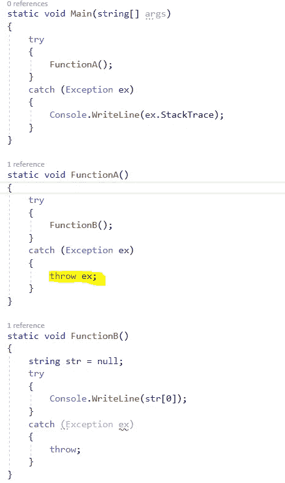****

****figure 6: re-throw an exception with parameter****

****如您所见，在 Main()方法中捕获的异常将显示来自 FunctionA 和 Main 方法的堆栈跟踪。它不会在堆栈跟踪中显示 Method1，因为我们使用`throw ex`在函数中重新抛出异常。所以，永远不要使用`throw <exception parameter>`抛出异常。****

*   ******捕获非特定类型的异常:**我们应该只捕获您预期会发生的异常类型，因为我们会隐藏代码中的错误。****

****不要这样做****

****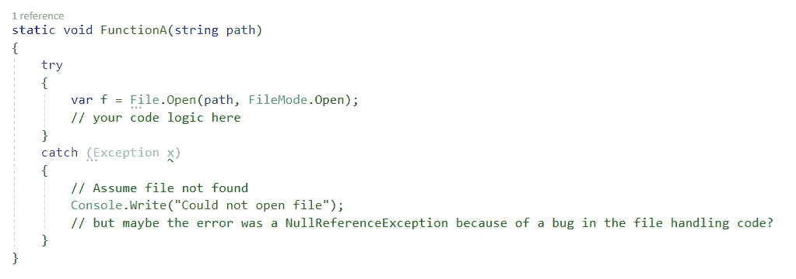****

****figure 7: catching non-specific type exception****

****应该这样做****

****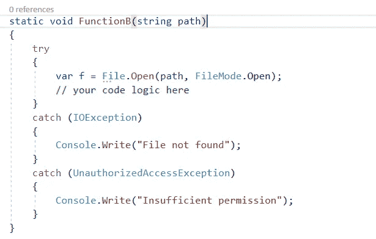****

****figure 8: catching specific type exception****

*   ******棒球异常处理:**你不应该使用异常来代替普通的流控制结构，比如 if-else 语句和 for-each 循环。****

****不要这样做:****

****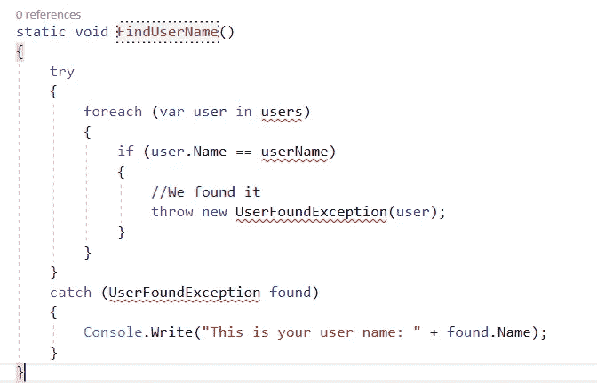****

****figure 9: baseball exception handling — don’t****

****应该这样做:****

****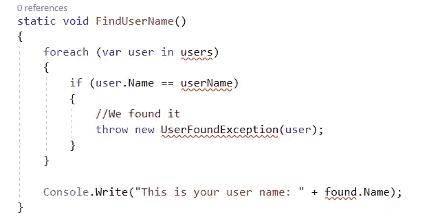****

****figure 9: baseball exception handling —should****

*****注:我这里还有另一篇关于登录微服务架构的文章:*[https://medium . com/@ letienthanh 0212/building-logging-system-in-microservice-architecture-with-elk-stack-and-serilog-net-core-part-1-8 Fe 2d fcf 9 E6 f](/@letienthanh0212/building-logging-system-in-microservice-architecture-with-elk-stack-and-serilog-net-core-part-1-8fe2dfcf9e6f)****

# ****复制粘贴编程****

****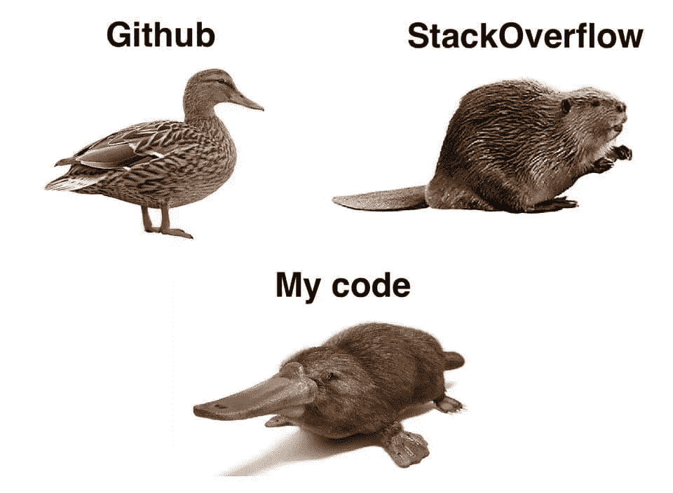****

****image source: Pinterest****

> ******复制粘贴编程**，有时简称为**粘贴**，是通过复制粘贴操作产生的高度重复的计算机编程代码。它主要是一个贬义词；那些使用这个术语的人经常暗示缺乏编程能力。这也可能是技术限制的结果(例如，表达能力不足的开发环境)，因为通常会使用子程序或库来代替。—维基百科。****

****当对初级开发人员或实习生进行代码审查时，我们很容易找到这种反模式的例子，他们没有太多的经验，很难从头开始构建和交付功能/任务。他们倾向于搜索和应用他们可以从互联网上找到的代码，如 Stackoverflow 或 Github，甚至是从同事那里找到的代码，而没有进行充分的测试和影响分析。****

****在最坏的情况下，这种反模式会导致源代码受到来自源代码的 bug 的感染。它的行为就像一个病毒，你将不得不修复这个错误，并在代码被复制的地方修改代码。****

****除了容易成为这种反模式受害者的初级开发人员和实习生之外，对计算机语言中常见的特性(如循环结构、函数和子例程)的不理解也可能导致这种反模式。****

******如何避免这种反模式？******

*   ****像其他反模式一样，避免这种反模式的最好方法是经常仔细地进行代码审查。****
*   ****从您的应用程序/解决方案之外找到的代码应该仔细测试和分析影响区域。之后，应该由您团队的高级成员进行审查和批准。****
*   ****当您看到一个代码块多次出现时，您应该进行重构，将每次出现的代码抽象成一个函数或方法。顺便说一下，如果发现了 bug，你只需要在一个地方进行修复。****

# ****结论****

****犯错导致改进，所以如果您可以在当前的应用程序/解决方案中找到一个或多个反模式，请不要惊慌。让我们集合团队，一个一个努力提高。****

****希望你不需要重写整个应用程序:)****

********

****Photo by [Wil Stewart](https://unsplash.com/@wilstewart3?utm_source=medium&utm_medium=referral) on [Unsplash](https://unsplash.com?utm_source=medium&utm_medium=referral)****

# ****参考****

 ****[## 反模式

### 反模式是对重复出现的问题的常见反应，通常是无效的，并且有被高度…

en.wikipedia.org](https://en.wikipedia.org/wiki/Anti-pattern)**** **** [## 设计模式和重构

### 反模式，像它们的设计模式对应物一样，为常见的有缺陷的过程定义了一个行业词汇…

sourcemaking.com](https://sourcemaking.com/antipatterns)  [## 用 ELK stack 和 Serilog 构建微服务架构下的测井系统。网络核心[第一部分]

### 日志系统不仅仅是为开发者准备的。它也被其他人使用(系统管理员、测试人员……)

medium.com](/@letienthanh0212/building-logging-system-in-microservice-architecture-with-elk-stack-and-serilog-net-core-part-1-8fe2dfcf9e6f)****