# 阿帕奇卡夫卡

> 原文：<https://medium.com/geekculture/apache-kafka-a352140977ac?source=collection_archive---------11----------------------->

## 关于卡夫卡你需要知道的一切

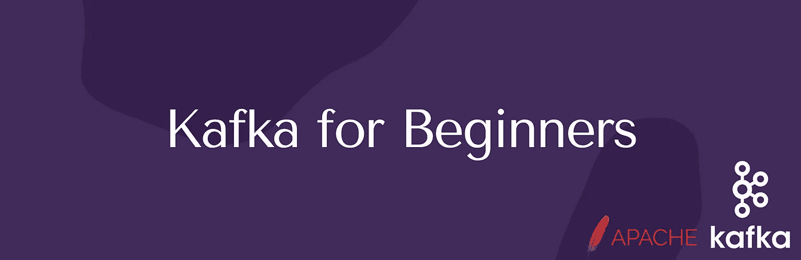

## 真正的问题

在我们继续讨论卡夫卡之前，我们将讨论现实世界的场景。

让我们假设有一个简单的应用程序，它由一个源系统和一个目标系统组成。所以两者之间只有一个结合点。此外，该系统将易于实施和维护。

现在假设有 4 个源系统和 4 个目标系统。在这种情况下，这些系统之间可能会有许多集成。至少 4 个最多 16 个集成点。然后事情变得非常复杂。

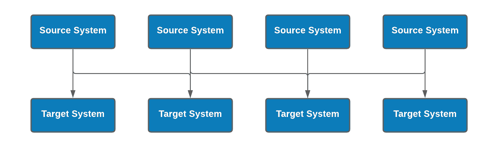

下面是我们必须处理的关于上述架构的困难。

*   不同的数据格式——如何传输数据*(JSON、纯文本等..)*
*   *不同的协议—如何解析数据(HTTP、TCP、JDBC 等..)*
*   *复杂性*
*   *维护*
*   *数据模式——它是如何形成的，可能会发生什么变化*
*   *连接带来的负载增加*

## *为什么是卡夫卡？*

*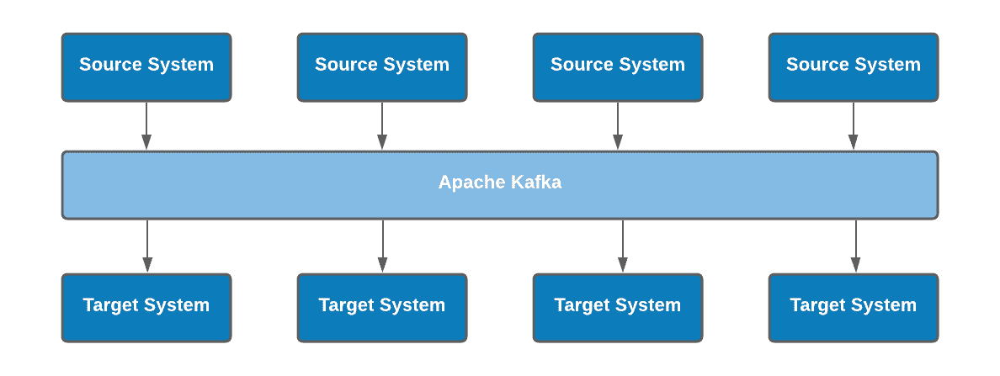*

*K afka 主要用于解耦。因此，所有源系统的数据都将存储在 Kafka 中，而目标系统将直接从 Apache Kafka 获取数据。*

*例如，Kafka 将存储出租车数据、定价数据、金融交易、用户交互、天气指标等等。一旦数据存储在 Kafka 中，我们就可以将其发送到任何我们想要的系统中。比如数据库、分析系统或审计。*

*K **afka** 是一款开源软件，为存储、读取和分析流数据提供了一个框架。现在，卡夫卡不仅仅是一个信息队列。Kafka 最初由 LinkedIn 开发，目前由 Confluent 维护。它是一个处理数据流的强大工具，可以用于许多其他事情。Kafka 是分布式的，这意味着它可以在需要的时候扩展(水平可扩展)。由于其分布式特性，Kafka 能够非常快速地运行(不到 10MS，接近实时)。大型 Kafka 集群每秒钟能够监控和处理数百万次数据集更改。Apache Kafka 是用 Scala 和 Java 编写的，但它兼容许多其他流行的编程语言。卡夫卡只用于一种运输机制。*

*Kafka 可用于以下用例。*

*   *消息系统(聊天)*
*   *活动跟踪(出租车公司)*
*   *从不同位置收集相同的指标(天气数据)*
*   *应用程序日志收集*
*   *流处理*
*   *去耦合*
*   *大数据技术(Spark、Flink、Hadoop 等)*

*例如:LinkedIn 使用 Kafka 检测垃圾邮件，网飞使用它进行实时电影推荐。优步使用卡夫卡来收集出租车的详细信息，例如行程详细信息、出租车详细信息、集市详细信息和乘客详细信息。*

*在卡夫卡那里，我们需要学习很多概念。*

*   ***T** opics 和 **P** artitions*
*   ***O** 偏置*
*   *B roker*
*   *复制*
*   *头儿*
*   ***生产者和**消费者*****

## *主题*

*题目就像一个数据库。卡夫卡的主题将成为一切的基础。所有消息都存储在主题中。卡夫卡可以有很多主题，它是通过名字来识别的。主题存储的数据是临时的。默认值仅为 7 天。*

## *分区*

*每个卡夫卡主题都被划分为分区。一个特定的主题可以有多个分区。每个分区都将被排序。我们可以在创建主题时指定分区的数量，或者在以后更改数量。消息顺序只在分区内得到保证。我们不能在一个分区中交换或合并消息。*

*让我们假设正在处理 10 条关于 Kafka 主题的消息。但是在后台，这些消息存储在分区中。消息被随机分配给分区，并且分区的消息计数是独立的。意味着分区 0 可以有 6 条消息，其他 2 个分区每个可以有 2 条消息。卡夫卡正在处理这些操作。我们不需要担心这个。*

*下图将解释主题和分区之间的关系。*

*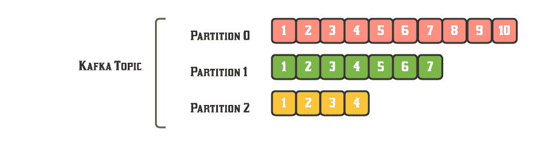*

## *O**偏置***

*分区中的每条消息都有一个增量 ID，称为“偏移量”这就像数据库表中的唯一 ID。偏移量只对特定分区有意义。偏移量是三个度量之一，当一起使用时，可以定位或识别消息。首先，有**主题**，然后在**主题**中是分区，最后，在**主题**中消息的排序被称为**偏移**。*

## *卡夫卡经纪人*

*代理是服务器，Kafka 集群由许多服务器上的许多 Kafka 代理组成。一个集群最好有 3 个代理。但是 100 个经纪人是可能的。每个 Kafka 经纪人都有一个唯一的 ID 号。Kafka Brokers 包含某些主题分区。*

*下图将解释主题、分区和 Kafka 代理之间的关系。*

*考虑下面这个例子，题目 A 有 3 个分区，题目 B 有 2 个分区。和 Kafka 集群中的 3 个经纪人。*

*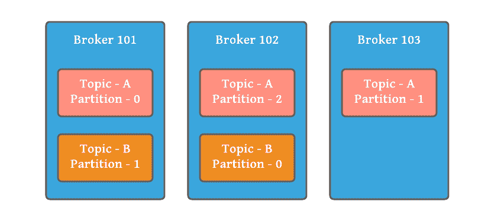*

*Kafka Broker*

## ***主题复制***

*复制因子是多个代理上的数据副本数量。…复制因子值应始终大于 1(介于 2 或 3 之间)。这有助于将数据的副本存储在另一个代理中，当代理出现故障时，用户可以从这个代理中访问数据。*

*下图将解释分区复制。*

*例如:3 个代理、1 个主题、2 个分区和 2 个副本。*

*考虑以下示例，代理 101 由分区 0 组成，分区 0 的复制由代理 102 组成。代理 102 由分区 1 组成，分区 1 的复制由代理 103 组成。*

*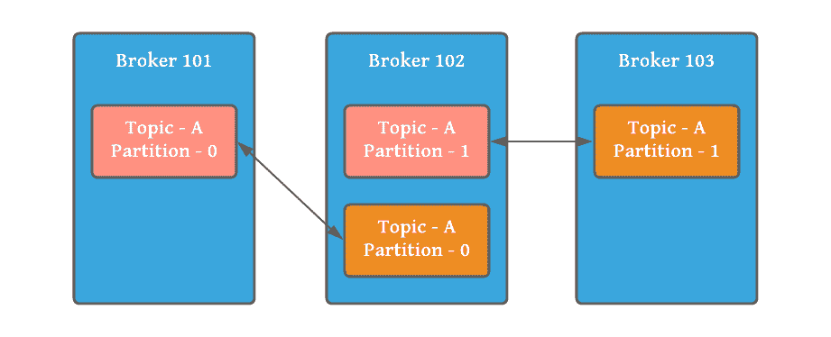*

*Partition Replication*

## ***一个分区的领导***

*每个分区都有一台服务器，充当“领导者”主节点处理对分区的所有读写请求，而从节点被动地同步数据。如果领导者失败，其中一个追随者将自动成为新的领导者。当一个经纪人恢复后，它将再次成为领导者**。**因此，每个分区都有一个领导者和多个同步副本(ISR)。*

*下图将给出一个关于领导者和分区如何工作的概念。*

*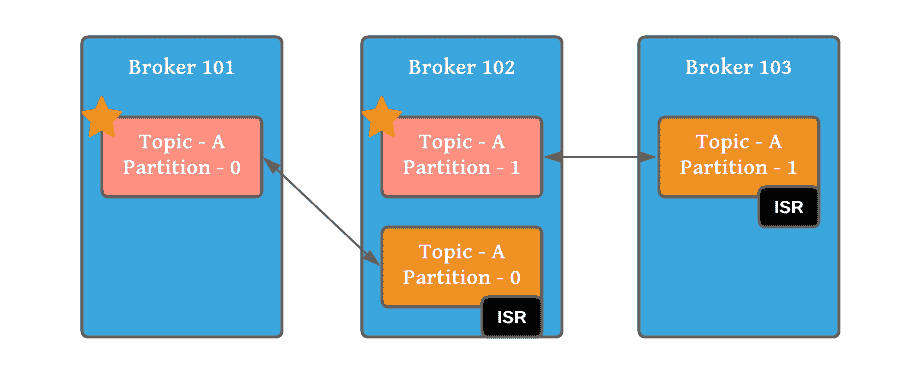*

*让我们假设经纪人 102 失败了。分区 1 的领导者出现故障，并且代理 103 中的 ISR 分区自动成为新的领导者。然后卡夫卡会像下面这样重新平衡。*

*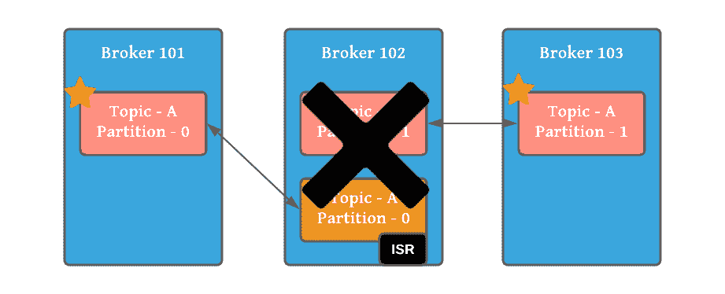*

## ***制片人***

*生产者是将记录写入 Kafka 主题的客户端进程。Producer 自动知道要写入哪个代理和分区。因为，如前所述，只有领导者可以对分区进行写或读。如果代理失败，生产者将自动恢复。卡夫卡在一个主题的结尾附加了一个制作人的记录。写入数据时，生成器将加载余额。*

*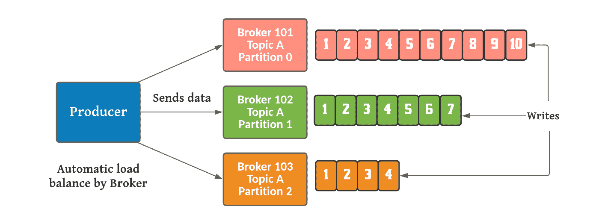*

*生产者从数据写入中收到 3 种类型的确认。*

*   *ack = 0*(生产者不等待确认——可能的数据丢失)**
*   *ack = 1*(生产者等待领导者确认—有限数据丢失)**
*   *ack = all*(生产者等待领导者+复制品确认——无数据丢失**

*下图将解释主服务器和副本服务器如何在它们之间同步数据。*

*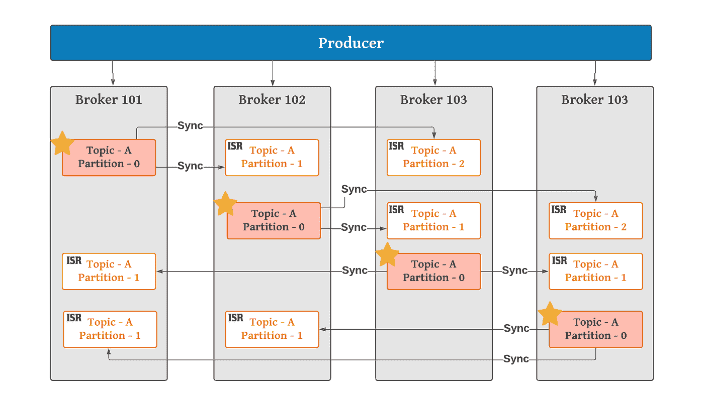*

## ***基于键的排序***

*Kafka 附带的分区器保证具有相同非空密钥的所有消息都将被发送到同一个分区。如果提供了密钥，分割器将使用 murmur2 算法对密钥进行哈希运算，并将其除以分区数。结果是相同的键总是被分配给相同的分区。如果未提供密钥，则基于循环法分配数据。*

*基于关键字的消息有助于特定字段(object_id)的排序。卡夫卡不能保证这把钥匙属于这个分区。但是该键所有消息将总是去往**相同的分区。***

*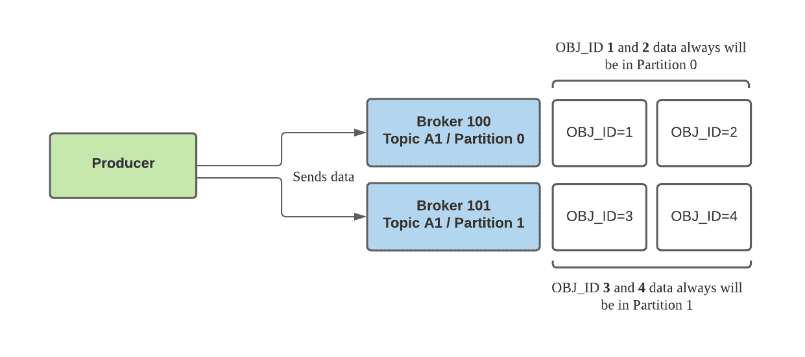*

## ***消费者和消费群体***

*消费者是从 Kafka 主题中读取/记录的客户端进程。与生产者一样，消费者自动知道从哪个代理和分区读取数据。此外，在代理失败的情况下，消费者将自动恢复。消费者在每个分区内按顺序阅读。*

*卡夫卡消费者是典型的消费群体的一部分。因此，当多个使用者读取一个主题并属于同一个使用者组时，每个使用者将从主题分区的不同子集接收消息。*

*下图将解释使用者如何使用分区。*

*场景 1:让我们以有四个分区的主题 A 为例。假设我们创建了一个新的消费者，C1，它是 G1 组中唯一的消费者；消费者 C1 将从所有四个 T1 分区获得所有消息。*

*场景 2:如果我们将另一个消费者 C2 添加到 G1 组。消费者 C1 和 C2 将只能从两个分区获得消息。*

*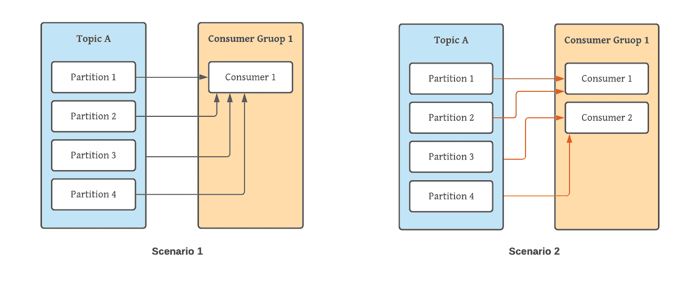*

*场景 3:如果 G1 有四个消费者，那么每个消费者将从单个分区读取消息。*

*场景 4:如果我们向单个主题的单个组中添加的消费者多于我们所拥有的分区，那么一些消费者将会处于空闲状态，并且不会收到任何消息。我们可以将此应用于读取大量用户阅读大量消息的用例。让我们假设 C1 失败了。那么 C5 将开始从分区 0 读取。*

*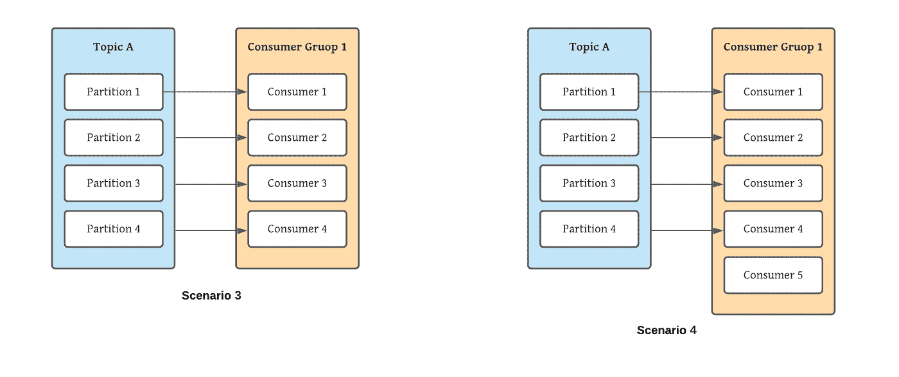*

*场景 5:在前面的例子中，如果我们添加一个只有一个消费者的新消费者组 G2，这个消费者将获得主题 T1 中的所有消息，而不管 G1 在做什么。G2 可以有不止一个消费者，其中他们将获得分区的子集，就像我们为 G1 展示的那样，但是 G2 作为一个整体仍然将获得所有的消息，而不管其他消费者组。*

*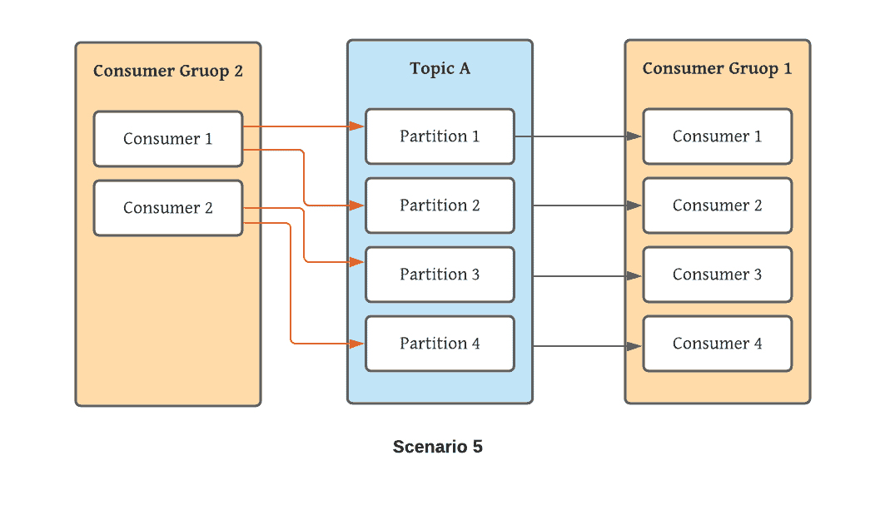*

## ***消费者补偿***

*偏移量是一个简单的整数，Kafka 使用它来保持消费者的当前位置。当前偏移量是指向 Kafka 已经发送给消费者的最后一条记录的指针。每个分区按顺序维护它收到的消息，这些消息由偏移量(也称为位置)来标识。因此，消费者不会因为当前的偏移量而获得两次重复的记录。*

*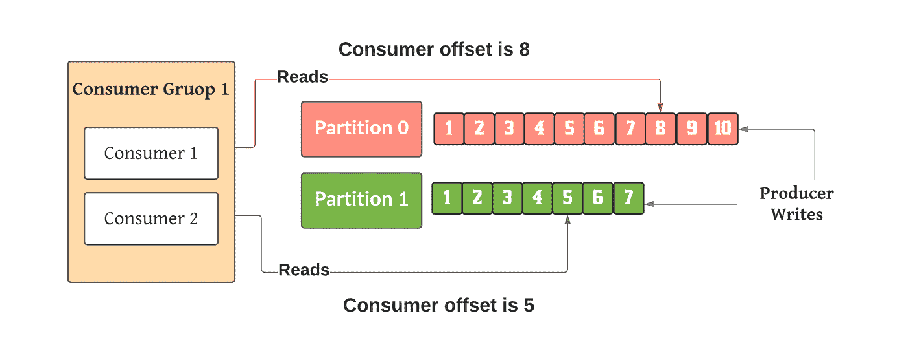*

*Consumer Offsets*

*有 3 种不同的消费者交付语义。*

*1-最多一次:*

**一条消息应该是* ***传递一次*** *。在这种语义中，丢失一条消息比传递一条消息两次更容易接受。一收到消息就提交偏移量，如果处理出错，消息就会丢失。**

**

*At most once*

*2-至少一次:*

**可以接受* ***多次传递一条消息*** *，但不应丢失任何消息。消费者确保所有消息都被读取和处理，如果处理出错，消息将被再次读取。这可能会导致处理重复的消息。因此应用程序应该是幂等的。这是最优选的语义。**

*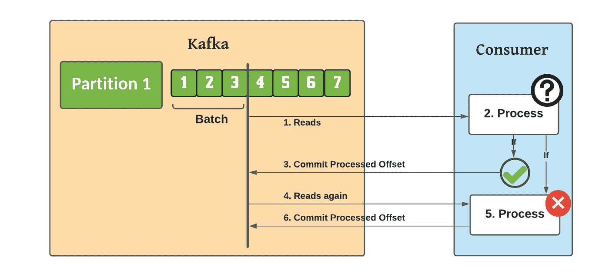*

*At least once*

*3-恰好一次:*

**一条消息必须* ***只传递一次，没有消息*** *应该丢失。这可以通过使用 Kafka 流 API 的 Kafka 到 Kafka 工作流来实现。**

***卡夫卡生产者/消费者发现***

*任何 Kafka 客户端都需要连接到一个代理，它将连接到整个集群。*(每个 Kafka 经纪人也被称为“引导服务器”)*。每个代理都知道关于代理、主题和分区(元数据)的所有细节*

*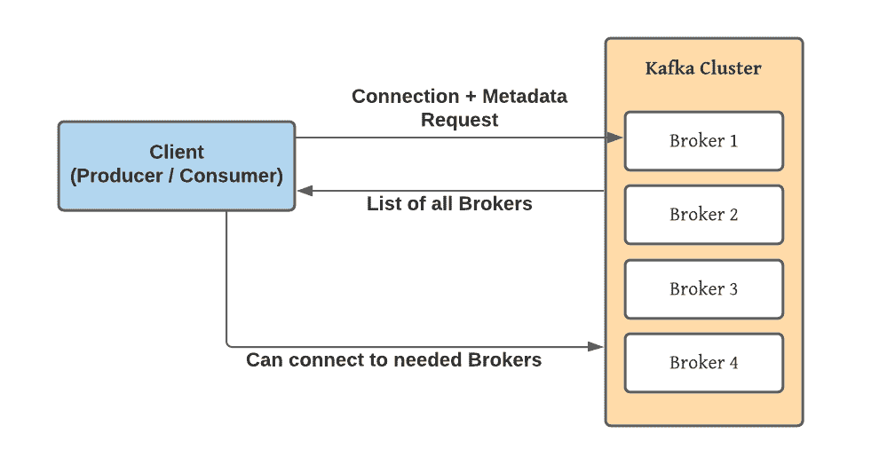*

## *动物园管理员*

*Zookeeper 是一个集中式开源服务器，用于维护和管理分布式集群环境的配置信息、命名约定和同步。Zookeeper 通过提供低延迟和高可用性来帮助分布式系统降低管理复杂性。卡夫卡的作品离不开动物园管理员。*

*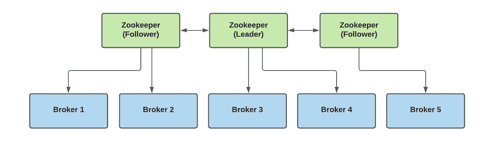*

*以下是关于 Zookeeper 的一些要点。*

*   *管理经纪人(保存他们的名单)*
*   *帮助执行分区的领导者选举*
*   *向 Kafka 发送更改通知(新主题、代理删除、删除主题)*
*   *根据设计，它可以运行奇数台服务器(3、5、7 台)*
*   *动物园管理员有一个'**领袖'**(句柄写)，其余都是'**追随者'**(句柄写)*
*   *动物园管理员**不**存储消费者补偿(卡夫卡> V0.10)*

## ***理论综述***

*我们已经讨论了卡夫卡的大部分理论。以下是我们讨论过的概念。*

*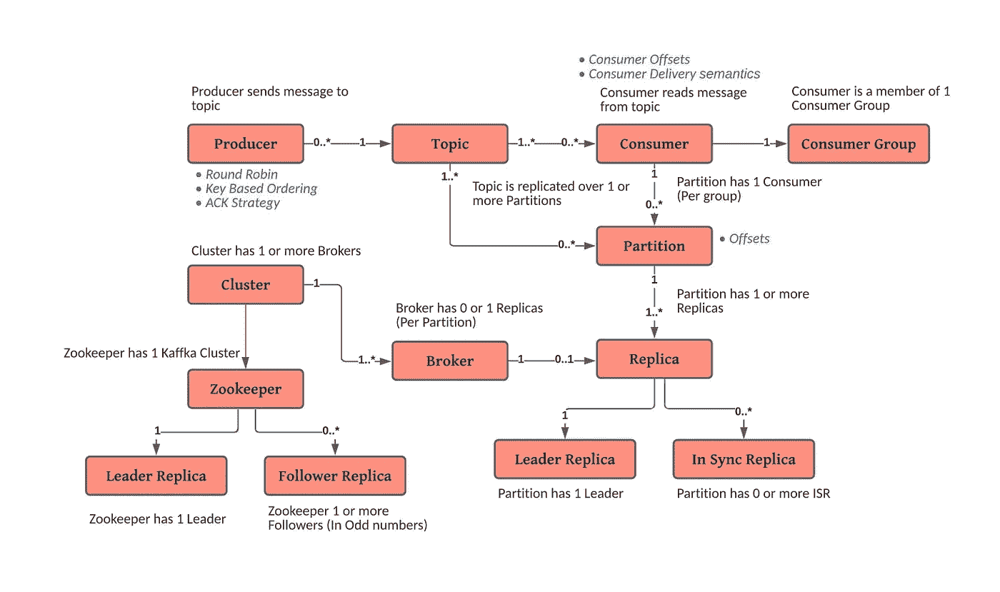*

## *参考*

> *[' https://www . udemy . com/share/1013 hcbuicclxx q3g =/](https://www.udemy.com/share/1013hcBUIcclxXQ3g=/)'*
> 
> *[https://kafka.apache.org/documentation/](https://kafka.apache.org/documentation/)*
> 
> *[https://www . LinkedIn . com/pulse/Kafka-consumer-delivery-semantics-Sylvester-Daniel/](https://www.linkedin.com/pulse/kafka-consumer-delivery-semantics-sylvester-daniel/)*
> 
> *[https://docs . cloud era . com/runtime/7 . 2 . 9/Kafka-overview/topics/Kafka-overview-architecture . html](https://docs.cloudera.com/runtime/7.2.9/kafka-overview/topics/kafka-overview-architecture.html)*