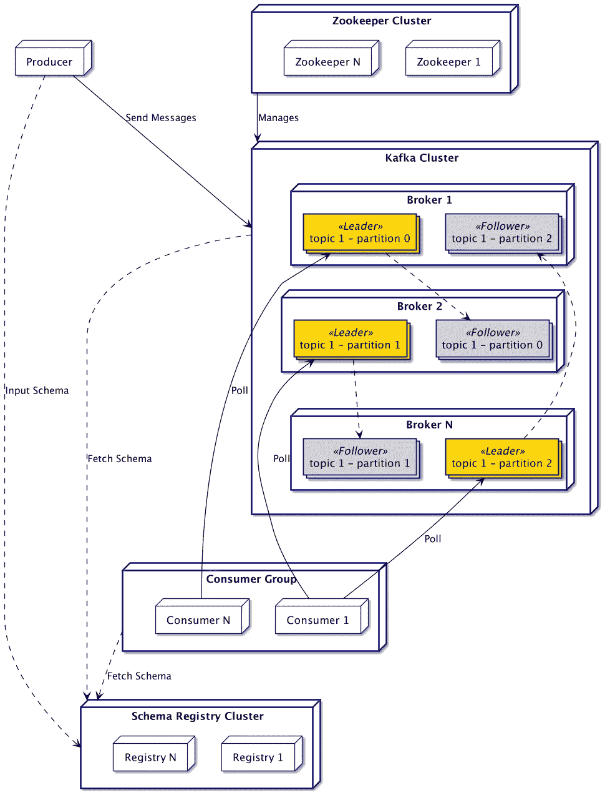
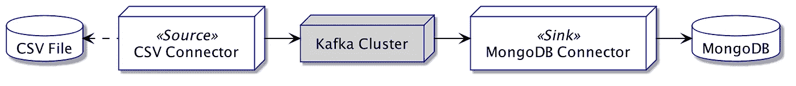

# 阿帕奇卡夫卡:学徒食谱

> 原文：<https://medium.com/geekculture/apache-kafka-apprentice-cookbook-557439273cee?source=collection_archive---------25----------------------->

Apache Kafka 是一个分布式事件流平台，强调可靠性、性能和定制。卡夫卡可以以[发布-订阅](https://aws.amazon.com/pub-sub-messaging/)的方式发送和接收信息。为了实现这一点，生态系统依赖于少数但强大的基本概念，这些概念使社区能够构建许多功能来解决[众多用例](https://kafka.apache.org/uses)，例如:

*   将消息作为[企业服务总线](https://www.confluent.io/blog/apache-kafka-vs-enterprise-service-bus-esb-friends-enemies-or-frenemies/)处理。
*   跟踪活动、度量和遥测。
*   处理流。
*   支持[事件采购](https://www.confluent.io/blog/event-sourcing-cqrs-stream-processing-apache-kafka-whats-connection/)。
*   存储日志。

本文将介绍支持 Kafka 的概念以及可用于处理数据流的不同工具。

# 体系结构

Kafka 的行为非常简单:**生产者**将*消息*推送至特定的*主题*，而**消费者**订阅该*主题*以获取并处理*消息。*让我们看看这项技术是如何实现的。

## 基础设施方面

独立于使用，将部署以下组件:

*   一个或多个**生产者**向经纪人发送消息。
*   一个或多个 Kafka **代理**，处理生产者和消费者之间通信的实际消息服务器。
*   一个或多个**消费者**在名为**消费者群体**的集群中获取和处理消息。
*   管理代理的一个或多个 [**动物园管理员**](https://zookeeper.apache.org/) 实例。
*   (可选)一个或多个**注册表**实例统一消息模式。

作为一个可扩展的分布式系统，Kafka 非常依赖于*集群*的概念。因此，在典型的生产部署中，每个组件可能会有多个实例。

一个**消费者组**是同一个消费者应用程序的集群。卡夫卡大量使用这个概念来平衡事物应用方面的负荷。

*注:对动物园管理员的依赖即将解除，参见* [*KIP-500*](https://cwiki.apache.org/confluence/display/KAFKA/KIP-500%3A+Replace+ZooKeeper+with+a+Self-Managed+Metadata+Quorum)

> 延伸阅读:
> [设计&实现文档](https://kafka.apache.org/documentation/#majordesignelements)
> [卡夫卡基础与核心概念:讲解— Aritra Das](https://hackernoon.com/kafka-basics-and-core-concepts-explained-dd1434dv)

## 应用侧

卡夫卡中的**消息**是`key-value`对。这些元素可以是从整数到 [Protobuf 消息](https://developers.google.com/protocol-buffers)的任何东西，只要提供正确的序列化器和反序列化器。

消息被发送到**主题**，主题会将其存储为**日志**。主题应该是语义相关的日志的集合，但是没有强加特定的结构。一个主题可以将每条消息作为一个新的日志条目保存，也可以只保存每个键的最后一个值(又名[压缩日志](https://docs.confluent.io/platform/current/kafka/design.html#log-compaction))。

为了利用多个代理，默认情况下，主题被[分割](https://en.wikipedia.org/wiki/Shard_(database_architecture))到**分区**中。Kafka 将根据其密钥将任何接收到的消息分配给一个分区，或者使用[一个分区算法](https://www.confluent.io/blog/apache-kafka-producer-improvements-sticky-partitioner)否则，从开发人员的角度来看，这将导致随机分配。每个分区都有一个负责所有 I/O 操作的**主分区**，以及复制数据的**从分区**。在当前角色出现问题的情况下，追随者将接管领导者的角色。

分区按顺序保存接收到的数据，为每个消息增加一个**偏移量**整数。但是，两个分区之间没有顺序保证。因此，对于顺序相关的数据，必须通过使用相同的键来确保它们最终出现在相同的分区中。

每个分区都被分配给使用者组中的一个特定使用者。该消费者是唯一从该分区获取消息的人。如果一个客户关闭，代理将[在客户之间重新分配分区](/streamthoughts/understanding-kafka-partition-assignment-strategies-and-how-to-write-your-own-custom-assignor-ebeda1fc06f3)。

作为一个异步系统，将每条消息准确地一次传递给消费者可能会很困难，并且会影响性能。为了减轻这一点，Kafka 为[提供了不同级别的保证](https://kafka.apache.org/documentation/#semantics)，保证消息被处理的次数(*，即*，最多一次，至少一次，正好一次)。

> 延伸阅读:
> [日志压缩主题 Apache Kafka—Seyed morte za mous avi](https://towardsdatascience.com/log-compacted-topics-in-apache-kafka-b1aa1e4665a7)
> [(Youtube)Apache Kafka 101:复制—汇合](https://www.youtube.com/watch?v=Vo6Mv5YPOJU&list=PLa7VYi0yPIH0KbnJQcMv5N9iW8HkZHztH&index=5)
> [复制设计文档](https://cwiki.apache.org/confluence/display/KAFKA/Kafka+Replication)
> [处理细节保证— Andy Briant](/@andy.bryant/processing-guarantees-in-kafka-12dd2e30be0e)

## 模式和注册表

消息在退出生产者时被序列化，在由消费者处理时被反序列化。为了确保兼容性，两者必须使用相同的数据定义。考虑到应用程序的发展，确保这一点可能很难。因此，在处理生产系统时，建议使用模式来明确数据结构上的契约。

为此，Kafka 提供了一个 **Registry** 服务器，用于存储和绑定主题的模式。历史上只有 [Avro](https://avro.apache.org/docs/current/) 可用，但是注册表现在是模块化的，也可以开箱即用地处理 [JSON](https://json-schema.org/) 和 [Protobuf](https://developers.google.com/protocol-buffers) 。

一旦生产者将描述由其主题处理的数据的模式发送到注册中心，其他方(*即*代理和消费者)将在注册中心获取该模式以验证和反序列化数据。

> 延伸阅读:
> [模式注册表文档](https://docs.confluent.io/platform/current/schema-registry/index.html)
> [卡夫卡教程# 4——Avro 和模式注册表——Alexis Seigneurin](https://aseigneurin.github.io/2018/08/02/kafka-tutorial-4-avro-and-schema-registry.html)
> [模式的串行化器——解串行化器](https://docs.confluent.io/platform/current/schema-registry/serdes-develop/index.html#serializer-and-formatter)

# 集成

Kafka 提供了多种连接代理的方式，根据需要，每种方式都可能比其他方式更有用。因此，即使一个库是另一个之上的抽象层，它也不一定对每个用例都更好。

## Kafka 客户端库

有多种语言的客户端库可以帮助开发生产者和消费者。在下面的例子中，我们将使用 Java，但是这个概念对于其他语言来说是相同的。

生产者的概念是随时发布消息，所以代码非常简单。

消费者部分的代码稍微复杂一些，因为消费循环需要手动创建。另一方面，这给了它更多的行为控制。消费者状态由 Kafka 库自动处理。因此，重新启动工作线程将从他最近遇到的偏移量开始。

> 延伸阅读:
> [可用库](https://docs.confluent.io/platform/current/clients/index.html)
> [生产者配置](https://docs.confluent.io/platform/current/installation/configuration/producer-configs.html)
> [消费者配置](https://docs.confluent.io/platform/current/installation/configuration/consumer-configs.html)

## 卡夫卡溪流

Kafka Streams 建立在消费者图书馆之上。它不断地从一个主题中读取数据，并使用用功能性 DSL 声明的代码处理消息。

在处理过程中，过渡数据可以保存在名为 [KStream](https://kafka.apache.org/23/javadoc/org/apache/kafka/streams/kstream/KStream.html) 和 [KTable](https://kafka.apache.org/23/javadoc/org/apache/kafka/streams/kstream/KTable.html) 的结构中，存储在主题中。前者相当于一个标准主题，后者相当于一个压缩主题。使用这些数据存储将使 Kafka 能够自动跟踪工作状态，有助于在重启时回到正轨。

以下代码示例摘自 Apache 提供的[教程。
代码连接到一个名为`streams-plaintext-input`的包含字符串值的主题，不需要提供键。配置`StreamsBuilder`的几行代码将:](https://kafka.apache.org/28/documentation/streams/tutorial)

1.  将每条消息转换成小写。
2.  使用空格作为分隔符分割结果。
3.  按值对以前的令牌进行分组。
4.  统计每组的令牌数，并将更改保存到名为`counts-store`的 KTable 中。
5.  将这个 Ktable 中的更改流式传输到名为`streams-wordcount-output`的 KStream 中。

> 延伸阅读:
> [Kafka Streams 概念](https://docs.confluent.io/platform/current/streams/concepts.html)
> [开发者指南](https://docs.confluent.io/platform/current/streams/developer-guide/write-streams.html) [Kafka Stream 作品分配— Andy Briant](/@andy.bryant/kafka-streams-work-allocation-4f31c24753cc)

## 卡夫卡连接

Kafka Connect 提供了一种使用**连接器**在几乎任何技术之间转换和同步数据的方法。Confluent 正在托管一个 [Hub](https://www.confluent.io/hub/) ，用户可以在上面共享各种技术的连接器。这意味着集成 Kafka Connect 管道在大多数情况下只是一个配置问题，不需要代码。单个连接器甚至可以处理两个连接端:

*   用来自任何系统的数据填充主题:*即*一个**源**。
*   将数据从一个主题发送到任何系统:*即*一个**接收器**。

源将从以下模式的 CSV 文件中读取数据，然后将它们发布到主题中。同时，接收器将轮询主题并将消息插入到 MongoDB 数据库中。每个连接器可以在同一个或不同的 worker 中运行，并且为了可伸缩性，可以将 worker 分组到一个集群中。

Kafka Connect pipeline example

连接器实例是通过特定于库的配置创建的。下面的文件是 [MongoDB 连接器](https://www.confluent.io/hub/mongodb/kafka-connect-mongodb)的配置。它要求从主题`mongo-source`中获取所有消息，并将它们插入到名为`kafka-connect`的数据库的集合`sink`中。凭证由外部文件提供，这是 Kafka Connect to[protect secrets](https://docs.confluent.io/platform/current/connect/security.html#externalizing-secrets)的一个特性。

一旦配置完成，注册连接器就像在运行的 [Kafka Connect 实例](https://docs.confluent.io/home/connect/userguide.html#configuring-and-running-workers)上进行 HTTP 调用一样简单。之后，该服务将自动观察数据，无需进一步的工作。

> 延伸阅读:
> [入门文档](https://docs.confluent.io/platform/current/connect/userguide.html#connect-userguide)
> [连接器实例 API 参考](https://docs.confluent.io/platform/current/connect/references/restapi.html)
> [(Youtube)教程播放列表—汇合](https://www.youtube.com/playlist?list=PLa7VYi0yPIH1MB2n2w8pMZguffCDu2L4Y)

## KSQL 数据库

Ksql 在某种程度上相当于 Kafka Streams，只是每个转换都是用类似 sql 的语言声明的。服务器连接到代理，可以根据主题创建**流**或**表**。这两个概念的行为方式与 Kafka Streams 中的 KStream 或 KTable 相同(*即*分别为主题和压缩主题)。

语言定义中有三种类型的查询:

1.  **持久查询** ( *例如* `CREATE TABLE <name> WITH (...)`):创建一个新的流或表，它将被自动更新。
2.  **拉式查询** ( *例如* `SELECT * FROM <table|stream> WHERE ID = 1`):行为类似于标准 DBMS。获取数据作为即时快照并关闭连接。
3.  **推送查询** ( *例如* `*SELECT * FROM <table|stream> EMIT CHANGES*`):请求到服务器的持久连接，异步推送更新的值。

该数据库可用于浏览经纪人的内容。可以通过命令`list topics`发现主题，并使用`print <name>`显示主题内容。

创建和查询流或表的语法非常接近 SQL。

Kafka 推荐使用一个 [headless ksqlDB 服务器](https://www.confluent.io/blog/deep-dive-ksql-deployment-options/)用于生产，用一个文件声明所有要创建的流和表。这避免了对定义的任何修改。

*注意:ksqlDB 服务器可以像任何其他消费者一样分组到一个集群中。*

> 延伸阅读:
> [官方文档](https://docs.confluent.io/platform/current/streams-ksql.html)
> [KSQL 详细查询类型](https://docs.ksqldb.io/en/latest/concepts/queries/)
> [(Youtube)教程播放列表—汇合](https://www.youtube.com/playlist?list=PLa7VYi0yPIH2eX8q3mPpZAn3qCS1eDX8W)

# 结论

这篇文章给出了卡夫卡生态系统和可能性的一个广阔的视野，这是众多的。这篇文章只是触及了每个主题的皮毛。但是不用担心，因为 Apache、Confluent 和其他开发人员都很好地记录了它们。这里有一些补充资料，可以让你更深入地了解卡夫卡:

*   [(Youtube)卡夫卡教程-](https://www.youtube.com/playlist?list=PLa7VYi0yPIH0KbnJQcMv5N9iW8HkZHztH)
*   *[卡夫卡实践教程](https://kafka-tutorials.confluent.io/)*
*   *[每个 Apache Kafka 开发人员都应该知道的 5 件事——Bill Bejeck](https://www.confluent.io/blog/5-things-every-kafka-developer-should-know/)*
*   *[Kafkacat 用户指南](https://docs.confluent.io/platform/current/app-development/kafkacat-usage.html)*
*   *【KSQL 故障排除第 2 部分:幕后发生了什么？—罗宾·莫法特*
*   *[阿帕奇卡夫卡内部——苏丹](https://ssudan16.medium.com/kafka-internals-47e594e3f006)*

**完整的实验代码在我的* [*GitHub 资源库*](https://github.com/aveuiller/frameworks-bootstrap/tree/master/Kafka) *上有。**

**感谢 Sarra Habchi 和 Dimitri Delabroye 的评论**