# 阿帕奇火花图 x 和柯尼斯堡的七座桥

> 原文：<https://medium.com/geekculture/apache-spark-graphx-and-the-seven-bridges-of-k%C3%B6nigsberg-790a53ac15a9?source=collection_archive---------6----------------------->

*Patrick Cuba，数据工程师兼 Data Vault SME。*

# 柯尼斯堡，1736 年

瑞士数学家伦纳德·欧拉(Leonard Euler)在数学、拓扑学、力学、流体力学、天文学甚至乐理等领域做出了诸多贡献。他引入了我们今天使用的许多数学术语和符号。如果你用符号 f(x ),你用的是 Leonard Euler 想出来的方法，来对一个物体应用一个函数。

一天，当欧拉在哥尼斯堡(今天的加里宁格勒)时，他定义了下面的数学问题:有没有可能沿着一条穿过每座桥(七座桥)恰好一次的路径，然后回到起点？

每个陆块是一个顶点(蓝色)，每个桥交叉是一条边(红色)。他发现没有一条电路不经过两次桥。c 转 A)；他用来证明这一结论的数学严密性和分析构成了图论和拓扑学的基础。而我们可以把这个问题表示为顶点和边(蓝色=顶点，红色=边)。

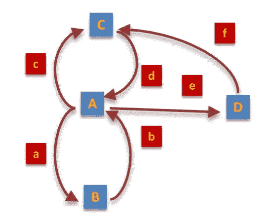

Directed Acyclic Graph (DAG)

# 技术债务

图形可以是无环的或循环的，有向的或无向的，它们形成树和层次结构。图表可以用来直观地表示社交媒体平台上的关系或用于刑事调查。它们经常出现在节点和集群的分布式计算系统中，它们可以用来遍历层次结构并将计算应用于每个节点，就像在 PageRank 中一样。

这里我们将用一个图来解决一个**应用缺口**；卡数据库设计用于跟踪新卡和替换卡的发行，但不跟踪账户(即没有将卡绑定在一起的伞式账号，系统设计用于跟踪卡的详细信息和活动，以及卡是否被盗或丢失)。当卡被报失或被盗，或者客户更换产品时，就会发放替换卡。让我们看看这是什么样子。

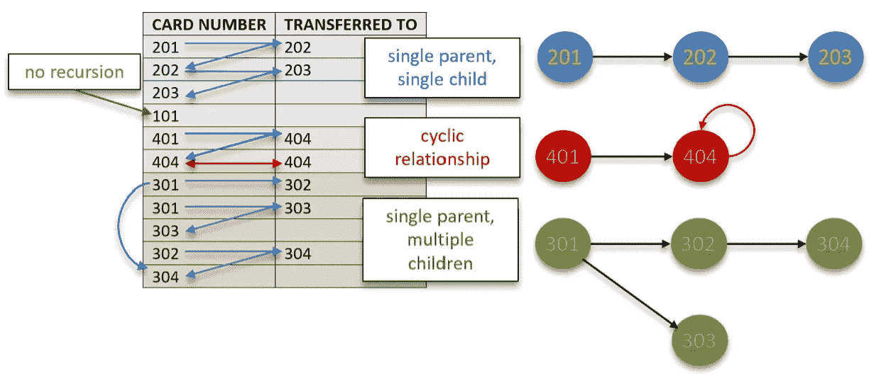

Card movement as a table and as a direct acyclic graph

对于现有的卡，将发行一张新的卡，并且“转入”列的值将填充新的卡号(即现有卡已转入的卡号)。活动卡通过缺少转入值来识别。在表格格式中，每个记录都独立于下一个记录，并且通过观察卡“201 ”,该记录不知道它与卡“203”相关。一张卡可以转让的次数是无限的，这里的技术债是；*我怎么知道卡 203 和卡 201 相关，而不用每次我想知道的时候都遍历层次结构*？

卡数据库不跟踪账户来“持有”这些卡。为了便于报告，我们希望能够看到与某个账户的**完整历史**相关的所有活动和详细信息，而不仅仅是一张卡。这些卡的帐户号码的明显候选者是发行的第一张卡。这个卡号在这个保护伞下永远不会改变，它是层次结构的锚，新发行的卡将作为叶节点添加到层次结构中。最新发行的卡(叶节点)是活动卡。出于报告目的，我们需要填补这一应用空白。

# 页面上的解决方案(SQL)

在符合 ANSI SQL 1999 的表格数据库中，可以使用递归公用表(CTE)表达式来遍历表中的每个相关卡。设置锚点(活动卡没有“转移到”值)，并且在单个表中提供该卡的完整历史，然后在相关卡之间共享该活动卡。

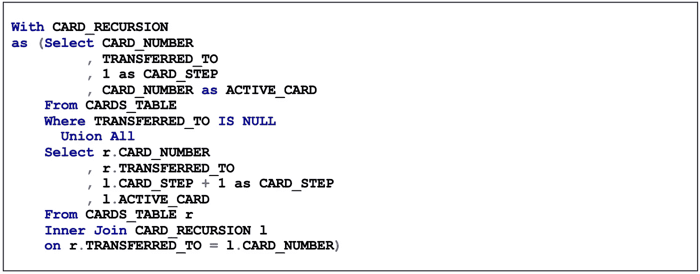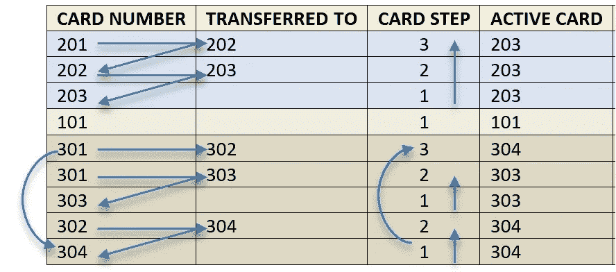

在跨卡共享活动卡之后，需要一个额外的步骤来遍历这些卡并分配层次结构的祖父卡，即永远不会改变的一致的卡值，因为它是分配给客户的第一张卡；这将是账号。

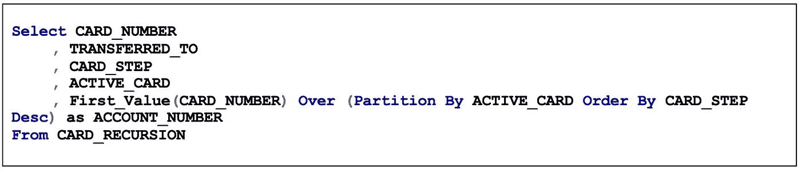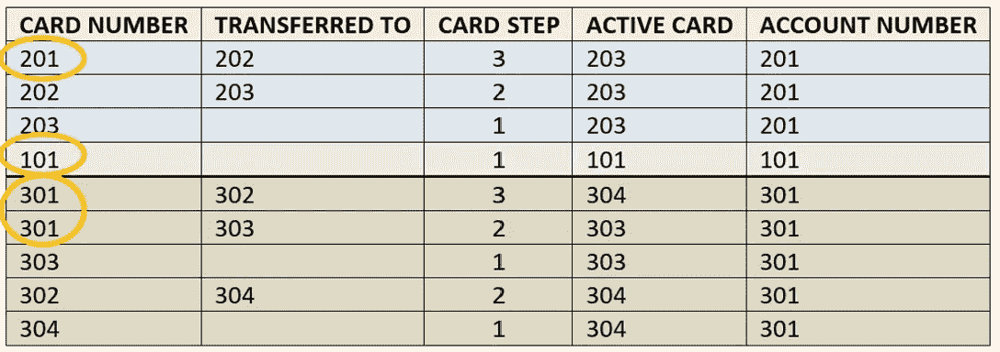

对于分布式系统来说，这有点复杂，但在 Apache Spark GraphX 中是可以解决的。

# 页面上的解决方案(图表)

Apache Spark 是一个统一的分析平台，具有通过 SQL、机器学习、流分析和图形查询结构化数据的组件。本文的重点是 GraphX 下 Pregel API 的使用。

在撰写本文时，Apache Spark 不支持 SQL 中的递归公共表表达式。数据工程师面临的挑战是使用 Apache Spark 中的另一种方法找到实现这种递归的另一种方法。因此，我们使用了 Pregel API，它执行了以下内容。

**超级步骤 0** ，

*   列出顶点和边…

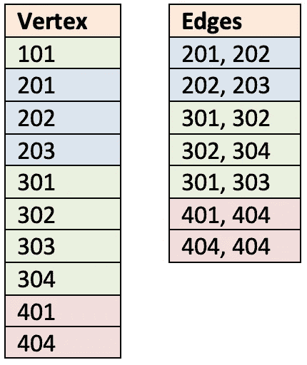

Data split into Vertices and Edges

列出了顶点的唯一列表，并且作为数组产生了边的列表；然后…

*   …Pregel 将分散(加载平行图形)…

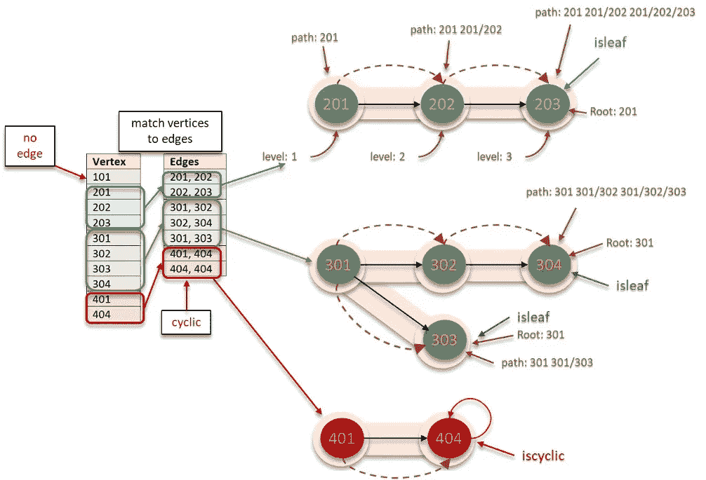

顶点与边匹配；没有边的顶点不会被绘制出来。当每个顶点在超级步骤中被单步执行时，它们被赋予以下值:

*   -根(设置为层次中的第一个顶点)
*   - isleaf(树中最低的顶点)
*   - path(欧拉路径中顶点的串联)
*   - iscyclic(如果层次结构中存在循环)
*   …并保存到磁盘。

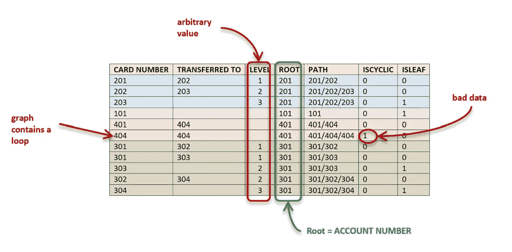

虽然级别与卡片步骤不同，但这与结果无关。我们需要知道树的根节点是什么，也就是账号。永远不会变；它将永远是相邻卡片的根。

*   “101”没有相邻顶点，因此已经是一个帐户。
*   “401”以循环结束，这是一个来自源头的坏数据的例子。

代码片段:

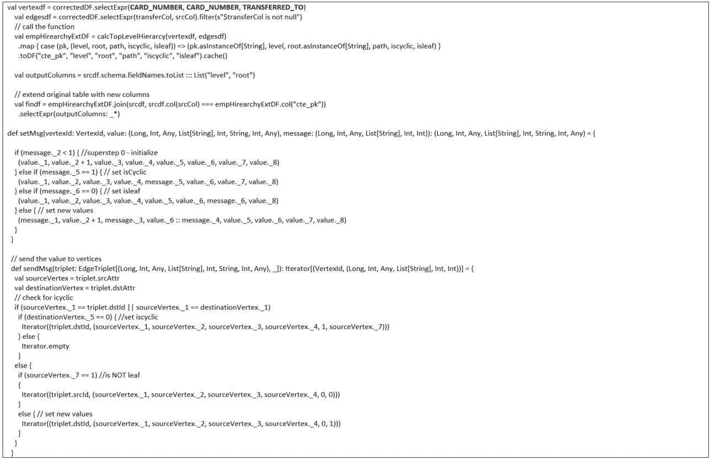

在使用 Pregel API 生成默认值的单个超级步骤中，我们已经确定了卡的帐号。在下一节中，我们将解释该图中发生了什么，并介绍我们的用例的一个附加要求，并使用 Pregel API 解决它。

# “像顶点一样思考”

Pregel 是一个以顶点为中心的消息传递 API，一个自定义的用户定义函数计算一个值，Pregel 将该结果作为消息传递给它最近的相邻顶点。每个顶点都有自己的值，并接收邻居的值，以便在同一用户定义函数的自己的副本中进行处理。保存在顶点的值是可变的，并且如果该值确实改变了，那么在下一个超步骤中，该顶点将在新消息中传递新值，同时它又可以从另一个最近的邻居接收消息。

在每个超步骤中，接收消息的顶点保持活动。如果一个顶点在一个超级步骤中没有收到消息，那么它将*投票*停止并变为不活动。如果一个不活动的顶点收到一条消息，导致它更新其值，那么它将再次成为活动的。超级步骤是迭代的，并且将持续到所有顶点都不活动为止。让我们看看这个消息传递系统是什么样子的:

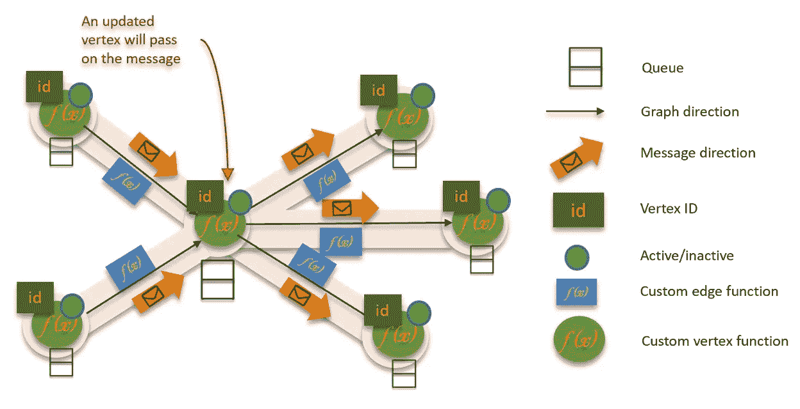

每个顶点和边可以包含一个自定义函数。如果一个顶点在一个超步骤中收到多条消息，那么这些消息将被排队等待顶点的用户自定义函数进行处理。让我们稍微改变一下我们的用例，使用 Pregel 来分配每个卡集合中的最高余额，一个帐户达到的最高余额。

**超级步骤 0**；初始消息

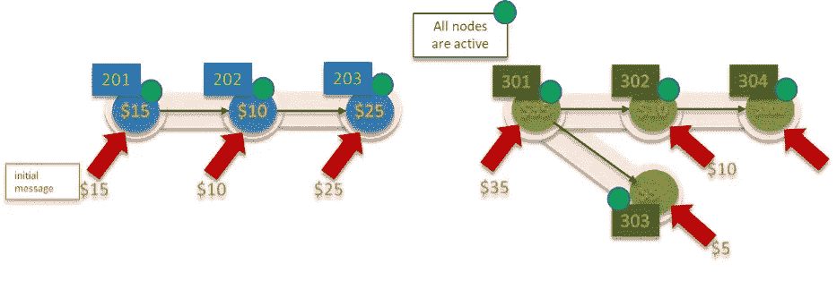

**超级步骤 1**；迭代时，所有节点将其值传递给最近的邻居。

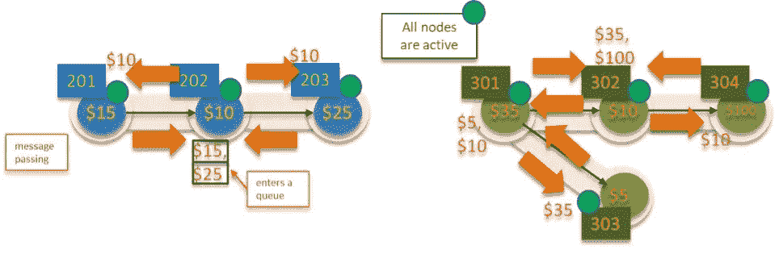

**超级步骤 2**；如果自定义函数要求，顶点值会发生变化。在超级步骤中没有接收到消息的顶点投票停止(变为不活动)。

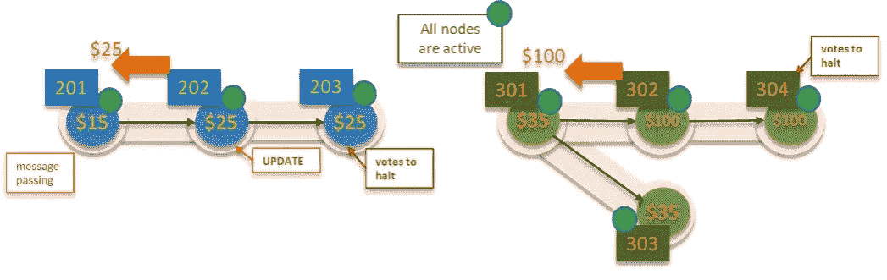

**超级步骤 3**；值已更改的顶点将传递新值。如果收到新值，非活动顶点可以再次变为活动顶点。

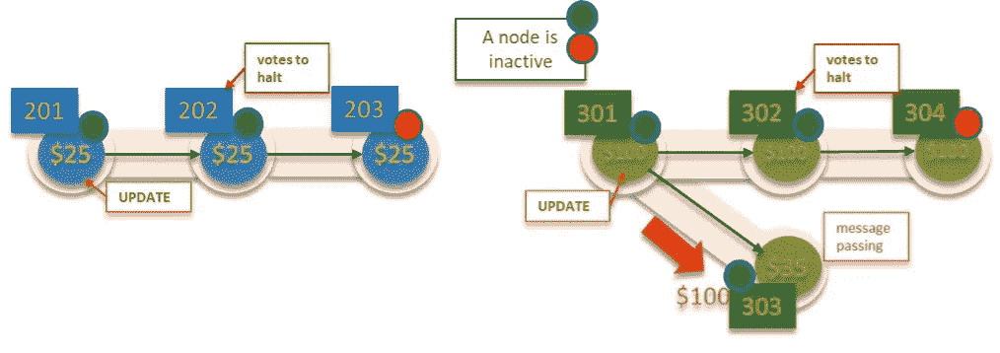

**超级步骤 4**；消息将一直传递，直到所有值都被更新。随着越来越多的顶点停止接收消息，越来越多的顶点投票决定暂停。

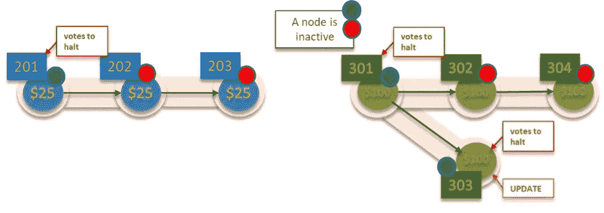

由于没有进一步的消息被发送，整个算法已经投票决定停止，因此该算法已经完成处理

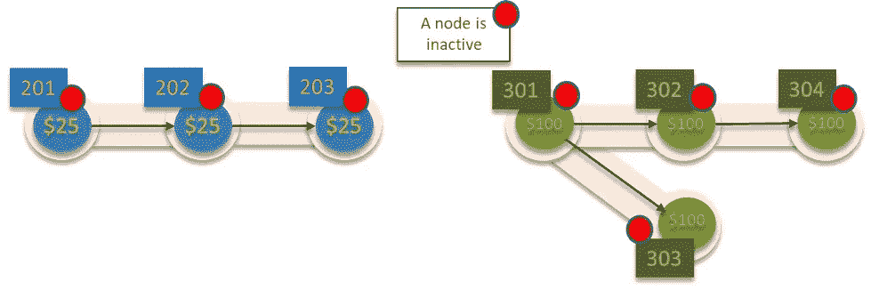

# Apache Spark 如何分工

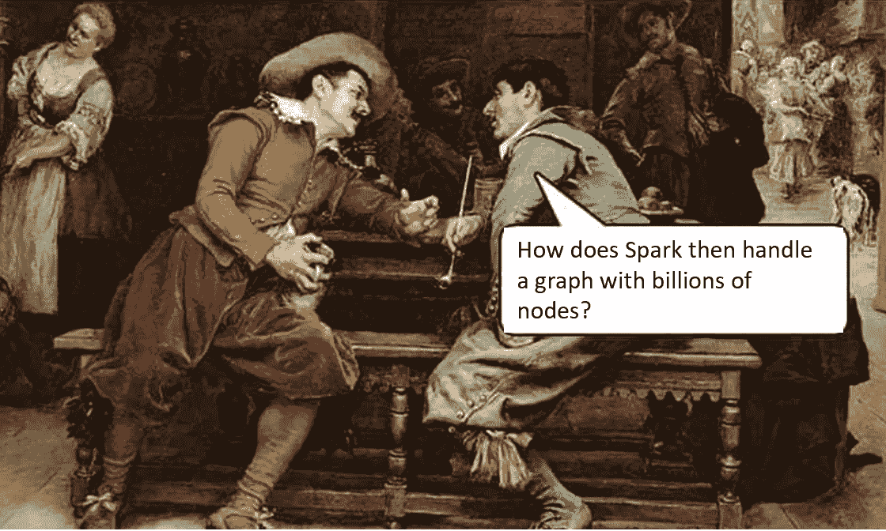

Spark 的 master 不会执行图形的任何部分，但是它会代表您协调工作。一个非常大的图可以跨越多个工作节点，并且工作节点将图状态更新发送回主节点。容错是内部管理的；主节点 pings 工作节点，失败的节点被重新分配给新工作节点的工作所取代。一个图表可以跨越多个工作节点。

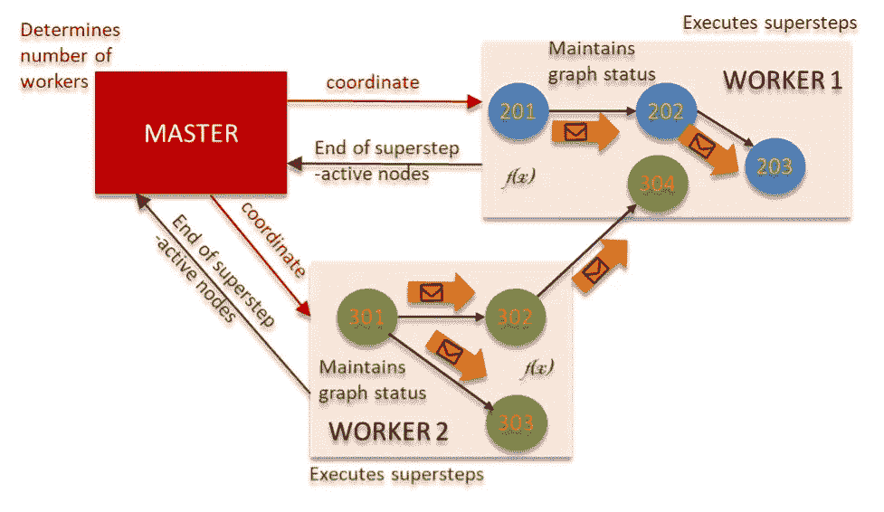

当不再有活动节点时，算法停止。

# 加载到业务存储库

该关系是派生的，而不是由源提供的；然后，该业务规则被保存在一个 business vault 链接表中，该链接表允许查询能够返回帐号的任何卡以及贯穿该帐户历史的所有相关卡信息。

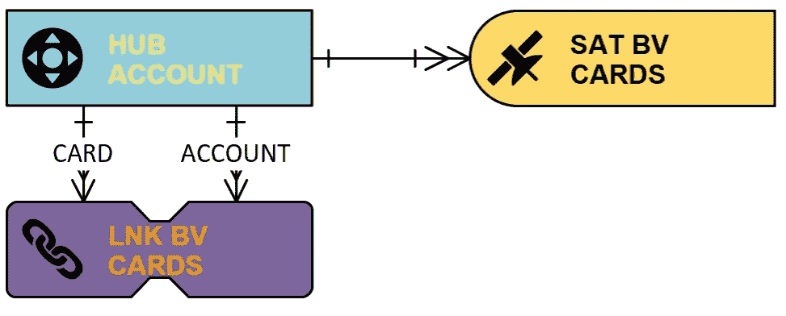

任何新的转帐都会添加到 business vault 链接，任何新卡都会添加到帐户中心。然后，每张卡在 business vault 卫星中都会有一个条目。对于任何卡，您都可以在最新的 business vault 卫星条目中检索最大余额。复杂的是，加载到该结构中的数据将如下所示:

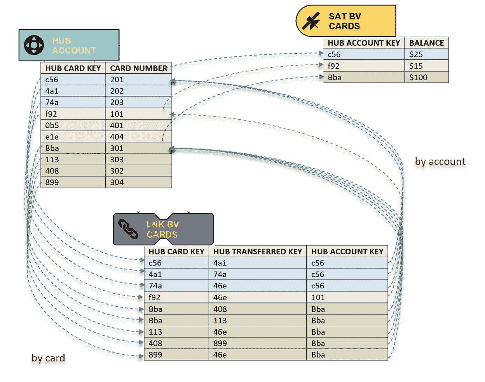

请注意，未转移的卡被分配了零密钥；数据仓库 2.0 的概念。

GraphX 带有一些现成的算法:

*   PageRank
*   连接的组件
*   标签传播
*   SVD++
*   强连通分量
*   三角形计数

…您可以使用它来应用像 Dijkstra 算法这样的贪婪算法，我们使用它来解决我们在 Spark SQL 中发现的一个缺口(还没有 R-CTE)和源应用程序的一个业务问题(技术债务)。

帕特里克古巴的书面和商业问题。
由尼辛·科萨设计和制造。

参考“Pregel:大规模图形处理系统”——Grzegorz Malewicz 等人。

[https://kowshik.github.io/JPregel/pregel_paper.pdf](https://kowshik.github.io/JPregel/pregel_paper.pdf)

*原载于 2020 年 2 月 24 日***。**