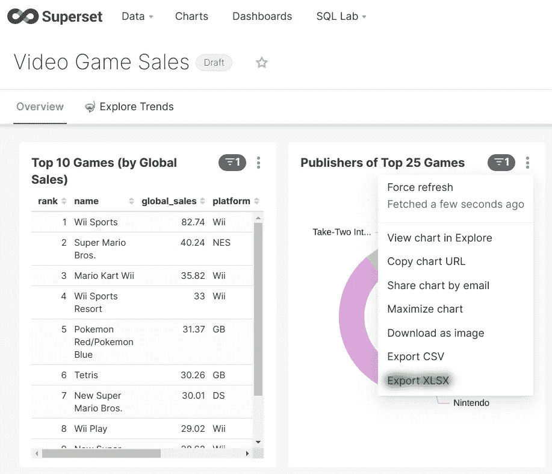

# Apache 超集:将数据导出到 Excel

> 原文：<https://medium.com/geekculture/apache-superset-export-data-to-excel-38b8170a30ee?source=collection_archive---------5----------------------->



Apache Superset 1.1.0 with ‘Export to XLSX’ functionality enabled

Apache Superset 是一个现代的 BI 工具，它通过结合来自通过 SQLAlchemy 连接的各种数据库的仪表板上的信息，帮助您轻松创建丰富的图表和强大的仪表板。从不同来源收集到一个图表中的数据，可以直接从超集导出到一个逗号分隔文件(CSV)。该 CSV 文件可以通过许多电子表格软件打开，包括业界领先的 Microsoft Excel。但是至少有一个问题可能会使您希望修补超集安装，以便能够将图表中的数据导出为 XLSX 格式。这个问题就是 Microsoft Excel 自动识别日期值。

假设您有一个从超集导出到 CSV 文件的简单表格。以下是它的内容:

```
Name,Building,Street,ID
Liubov,23/1,Pretty St.,01-04
Mike,17,New St.,16-7
```

下面是您可能认为它在电子表格中的样子:

```
┌────────┬──────────┬────────────┬───────┐
│  Name  │ Building │   Street   │  ID   │
├────────┼──────────┼────────────┼───────┤
│ Liubov │ 23/1     │ Pretty St. │ 01-04 │
│ Mike   │ 17       │ New St.    │ 16-7  │
└────────┴──────────┴────────────┴───────┘
```

如果您尝试将这个 CSV 文件导入 Excel，您会感到惊讶。如果没有额外的用户操作，要正确找到表的初始视图并不容易。默认情况下，您的表可能如下所示:

```
┌────────┬──────────┬────────────┬────────┐
│  Name  │ Building │   Street   │   ID   │
├────────┼──────────┼────────────┼────────┤
│ Liubov │ **23-Jan**   │ Pretty St. │ **01-Apr** │
│ Mike   │ 17       │ New St.    │ **16-Jul** │
└────────┴──────────┴────────────┴────────┘
```

如您所见，Excel 正试图根据您系统的区域设置将一些数字解释为可能的日期。这个问题会导致人们根据他们在表格中看到的数据做出错误的决定。


有几种方法可以解决这个问题。您可以教您的用户使用附加操作打开 CSV 文件:选择“导入”菜单项、将表格拆分成列、设置每列的数据类型等等。这可能会阻止 Excel 将数字自动解释为日期并使用用户选择的数据类型。另一个解决方案是切换到不同的电子表格软件，例如只使用 Office，它会在打开时询问如何解释 CSV 文件中的数据。但是我发现所有的选项都不够好，因为它们会导致额外的用户咨询费用或贵公司支持的软件列表的变化(可能还有额外的许可费用)。因此，我走了一条不同的路。

我的解决方案是通过添加一个新的按钮将数据导出到 XLSX 文件来修补官方的 Apache 超集包，XLSX 文件可以通过 Excel 打开，同时不会丢失数据，也不会有额外的用户操作。XLSX 是一种比 CSV 更加可定制的格式。我们不仅可以在其中保存值，还可以保存数据类型。

我使用 docker，因此我准备了一个新的 docker 文件来构建一个中间容器，用于在超集的界面中使用一个附加按钮来生成节点资产，并将这些资产和正确的后端 Python 文件复制到一个新的映像中。您可以在这个库中找到构建您自己的映像所需的所有文件，并以与使用官方超集映像相同的方式运行它。我不确定 Superset 将来会如何发展。我已经决定将补丁锁定到文件夹结构和 docker 文件中的版本。如果您发现这个解决方案在不做任何更改的情况下适用于另一个版本，或者您有时间编辑代码以适用于另一个版本，请在存储库中创建一个新的 pull 请求，以帮助其他人获得一个将数据从 Apache 超集导出到 XLSX 文件的有效解决方案。

> Upd 1/23/22:自定义版本支持 1.3.2 和 1.4.0 版本以及之前的 1.1.0 版本。另外，GitHub repo 中包含了 **run_locally** 实用程序，以简化本地运行的过程。
> 
> Upd 2/11/22:自定义版本支持 1.4.1 版以及 1.1.0、1.3.2、1.4.0 版。 **run_locally** 实用程序的默认超集版本现在是 1.4.1。

我希望你喜欢阅读这篇文章。请在[中](/@agordienko)、 [GitHub](https://github.com/aleksandrgordienko) 、 [Twitter](https://twitter.com/data_diving) 、 [LinkedIn](https://www.linkedin.com/in/aleksandrgordienko/) 上关注我。

请阅读前一篇文章中[关于在 Docker 容器中运行超集的附加信息。另外，在这里查看关于向您的超集安装添加自定义安全管理器的文章](/geekculture/run-apache-superset-locally-in-10-minutes-30bc70ed808c)[。](/geekculture/custom-security-manager-for-apache-superset-c91f413a8be7)