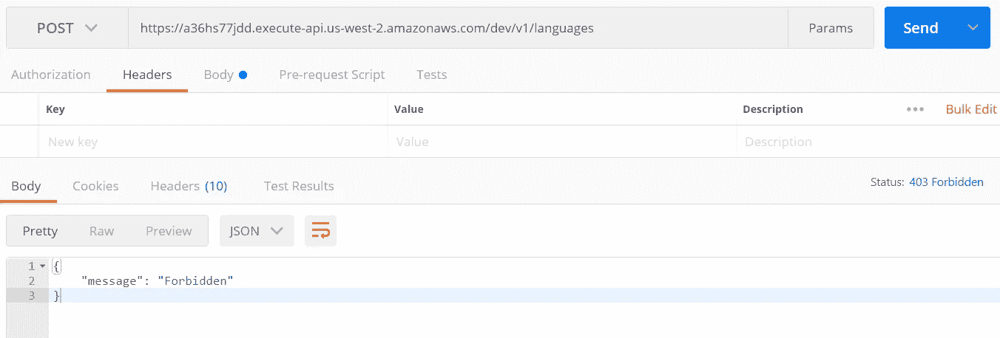
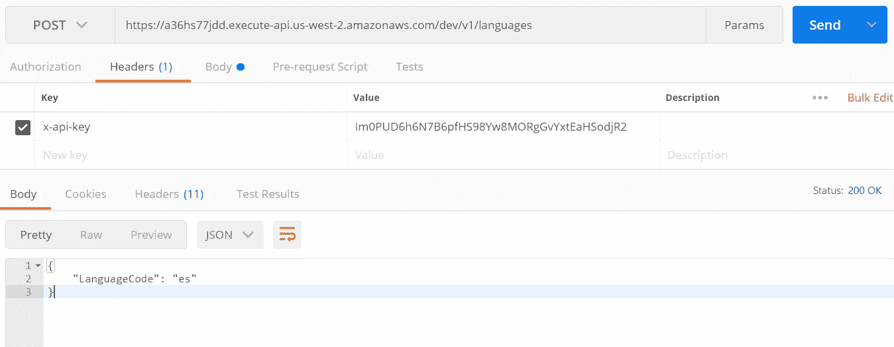
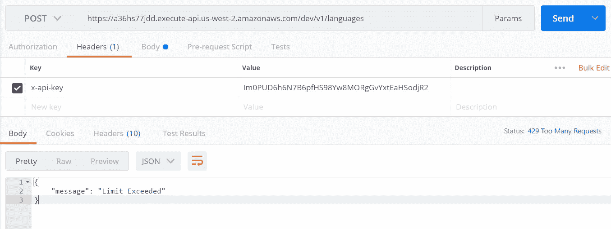

# API 密钥和使用计划与 AWS API 网关集成

> 原文：<https://medium.com/geekculture/api-key-and-usage-plan-integration-with-aws-api-gateway-2d07bbb9a2a4?source=collection_archive---------8----------------------->

今天，我们将了解如何利用 AWS API 密钥和使用计划来验证和限制对 AWS REST API 的请求数量。

你会在这篇文章的结尾找到完整的代码和 sam CLI 部署脚本。要直接通过 AWS 控制台进行配置，请访问[https://docs . AWS . Amazon . com/API gateway/latest/developer guide/API-gateway-create-usage-plans . html](https://docs.aws.amazon.com/apigateway/latest/developerguide/api-gateway-create-usage-plans.html)

# 什么是使用计划和 API 密钥？

一个*使用计划*指定谁可以访问一个或多个已部署的 API 阶段和方法——以及他们可以访问它们的数量和速度。该计划使用 API 密钥来识别 API 客户端，并计量每个密钥对相关 API 阶段的访问。它还允许您配置在单个客户端 API 密钥上实施的节流限制和配额限制。

*API 密钥*是由字母数字组成的字符串值，您将其分发给应用程序开发人员客户，以授权他们访问您的 API。您可以使用 API 密钥和[使用计划](https://docs.aws.amazon.com/apigateway/latest/developerguide/api-gateway-api-usage-plans.html)或 [Lambda 授权器](https://docs.aws.amazon.com/apigateway/latest/developerguide/apigateway-use-lambda-authorizer.html)来控制对您的 API 的访问。API Gateway 可以代表您生成 API 密钥，或者您可以从一个 [CSV 文件](https://docs.aws.amazon.com/apigateway/latest/developerguide/api-key-file-format.html)中导入它们。您可以在 API Gateway 中生成 API 密钥，或者从外部来源将其导入 API Gateway。更多信息，参见[使用 API 网关控制台设置 API 密钥](https://docs.aws.amazon.com/apigateway/latest/developerguide/api-gateway-setup-api-key-with-console.html)。

让我们看看集成的示例和步骤:

确保在 template.yaml 中的 REST API 代码中将 API Auth 添加为 true，以使用使用计划和 API 密钥。您可以使用下面两行将 auth 设置为 true。

```
Resources:
  TestUsagePlanAPI:
    Type: AWS::Serverless::Api
    Properties:
      StageName: !Ref deploymentEnvironment
      Auth:
        ApiKeyRequired: 'true'
```

通过 YAML 模板创建 API 后，我们必须添加以下代码来通过 YAML 模板创建使用计划。这里的使用计划取决于将要创建和集成的 API 阶段，因此我们需要添加 depends on 属性，以便它应该等到 API 阶段创建完毕。

每月发送的请求数量和限制可以相应地修改。

```
TestAPIUsagePlan:
    Type: 'AWS::ApiGateway::UsagePlan'
    DependsOn:
      - TestUsagePlanAPI
    Properties:
      ApiStages:
        - ApiId: !Ref TestUsagePlanAPI
          Stage: !Ref deploymentEnvironment
      Description: To test usage plan and api key in REST API.
      Quota:
        Limit: 100
        Period: MONTH
      UsagePlanName: "test-usage-plan"
```

一旦创建了使用计划，我们就必须创建 API 密匙。

```
TestApiAccessKey:
    Type: 'AWS::ApiGateway::ApiKey'
    DependsOn:
      - TestUsagePlanAPI
    Properties:
      Name: "test-api-key"
    Description: To test usage plan and api key in REST API.
      Tags: 
       - Key: Mode
         Value: Learning
      Enabled: true
      StageKeys:
       - RestApiId: !Ref TestUsagePlanAPI
         StageName: !Ref deploymentEnvironment
```

现在，我们必须将 API 密钥绑定到使用计划，为此我们将使用以下代码:

```
LinkUsagePlanApiKey:
    Type: "AWS::ApiGateway::UsagePlanKey"
    Properties:
      KeyId: 
       Ref: TestApiAccessKey
      KeyType: API_KEY
      UsagePlanId: 
       Ref: TestAPIUsagePlan
```

集成完成后，运行 sam CLI 脚本，在 AWS 控制台中部署 API。现在，您将需要头中的 x-api-key 来运行 api。如果 x-api-key 没有通过，那么它将抛出错误 403 Forbidden。如果与我们在使用计划中设置的每月允许的 API 请求相比，对 API 的请求太多，那么它将抛出 429 个过多的请求。

我们可以从 AWS 控制台的 API Key 部分记下 x-api-key，如下所示:


点击 API 键中的 *show* ，您将获得 API 键，该 API 键可在标题中用于调用相应的 REST API。我们可以单击使用计划并相应地修改配置。


我在 AWS 中创建了一个测试 API，它使用理解服务来检测语言。让我们看看用 x-api-key 调用 REST API 的例子。

如果我们调用部署的 API 而不传递 x-api-key，它将给出以下错误:



同样，当我们将头中的 x-api-key 传递给请求 api 时，我们将得到一个成功的响应。



如果我们每月超过 API 100 的请求数，正如我们在上面的使用计划中添加的那样，将会出现以下错误:



要使用 postman 自动测试具有多个测试用例的 API，请阅读文章:[https://hemnanirohan . medium . com/effectively-use-postman-API-testing-in-simple-steps-with-dynamic-data-in-a-file-for-test-automation-115 f1a 36 ded 4](https://hemnanirohan.medium.com/effectively-use-postman-api-testing-in-simple-steps-with-dynamic-data-in-a-file-for-test-automation-115f1a36ded4)

我希望这篇文章在某种程度上对你有用。要获得完整的代码和部署脚本，请访问 https://github.com/Rohan009/aws_api_key_usage_plan